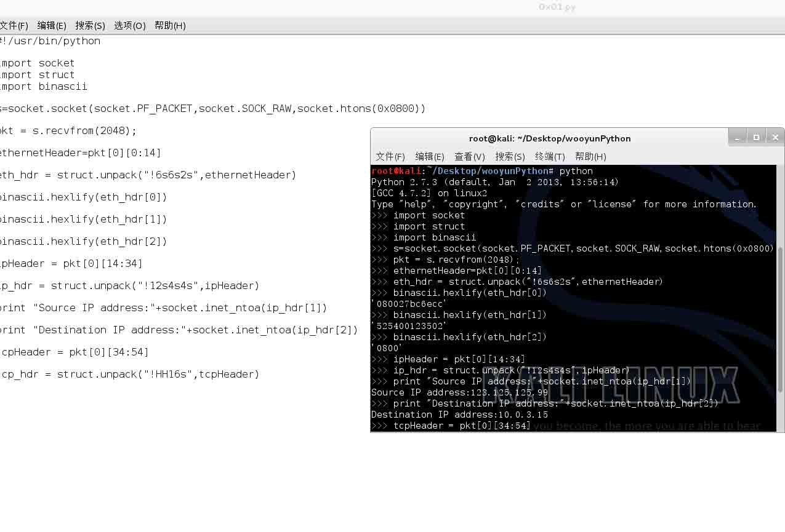
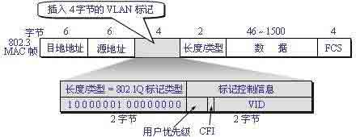
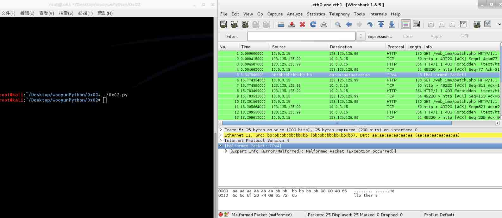
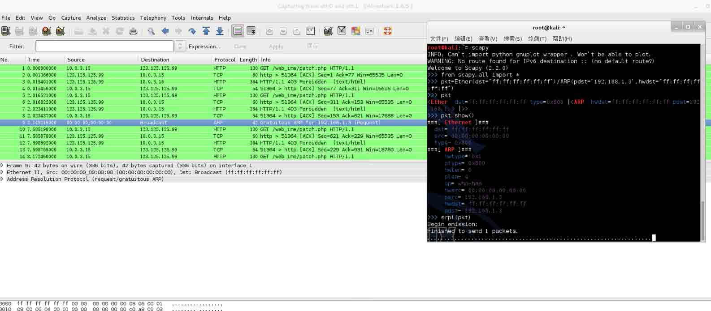

# Python 教程网络安全篇

2014/07/17 14:07 | [lxj616](http://drops.wooyun.org/author/lxj616 "由 lxj616 发布") | [技术分享](http://drops.wooyun.org/category/tips "查看 技术分享 中的全部文章") | 占个座先 | 捐赠作者

## 0x00:概述

* * *

本文从实例代码出发，讲解了 Python 在网络安全分析中的作用，以最基础的示例向读者展示了 Python 如何解析、发送、以及嗅探网络中的数据包 系统环境：kali 并且具备了 scapy，由于涉及底层网络操作，文中的示例代码均为 linux 下可用，无法直接复制到 windows 下使用

## 0x01:利用 Python 解析 TCP 数据包

* * *

以下面代码为例进行说明



首先导入 socket（用于网络编程）、struct（用于拆包解析数据包结构）、binascii（方便格式的转化）

创建 socket 时指定 socket.SOCK_RAW 以接收原始数据包

Pkt 为获取到的数据包

Eth_hdr 为拆包得到的以太网头部，使用 unpack 解出（请见下图以太网帧格式）

以太网帧结构：



我们可以看到解出的第一部分（目的地址）为 080027bc6ecc 我们可以看到解出的第二部分（源地址）为 525400123502 我们可以看到解出的第三部分（长度\类型）为 0800 图片来自网络，注意图中说的 4 字节 VLAN 是不存在的 - -

下面看看自己的 mac（eth1） 为 080027bc6ecc，与上文结论相符


同理解出 IP 包头里的源 IP 和目的 IP，如第一张图所示

IP 包头结构：


本节所用代码如下：

```
#!/usr/bin/python

import socket
import struct
import binascii

s=socket.socket(socket.PF_PACKET,socket.SOCK_RAW,socket.htons(0x0800))

pkt = s.recvfrom(2048);

ethernetHeader=pkt[0][0:14]

eth_hdr = struct.unpack("!6s6s2s",ethernetHeader)

binascii.hexlify(eth_hdr[0])

binascii.hexlify(eth_hdr[1])

binascii.hexlify(eth_hdr[2])

ipHeader = pkt[0][14:34]

ip_hdr = struct.unpack("!12s4s4s",ipHeader)

print "Source IP address:"+socket.inet_ntoa(ip_hdr[1])

print "Destination IP address:"+socket.inet_ntoa(ip_hdr[2])

tcpHeader = pkt[0][34:54]

tcp_hdr = struct.unpack("!HH16s",tcpHeader)

```

本节示例输出如下：

```
root@kali:~/Desktop/wooyunPython# ./0x01.py
Source IP address:123.125.125.99
Destination IP address:10.0.3.15
root@kali:~/Desktop/wooyunPython# python
Python 2.7.3 (default, Jan  2 2013, 13:56:14)
[GCC 4.7.2] on linux2
Type "help", "copyright", "credits" or "license" for more information.
>>> import socket
>>> import struct
>>> import binascii
>>> s=socket.socket(socket.PF_PACKET,socket.SOCK_RAW,socket.htons(0x0800))
>>> pkt = s.recvfrom(2048);
>>> ethernetHeader=pkt[0][0:14]
>>> eth_hdr = struct.unpack("!6s6s2s",ethernetHeader)
>>> binascii.hexlify(eth_hdr[0])
'080027bc6ecc'
>>> binascii.hexlify(eth_hdr[1])
'525400123502'
>>> binascii.hexlify(eth_hdr[2])
'0800'
>>> ipHeader = pkt[0][14:34]
>>> ip_hdr = struct.unpack("!12s4s4s",ipHeader)
>>> print "Source IP address:"+socket.inet_ntoa(ip_hdr[1])
Source IP address:123.125.125.99
>>> print "Destination IP address:"+socket.inet_ntoa(ip_hdr[2])
Destination IP address:10.0.3.15
>>> tcpHeader = pkt[0][34:54]
>>> tcp_hdr = struct.unpack("!HH16s",tcpHeader)

```

## 0x02:利用 Python 发送 TCP 数据包

* * *

本文所用代码如下：

```
#!/usr/bin/python

import socket
import struct

rawSocket = socket.socket(socket.PF_PACKET,socket.SOCK_RAW,socket.htons(0x0800))

rawSocket.bind(("eth0",socket.htons(0x0800)))

packet = struct.pack("!6s6s2s",'\xaa\xaa\xaa\xaa\xaa\xaa','\xbb\xbb\xbb\xbb\xbb\xbb','\x08\x00')

rawSocket.send(packet+"Hello there")

```



首先 socket 类型选择 raw，然后 bind 一个 interface 就可以发包了，由于发送的是原始的数据包，因此数据包需要自己通过 struct.pack 包装好

## 0x03:利用 Python+Scapy 嗅探数据包

* * *

```
root@kali:~# scapy
INFO: Can't import python gnuplot wrapper . Won't be able to plot.
WARNING: No route found for IPv6 destination :: (no default route?)
Welcome to Scapy (2.2.0)
>>> ls()
ARP        : ARP

```

这里还列出了一大堆的介绍，就不列出了

```
>>> pkts = sniff(iface="eth1",count=3)

```

使用 sniff 监听 eth1 接口的 3 个数据包

```
>>> pkts
<Sniffed: TCP:3 UDP:0 ICMP:0 Other:0>

```

直接输入 pkts 会显示嗅探的概况

```
>>> pkts[0]
<Ether  dst=52:54:00:12:35:02 src=08:00:27:bc:6e:cc type=0x800 |<IP  version=4L ihl=5L tos=0x0 len=116 id=30377 flags=DF frag=0L ttl=64 proto=tcp chksum=0xbdeb src=10.0.3.15 dst=123.125.125.99 options=[] |<TCP  sport=49157 dport=http seq=2358039370 ack=1044674792 dataofs=5L reserved=0L flags=PA window=24120 chksum=0x656 urgptr=0 options=[] |<Raw  load='GET /web_ime/patch.php HTTP/1.1\r\nHost: web.pinyin.sogou.com\r\nAccept: */*\r\n\r\n' |>>>>
>>> pkts[0].show()

```

使用 show 显示更详细

```
###[ Ethernet ]###
  dst= 52:54:00:12:35:02
  src= 08:00:27:bc:6e:cc
  type= 0x800
###[ IP ]###
     version= 4L
     ihl= 5L
     tos= 0x0
     len= 116
     id= 30377
     flags= DF
     frag= 0L
     ttl= 64
     proto= tcp
     chksum= 0xbdeb
     src= 10.0.3.15
     dst= 123.125.125.99
     \options\
###[ TCP ]###
        sport= 49157
        dport= http
        seq= 2358039370
        ack= 1044674792
        dataofs= 5L
        reserved= 0L
        flags= PA
        window= 24120
        chksum= 0x656
        urgptr= 0
        options= []
###[ Raw ]###
           load= 'GET /web_ime/patch.php HTTP/1.1\r\nHost: web.pinyin.sogou.com\r\nAccept: */*\r\n\r\n'
>>>
>>> hexdump(pkts[1])

```

转成十六进制形式更加亲切

```
0000   08 00 27 BC 6E CC 52 54  00 12 35 02 08 00 45 00   ..'.n.RT..5...E.
0010   00 28 82 39 00 00 40 06  F2 A7 7B 7D 7D 63 0A 00   .(.9..@...{}}c..
0020   03 0F 00 50 C0 05 3E 44  78 E8 8C 8C D3 96 50 10   ...P..>Dx.....P.
0030   FF FF D2 3F 00 00 00 00  00 00 00 00               ...?........
>>>

>>> wrpcap("demo.pcap",pkts)

```

写出到 pcap 文件

```
>>> read_pkts=rdpcap("demo.pcap")

```

从 pcap 文件中读取

```
>>> read_pkts
<demo.pcap: TCP:3 UDP:0 ICMP:0 Other:0>

```

检查发现读出与写入是一致的

```
>>>

>>> pkts=sniff(iface="eth1",filter="icmp",count=3)

```

使用 filter 来过滤想要捕获的数据包类型

注意同时我另开一个 shell 做了一个 ping 来发送 icmp 包

```
root@kali:~# ping www.wooyun.org
PING wooyun.sinaapp.com (220.181.136.24) 56(84) bytes of data.
64 bytes from 220.181.136.24: icmp_req=1 ttl=54 time=17.1 ms
64 bytes from 220.181.136.24: icmp_req=3 ttl=54 time=11.8 ms
64 bytes from 220.181.136.24: icmp_req=4 ttl=54 time=23.8 ms
64 bytes from 220.181.136.24: icmp_req=5 ttl=54 time=17.1 ms
64 bytes from 220.181.136.24: icmp_req=6 ttl=54 time=5.63 ms
^C
--- wooyun.sinaapp.com ping statistics ---
6 packets transmitted, 5 received, 16% packet loss, time 5013ms
rtt min/avg/max/mdev = 5.636/15.135/23.824/6.086 ms

>>> pkts
<Sniffed: TCP:0 UDP:0 ICMP:3 Other:0>

```

发现截获的通过 filter 果然都是 icmp 包

```
>>>
>>> pkts[0]
<Ether  dst=52:54:00:12:35:02 src=08:00:27:bc:6e:cc type=0x800 |<IP  version=4L ihl=5L tos=0x0 len=84 id=0 flags=DF frag=0L ttl=64 proto=icmp chksum=0xc8cc src=10.0.3.15 dst=220.181.136.24 options=[] |<ICMP  type=echo-request code=0 chksum=0xd856 id=0x218e seq=0x1 |<Raw  load='\xcc\xa7\xc3S\x00\x00\x00\x00\xa2K\r\x00\x00\x00\x00\x00\x10\x11\x12\x13\x14\x15\x16\x17\x18\x19\x1a\x1b\x1c\x1d\x1e\x1f !"#$%&\'()*+,-./01234567' |>>>>
>>> pkts[1]
<Ether  dst=08:00:27:bc:6e:cc src=52:54:00:12:35:02 type=0x800 |<IP  version=4L ihl=5L tos=0x1 len=84 id=33433 flags= frag=0L ttl=54 proto=icmp chksum=0x9032 src=220.181.136.24 dst=10.0.3.15 options=[] |<ICMP  type=echo-reply code=0 chksum=0xe056 id=0x218e seq=0x1 |<Raw  load='\xcc\xa7\xc3S\x00\x00\x00\x00\xa2K\r\x00\x00\x00\x00\x00\x10\x11\x12\x13\x14\x15\x16\x17\x18\x19\x1a\x1b\x1c\x1d\x1e\x1f !"#$%&\'()*+,-./01234567' |>>>>
>>>

>>> icmp_str=str(pkts[0])

```

转成 str

```
>>> icmp_str
'RT\x00\x125\x02\x08\x00\'\xbcn\xcc\x08\x00E\x00\x00T\x00\x00@\x00@\x01\xc8\xcc\n\x00\x03\x0f\xdc\xb5\x88\x18\x08\x00\xd8V!\x8e\x00\x01\xcc\xa7\xc3S\x00\x00\x00\x00\xa2K\r\x00\x00\x00\x00\x00\x10\x11\x12\x13\x14\x15\x16\x17\x18\x19\x1a\x1b\x1c\x1d\x1e\x1f !"#$%&\'()*+,-./01234567'
>>> recon=Ether(icmp_str)

```

从 str 重构数据包

```
>>> recon
<Ether  dst=52:54:00:12:35:02 src=08:00:27:bc:6e:cc type=0x800 |<IP  version=4L ihl=5L tos=0x0 len=84 id=0 flags=DF frag=0L ttl=64 proto=icmp chksum=0xc8cc src=10.0.3.15 dst=220.181.136.24 options=[] |<ICMP  type=echo-request code=0 chksum=0xd856 id=0x218e seq=0x1 |<Raw  load='\xcc\xa7\xc3S\x00\x00\x00\x00\xa2K\r\x00\x00\x00\x00\x00\x10\x11\x12\x13\x14\x15\x16\x17\x18\x19\x1a\x1b\x1c\x1d\x1e\x1f !"#$%&\'()*+,-./01234567' |>>>>
>>> export_object(icmp_str)
eNprYApNCgphEDJl4mBQ35N3hoPBlYEhhIHBgcGB8cQZLgZm/jtbOyQ4GG6EKfYxMJ5ZfjiYAQgW
efOCKAYBQSFhEVExcQlJKWkZWTl5BUUlZRVVNXUNTS1tHV09fQNDI2MTUzPzQkY9AMQIFOY=

```

导出可读 base64 对象

```
>>> newPkt=import_object()
eNprYApNCgphEDJl4mBQ35N3hoPBlYEhhIHBgcGB8cQZLgZm/jtbOyQ4GG6EKfYxMJ5ZfjiYAQgW
efOCKAYBQSFhEVExcQlJKWkZWTl5BUUlZRVVNXUNTS1tHV09fQNDI2MTUzPzQkY9AMQIFOY=

```

输入完成后按(ctrl+D)结束输入 从 base64 中读回对象

```
>>> newPkt
'RT\x00\x125\x02\x08\x00\'\xbcn\xcc\x08\x00E\x00\x00T\x00\x00@\x00@\x01\xc8\xcc\n\x00\x03\x0f\xdc\xb5\x88\x18\x08\x00\xd8V!\x8e\x00\x01\xcc\xa7\xc3S\x00\x00\x00\x00\xa2K\r\x00\x00\x00\x00\x00\x10\x11\x12\x13\x14\x15\x16\x17\x18\x19\x1a\x1b\x1c\x1d\x1e\x1f !"#$%&\'()*+,-./01234567'
>>> Ether(newPkt)
<Ether  dst=52:54:00:12:35:02 src=08:00:27:bc:6e:cc type=0x800 |<IP  version=4L ihl=5L tos=0x0 len=84 id=0 flags=DF frag=0L ttl=64 proto=icmp chksum=0xc8cc src=10.0.3.15 dst=220.181.136.24 options=[] |<ICMP  type=echo-request code=0 chksum=0xd856 id=0x218e seq=0x1 |<Raw  load='\xcc\xa7\xc3S\x00\x00\x00\x00\xa2K\r\x00\x00\x00\x00\x00\x10\x11\x12\x13\x14\x15\x16\x17\x18\x19\x1a\x1b\x1c\x1d\x1e\x1f !"#$%&\'()*+,-./01234567' |>>>>

```

到此我们成功原路返回了导出的数据包

```
>>> 
```

接下来就是利用 scapy 发送数据包了



首先 Ether/ARP 构造一个 ARP 数据包，之后 srp1 发送出去，从 wireshark 中看发现数据包已经成功发送了，不过在这里理论上是可以收到 response 的，测试时由于不明原因没有收到

```
root@kali:~# scapy
INFO: Can't import python gnuplot wrapper . Won't be able to plot.
WARNING: No route found for IPv6 destination :: (no default route?)
Welcome to Scapy (2.2.0)
>>> from scapy.all import *
>>> pkt=Ether(dst="ff:ff:ff:ff:ff:ff")/ARP(pdst='192.168.1.3',hwdst="ff:ff:ff:ff:ff:ff")
>>> pkt
<Ether  dst=ff:ff:ff:ff:ff:ff type=0x806 |<ARP  hwdst=ff:ff:ff:ff:ff:ff pdst=192.168.1.3 |>>
>>> pkt.show()
###[ Ethernet ]###
  dst= ff:ff:ff:ff:ff:ff
  src= 00:00:00:00:00:00
  type= 0x806
###[ ARP ]###
     hwtype= 0x1
     ptype= 0x800
     hwlen= 6
     plen= 4
     op= who-has
     hwsrc= 00:00:00:00:00:00
     psrc= 192.168.1.3
     hwdst= ff:ff:ff:ff:ff:ff
     pdst= 192.168.1.3
>>> srp1(pkt)
Begin emission:
Finished to send 1 packets.
..............................................................................^C
Received 78 packets, got 0 answers, remaining 1 packets
>>>

```

版权声明：未经授权禁止转载 [lxj616](http://drops.wooyun.org/author/lxj616 "由 lxj616 发布")@[乌云知识库](http://drops.wooyun.org)

分享到：

### 相关日志

*   [Python 教程 WEB 安全篇](http://drops.wooyun.org/tips/2591)
*   [64 位 Linux 下的栈溢出](http://drops.wooyun.org/tips/2288)
*   [Pocket Hacking: NetHunter 实战指南](http://drops.wooyun.org/tips/4634)
*   [本是同根生，相煎何太急-用 Google 语音识别 API 破解 reCaptcha 验证码](http://drops.wooyun.org/papers/1524)
*   [Python Pickle 反序列化带来的安全问题](http://drops.wooyun.org/papers/66)
*   [得到内网域管理员的 5 种常见方法](http://drops.wooyun.org/tips/646)