# CVE2014-6287 分析报告

2014/09/29 11:30 | [cssembly](http://drops.wooyun.org/author/cssembly "由 cssembly 发布") | [二进制安全](http://drops.wooyun.org/category/binary "查看 二进制安全 中的全部文章"), [漏洞分析](http://drops.wooyun.org/category/papers "查看 漏洞分析 中的全部文章") | 占个座先 | 捐赠作者

## 0x00 写在前面

* * *

在乌云 zone 里看到了《HFS 2.3x 远程命令执行(抓鸡黑客末日)》的文章，以前只是分析二进制漏洞，这种命令注入漏洞还是第一次分析，从网上下了 HFS 2.3.279 这个版本，运行起来之后，执行 POC，四个 calc 就执行起来了。

poc：

```
http://localhost:80/?search==%00{.exec|calc.} 
```

PS:分析到最后，google 查找可执行模块中的字符串“`parserLib`”，才知道这个漏洞是 CVE2014-6287。。。。。。一种淡淡的忧伤。不过还是说一下分析的过程吧。

## 0x01 准备工作

* * *

首先是分析前的一些准备工作，用 PEiD 查看了一下文件，加了 asp 的壳，通过 PEiD 通用脱壳器简单的进行脱壳。

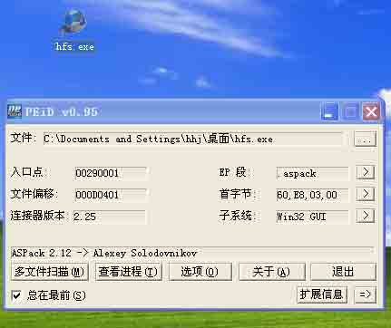

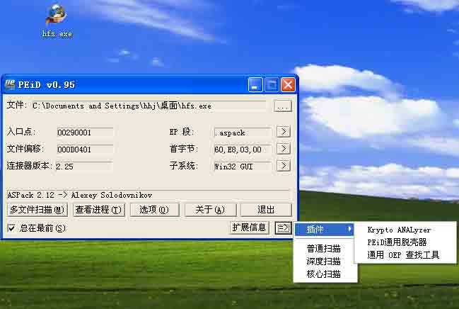

通过 IDA 加载脱壳后的文件，看到一些函数如图，根据之前对 c++中 string 类实现的认识，看来应该是使用了静态编译，字符串处理的库代码被静态链接到了可执行文件中。

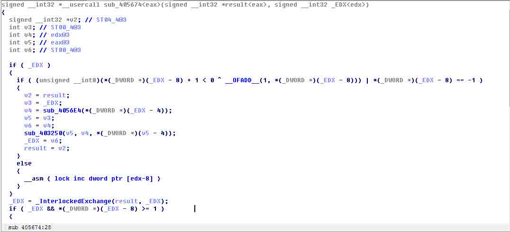

通过 PEid 对脱壳后的文件进行编译器识别，识别为 Borland Delphi 6.0 - 7.0，通过 IDA 加载相应的签名库，对函数进行签名，这样就能识别出大量的内联函数，方便分析。通过签名，已经可以识别出 5636 个内联函数，这样分析起来就方便很多。

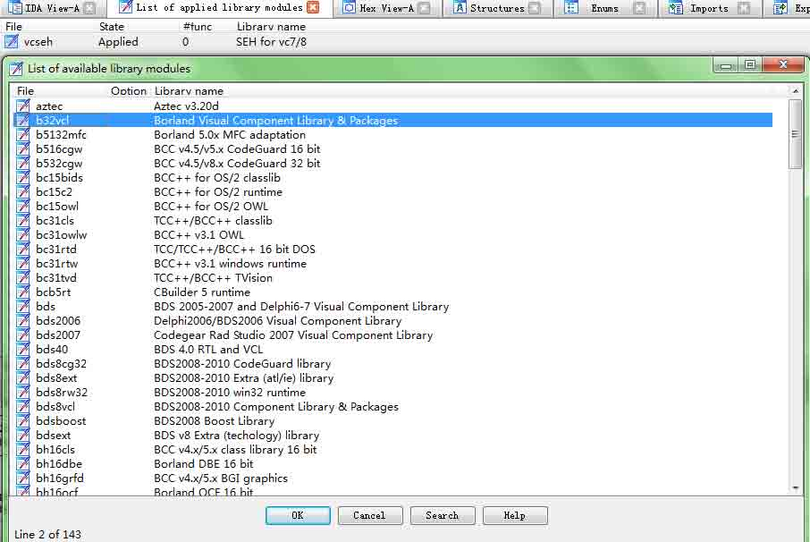

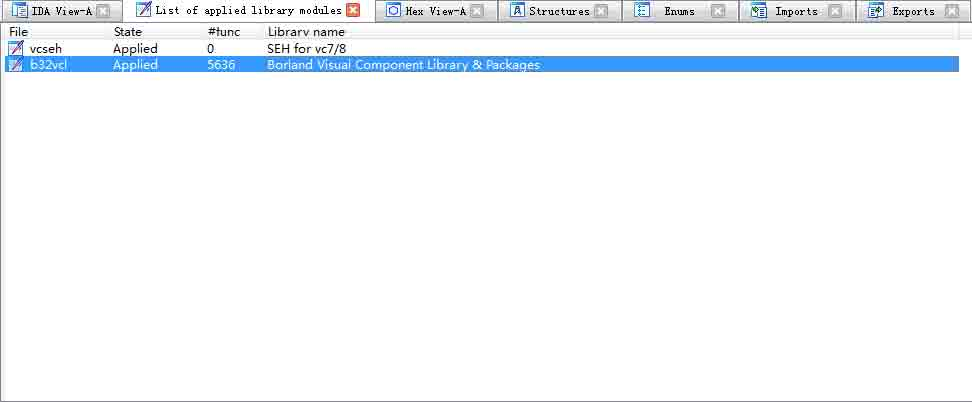

## 0x02 分析过程

* * *

通过 IDA 查看文件导入函数，查找 WinExec、ShellExecuteA 等进程启动相关函数，通过交叉引用找到函数调用点，通过 windbg 设置断点，观察参数，确实是由 ShellExecuteA 启动了计算器。同时查看程序的调用栈。

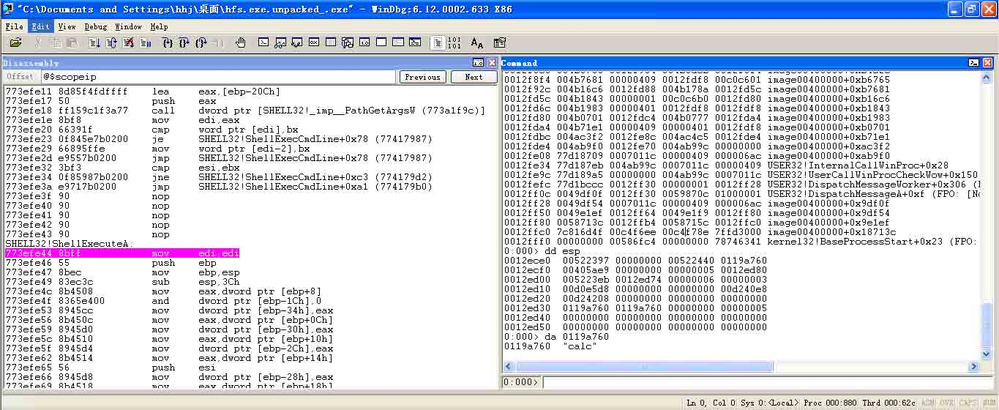


通过调用栈，可已找到 sub_531438 函数，该函数解释了 exec|calc 命令，并启动了 calc。对函数进行分析，可知该函数是对用户的命令进行解释执行的函数，相关代码如下。

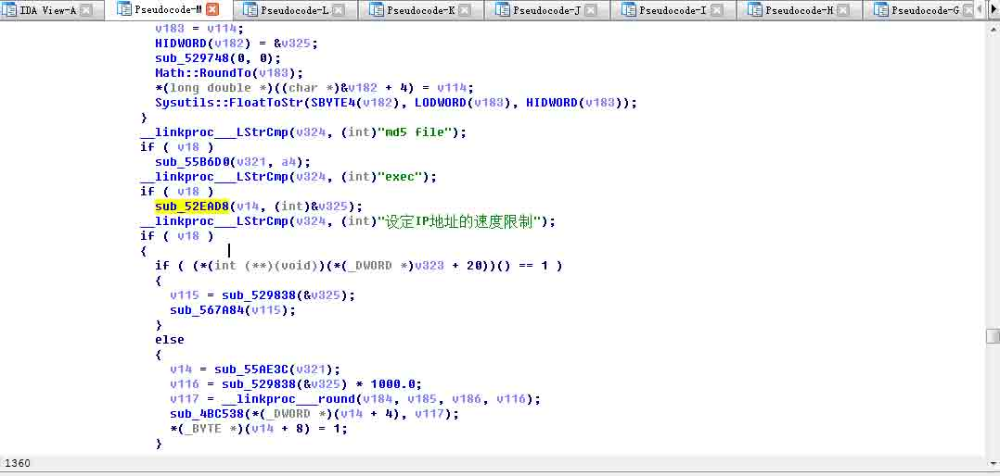

继续通过调用栈，结合 IDA 对“exec|calc”的传递过程进行分析，找到

```
int __stdcall sub_51E268(signed char *** a1, int a2) 
```

函数，**a1 指向需要解释的字符串“\x00{.exec|calc.}”，其中`int __cdecl sub_51DFA0(int a1)`函数对“`\x00{.exec|calc.}`”对其进行分析并执行。

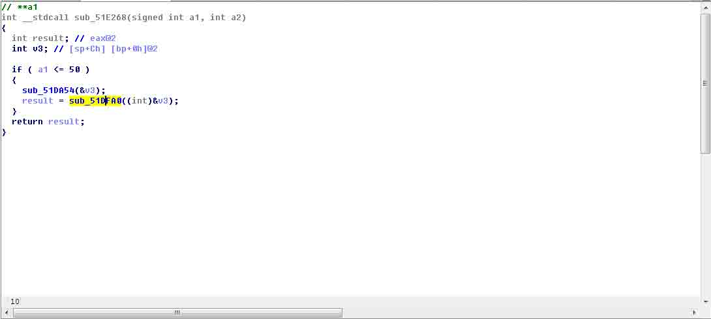

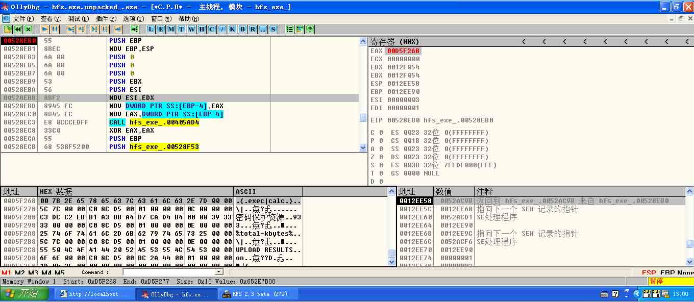

对于

```
http://localhost:80/?search=%20{.exec|calc.} 
```

通过对比 sub_51E268 处**a1 指向需要解释的字符串，可以看到`{.|`等字符都被编码了。


可见

```
http://localhost:80/?search=%00{.exec|calc.} 
```

中`%00`导致了`{.exec|calc.}`中的特殊字符转换失败，因此需要对转换函数进行定位。在模块中对“&#”字符串进行查找，定位得到

```
int __fastcall sub_528EB0(int a1, int a2) 
```

完成对{|等字符进行转换。

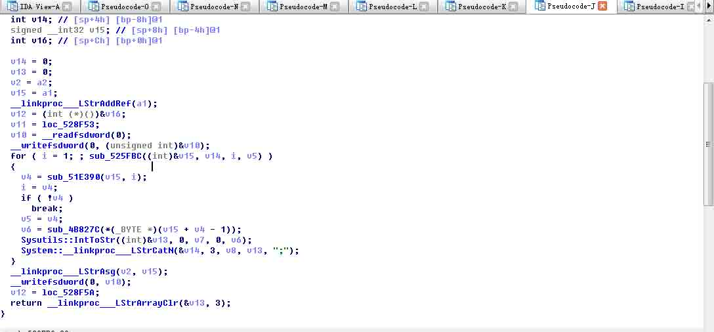

sub_51E390 做正则表达式匹配，查找`{|`等字符，当`%20{.exec|calc.}`传递给该函数时，该函数返回值为 2。下面由

```
sub_4B827C、Sysutils::IntToStr 
```

将字符转换为 10 进制字符串形式，最终替换掉原始字符串中的{。

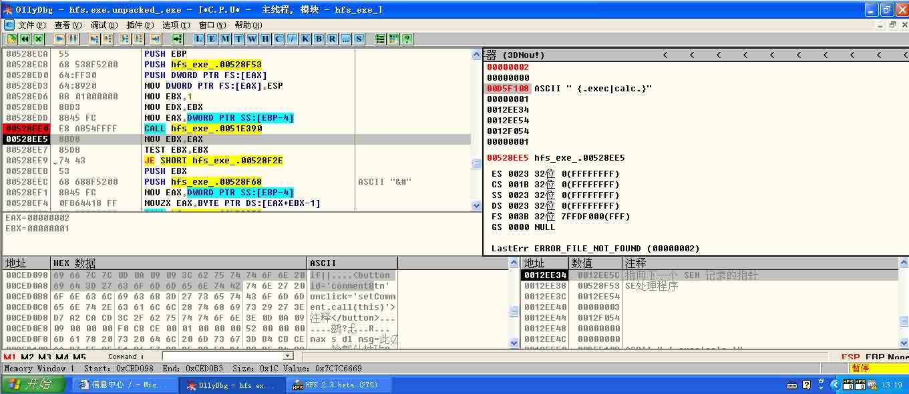

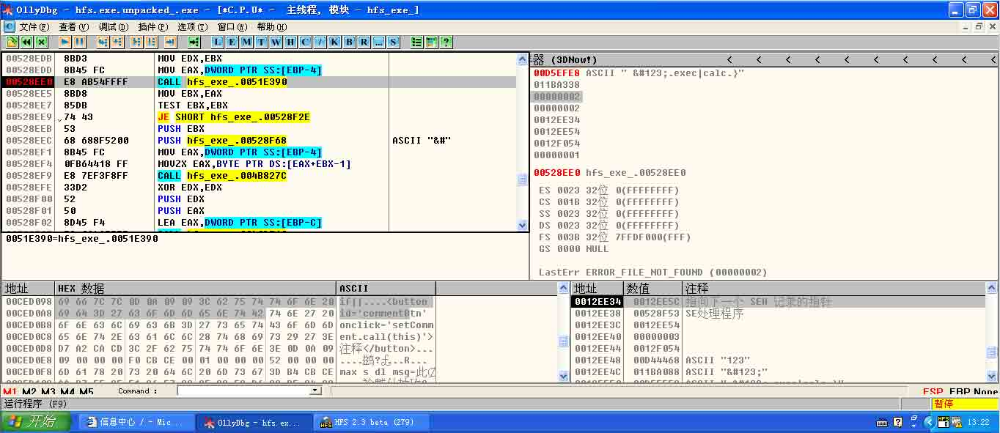

对于

```
http://localhost:80/?search=%00{.exec|calc.} 
```

sub_51E390 返回值为 0，因此后面的{|等字符不会被转换，最终导致了后面的命令执行。


查看

```
int __fastcall sub_51E390(int a1, int a2) 
```

函数，可以看到“`\\{[.:]|[.:]\\}|\\|`”和“`m!`”，在分析的过程中，看到过字符串“`parserLib`”，就 google 一下。。。。。。。

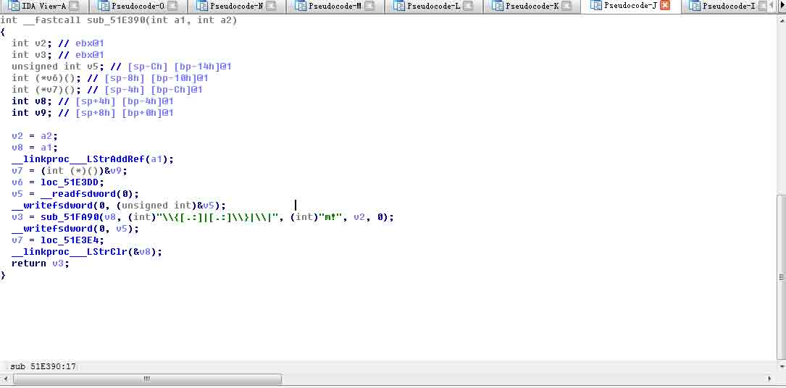


查看该漏洞详情，可以看到和分析的结果一致，由于正则表达式的问题，导致了最终的远程代码执行。

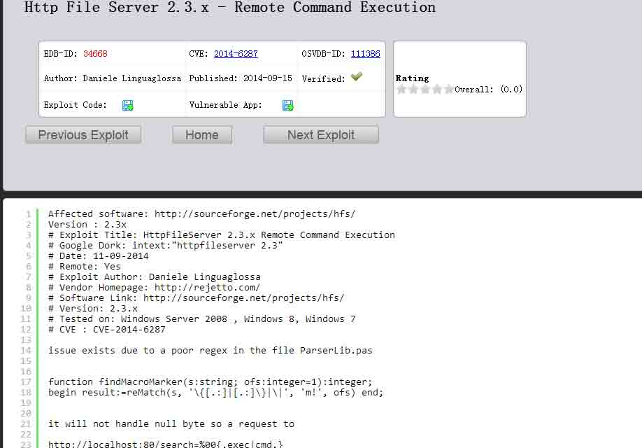

版权声明：未经授权禁止转载 [cssembly](http://drops.wooyun.org/author/cssembly "由 cssembly 发布")@[乌云知识库](http://drops.wooyun.org)

分享到：

### 相关日志

*   [CVE-2014-4113 漏洞利用过程分析](http://drops.wooyun.org/papers/3331)
*   [MS15-002 telnet 服务缓冲区溢出漏洞分析与 POC 构造](http://drops.wooyun.org/papers/4621)
*   [Easy RM to MP3 Converter(2.7.3.700)栈溢出漏洞调试笔记](http://drops.wooyun.org/papers/3178)
*   [做个试验：简单的缓冲区溢出](http://drops.wooyun.org/papers/1421)
*   [堆溢出学习笔记](http://drops.wooyun.org/tips/1621)
*   [uctf-杂项题目分析](http://drops.wooyun.org/tips/3349)