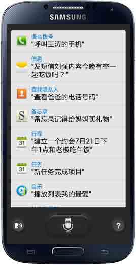
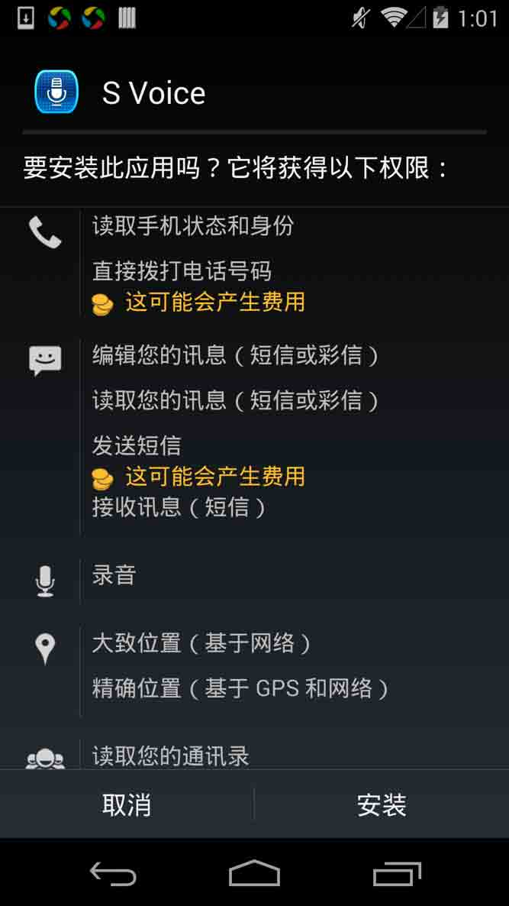
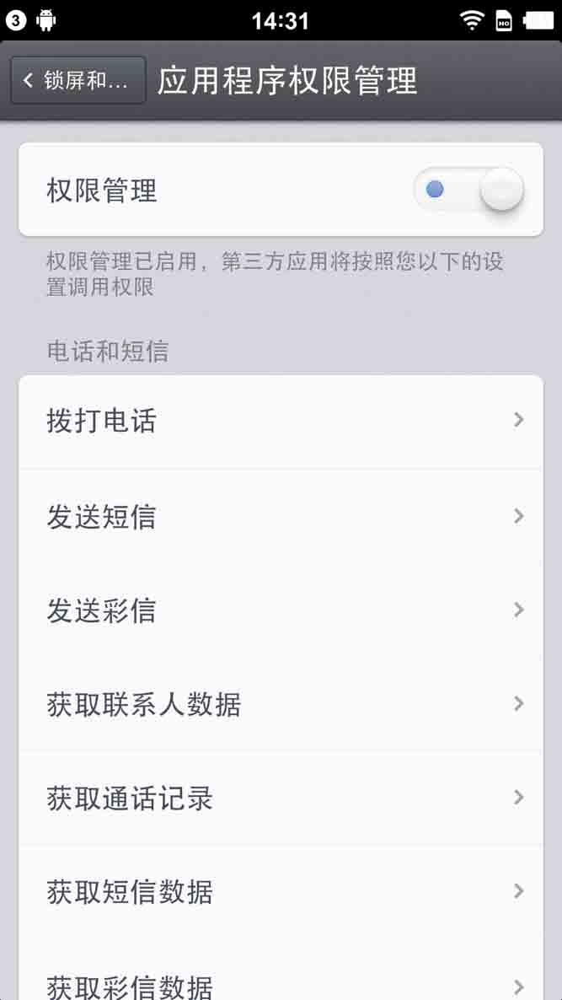
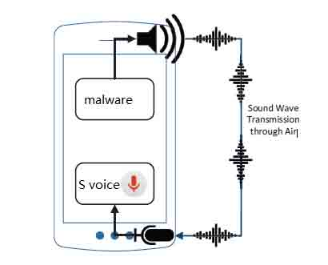
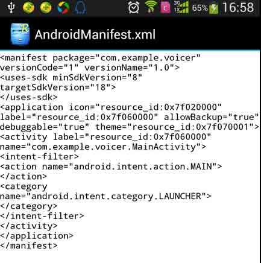
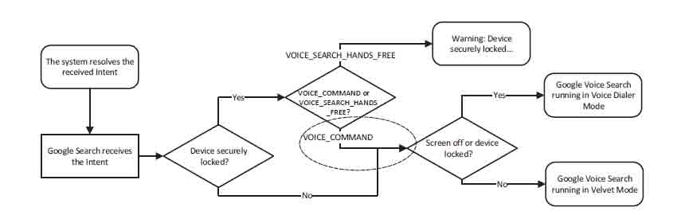

# Samsung S Voice attack

2014/08/08 15:01 | [瘦蛟舞](http://drops.wooyun.org/author/瘦蛟舞 "由 瘦蛟舞 发布")   | [技术分享](http://drops.wooyun.org/category/tips "查看 技术分享 中的全部文章"), [移动安全](http://drops.wooyun.org/category/mobile "查看 移动安全 中的全部文章")  | 占个座先  | 捐赠作者

参考：http://arxiv.org/pdf/1407.4923.pdf

## 0x00 三星 S voice

* * *

三星 s voice 是类似 apple siri 以及 google voice 的一款语音助手软件，通过此款软件可以释放双手通过语音命令操作手机。执行如拨打电话、发送短信、拍照等功能。由此可见此软件的权限是非常宽广的。



App 申请的权限如下：

```
<uses-permission android:name="android.permission.BROADCAST_STICKY"/>
<uses-permission android:name="android.permission.READ_CALENDAR"/>
<uses-permission android:name="android.permission.WRITE_CALENDAR"/>
<uses-permission android:name="android.permission.RECEIVE_BOOT_COMPLETED"/>
<uses-permission android:name="android.permission.ACCESS_COARSE_LOCATION"/>
<uses-permission android:name="android.permission.ACCESS_FINE_LOCATION"/>
<uses-permission android:name="android.permission.ACCESS_WIFI_STATE"/>
<uses-permission android:name="android.permission.CALL_PHONE"/>
<uses-permission android:name="android.permission.INTERNET"/>
<uses-permission android:name="android.permission.ACCESS_LOCATION_EXTRA_COMMANDS"/>
<uses-permission android:name="android.permission.MODIFY_AUDIO_SETTINGS"/>
<uses-permission android:name="android.permission.READ_CONTACTS"/>
<uses-permission android:name="android.permission.WRITE_CONTACTS"/>
<uses-permission android:name="android.permission.READ_PHONE_STATE"/>
<uses-permission android:name="android.permission.READ_SMS"/>
<uses-permission android:name="android.permission.READ_USER_DICTIONARY"/>
<uses-permission android:name="android.permission.RECEIVE_SMS"/>
<uses-permission android:name="android.permission.RECORD_AUDIO"/>
<uses-permission android:name="android.permission.SEND_SMS"/>
<uses-permission android:name="android.permission.WRITE_SMS"/>
<uses-permission android:name="android.permission.WRITE_SETTINGS"/>
<uses-permission android:name="android.permission.VIBRATE"/>
<uses-permission android:name="android.permission.WRITE_EXTERNAL_STORAGE"/>
<uses-permission android:name="android.permission.WRITE_USER_DICTIONARY"/>
<uses-permission android:name="android.permission.ACCESS_NETWORK_STATE"/>
<uses-permission android:name="android.permission.BLUETOOTH"/>
<uses-permission android:name="android.permission.CHANGE_WIFI_STATE"/>
<uses-permission android:name="android.permission.WAKE_LOCK"/>
<uses-permission android:name="com.android.launcher.permission.INSTALL_SHORTCUT"/>
<uses-permission android:name="android.permission.DISABLE_KEYGUARD"/>
<uses-permission android:name="android.permission.BLUETOOTH_ADMIN"/>
<uses-permission android:name="com.android.alarm.permission.SET_ALARM"/>
<uses-permission android:name="com.android.vending.BILLING"/>
<uses-permission android:name="android.permission.GET_TASKS"/>
<uses-permission android:name="android.permission.GET_ACCOUNTS"/>
<uses-permission android:name="com.android.alarm.permission.SET_ALARM"/>
<uses-permission android:name="com.sec.android.widgetapp.q1_penmemo.permission.READ"/>
<uses-permission android:name="com.sec.android.widgetapp.q1_penmemo.permission.WRITE"/>
<uses-permission android:name="com.sec.android.permission.READ_MEMO"/>
<uses-permission android:name="com.sec.android.permission.WRITE_MEMO"/>
<uses-permission android:name="com.android.email.permission.ACCESS_PROVIDER"/>
<uses-permission android:name="com.android.email.permission.READ_ATTACHMENT"/>
<uses-permission android:name="com.sec.android.app.clockpackage.permission.READ_ALARM"/>
<uses-permission android:name="com.sec.android.app.clockpackage.permission.WRITE_ALARM"/>
<uses-permission android:name="com.sec.android.app.twdvfs.DVFS_BOOSTER_PERMISSION"/>
<uses-permission android:name="android.Manifest.permission.DISABLE_KEYGUARD"/>
<uses-permission android:name="android.permission.DISABLE_KEYGUARD"/>
<uses-permission android:name="com.infraware.provider.SNoteProvider.permission.READ"/>
<uses-permission android:name="com.infraware.provider.SNoteProvider.permission.WRITE"/>
<uses-permission android:name="android.permission.SYSTEM_ALERT_WINDOW"/>
<uses-permission android:name="android.permission.READ_CALL_LOG"/>
<uses-permission android:name="com.sec.android.app.sns3.permission.SNS_FB_ACCESS_TOKEN"/>
<uses-permission android:name="com.samsung.music.permission.READ_MUSIC_STORAGE"/>
<uses-permission android:name="com.sec.android.daemonapp.ap.yonhapnews.permission.YONHAP_DAEMON_ACCESS_PROVIDER"/>
<uses-permission android:name="com.sec.android.app.music.permission.READ_MUSICPROVIDER"/> 
```

## 0x01 Android permission

* * *

应用在执行某项敏感操作时（例如发送短信）必须在程序安装时就对此项权限进行申明

参考：

http://developer.android.com/guide/topics/manifest/uses-permission-element.html http://developer.android.com/guide/topics/manifest/manifest-intro.html#perms http://developer.android.com/reference/android/Manifest.permission.html



恶意软件要获取手机通讯录中的联系人信息就必须申请 READ_CONTACTS 权限，读取信必须申请 READ_SMS ，发现短信要申请 SEND_SMS 权限。利用这一机制小伙伴如果发现某些不知名软件申请这些权限就果断点取消。更机智小伙伴就会利用权限管理软件把看片神器的除网络访问权限以为的权限都关闭掉。



## 0x02 攻击思路

* * *

在权限管理软件的控制下恶意软件视乎难以再有所作为，是否有零权限的攻击方法了？ 这就要借助上文提到高权限软件 s voice 了，我们可以伪装一个恶意软件不申请任何敏感权限再借助 S voice“提升权限”达到攻击效果。



## 0x03 Demo

设计思路： 1、 设置 intent 启动 S Voice

```
Intent intent = new Intent();
intent.setAction("android.intent.action.VOICE_COMMAND");
startActivity(intent); 
```

2、 调用 MediaPalyer 类播放攻击语音

```
private MediaPlayer mp4;
mp4 = MediaPlayer.create(MainActivity.this, R.raw.confirm);
mp4.start(); 
```

demo 应用未申请任何权限



演示视频： http://v.youku.com/v_show/id_XNzUyNzk3MzYw.html

## 0x04 补充说明

* * *

```
1\. 因为 google voice 的谷歌类产品被严重河蟹基本无法使用，不考虑这种情况下音频文件过大可使用 google TTS 文字转语音。
2\. 其他语音助手软件：百度语音….
3\. 即使声音很小也能成功被 s voice 识别，睡眠时小于 55 分贝不易被发现。可以通过监视系统状态、传感器判断手机运行状态。
4\. 安卓系统中录音方法是 synchronized,也就是通过 sdk api 多个应用是无法同时访问麦克风的。想无声攻击可以考虑 NDK。
5\. 通过传感器、系统状态信息判断手机是否被使用，再未使用的情况下唤醒屏幕，发出攻击指令。（s voice 在屏幕关闭时候无法运行，用户在使用时攻击指令发声易被发现）
6\. 锁屏下攻击思路： 
```



版权声明：未经授权禁止转载 [瘦蛟舞](http://drops.wooyun.org/author/瘦蛟舞 "由 瘦蛟舞 发布")@[乌云知识库](http://drops.wooyun.org)

分享到：碎银子打赏，作者好攒钱娶媳妇：


### 相关日志

*   [Intent scheme URL attack](http://drops.wooyun.org/papers/2893)
*   [Android Logcat Security](http://drops.wooyun.org/tips/3812)
*   [Android Activtity Security](http://drops.wooyun.org/tips/3936)
*   [Android Adobe Reader 任意代码执行分析(附 POC)](http://drops.wooyun.org/papers/1440)
*   [一次 app 抓包引发的 Android 分析（续）](http://drops.wooyun.org/tips/2986)
*   [Android uncovers master-key 漏洞分析](http://drops.wooyun.org/papers/219)