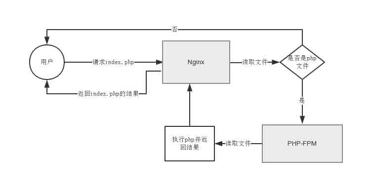

# lnmp 虚拟主机安全配置研究

2014/08/25 16:28 | [phith0n](http://drops.wooyun.org/author/phith0n "由 phith0n 发布") | [技术分享](http://drops.wooyun.org/category/tips "查看 技术分享 中的全部文章"), [运维安全](http://drops.wooyun.org/category/%e8%bf%90%e7%bb%b4%e5%ae%89%e5%85%a8 "查看 运维安全 中的全部文章") | 占个座先 | 捐赠作者

## 0x00 背景

* * *

众所周知，虚拟主机的安全不好做，特别是防止跨目录成为了重点。apache+php 服务器防止跨目录的方式比较简单，网上的所有成熟虚拟主机解决方案都是基于 apache 的，如 directadmin、cpanel。

但如今已然不是 apache 的时代了，在 linux+nginx+mysql+php 下怎么防止不同虚拟主机进行跨站？

首先我们要清楚明白 Nginx 是怎么运行的，再考虑怎么具体操作吧。乌云知识库里有一篇很好的文章[`drops.wooyun.org/tips/1323`](http://drops.wooyun.org/tips/1323)，介绍了 nginx 的安全配置，大家可以看看。

nginx 实际上只是一个反向代理服务器，它接收到请求以后会看当前请求是否是.php 文件，如果是则转交给 php-fpm 来处理，获得结果后再发给用户。所以有两个权限需要考虑：第一是 nginx 的权限，第二是 php-fpm 的权限。如下图，nginx 和 php-fpm 都要读取这个文件，所以权限分配是要考虑的重要一项。



防御跨站要防御的有三点，第一是防止其他用户列网站目录，防止自己的一些敏感文件名被看到及访问；第二是防止其他用户读取自己的文件，防止配置信息泄露；第三就是防止其他用户写 shell 在自己目录。

php 显然也考虑到了这个问题，其配置文件中的`open_basedir`，是一个目录列表，只允许 php 访问其中给出的目录。通过设置这个`open_basedir`我们就可以防御 php 读写 web 目录以外的文件，比如`/etc/passwd`之类的。

但现在的问题是，open_basedir 是写在 php.ini 中的一个配置文件，而所有虚拟主机使用的 php 是同一个 php，我们可以防止 php 访问 web 目录以外的文件，但是没法防止“虚拟主机 1”访问“虚拟主机 2”的文件，因为二者都在 web 目录内。甚至还有一个更大的问题是，很多版本 php 的 open_basedir 并不靠谱，能被很容易地绕过。

这是现在遇到的问题。解决方法就是：让每个虚拟主机用不同用户来单独启动 php-fpm。

为了实现上面方法，我们需要对安装好的 lnmp 做些修改。（我使用的就是国内用的比较广的"lnmp 一键安装包"）。

## 0x01 lNMP 加固

* * *

比如我们服务器上有两个虚拟主机 game01.com 和 game02.com，其目录分别是 /home/wwwroot/game01/和/home/wwwroot/game02/。

这里说一下，新版的 lnmp 一键安装包有自带的防跨站功能，是因为 php 5.3.3 以后，可以在 php.ini 末尾加上类似如下语句：

```
[HOST=www.vpser.net] 
open_basedir=/home/wwwroot/www.vpser.net/:/tmp/ 
[PATH=/home/wwwroot/www.vpser.net] 
open_basedir=/home/wwwroot/www.vpser.net/:/tmp/ 
```

就可以给不同 HOST 赋予不同`open_basedir`。但是我们这里不用这个方法，第一其限制 php 版本在 5.3.3 以上，第二`open_basedir`也是有局限与漏洞的，不能完全依靠这个玩意。所以，虚拟主机创建好以后，来到/usr/local/php/etc/php.ini 把这些内容注释掉。（注释符;）

首先，让不同虚拟机用不同 php-fpm 运行：

一、为每个站点创建 php-fpm.pid 文件

```
cd /usr/local/php5/var/run
touch php-fpm-game01.pid
touch php-fpm-game02.pid 
```

二、为每个站点创建 php-fpm.conf 文件

```
cd /usr/local/php5/etc/ 
cp php-fpm.conf php-fpm-game01.conf 
cp php-fpm.conf php-fpm-game02.conf 
```

三、为每个站点建立 php-cgi.sock 文件

```
touch /tmp/php-cgi-game01.sock #建立 php-cgi.sock 文件 
chown www.www /tmp/php-cgi-game01.sock #设置文件所有者为 www（必须与 nginx 的用户一致） 
touch /tmp/php-cgi-game02.sock 
chown www.www /tmp/php-cgi-game02.sock 
```

四、修改相关文件

```
vi /usr/local/php5/etc/php-fpm-game01.conf 
pid = run/php-fpm-game01.pid 
listen =/tmp/php-cgi-game01.sock; 

vi /usr/local/php5/etc/php-fpm-game02.conf
pid = run/php-fpm-game02.pid
listen =/tmp/php-cgi-game02.sock; 

vi /etc/init.d/php-fpm 
vhost=$2 
php_fpm_CONF=${prefix}/etc/php-fpm-$vhost.conf 
php_fpm_PID=${prefix}/var/run/php-fpm-$vhost.pid 
php_opts="-d open_basedir=/home/wwwroot/$vhost/:/tmp/ --fpm-config $php_fpm_CONF" 
```

上述最后一行，就是 php-fpm 执行的参数，其中我们将 open_basedir 设置成了/home/wwwroot/$vhost/:/tmp/，$vhost 就是我们运行时传入的第二个参数$2（game01 或 game02）。

继续修改

```
vi /usr/local/nginx/conf/vhost/game01.com.conf # 配置文件名可能不一样，要根据实际情况改变
fastcgi_pass unix:/tmp/php-cgi-game01.sock;
vi /usr/local/nginx/conf/vhost/game02.com.conf 
fastcgi_pass unix:/tmp/php-cgi-game02.sock; 
```

五.增加开机启动项

```
vi /home/start.sh
# !/bin/bash
auto=$1 /bin/bash /etc/rc.d/init.d/php-fpm $auto game01 /bin/bash /etc/rc.d/init.d/php-fpm $auto game02
chmod +x /home/start.sh 
```

然后编辑/etc/rc.local 将 start.sh 加入启动项。 到此，不同虚拟主机就会以运行不同的 php-fpm。我们还需要用不同的用户身份来运行。

```
groupadd game01 groupadd game02 
useradd game01 -M -s /sbin/nologin -g game01 
useradd game02 -M -s /sbin/nologin -g game02 
```

添加了 game01.game01 和 game02.game02 两个用户。 修改/usr/local/php/etc/php-fpm-game01.conf：

```
listen.owner = game01
listen.group = game01 
user=game01 
group=game01 
```

game02 同理修改。这样我们就让 php-fpm 以不同用户来运行了。

再来到/home/wwwroot/：

```
cd /home/wwwroot/ 
chown game01.game01 -R game01 
chown game02.game02 -R game02 
```

将 game01 和 game02 文件夹分别给予用户 game01 和 game02。

再有，我们的 nginx 是默认以 www 用户运行的，所以是不能读取 game01、game02 用户文件的，如果把文件权限设置成 777，又不能防止 game01 读取 game02 的文件。

所以，我们应该将 www 用户加入 game01、game02 组，再把 game01、game02 的文件设置成 750 权限，这样就可以允许 www 来读取 game01/game02 的文件（因为在同组，而组权限是 5，5 就够了），又能防止 game01 读取 game02 的文件。

linux 中允许把一个用户加入多个组，所以操作如下：

```
usermod -aG game01 www 
usermod -aG game02 www 
```

这时候。我们的防御其实有两层。

01.不同 php-fpm 运行两个虚拟主机的 php 程序，他们拥有自己的 open_basedir，使之不能跨目录。

02.即使 open_basedir 被绕过了，以 game01 用户身份运行的 php-fpm 也无法写入、读取 game02 的文件，因为 game02 的所有文件权限都是 750。其他用户没有任何权限（0）。

一切设置好以后，说一下使用方法了。

## 0x02 使用方法

* * *

先 kill 掉已有的 php-fpm，再重启一下 nginx，再/home/start.sh 启动新的 php-fpm 即可。

```
/etc/init.d/php-fpm start game01 单独启动 game01
/etc/init.d/php-fpm start game02 单独启动 game02
/etc/init.d/php-fpm stop game01 单独启动 game01
/etc/init.d/php-fpm stop game02 单独启动 game02 
```

以上是我拼凑的一点方法，可能并不是最佳方法（我对 nginx 机制也是不熟悉，也许有更简单的方法可以解决这个问题），所以也希望各大牛能分享自己运维的方法，指出我的不足

## 0x03 参考:

* * *

http://drops.wooyun.org/tips/1323

http://www.dedecms.com/knowledge/servers/linux-bsd/2012/0819/8389.html

http://yzs.me/2198.html

版权声明：未经授权禁止转载 [phith0n](http://drops.wooyun.org/author/phith0n "由 phith0n 发布")@[乌云知识库](http://drops.wooyun.org)

分享到：

### 相关日志

*   [使用 OpenSSH 证书认证](http://drops.wooyun.org/tips/1055)
*   [如何用意念获取附近美女的手机号码](http://drops.wooyun.org/tips/573)
*   [NTP 反射型 DDos 攻击 FAQ/补遗](http://drops.wooyun.org/papers/955)
*   [Rsync 安全配置](http://drops.wooyun.org/papers/161)
*   [搭建基于 Suricata+Barnyard2+Base 的 IDS 前端 Snorby](http://drops.wooyun.org/papers/653)
*   [J2EE 远程代码执行那些事儿(框架层面)](http://drops.wooyun.org/papers/914)