# BurpSuite 扩展开发[1]-API 与 HelloWold

2014/11/20 15:08 | [园长](http://drops.wooyun.org/author/园长 "由 园长 发布") | [技术分享](http://drops.wooyun.org/category/tips "查看 技术分享 中的全部文章"), [漏洞分析](http://drops.wooyun.org/category/papers "查看 漏洞分析 中的全部文章") | 占个座先 | 捐赠作者

## 0x00 简介

* * *

BurpSuite 神器这些年非常的受大家欢迎，在国庆期间解了下 Burp 相关开发并写了这篇笔记。希望和大家分享一下 JavaSwing 和 Burp 插件相关开发。第一节仅简单的了解下 API 相关，后面会带着大家利用 Netbeans 开发我们自己的扩展以及各种有趣的小工具。

## 0x01 怎么学？

* * *

第一个问题是我们应该怎么去写自己的 Burp 扩展？我们可以找一些现有的扩展学习下，或者参阅官方文档或者手册，其次才是 google 一下是否有相关的教程、文章进行学习。

google 搜索：burp suite api，找到官方的 API 相关说明。

1.  http://portswigger.net/burp/extender/

2.  http://blog.portswigger.net/2012/12/draft-new-extensibility-api.html

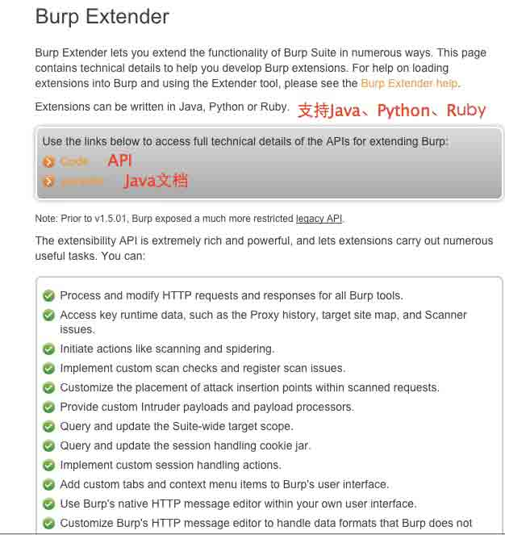

You can:

1.  执行和修改 HTTP 请求和响应

2.  访问运行时的数据，比如：代理日志、目标站 map 和扫描问题

3.  启动自己的 action，如扫描和网站爬行

4.  自定义扫描检测和注册扫描问题

5.  提供自定义 Intruder payloads 和 payload 处理

6.  查询和更新 Suite-wide 的目标作用域

7.  查询和更新 session 处理 cookie jar

8.  实现自定义 session 处理 action

9.  添加自定义的标签(tabs)和上下文菜单项到 Burp 用户界面

10.  可使用自己的界面添加 Burp 的 HTTP 消息编辑器

11.  自定义 Burp 的 HTTP 消息编辑器处理 Burp 不支持的数据格式

12.  获取 headers, parameters, cookies 分析 HTTP 请求和响应

13.  读取或修改 Burp 配置设置

14.  保存或恢复 Burp 状态

## 0x02 学习 API

* * *

API 下载地址：http://portswigger.net/burp/extender/api/burp_extender_api.zip

下载 API 后新建 Eclipse 项目导入 API 文件：

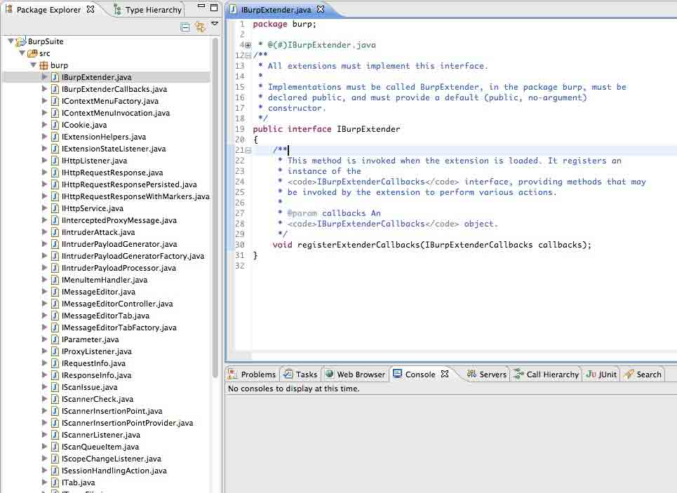

不急于动手写代码，先看下官方的 Demo：

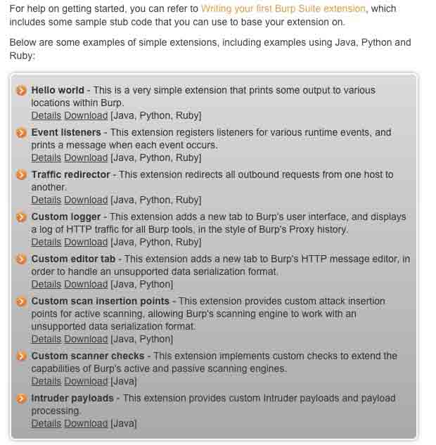

下载第一个 HelloWorld 解压它并复制 BurpExtender.java 到我们的项目当中：

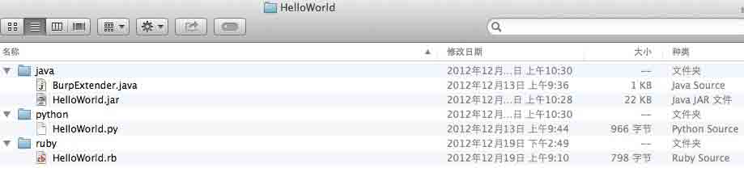

BurpExtender.java：

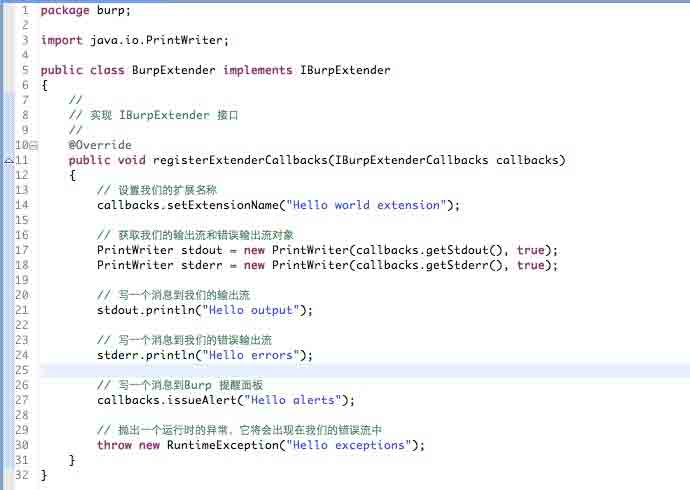

BurpExtender.java 实现了 IBurpExtender 接口，而 IBurpExtender 仅定义了一个方法：registerExtenderCallbacks(注册扩展回调方法)：

```
public interface  IBurpExtender{
         /**
          * 这个方法将在扩展加载的时候.他将会注册一个
          *<code>IBurpExtenderCallbacks</code> 接口实例,可通过扩展
          * 实现各种调用
          *@param 回调一个
          *<code>IBurpExtenderCallbacks</code>对象.
          */
         void registerExtenderCallbacks(IBurpExtenderCallbacks callbacks);
}

```

在确认代码无任何错误后选中项目并导出为 jar,建议安装一个打 jar 包的插件:Build Fat Jar 这样你就可以非常方便的把整个项目打成一个 jar 包了.

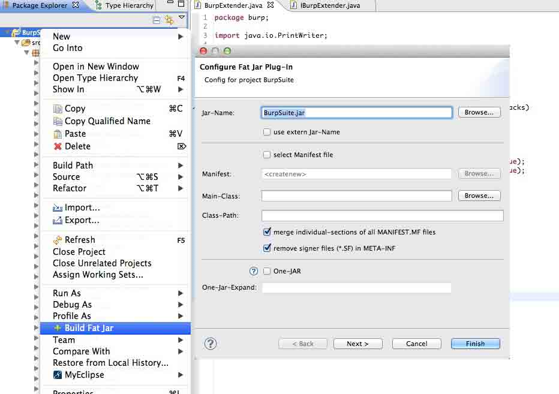

如果你和我一样从来都没有使用过 BurpSuite，那么不妨先打开它把玩几分钟。在 extender(扩展)标签当中看到了 Burp 的插件加载界面。


Add 我们刚打好的 jar 包，加载到 Burp 扩展中去。

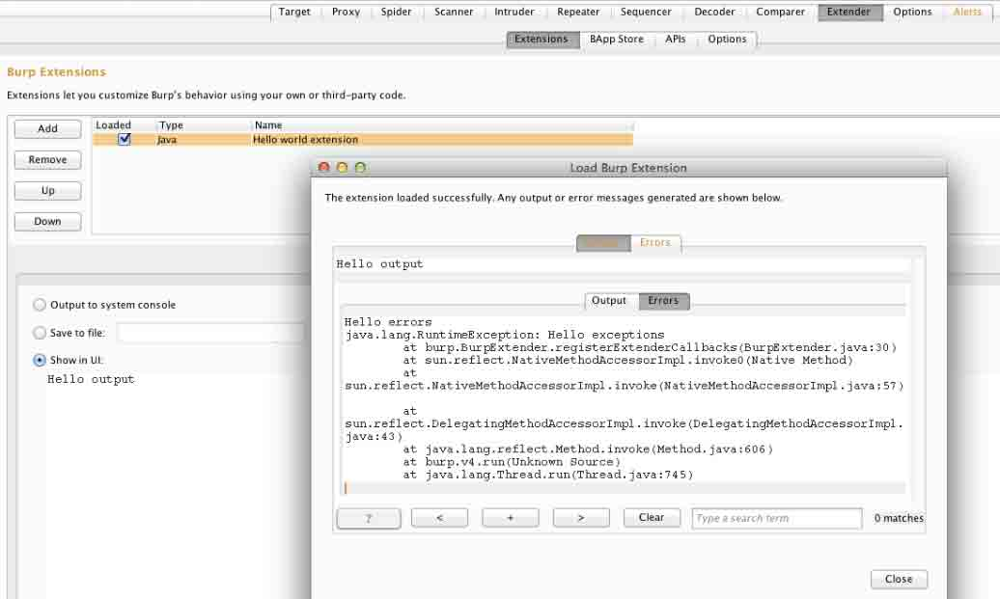

这个时候可以看到我们的插件已经成功运行了，在 LoadBurpExtension 中的 output 标签已经看到了 Hello output(stdout.println("Hello output");)

Errors 标签也输出了 Hello errors()stderr.println("Hello errors");

对应的错误信息(throw new RuntimeException("Hello exceptions");)。

插件名(callbacks.setExtensionName("Hello world extension");)，

以及提醒面板的信息 Hello alerts(callbacks.issueAlert("Hello alerts");)。

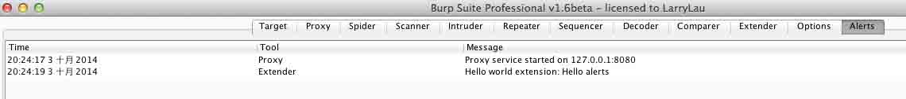

获取到 Burp 混淆后的扩展加载类(自定义类加载器)：

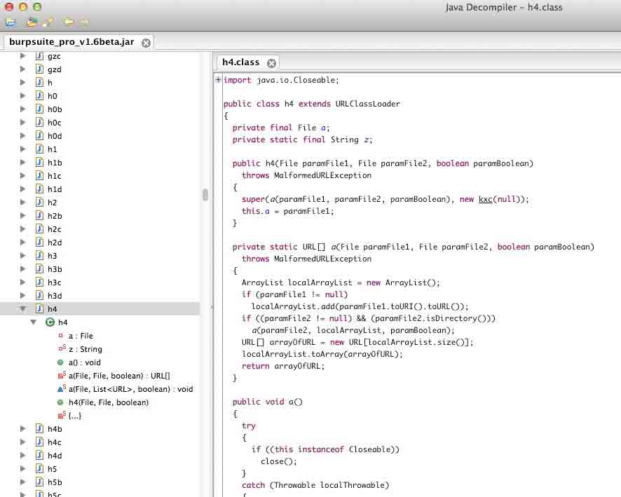

如你所想，java 加载外部扩展利用了 URLClassLoader load 外部的 jar(对这感兴趣的朋友可以看下 p2j 上的相关文章:http://p2j.cn/?s=URLClassLoader&submit=Search)。

第一个 HelloWorld 很容易就搞定了，第二个 Event listeners 的 Demo。所谓事件监听即你可以通过 Burp 的 IBurpExtenderCallbacks 去注册自己的监听方法。Demo 只提供了四种事件(包含 HTTP 监听、代理、Scanner、状态监听)，所有的未列举的事件直接用 Eclipse 的快捷键提示就出来了：

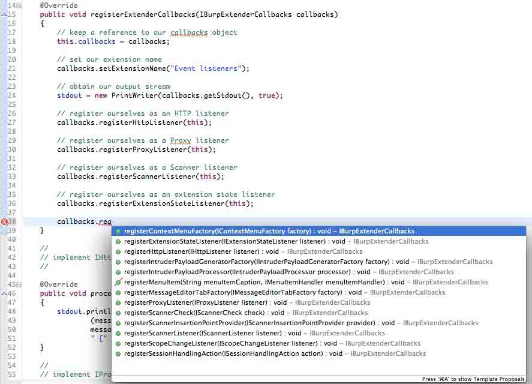

比如想要添加一个 IScopeChangeListener 很简单，让当前类实现 IScopeChangeListener 接口，注册 ScopeChange 事件(callbacks.registerScopeChangeListener(this);)重写其 scopeChanged 方法即可。


设置本地浏览器代理后再次访问任意网站后回到扩展标签，选中我们的扩展程序可以看到监听中的请求已输出。

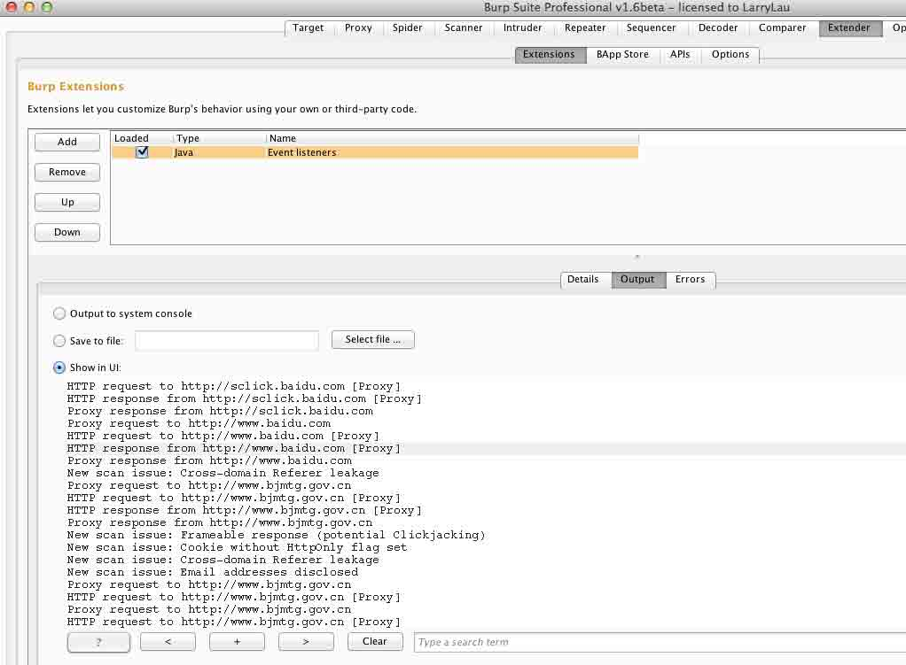

## 0x03 HelloWorld

* * *

在编写扩展的时候一定要注意，你的包里面务必包含一个 BurpExtender 类可以有多个类实现 IBurpExtender。 创建自己的 Panel 并加到 Burp 主窗体，AppPanel 是我自己写的一个应用面板。我们可以通过实现 ITab 重写 getTabCaption 和 getUiComponent 方法(当然实现 IBurpExtender 接口是必须的)将我们自己的 ui 嵌套到 Burp 当中。getTabCaption 即获取获取标题，getUiComponent 获取组件这里需要给 Burp 返回你封装的组件对象。

我们可以先写好 JPanel 再嵌入到 Burp 当中，这里提供了一个简单的 ApplicationPanel 小 Demo:http://p2j.cn/?p=1512

```
package burp;

import java.awt.Component;

import javax.swing.JPanel;
import javax.swing.SwingUtilities;

public class BurpExtender implements IBurpExtender, ITab {

     private JPanel jPanel1;

     @Override
     public void registerExtenderCallbacks(final IBurpExtenderCallbacks callbacks) {
          //设置扩展名
          callbacks.setExtensionName("应用中心");
          //创建我们的窗体
          SwingUtilities.invokeLater(new Runnable() {
               @Override
               public void run() {
                    //我们的主窗体
                    jPanel1 = new AppPanel();
                    //自定义我们的组件
                    callbacks.customizeUiComponent(jPanel1);
                    //添加标签到 Burp 主窗体
                    callbacks.addSuiteTab(BurpExtender.this);
               }
          });
     }

     @Override
     public String getTabCaption() {
          return "应用中心";
     }

     @Override
     public Component getUiComponent() {
          return jPanel1;
     }

}

```

效果图：

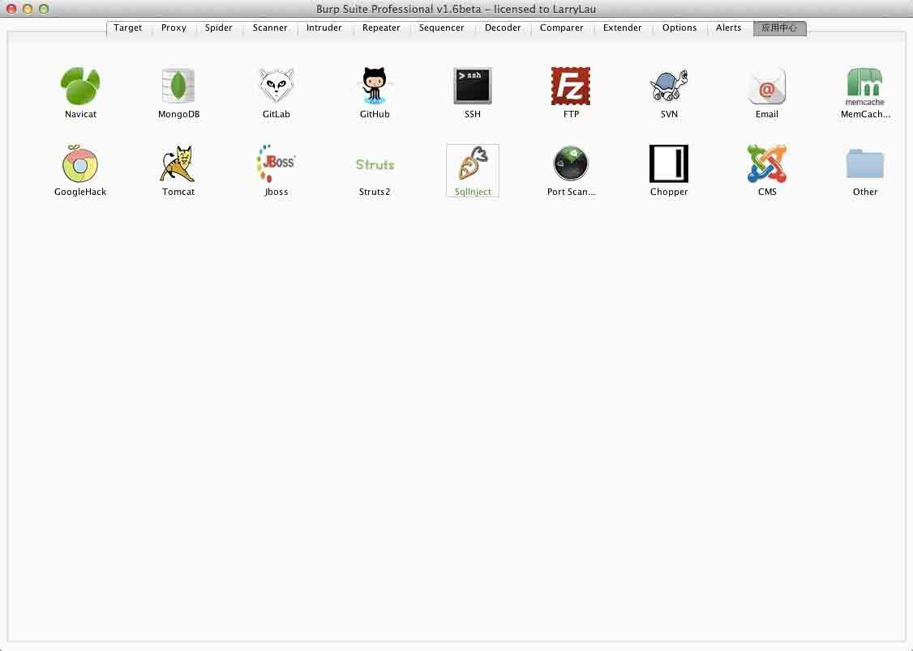

版权声明：未经授权禁止转载 [园长](http://drops.wooyun.org/author/园长 "由 园长 发布")@[乌云知识库](http://drops.wooyun.org)

分享到：

### 相关日志

*   [STRUTS2 的 getClassLoader 漏洞利用](http://drops.wooyun.org/papers/1151)
*   [CVE-2014-6321 schannel 堆溢出漏洞分析](http://drops.wooyun.org/papers/4194)
*   [CVE-2014-3393 详细分析与复现](http://drops.wooyun.org/papers/3451)
*   [Burp Suite 使用介绍（三）](http://drops.wooyun.org/tips/2247)
*   [Burp Suite 使用介绍（四）](http://drops.wooyun.org/tips/2504)
*   [雅虎某分站的 XSS 导致雅虎邮箱沦陷](http://drops.wooyun.org/papers/1024)