# DNS 泛解析与内容投毒，XSS 漏洞以及证书验证的那些事

2014/04/01 17:58 | [爱小狐狸的小螃蟹](http://drops.wooyun.org/author/爱小狐狸的小螃蟹 "由 爱小狐狸的小螃蟹 发布") | [技术分享](http://drops.wooyun.org/category/tips "查看 技术分享 中的全部文章"), [运维安全](http://drops.wooyun.org/category/%e8%bf%90%e7%bb%b4%e5%ae%89%e5%85%a8 "查看 运维安全 中的全部文章") | 占个座先 | 捐赠作者

from:[`w00tsec.blogspot.com/2014/03/wilcard-dns-content-poisoning-xss-and.html`](http://w00tsec.blogspot.com/2014/03/wilcard-dns-content-poisoning-xss-and.html)

## 0x00 背景

* * *

今天来讨论一下之前几个月我上报给 Google 和 Facebook 的一个有趣的漏洞，我在去年十月份利用一些空闲的时间在几家悬赏漏洞的公司当中测试，这个 bug Google 奖励了我 5000 美元，Facebook 奖励了我 500 美元。

我知道你可能非常关心是如何做到[上传任意文件](http://seclists.org/fulldisclosure/2014/Mar/123)的，文件包含的 payload 可能会导致预料之外的行为例如关闭白名单，希望这类 bug 已经已经被[Fyodor 修复](http://seclists.org/fulldisclosure/2014/Mar/333)。

（经/fd 提醒：这里其实想要讽刺全披露安全社区关闭的事件事源一个叫尼古拉 Lemonias 的人提交了一个很无聊的「任意文件上传漏洞」使约翰·卡特赖特（FD 的管理员）无法忍受而关闭服务）

标题可能会有点混乱，但我将要把这些技术结合起来，将会形成漏洞。

## 0x01 Wilcard DNS 和 Content Poisoning

* * *

应用程序从 HTTP Host 头与 domain name 中不验证产生完整的 URL 会造成主机名中毒。近日，Django 框架修复了一些漏洞，与 James Kettle 发表的[host header 攻击](http://www.skeletonscribe.net/2013/05/practical-http-host-header-attacks.html)相关。

在测试这个问题时，我发现了一个不一样的主机头攻击方式，可能会绕过浏览器的通配符。

我们快速浏览一下关于 Hostnames 的维基百科条目：

> “互联网标准（RFC）的协议，授权该组件的主机名称标签可能只包含 ASCII 字母'a '到'z ' （不区分大小写），数字'0'到'9'，而连字符（ “ - ” ）在 RFC 952 主机名的原始规范，规定了不能以数字或连字符开始，并且不能以连字符结尾，然而，随后的规范（RFC 1123）允许以数字开头的主机名称。不能有其他符号，点与空格是允许的。 “

最有趣的部分在这里：从 Windows，Linux 和 Mac OS X 当中认为

```
-www.plus.google.com
www-.plus.google.com
www.-.plus.google.com 
```

是有效的。但是 Android 不是这么认为的：


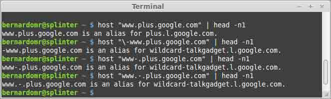

举个例子，下面的 URL：

```
https://www.example.com.-.www.sites.google.com 
```

如果我们在邮件当中写如上 URL，Gmail 会分割他，收到的邮件将含有两个部分：

```
https://www.example.com
sites.google.com 
```

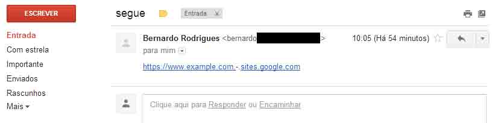

Facebook 在 zero.facebook.com 域名下有一个泛解析。为了利用这个漏洞，我们有使用中毒的 URL 来浏览服务，并执行可能需要电子邮件确认动作，检查 Facebook 是否会把精心构造 URL 的电子邮件发送给用户。

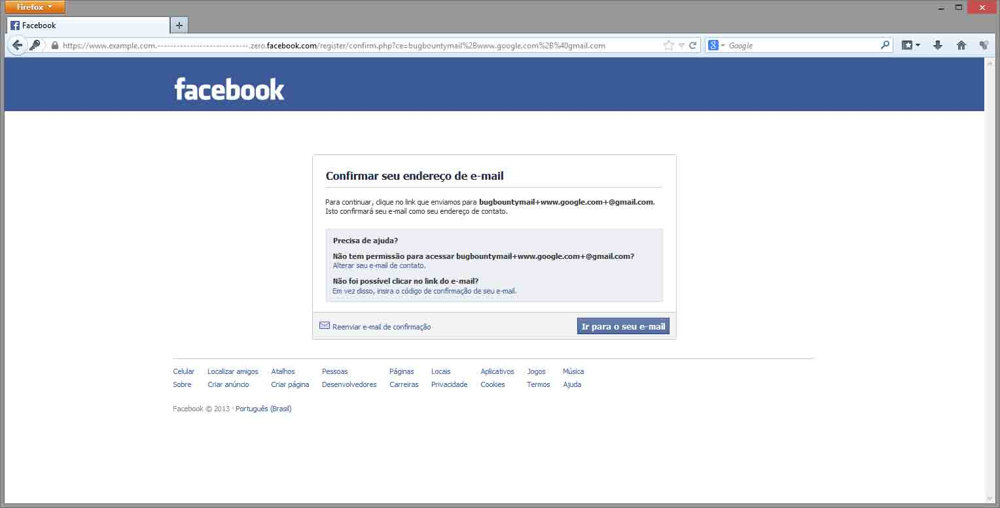

我发现这个问题产生的唯一漏洞就是注册邮件确认流程中，你可能会问一个人如何利用这个来攻击一个正常的用户呢？

假设我想利用`goodguy@example.com`攻击 Facebook 帐户。

如果我使用

```
https://www.example.com.-.zero.facebook.com 
```

浏览 Facebook，我所需要做的就是创建两个账户

```
goodguy+DUPLICATE@example.com 
```

绝大部分的 email 服务器如 Gmail 和 Hotmail 并不考虑“+”后面的字符，会把它转发到原始的账户中。

在这个例子当中，Facebook 发送的所有确认的 email 有污染过的连接：

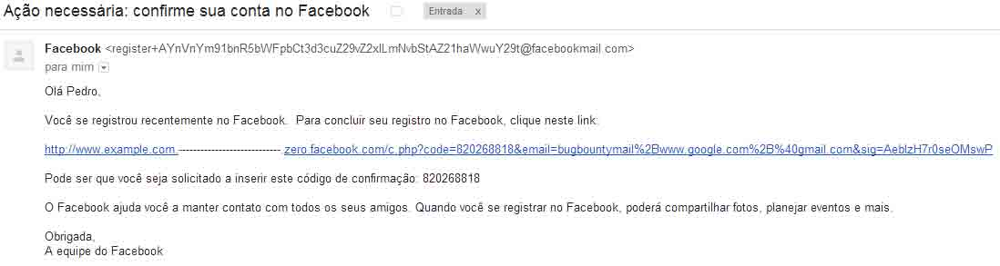

这也可以用来攻击密码重置电子邮件，但 Facebook 并没有受到影响。他们很快通过编码修复了电子邮件确认系统。它也可以（但不推荐）通过相对链接，而不是完整的 URL （请点击[这里](http://zero.facebook.com)，而不是一个具体的 URL `www.example.com.-.zero.facebook.com`） 。

## 0x02 XSS 和 Wildcard DNS

* * *

在 Google 上寻找此类问题的时候，我很快就发现了泛解析的域名，如：

```
- https://w00t.drive.google.com
- https://w00t.script.google.com
- https://w00t.sites.google.com 
```

如果你想知道如何快速地找到这些泛解析的域名，你可以下载[scans.io](https://scans.io/)从中寻找。你可以找到有关反向 DNS 记录或通过搜索发给通配符域的 SSL 证书，如

```
*.sites.google.com 
```

刚开始测试时，在 drive.google.com 域内我无法在 URL 当中使用`.-.`（得到 500 错误消息）

我能创造的 URL 是这样的：

```
https://www.example.com-----www.drive.google.com 
```

当你使用那个 URL 使用 Google Drive 时，上传一个文件到一个文件夹，并尝试`压缩/下载`它，会要求电子邮件确认，电子邮件的确认消息是这样的：

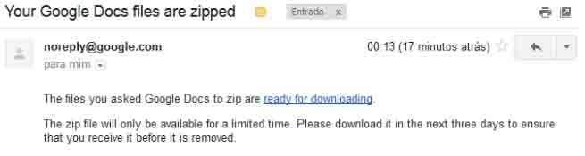

“ready for downloading”链接指向

```
https://www.example.com-----www.drive.google.com/export-result?archiveId=REDACTED 
```

到目前为止，没有什么大不了的，我仍然无法伪造该链接...钓鱼自己也是没有多大用处= ）

我不停地测试不同的 URL ，直到我发现了一个谷歌 DNS 服务器怪异的行为。当输入的 URL 中包含一定数量的“-”之后，解析的 IP 地址将会是你前面所可控部分域名的 IP 地址：

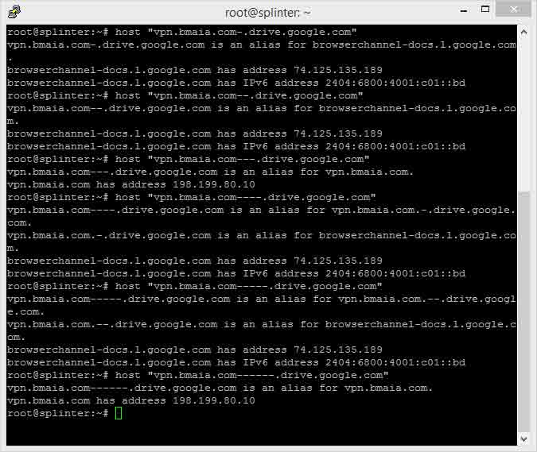

出于某种原因，他们的 DNS 服务器有这样的小问题，更具体地说在剥离了正则表达式“--”的前缀。我不知道他们为什么进行这些检查，但可能有些事情与[国际化域名](https://en.wikipedia.org/wiki/Internationalized_domain_name)相关。

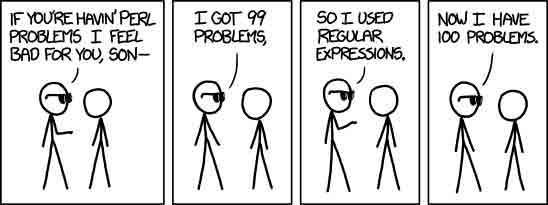

受此问题影响的一些谷歌的域名（ 2013 年 10 月） ：

```
- docs.google.com
- docs.sandbox.google.com
- drive.google.com
- drive.sandbox.google.com
- glass.ext.google.com
- prom-qa.sandbox.google.com
- prom-test.sandbox.google.com
- sandbox.google.com
- script.google.com
- script.sandbox.google.com
- sites.google.com
- sites.sandbox.google.com 
```

现在，我可以冒充谷歌的域名，很可能绕过同源策略，

滥用代表一个登录用户的同源策略和发出请求。 [lcamtuf](http://twitter.com/lcamtuf)已经告诉我们[HTTP cookies, or how not to design protocols](http://lcamtuf.blogspot.com.br/2010/10/http-cookies-or-how-not-to-design.html)。

如果我们控制

```
www.example.com 
```

从 drive.google.com 登录用户然后访问 URL

```
http://www.example.com---.drive.google.com 
```

会发生什么？

请求发送到合法的网站：

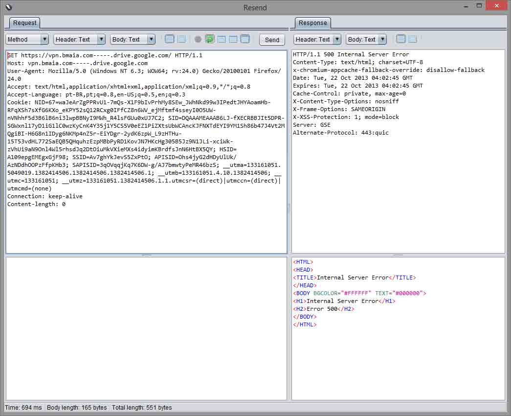

请求转向到用户可控的网站中，这个例子当中，我自己的服务器运行着 nginx：

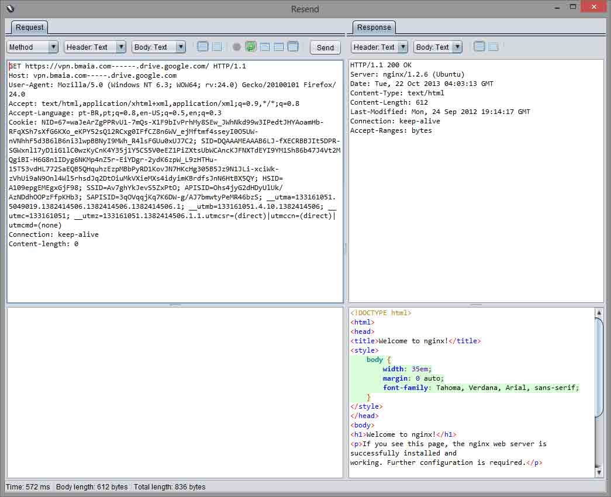

这可以导致 xss，你已经绕过了同源策略，可以偷取 cookie，执行脚本了。

## 0x03 Certificate Pinning 和 Wildcard DNS

* * *

到目前为止，一切都很好，但如果我们在 Google Chrome 当中做同样的测试，它会强制执行证书验证码？

我一开始没有注意，但我无意中也发现了 Chrome 浏览器的问题：这些非 RFC 兼容的域他并不能做 HSTS 检查。

网络堆栈的其他部分进行了处理，并提取从这些“无效”的 DNS 名称的结果，但 TransportSecurityState 否决了，因此 HSTS 政策并不适用。他们只是删除了完整性检查，这使 TransportSecurityState 的过程更加复杂。

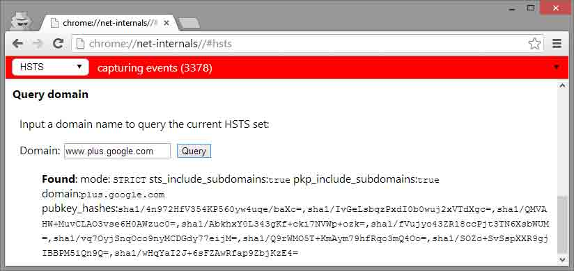

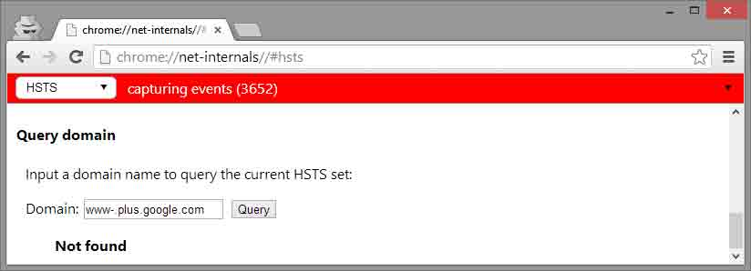

你可以在 Chrome V31 版本之前容易重现此问题：通过 OWASP ZAP 代理铬（接受其证书），请访问网址

```
https://sites.google.com 
```

Chrome 会显示一个“heightened security”的错误消息。

如果你输入键入的 URL 为：

```
https://www-.sites.google.com 
```

或

```
https://www-.plus.google.com 
```

Chrome 浏览器提供了“Proceed anyway”的选项。

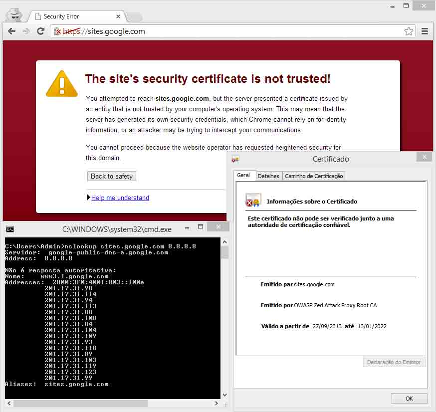

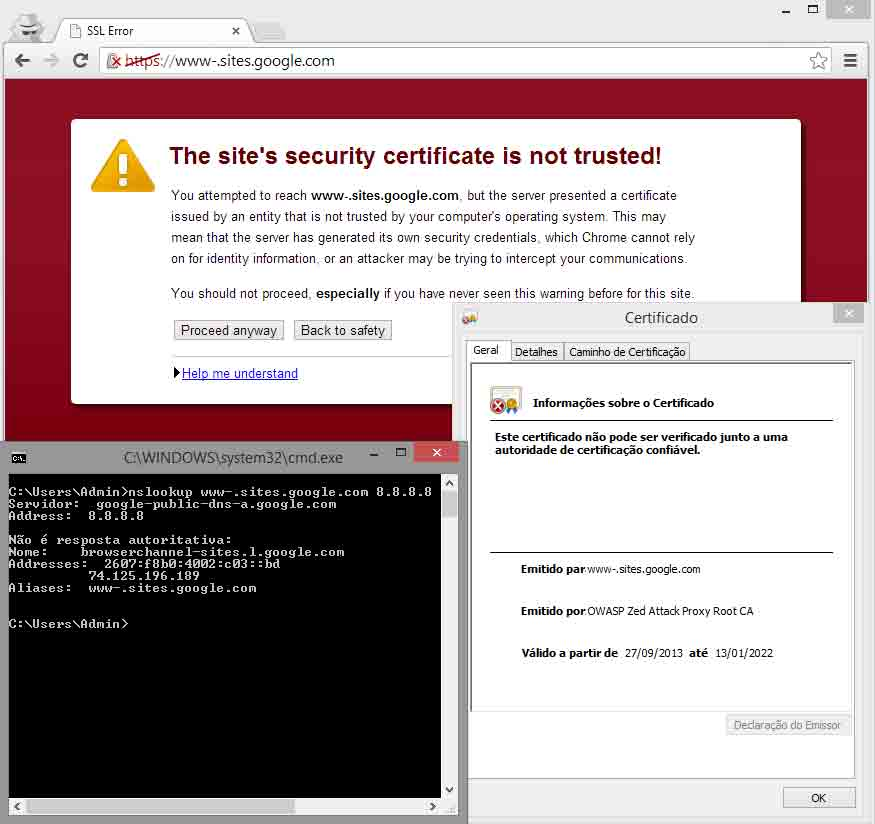

值得注意的是,根据 RFC 2818 当你在你的网站上使用通配证书(wildcard certificate)的时候，比如*.google.com，通配证书只在单层域名可用，比如如果你把匹配*.google.com 的证书放到 abc.def.google.com 上，浏览器会提示证书错误。

Chrome 浏览器中锁定的证书(pinned certificates)可以在这里找到：

[`src.chromium.org/viewvc/chrome/trunk/src/net/http/transport_security_state_static.json`](https://src.chromium.org/viewvc/chrome/trunk/src/net/http/transport_security_state_static.json)

在我分析的过程中，我发现在使用 SSL 的 397 个域名里的 55 个都在他们的 DNS 中有泛解析。一个国家级大黑客，如果获得了任意一个可信 CA 签发的证书都可以用这种方法对存在泛解析的域名使用中间人攻击， 注入数据包等等，绕过 HSTS 规则并且偷得 cookie。

Google 没把这个 bug 发 CVE，但是几周后他们悄悄的修复了。Chrome 32 和 33 以上的版本不会受此影响。

在 Apple 还在为 Goto fail 的问题纠结的时候，如果你围观了 Chromium 的 tracker 和内部交流和测试等等，你会发现这个洞就是在那个时候补的。

## 0x04 结论

* * *

Google 和 Facebook 的安全团队处理的都很好。这个 bug 是非常好玩的，它与 OWASP 的 Top 10 的内容都不相同。

这个 bug 需要一个新的名词，有人愿意称这些攻击将命名为 Advanced Persistent Cross Site Wildcard Domain Header Poisoning （或简称 APCSWDHP ） 。

如果你来自 NSA，并希望使用此技术来植入我们的 DNS，请使用代号 CRAZY KOALA 这样斯诺登泄漏你的文件时，我们就可以更好地跟踪他们了。

版权声明：未经授权禁止转载 [爱小狐狸的小螃蟹](http://drops.wooyun.org/author/爱小狐狸的小螃蟹 "由 爱小狐狸的小螃蟹 发布")@[乌云知识库](http://drops.wooyun.org)

分享到：

### 相关日志

*   [邮箱伪造详解](http://drops.wooyun.org/papers/534)
*   [安全科普：Waf 实现扫描器识别 彻底抵挡黑客扫描](http://drops.wooyun.org/tips/730)
*   [使用 OpenSSH 证书认证](http://drops.wooyun.org/tips/1055)
*   [Shellshock 漏洞回顾与分析测试](http://drops.wooyun.org/papers/3268)
*   [SQL SERVER 2008 安全配置](http://drops.wooyun.org/tips/1670)
*   [HCTF writeup(web)](http://drops.wooyun.org/tips/4070)