# 从 Windows 到安卓：多重攻击机制的远控的分析

2014/03/21 18:16 | [livers](http://drops.wooyun.org/author/livers "由 livers 发布") | [漏洞分析](http://drops.wooyun.org/category/papers "查看 漏洞分析 中的全部文章") | 占个座先 | 捐赠作者

## 0x00 背景

* * *

Feye 近期检测到一起通过高度伪造的钓鱼邮件（鱼叉式钓鱼电邮）攻击，目标直指美国的金融机构。攻击中用到的恶意代码是由一个被作者出售的间谍和监视工具生成。此工具的功能很类似市面上常见的其他远控软件。同时，也发现了其他的攻击者把此工具的恶意代码嵌入到宏文本文件中用来攻击其他的目标，看上去更像是第二轮的撒网式钓鱼邮件攻击。

用于攻击金融机构的 C&C 的网络设备是被 WinSpy 的作者控制的。这并不意味着作者有意在背后为攻击者提供了服务器。而是攻击者使用了 WinSpy 包里面默认配置存储受害者的数据。这个功能也许是作者的无心之失。

在分析 WinSpy 的恶意代码的时候，我们发现其中也有 AndroidSpy 间谍的组件部分，我们称之为 GimmeRat。这个安卓工具有多种功能包括允许被感染的设备通过短信或者其他形式被 Windows 的设备控制。基于 windows 平台的远控看上去只能通过物理访问控制安卓设备。最近数量上升的安卓远控如 Dendroid 或者 AndroRAT，表名黑客们对移动设备更感兴趣。GimmeRAT 是又一个攻击者开始转向 andorid 系统的例子。

## 0x01 利用 WinSpy 进行攻击

* * *

WinSpy 作为一个间谍和监视工具出售给用户，其自身的远程管理功能适合对手找到目标组织的法案.使用 WinSpy 包的默认指令和默认服务器为攻击者提供一层匿名代理。


图 1 – 针对金融机构的攻击机制

通过伪造过网络钓鱼的电子邮件并采用 WinSpy 的恶意代码针对美国金融机构进行攻击。电子邮件的附件（b430263181959f4dd681e9d5fd15d2a0）是一个大的安装程序的打包文件。打开时用一个工资单的 pdf 截图作为诱饵，以避免受害者的关注。它同时会下载和生成如在图 1 和图 2 所示的各种组件。

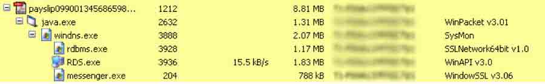

图二：WinSpy 的组件

我们观察到另一个攻击者在微软宏文档(78fc7bccd86c645cc66b1a719b6e1258, f496bf5c7bc6843b395cc309da004345) 和独立的可执行文件(8859bbe7f22729d5b4a7d821cfabb044, 2b19ca87739361fa4d7ee318e6248d05)中使用 WinSpy。 这些恶意文件作为附件或者是下载链接的形式封装到电子邮件中。它们包含下列特征元素：

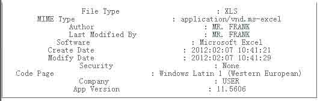

这些被发现的恶意邮件有下列命名的附件：

```
Western Union Slip.xls
Money Transfer Wumt.xls
Wumt.xls 
```

## 0x02 Windows 组件

* * *

WinSpy 模块使用 VB 进行编码的，同时用一些公开的 lib 库如 modJPEG.bas 和 cJpeg.cls。 这些组件支持多种特性如下：

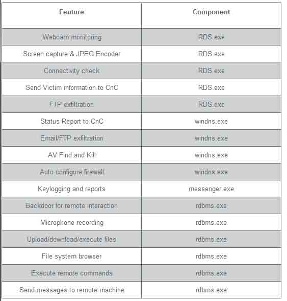

WinSpy 木马软件会在注册表的 SOFTWAREMSI64 目录下创建自己的配置。WinSpy 的组件在运行时会读取该配置。此配置包含各种设置，如：用户名，唯一标识，连接参数，远程 FTP 和认证，文件名，数据的路径，当前的状态等等。例如：DUNIN 代表卸载日期，FTSV 代表的 FTP 服务器，FTUS 代表着 FTP 用户等。SID2 表示识别感染的唯一标识，在初始化时候创建。

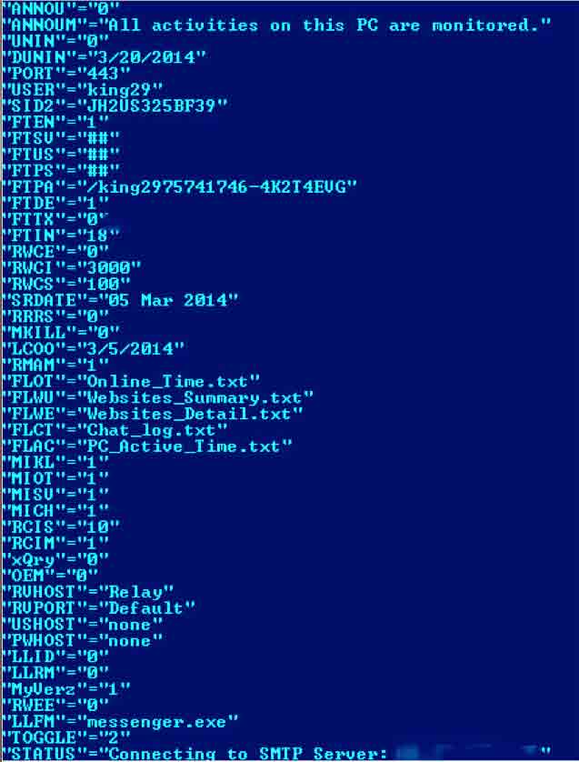

WinSpy 配置

WinSpy 有多个选项配置来生成一个木马文件。有趣的是默认配置的参数竟然是作者控制的服务器。

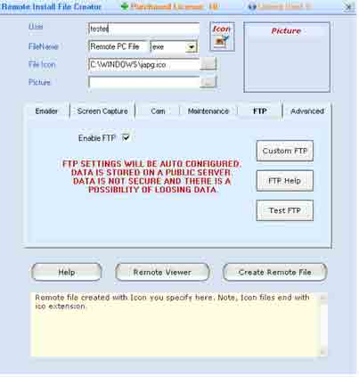

图四 WinSpy 生成器

控制器可以截屏，键盘记录，也可以上传下载文件 执行恶意代码。

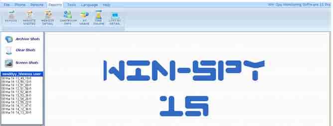

图五 WinSpy 控制器

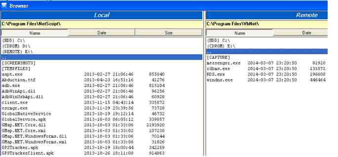

图六 WinSpy 文件浏览器

发指令和控制 WinSpy 有多种通信方式进行数据传递和指令控制（类似心跳包）。

### 方法一

反向连接控制者服务器的 14001 端口，“/p”表示在线，服务器也以”/p”回应。

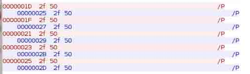

图七 在线状态

### 方法二

通过自己封装的协议反向连接作者服务器的 27171。

请求包含受害者的 IP 地址以及前面讲的唯一标志。服务器返回带有 keep alive 的 response.

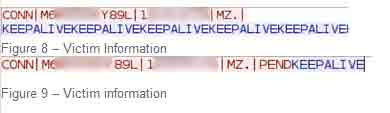

### 方法三

smtp 在配置了 SMTP 选项的情况下，他通过 SMTP 回传键盘记录的数据。作者服务器 STMP 运行在 37 端口。37 端口通常是用于 NTP 协议，但 WinSpy 的作者把它配置成 STMP 服务器。SysMon v1.0.0 的响应头非常明显。

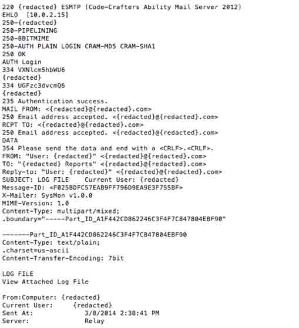

图十 SMTP

### 方法四

FTP 通过自定义的 FTP 服务器进行定期传输。FTP 帐号密码等在前面说的注册表配置中。

### 方法五

直接控制 Rdbms.exe 模块监听受害者机器的 443 端口。攻击者可以直接从 WinSpy 控制器连接到该端口并发出各种命令来下载数据，上传/下载文件，执行文件，发送邮件，查看摄像头等。数据传输使用端口 444。它支持各种命令，如下所示。在初始连接的命令表，作者打算在某个时间点来实现认证，但目前的情况是任何人都可以使用这个命令连接到受感染的机器 。

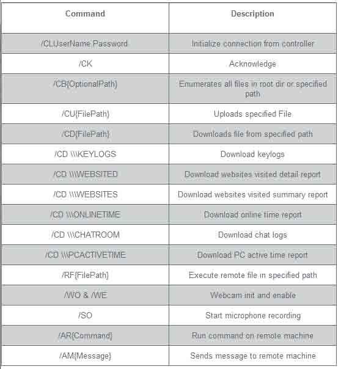

表示各种低小下啊！！！

## 0x03 安卓组件

* * *

终于有些感兴趣的了。

在调查 WinSpy 的过程中发现一些 android 木马组件。我们已经发现三个不同应用是该套件的一部分。其中一个应用，需要通过一个 Windows 服务器进行控制。只能物理接触 androids 设备感染。其他两个应用是 C-S 架构，通过另一个 android 手机进行远程控制。

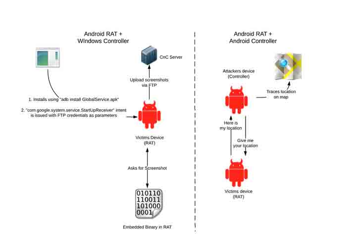

图 11 安卓组件

## 0x04 Windows 控制器

* * *

Windows 的控制器需要对 android 设备进行直接的物理接触，可运行攻击者获取感染设备的截图。选项如下：


### 组件一 ：GlobalService.apk

```
Components:
          a. Services
                    Global Service
          b. Methods
                    Sleeper
                    ScreenCapturer
                    ServiceActivity 
```

#### Activity 组件

该应用以 intent 绑定机制启动 android 桌面应用。使用 Intent 连接 com.google.system.service.StartUpReceiver 服务时使用附加信息。字符串格式如下： “interval@@hostname@@port@@username@@password@@working_directory@@delete_after_upload” 服务器名，端口，用户名，密码连接攻击者的 FTP 服务器。在后面介绍如何传递截图。一旦此 intent 接收到就会让 GlobalService 服务一个间隔参数重启。

#### GlobalService 组件

服务包含下列变量

```
private static final String TAG = "GlobalService";
         private static boolean isScreenON;
         private int mInterval;
         private KeyguardManager mKeyGaurdManager;
         private BroadcastReceiver mPowerKeyReceiver;
         private Timer mSyncTimer;
         private TimerTask mSyncTimerTask; 
```

他会一直检测键盘锁是否解锁，如果屏幕键盘锁被解，他会调用 startScreenCaptureThread（）截取屏幕。

```
startScreenCaptureThread 该线程设置毫秒的时间间隔，将结果传递给服务。它还设置了 mSyncTimerTask 的值（任务同步），调用 ScreenCapturer. takeScreenshot 方法，可以让线程调用时，每隔多少秒进行截图。
ScreenCapturer. takeScreenshot 使用 socket 连接到 localhost:42345 端口，GlobalNativeService 监听此端口接收 socket 传来的数据。
takeScreenshot 以字符串的形式发送‘/data/local/tmp/images/screenshot_DATE.png’到 GlobalNativeService。GlobalNativeService 检测接收的字符串最后/的是否有 screenshot，如果有 则调用 screencap –P  路径 截图。
takeScreenshot 返回截图的路径作为参数传给 screenCaptureThread 方法。该方法调用 FTPService 传截图给攻击者的 C&C 服务器。 
```

#### GlobalNativeService

除了上面说的监听 等待截图指令还有其他类似 删除文件，保存 FTP 信息到/data/local/tmp/ftpInformation 中。
此外 ，如果 socket 传来 GPSLocationInfo 这样的字符串，它会创建/data/local/tmp/GPSLocations.txt（但不含 GPS 信息 未完善的功能）。

## 0x05 Android 远程控制

* * *

### 组件 1 GPSTracker.apk

GPSTracker 的启动和 GlobalService 一样，以一个时间间隔启动。记录设备的 GPS 位置，定期五分钟。只有当现在位置离开先前位置 200m 后才会记录。
当某个位置已被添加到数据库中的所有以前的位置被删除。因此，它只能维持最后的位置。

这个应用监控所有传进来的信息，如果 SMS （短信）带有 [gmyl] (Short for (g)ive (m)e (y)our (l)ocation) 短信时，它会终止该短信的接收，并进行数据库查询。并回复短信 类似下面：

```
[himl]<>DATE><LATITUDE##LONGTITUDE 
```

“himl” is short for (h)ere (i)s (m)y (l)ocation。只回复最后的位置。

### 组件 2 GPSTrackerClient.apk

此应用是上一个应用的控制器。GPSTrackerClient.apk 安装到攻击者的设备上。他向被攻击者发送一个带有“[gmyl]”的短信。调用本地地图显示被攻击者的方位。

这里值得注意的是，两个模块之前没有任何验证机制。WTF！

## 0x06 总结

* * *

PC 端其实是比较低级的远控 通信处理的一般，而且保存恶意文件。特征也非常明显。 Android 端也是处于一般水平，毕竟 Android 的数据加密和签名机制比 IOS 要简单的多。

from:[`www.fireeye.com/blog/technical/2014/03/from-windows-to-droids-an-insight-in-to-multi-vector-attack-mechanisms-in-rats.html`](http://www.fireeye.com/blog/technical/2014/03/from-windows-to-droids-an-insight-in-to-multi-vector-attack-mechanisms-in-rats.html)

版权声明：未经授权禁止转载 [livers](http://drops.wooyun.org/author/livers "由 livers 发布")@[乌云知识库](http://drops.wooyun.org)

分享到：

### 相关日志

*   [Powershell and Windows RAW SOCKET](http://drops.wooyun.org/tips/4707)
*   [CVE-2014-1806 .NET Remoting Services 漏洞浅析](http://drops.wooyun.org/papers/3993)
*   [DNS 域传送信息泄露](http://drops.wooyun.org/papers/64)
*   [STRUTS2 的 getClassLoader 漏洞利用](http://drops.wooyun.org/papers/1151)
*   [JBoss 安全问题总结](http://drops.wooyun.org/papers/178)
*   [JAVA 逆向&反混淆-追查 Burpsuite 的破解原理](http://drops.wooyun.org/tips/2689)