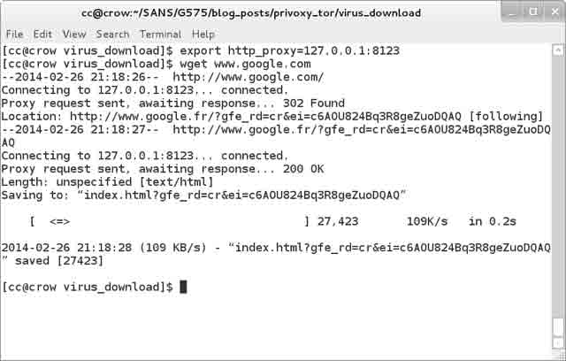

# Tor 隐身大法 —— 用 Tor 来帮助我们进行渗透测试

2014/03/20 12:04 | [龙臣](http://drops.wooyun.org/author/龙臣 "由 龙臣 发布") | [技术分享](http://drops.wooyun.org/category/tips "查看 技术分享 中的全部文章") | 占个座先 | 捐赠作者

## 0x00 背景

* * *

（编者：在这篇文章里，Chris Crowley 提供了一些利用 Tor 来进行渗透测试的方法，他提供的一些细节和脚本配置非常有用，尤其是他对 Privoxy 的讨论部分，谢谢！）

By Chris Crowley

我认为渗透测试的真正价值是能模拟现实世界的真实攻击行为，所以渗透测试人员应该尽量将自己的行为与那些攻击者靠拢。但是与真的攻击者不一样的是，我们还是应该对我们的目标系统保持一定的谨慎和敏感，而攻击者肯定不会去管这些。

在这篇文章里，我向大家分享了一个我经常用的隐藏源 IP 的方法。一般来说，渗透测试人员有两个原因需要隐藏他们的真实 IP。首先，在测试过程中，我们需要访问的资源可能是非法的恶意资源（或者怀疑其是恶意的）。其次，我们需要尽量隐藏测试过程中的测试或攻击来源。

为了研究一个恶意攻击者或者恶意软件的行为特征，我们有可能需要去访问一些攻击者控制的资源。比如一个很常见的场景是：用户在 facebook 或者一个社交媒体网站上会受到攻击者的诱骗而去访问一些 url，我们还不太确定攻击者是如何成功的控制这些跳转，而这些资源里包含有很多附加链接和 javascript。因为我们要对这样的一个场景进行渗透测试，我们必须伪装成一个普通用户去访问这些资源，同时又不能被攻击者识破。

直接通过我们的真实 IP 去访问这些恶意网站是很不明智的，因为这无疑相当于直接告诉攻击者，我们在研究你的网站。此外，如果我们发出的请求看起来很像是一个小白用户发起的，这无疑告诉攻击者鱼儿上钩了。这也会使得攻击者来访问我们的系统，所以说隐藏我们的源 IP 是非常重要的。

有些时候，恶意软件只会在接收到特意的指令才会运行。我们可以尝试各种各样的指令来触发它，但是让它连接到真实网络这样触发无疑是最快的。但是，我们又不想被攻击者注意到恶意软件已经在我们的系统上运行了，避免攻击者会来入侵我们的系统。我们只需要这些行为信息和整个攻击过程。我们想还原攻击过程，但是，我们希望在拿到这些信息之后能够马上断开恶意软件的连接。

攻击者拥有各种各样的虚拟系统，他们不必担心自己的源 IP 暴露。对于一个渗透测试人员来说，一个虚拟的 IP 地址对于模拟一个真实的攻击者来说是非常重要的。以下的几个场景能说明这个道理：首先是网站踩点，一个熟练的攻击者不会使用相同的一个 IP 来扫描一个网站。其次是扫描服务类型，如果网站发现有人在不停的扫他，那么肯定会将这些扫描记录到日志里。试想来自四面八方的扫描，只扫那些常用服务是怎样的场景。攻击者会使用一些假 IP 来扫描目标，然后使用其他的 IP 来执行渗透。真正的坏蛋的目标只有一个，那就是敏感信息。你觉得一个聪明的家伙会把他的真实信息留下来莫？他会使用不同的系统来制造混乱。第四，是一些在未来今年对渗透测试人员来说很普遍的东西。渗透测试人员会越来越多的将精力花在移动设备上。

下面概述的方法可以有几个不同的方式来实现。我只会概述一种可以用的方法，你们可以根据自己的需要来自己调整。

这里还有一些有关政府部分比较介意的 Tor 在安装使用过程中的一些漏洞，(比如[`blog.torproject.org/blog/tor-security-advisory-old-tor-browser-bundles-vulnerable`](https://blog.torproject.org/blog/tor-security-advisory-old-tor-browser-bundles-vulnerable)，[`www.mozilla.org/security/announce/2013/mfsa2013-53.html`](https://www.mozilla.org/security/announce/2013/mfsa2013-53.html)).当然，对于我们来说 Tor 已经能够满足我们了。如果你在找有关如何躲避联邦政府对 Tor 网络的监控的话，恐怕这篇文章不适合你。

## 0x01 细节

* * *

下面是基本步骤

```
1、安装和设置 Privoxy  
2、安装和设置 Tor  
3、配置 Privoxy 将代理指向 Tor  
4、通过 Privoxy 来上网 
```

虽然以上步骤我是在 linux 上面演示的，但是其他系统上的设置基本上大同小异，比如 windows，mac ox x。Privoxy 和 Tor 组合可以让你很轻松的在 Tor 网络里作为一个匿名节点翱翔，这个节点跟 IP 地址的概念不太一样。如果有人想通过 Tor 网络来监控你的数据包的话，他们有可能是知道你在跟谁通信，但是这个不是我关注的重点，重点是没有人会知道我们是从哪里发起这个通信的。

### 1、安装和配置 Privoxy

Privoxyd 官网（[`www.privoxy.org/`](http://www.privoxy.org/)）是这样介绍这款软件的：Privoxy 是一个拥有高级过滤、修改网页数据和 http header、访问控制和屏蔽广告等互联网垃圾功能的无缓存 web 代理工具。Privoxy 拥有灵活的配置并且可以高度定制化，以满足各位黑阔的需求。它在单人操作系统和多人操作系统下均有对应的版本。

它非常容易安装，不会的话去这里看看[`www.privoxy.org/user-manual/index.html`](http://www.privoxy.org/user-manual/index.html)，找到你自己的系统，然后按照步骤来就 ok 了。比如在 Fedora 里只需这样：

```
yum -y install privoxy

```

当然你也可以使用其他的 http 代理工具，比如 polipo 。

### 2、安装和配置 Tor

Tor 的官网（[`www.torproject.org/`](https://www.torproject.org/)）是这样介绍她的：Tor 最初是美国海军研究实验室设计用来作为第三代洋葱头路由的项目。她最初是美国海军为了保护政府的通信隐私而开发的。今天，全世界所有的普通人都可以用它来做各种各样的事情，比如军人，记者，政府人员，政治分子等等。

这里有 Tor 的工作背景：
[`www.torproject.org/about/overview.html.en#thesolution`](https://www.torproject.org/about/overview.html.en#thesolution)

如果它勾起你的好奇心，可以在这里下载安装：
[`www.torproject.org/docs/documentation.html.en`](https://www.torproject.org/docs/documentation.html.en)

这里有 Tor 的警告和一些局限性：
[`www.torproject.org/download/download-easy.html.en#warning`](https://www.torproject.org/download/download-easy.html.en#warning)

对于那些已经熟悉 Tor，但是可能因为某些大家都懂的原因，比如被墙了之类的，连接不上 Tor 的专有网络的人，可以看看这里看如何通过 bridge 来连接到 Tor 网络：
[`www.torproject.org/docs/bridges.html.en`](https://www.torproject.org/docs/bridges.html.en)

### 3、配置 Privoxy 指向到 Tor

我选择使用 Privoxy 和 Tor 组合最主要的原因就是 DNS。如果我想控制本地的 dns 请求，以便我所有的 dns 请求都不泄露我的信息，我可以不停的换用一些公用 dns 服务器（比如 8.8.8.8）。但是 Privoxy 还提供了一些附加功能用来阻断请求，而且它还会阻止那些有可能会暴露我们 IP 的请求。

这配置其实非常简单。在 Linux 里，只需要简单的配置下 Privoxy 让它链接到 Tor，那么 Privoxy 就会将所有的 DNS 和 HTTP 请求转发到 Tor 网络里。

要让 Tor 帮你转发请求，只需在 Privoxy 里这样配置：

```
forward-socks5 / 127.0.0.1:9050 
```

下面是 privoxy 的完整配置文件（没有注释）。从里面可以很清楚的看到它并没有监听所有的端口，而是直接把请求转发给了 Tor。

```
$ grep -v "^#" /etc/privoxy/config
confdir /etc/privoxy
logdir /var/log/privoxy
actionsfile match-all.action # Actions that are applied to all sites and maybe overruled later on.
actionsfile default.action # Main actions file
actionsfile user.action # User customizations
filterfile default.filter
logfile logfile
listen-address :8123
toggle 1
enable-remote-toggle 0
enable-remote-http-toggle 0
enable-edit-actions 0
enforce-blocks 0
buffer-limit 4096
forward-socks5 / 127.0.0.1:9050 .
forwarded-connect-retries 0
accept-intercepted-requests 0
allow-cgi-request-crunching 0
split-large-forms 0
keep-alive-timeout 5
socket-timeout 300
handle-as-empty-doc-returns-ok

```

#### 4、通过代理上网

**a)配置环境变量（http_proxy, https_proxy, ftp_proxy）和命令行工具，以便通过代理上网。**

举个例子，wget: wget 是一个命令行的浏览器。它能跨域和递归地向指定地址发出请求，比如：

```
$ export http_proxy=127.0.0.1:8123  
$ wget -nc -nd http://www.willhackforsushi.com/subscriptions.xml 
```

在上面的例子中，我想查看 Josh 的 rss feed 列表，但是我又不想让他知道是我看的。我会大概每分钟左右发出一个请求

```
 * * * * * wget -nc -nd http://www.willhackforsushi.com/subscriptions.xml 
```

来监视这个页面，以防万一该页面会发生变化。

现在，wget 对于我来说是一个很乖的 web 机器人。首先它会按照规定请求网站的 robots.txt 文件，并严格遵守该文件定义的内容。而且，wget 也有 nc 选项，这个在我之前的例子中也用到了。这个选项的意思是”no-clobber“，或者说不要重复下载已经下载过的文件。事实上，它下载了但是并不保存。那么 wget 是怎么知道这个文件是不是已经下载了呢？毫无疑问，它会监控文件系统。所以

```
touch robots.txt; wget -nc -nd http://www.willhackforsushi.com/subscriptions.xml

```

将告诉 wget 不要保存 willhackforsushi.com 这个网站的 robots.txt 文件，而是保存之前就保存过的一个空的 robots.txt 文件。

**b)用-http-proxy 选项来开启安卓虚拟机**

通过一个安卓虚拟机安装一些 app 来进行渗透测试是一个不错的方法，当你在虚拟机里输入命令时，多半会用到 "-http-proxy ipaddr:port"。

确保你先运行了 privoxy 。如果虚拟机不能访问 privoxy 的本地端口，那么这些设置会失效。还会以图解的方式出现警告。

举个例子：

```
emulator -avd IceCreamSandwich -partition-size 256 -qemu -http-proxy 127.0.0.1:8123

```

现在，所有虚拟机里的数据包都会通过 privoxy 转发到 Tor 网络里。

不得忽视的一点是：在虚拟机启动前，必须先开启 privoxy ，并确保本地端口监听是正常的。如果虚拟机在启动了之后不能连接到 privoxy 的端口，那么它就会忽略这些代理选项，而且虚拟机还会直接使用本地网络来与外界通信，这无疑会暴露我们的源 IP。

**c)配置一个应用程序（或者设备）来使用代理**

http_proxy 环境变量对基于命令行的工具来说非常有用，因为大部分的命令行工具都会使用到它。但是，窗口工具不同于 BASH 的环境变量，他们有自己独立的代理设置。所以你可以通过配置好的应用来连接到代理。比如在 chrome 里可以这样：

```
打开 chrome，输入"chrome://settings/"  
选择高级选项  
在网络选项里，点击“更改代理设置”按钮  
配置 http 和 https 代理到 127.0.0.1:8123 
```

(所有主流浏览器的设置基本上大同小异)

**d)通过 iptables 规则来分配数据包**

如果你的应用程序不使用命令行代理环境变量，而且你也不能通过配置一个应用程序来连接代理，你还可以通过配置 iptables 来使用 NAT 转换数据包到代理上。

下面是一个我经常用的 bash 脚本：

```
#!/bin/bash
## CHECK FOR ROOT
wai=`whoami`
if [[ "$wai" != "root" ]]
then
 echo "
You need to be uid 0\. Re-run as:
sudo $0
"
 exit
fi
## SET SYSTEM TO PREROUTING IP PACKETS
echo "1" > /proc/sys/net/ipv4/ip_forward
## HTTP TRAFFIC
iptables -t nat -A PREROUTING -p tcp --destination-port 80 -j REDIRECT --to-port 8123
## HTTPS TRAFFIC
iptables -t nat -A PREROUTING -p tcp --destination-port 443 -j REDIRECT --to-port 8123
## CHECK FOR BURP
pgrep -fl privoxy 2>&1 > /dev/null || echo "Are you sure privoxy is running?\nOr maybe you intend to use something else I didn't check for."

```

我认为我已经设置好了后，我测试了下看它咋样。先来 wget 谷歌一下，

```
wget http://www.google.com

```

然后我用 tcpdump 抓包看了下

```
tcpdump -Xnnv -i eth0 port 80 or port 443 or port 53

```

因为如果我的代理工作正常的话，我在本地用 tcpdump 应该是抓不到任何数据包的。

注意我的请求被重定向到了 google.fr，因为我是在 Tor 的匿名节点当中。



现在，你们可以尽情的干坏事了！各位大黑阔们！确保你们的访问都得到了授权哈。。。比如你可以看看那些高大上的软件是如何和自己家庭网络互通的。

现在，你已经具备了一定的匿名性了（前提是你们要有一定的授权哈），你可以用爬虫爬爬目标网站，下一些恶意软件来研究一下，或者跑一些你正在测试的 app，与此同时，你不必担心你的源位置会被暴露。

from:http://pen-testing.sans.org/blog/pen-testing/2014/03/16/tor-nonymous-using-tor-for-pen-testing

版权声明：未经授权禁止转载 [龙臣](http://drops.wooyun.org/author/龙臣 "由 龙臣 发布")@[乌云知识库](http://drops.wooyun.org)

分享到：

### 相关日志

*   [说说 RCE 那些事儿](http://drops.wooyun.org/tools/3786)
*   [Trying to hack Redis via HTTP requests](http://drops.wooyun.org/papers/3062)
*   [远程备份数据库和文件的方法](http://drops.wooyun.org/tips/783)
*   [SQL Injection via DNS](http://drops.wooyun.org/tips/4605)
*   [SVN 安装配置及安全注意事项](http://drops.wooyun.org/tips/352)
*   [各种环境下的渗透测试](http://drops.wooyun.org/tips/411)