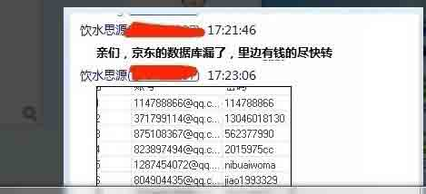
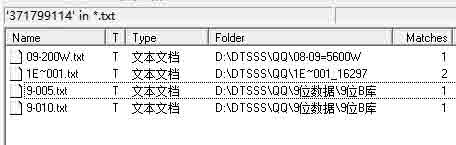
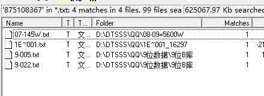
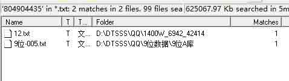
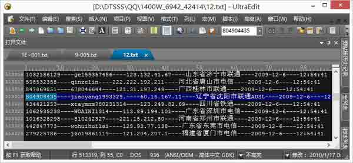

# 京东数据库泄露事件分析

2014/03/01 12:02 | [猪猪侠](http://drops.wooyun.org/author/猪猪侠 "由 猪猪侠 发布")   | [业界资讯](http://drops.wooyun.org/category/news "查看 业界资讯 中的全部文章")  | 占个座先  | 捐赠作者

## 0x00 背景

* * *

昨天一张截图在 QQ 群里疯传，并说京东数据库泄露，里面有钱的尽快转。

有人问“我挨个试了一下，只有 3 个可以正常登陆，而且网上也并没有完整的数据库流出，所以我妄猜是否是支付宝或者是其他竞争对手的营销手段？”

这件事件到底是真的假的呢？经过我的研究，京东的数据库没有被脱裤，只是无聊黑客的恶作剧，他们通过收集互联网已泄露的用户+密码信息，生成对应的字典表，尝试批量登陆京东网站后，拿出几个能够登陆的用户来说事！

## 0x01 细节

* * *

我们认真的研究了一下关于京东数据库泄露提及的几个 QQ 号，确定这次炒作使用的手法是 [企业 2013 年最高的 10 个信息安全威胁是哪些？](http://www.zhihu.com/question/21596439)提及的：

### A2-互联网泄密事件/撞库攻击

以大量的用户数据为基础，利用用户相同的注册习惯（相同的用户名和密码），尝试登陆其它的网站。2011 年，互联网泄密事件引爆了整个信息安全界，导致传统的用户+密码认证的方式已无法满足现有安全需求。泄露数据包括：天涯：31,758,468 条，CSDN：6,428,559 条，微博：4,442,915 条，人人网：4,445,047 条，猫扑：2,644,726 条，178：9,072,819 条，嘟嘟牛：13,891,418 条，7K7K：18,282,404 条，Adobe：1.5 亿，Cupid Media：4200 万，QQ 数据库：大于 6 亿，福布斯：100 万，接近 9 亿多条。

网上疯传的京东数据库泄露的截图：(全都是 QQ 邮箱，全都是明文密码？)

### 我们的分析结果

114788866@qq.com
QQ：114788866

图中密码：114788866 (密码和 QQ 号码一样，撞库黑客考虑了人类设置密码缺陷)
密码 2：j2j5gx1019l (泄露位置：08-09=5600W8-350W-02.txt)

371799114@qq.com
QQ：371799114

密码：ren15964078319 (泄露位置：8-09=5600W9-200W.txt)
密码 2：13046018130 (泄露位置：http://uuu9.com)

875108367@qq.com
QQ：875108367

密码：AITING (泄露位置：1E~001_162971E~001.txt)
密码 2：AIBAOTING (泄露位置：1E~001_162971E~001.txt)
密码 3：562377990 (泄露位置：1E~001_162971E~001.txt)

823897494@qq.com
QQ：823897494

密码：2015975cc
密码 2：2015975c (泄露位置：http://uuu9.com)

1287454072@qq.com
QQ：1287454072

密码：nibuaiwoma (泄露位置：10 年 300 万 463231.txt 过滤后文件.txt)
IP 地址：222.208.214.6
物理地址：四川省达州市大竹县 有家网吧
时间：2010-11-1---|-4:21:28

804904435@qq.com
QQ：804904435

密码：jiaoyang1993329 (泄露位置：9 位数据 9 位 A 库 9 位-005.txt)
密码 2：jiao1993329
IP 地址：60.16.167.11
物理地址：辽宁省沈阳市联通 ADSL
时间：2009-12-6---|-12:54:41

### 分析过程相关截图：

371799114

875108367

804904435

版权声明：未经授权禁止转载 [猪猪侠](http://drops.wooyun.org/author/猪猪侠 "由 猪猪侠 发布")@[乌云知识库](http://drops.wooyun.org)

分享到：

### 相关日志

*   [Top 10 Security Risks for 2014](http://drops.wooyun.org/news/2731)
*   [从丝绸之路到安全运维（Operational Security）与风险控制（Risk Management） 上集](http://drops.wooyun.org/news/674)
*   [一起针对国内企业 OA 系统精心策划的大规模钓鱼攻击事件](http://drops.wooyun.org/tips/2562)
*   [chrome 33 中修复了 4 个 Pwn2Own 大会上发现的漏洞](http://drops.wooyun.org/news/1205)
*   [Angry Birds 和广告系统泄露个人信息——FireEye 对 Angry Birds 的分析](http://drops.wooyun.org/news/1408)
*   [Google 对 Gmail 的所有通信进行 SSL 加密](http://drops.wooyun.org/news/1269)