# Shodan 搜索引擎介绍

2014/06/30 15:35 | [修码的马修](http://drops.wooyun.org/author/修码的马修 "由 修码的马修 发布") | [工具收集](http://drops.wooyun.org/category/tools "查看 工具收集 中的全部文章"), [技术分享](http://drops.wooyun.org/category/tips "查看 技术分享 中的全部文章") | 占个座先 | 捐赠作者

from:http://www.exploit-db.com/wp-content/themes/exploit/docs/33859.pdf

* * *

## 0x00 概要

* * *

这篇文章可以作为渗透测试人员和安全工作者运用 Shodan 搜索引擎的指南，同时有助于理解其工作原理和达到安全审计目的。文章也列举出找到大量有风险的互联网服务及其设备的步骤和方法。同时介绍了 Shodan 能用初级筛选语法以及 Shodan 和其他工具的联合运用。主要适用于渗透测试的数据收集阶段。

## 0x01 介绍

* * *

Shoudan 是一个用于帮助发现主要的互联网系统漏洞（包括路由器，交换机，工控系统等）的搜索引擎。它在圈子里就像 google 一样出名。它主要拦截从服务器到客户端的元数据来工作，目前提供超过 50 个端口的相关搜索。

Shodan 能找到的设备：

```
1.服务器
2.路由器
3.交换机
4.公共 ip 的打印机
5.网络摄像头
6.加油站的泵
7.Voip 电话和所有数据采集监控系统 
```

Shodan 能做的：

```
1.用户搜索制定的项目
2.Shodan 寻找端口并拦截数据
3.Shodan 为拦截的数据设置索引
4.显示结果 
```

Shodan 和 google 的区别：

```
Google 的爬虫/蜘蛛 抓取网页数据并为网页内容创建索引，然后更具 page rank 显示结果。Shoudan 主要寻找端口并抓取拦截到的信息，然后为它们建立索引，最后显示结果。Shoudan 并不像 google 那样为网页内容建立索引，因此它是一个基于拦截器的搜索引擎。 
```

## 0x02 基础用法

* * *

City：用于寻找位于指定城市的设备。例：

```
iis city:New York 
```

County：用于寻找位于指定国家的设备。例：

```
iis country: United States 
```

Port：限定指定的端口。例：

```
https port:443 
```

Os：用于寻找特定的操作系统。例：

```
microsoft-iis os:"windows 2003" 
```

Geo：根据经纬度和指定的半径来返回结果。只能有 2 个或 3 个参数，第三个参数是半径，默认数值之 5km。例：

```
 apache geo:42.9693,-74.1224 
```

Net：用于寻找指定 ip 地址和子网掩码的设备。例：

```
 iis net:216.0.0.0/16 
```

Hostname：用于搜索包含指定域名的主机。例：

```
Akamai  hostname:.com 
```

After and Before: 帮助找到指定日期范围的设备。格式：dd/mm/yyyy dd-mm-yy 例：

```
apache before:1/01/2014       
nginx after:1/01/2014 
```

注意：登陆后大多数参数都能运作。

## 0x03 Shodan 和其他工具的结合

* * *

### 1.和 Maltego 的结合

需要：[从 http://www.paterva.com/web6/products/download.php](http://%E4%BB%8Ehttp://www.paterva.com/web6/products/download.php)下载 Matlego。

从 [`static.Shodan.io/downloads/Shodan-maltego-entities.mtz`](https://static.Shodan.io/downloads/Shodan-maltego-entities.mtz)

下载 Shodan 的 matlego 目录

用法：

```
1.安装 maltego 之后，选择‘Manage tab’里的 ‘Manage Entities’ ，然后选择‘import’。
2.选择 ‘transforms’ 然后是‘advanced’ 
```

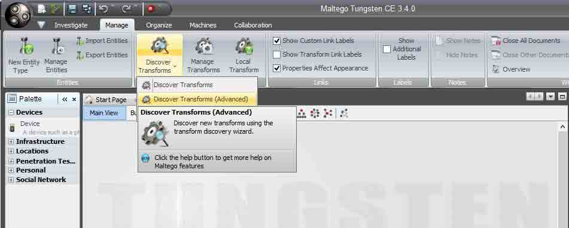

```
3.现在可以添加 Shodan 的链接 https://cetas.paterva.com/TDS/runner/showseed/Shodan 
```

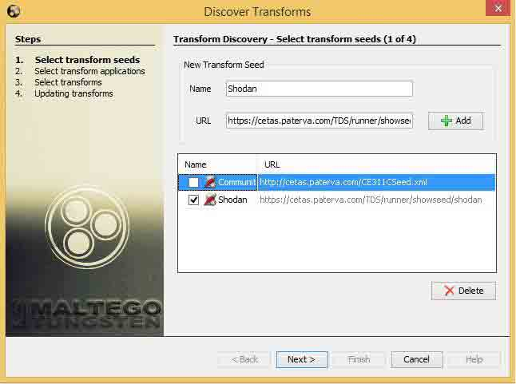

```
4.最后我们可以看到安装成功的窗口 
```

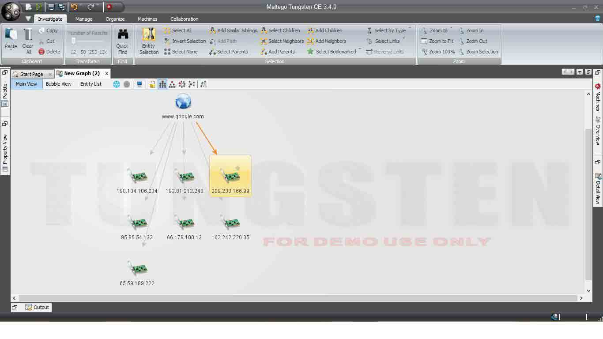

注意：需要你有 Shodan 的 API keys，可以在 maltgo 进行 Shodan 的使用，API keys 在你登陆 Shodan 账户时候是可以获得的。

### 2.和 metasploit 的结合

用法：

```
1.在 Kail/Backtrack Box 中打开 Metasploit framework 
```

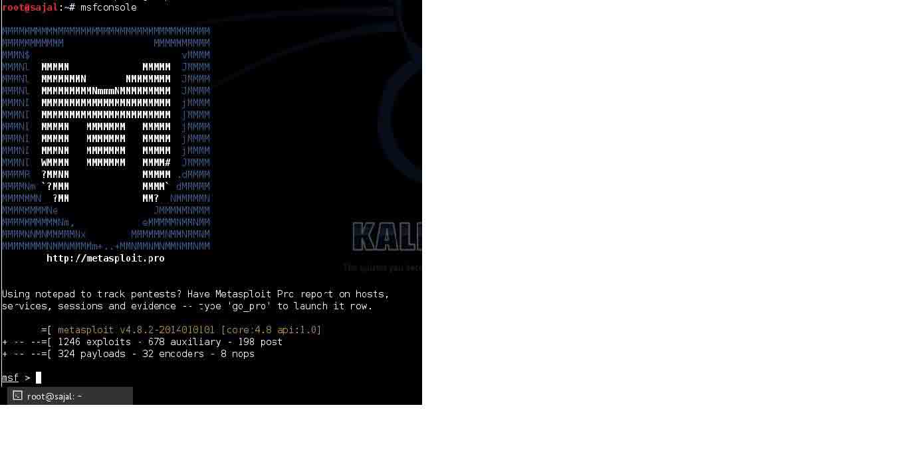

```
2.在命令行中输入 show auxiliary 
```

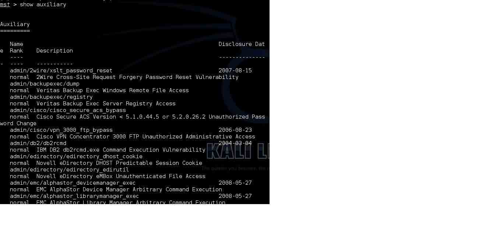

```
3.使用 auxiliary/gather/Shodansearch 模块 
```

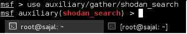

```
4.现在，你可以用 show options 命令来查看模块需要的参数 
```

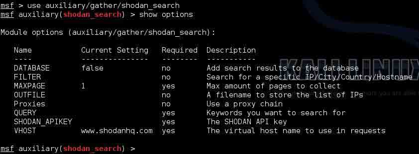

```
5.我们需要指定 iis 来搜索 iis 服务器，还需要登陆 Shodan 账户后得到的 API key。现在我们可以用 Run command 来执行命令。 
```

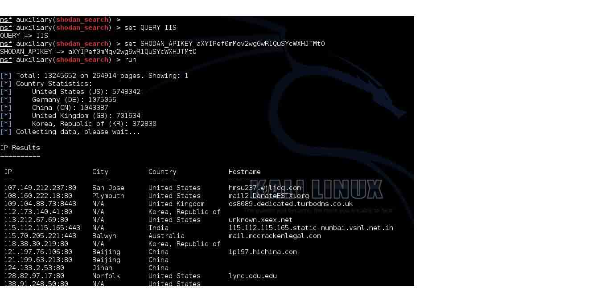

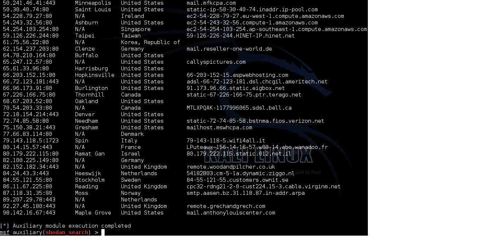

一般来说 auxiliary/gather/Shodan_search 模块通过 API 向数据库查询前 50 个 ip 地址。50 个 ip 地址的限制可以通过购买无限制 API key 来扩大到查询 10000 个 ip 地址

## 0x04 Shodan 的组件

* * *

1.Exploits：Shodan Exploits 能够用于在 ExploitDB 或 Metasploit 寻找针对不同系统、服务器、平台、应用的的 exploits。

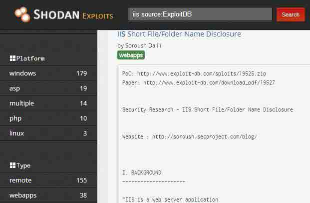

2.Maps：这是个付费功能，我们能在地图上直观地看到 Shodan 提供的结果。提供三种视图：卫星，街景（浅），街景（深）。可以同时在屏幕展示超过 1000 个结果。

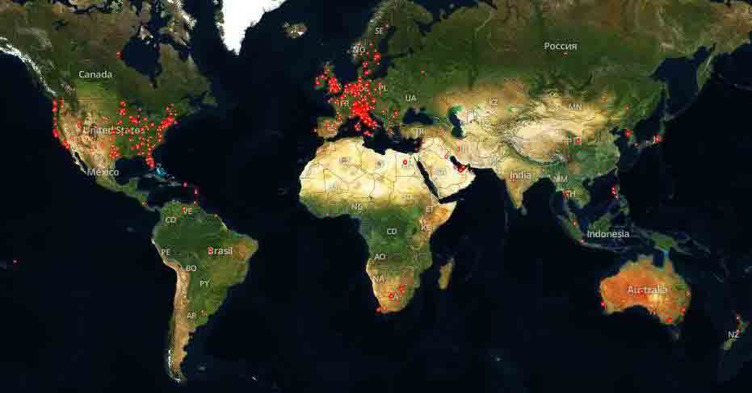

3.)Scanhub：Shodan Scanhubs 可以用于创建陌生网络的搜索，它支持 Nmap 和 Masscan 类似的工具。要使用 Scanhub，我们首先要设置好工具，输出一个 XML 格式的文件并上传到 Scanhub 的库里以获得结果。不幸的是这也是一个付费功能。

## 0x05 一些测试的例子

* * *

### 1\. Netgear 设备

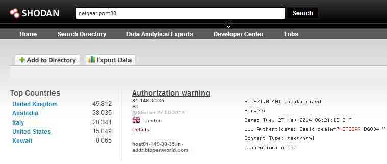

### 2\. 网络摄像头

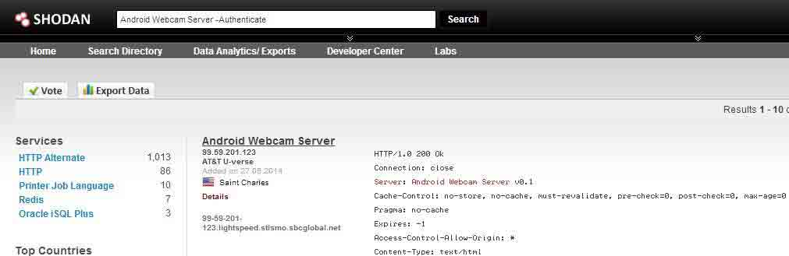

### 3\. 比特币服务器

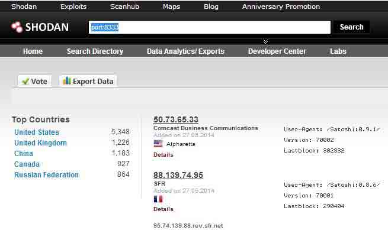

### 4\. Ruby on Rails Vulnerable Server(CVE-2013-0156 and CVE-2013-0155)

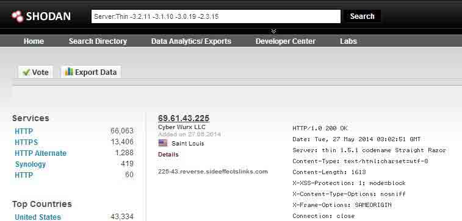

### 5\. Windfarms:

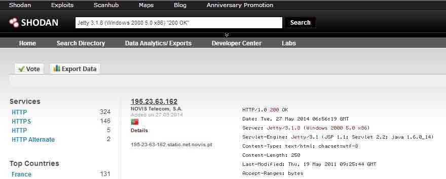

### 6\. DNS 服务:

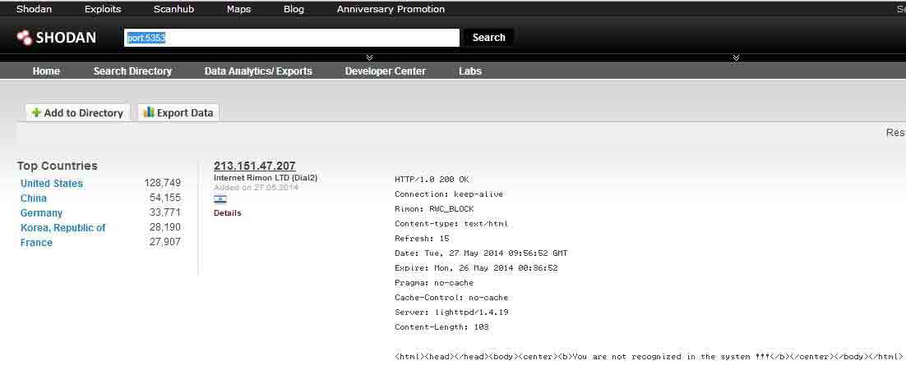

## 0x06 一些另外的 cheat sheet 链接

* * *

http://www.Shodanhq.com/?q=bitcoin-mining-proxy (Bitcoin proxy mining) http://www.Shodanhq.com/search?q=port%3A11 (Systat) http://www.Shodanhq.com/search?q=port%3A8089+splunkd (Splunk servers on tcp/8089) http://www.Shodanhq.com/search?q=port%3A17(Search for quote of the day) http://www.Shodanhq.com/search?q=port%3A123(Ntp monlist) http://www.Shodanhq.com/search?q=port%3A5632 (Vnc) http://www.Shodanhq.com/search?q=port%3A1434 ((MS-SQL (1434)) http://www.Shodanhq.com/search?q=OpenSSL%2F1.0.1 (Servers running OpenSSL/1.0.1) http://www.Shodanhq.com/search?q=port%3A79 (Finger protocol) http://www.Shodanhq.com/search?q=port%3A15 (Netstat) http://www.Shodanhq.com/?q=telemetry+gateway (Telemetry gateway)
http://www.Shodanhq.com/?q=port:161+country:US+simatic (Simatic automation system o 161 running in US)

版权声明：未经授权禁止转载 [修码的马修](http://drops.wooyun.org/author/修码的马修 "由 修码的马修 发布")@[乌云知识库](http://drops.wooyun.org)

分享到：

### 相关日志

*   [迭代暴力破解域名工具](http://drops.wooyun.org/tools/950)
*   [charles 使用教程指南](http://drops.wooyun.org/tips/2423)
*   [Cobalt Strike 之团队服务器的搭建与 DNS 通讯演示](http://drops.wooyun.org/tools/1475)
*   [通过 dns 进行文件下载](http://drops.wooyun.org/tools/1344)
*   [分享信息安全工作小记](http://drops.wooyun.org/tips/2945)
*   [CVE-2013-4547 Nginx 解析漏洞深入利用及分析](http://drops.wooyun.org/tips/2006)