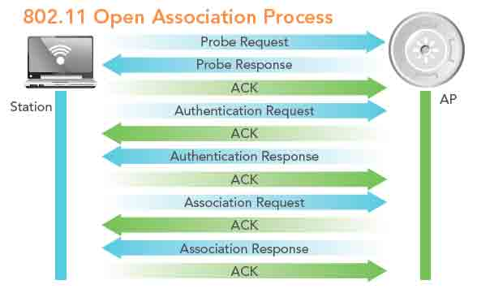
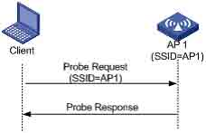
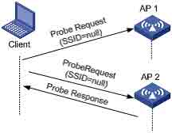
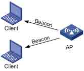
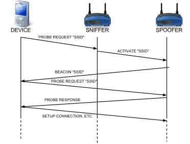
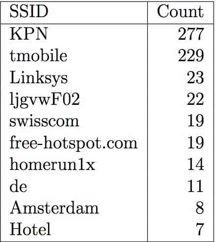
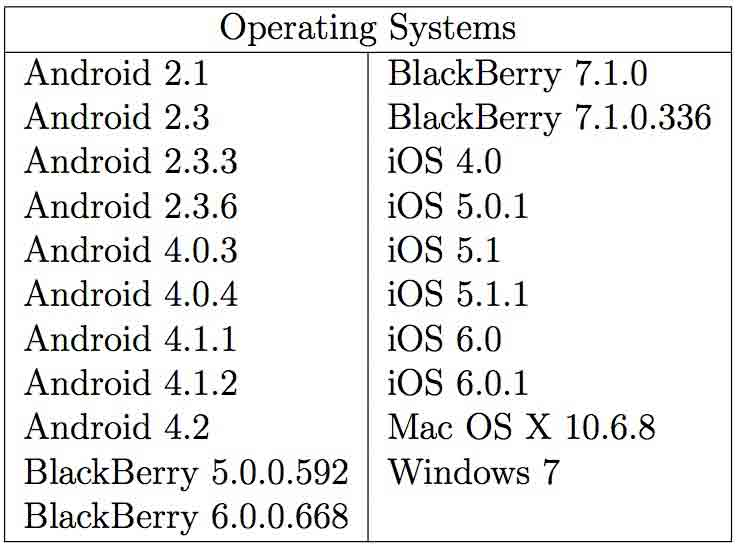
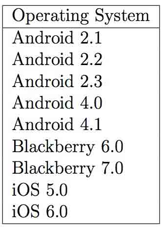
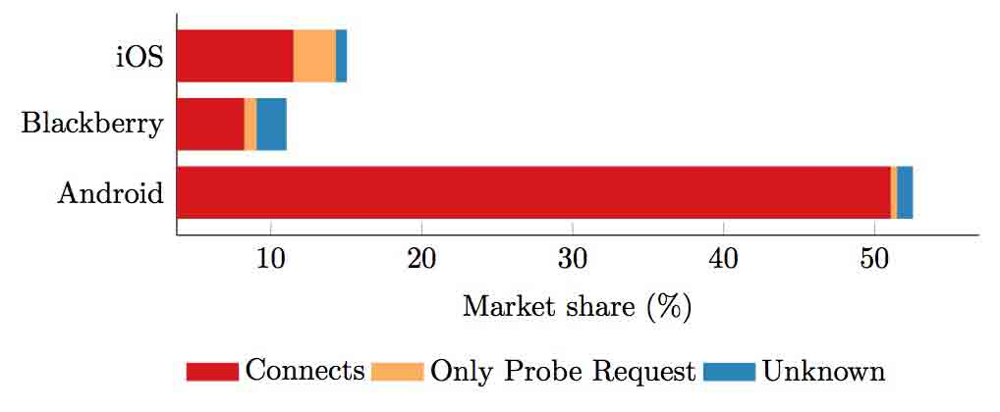

# Open Wifi SSID Broadcast vulnerability

2014/08/28 16:52 | [无人知晓](http://drops.wooyun.org/author/无人知晓 "由 无人知晓 发布") | [无线安全](http://drops.wooyun.org/category/wireless "查看 无线安全 中的全部文章") | 占个座先 | 捐赠作者

## 0x00 前言

* * *

前几天，看到微博上[@RAyH4c](http://weibo.com/rayh4c)分享了一份老外关于 wifi 钓鱼的文章，觉得挺好的，便翻译了一下。第一次翻译，英语水平堪堪才过 4 级，翻的不好请大家见谅，凑合着看吧。

附上原文地址：https://www.os3.nl/_media/2012-2013/courses/ssn/open_wifi_ssid_broadcast_vulnerability.pdf

## 0x01 摘要

* * *

一些厂商更想传递更好的用户体验，而不是更好的安全性，这很常见。基于这个事实，SNE 实验室进行了一次研究并证实，为了保证更快的扫描/连接，一些设备会在用户没有察觉的情况下广播他们保存的 SSID。这个研究提出了配置方面的问题，特别是公用 wifi 的 SSID，揭露了一个安全漏洞。那么，主要担心两个问题，设备究竟发出了什么以及如何利用这个发出的东西。

## 0x02 介绍

* * *

最近的观察显示，打开主动扫描功能的 wifi 设备暴露了一些对用户来说无关紧要，但是对攻击者很有价值的信息。为了用一种更有效的方式（更少的时间，更少的努力）收集同样的信息，这个项目的想法起源于此。这个想法是利用 wifi 可用的设备自身的主动扫描（探针请求）和自动连入开放 wifi 接入点的漏洞，设计一个自动化方法（设备）。显然，通过创建一个可以嗅探和自动创建伪造的 SSID 的设备，在一段时间内扫描许多设备就可以获得这个漏洞的范围了。先不提研究结论，这种设备可以有许多实用的安全相关应用。比如，任何公共实体，像机构或者公司（没有任何技术知识），通过他们的设备，从 wifi 主动扫描能够评估他们的员工的安全等级。特别是高等级的安全实体（银行），增强安全措施是非常有必要的。而且，没有物理的接触也是必要的，完成一个安全分析能够提供更好的结果。不用再说，它无疑能够减少费用和耽误工作的时间。

## 0x03 背景

* * *

1）客户端和接入点连接

IEEE802.11 过程的一个关键部分是发现 WLAN 并随后连接到它。这个过程先是 WLAN 网络通过展示 SSID 来通知它的存在，会发送一种叫做 Beacons 的帧。然后 WLAN 客户端为了鉴别或者连接到更好的 WLAN，发送探针请求帧。最后两步是认证和连接，考虑到它和我们的项目没有直接联系，没有介绍这部分。

2） IEEE 802.11 Beacons

Beacon 的主要目的是让 WLAN 客户端了解在给定的地区里，哪个网络或者接入点是可用的。接入点可能会时不时地广播 beacons。虽然 beacon 可能是由接入点有规律地广播的，在连接（或重连接）过程中，探测帧、认证和连接也会有用到。

3）IEEE 802.11 探针

对于客户端，实际上有两种方法扫描可用的 AP，主动扫描和被动扫描：如图 1



图 1：连接过程

1 主动扫描：在主动扫描的过程中，为了在匹配的 SSID 的特定频道监听到可用的 AP 探针回应，客户端会将它的 IEEE 802.11 广播调整到将扫描的频道，并广播探针请求。客户端等待回应的时间取决于厂商，但是通常在 10ms 左右。有两种探针请求，直接探针和广播探针。

直接探针：客户端发送特定名字的 SSID 探针请求，只有拥有请求的 SSID 的 AP 才能回应。（图 2）



图 2 直接探针



图 3 广播探针

广播探针：客户端广播一个无 SSID 的探针请求，所有的 AP 都会收到这个请求，并返回它们支持的 SSID。

2 被动扫描：被动扫描时，客户端依然会将它的广播频率调整到它想要扫描的频道，但它会等待从有效的 AP 发出的广播 beacon，而不是发送一个探针请求。如图 4



图 4： 被动扫描

## 0x04 方法

* * *

### 1）探测发送探针请求的设备

1 安装

这部分主要是抓取所有发送探针请求的设备信息。安装主要是基于软件配置，这样它可以装在自定义操作系统的路由器上（比如 openWRT）或者笔记本上。配置生效后能够抓到三种类型的数据。

第一部分是网络嗅探。在无线监听设备上运行一个 tcpdump 进程来监听所有其他设备发出的流量包。然后放到过滤器里，仅保存探针请求到日志文件里。文件格式仅包含设备 MAC 地址和探针请求发出的 SSID。

第二部分是识别设备。为了识别设备，会设置一个接入点来让设备连接到它。DHCP 服务器会给每个设备分配一个永久 IP。MAC 地址和对应的 IP 地址都会记录在一个文件里。所有的流量都会经过一个打开日志记录的本地服务器（在这里是 Lighttpd）。日志文件包含 IP 地址和 HTTP 设备请求的 UserAgent 字符串。事实上，如果一个设备连接到这个接入点并访问一个网页，它都会访问到本地 web 服务器并记录下它的请求。

2 收集数据

为了收集数据，在不同的地点放置了这样的设备。这些地点选择在了公共的，但是也有用户交互的地方。在每个地方，人们都被要求连到接入点来判定设备类型。这些地点包括 UvA,VU,Amsterdam Central andcSchiphol Airport。在设备连接前，先安置一个嗅探器来抓包，并在最后一个客户端连接后再运行一小段时间。这是为了确保嗅探器能抓到探针请求，因为它们每 60 秒发送一次。

3 保存数据

在收集数据后，对于每个登陆会话会有三个文件，即发出的 SSID，DHCP 租约和 HTTP UserAgent。所有会话的文件会合成三个大文件，格式化以便导入到数据库里。在这个项目，我们使用 Mysql 数据库。每个文件都被导入到数据库，并表示为一张表。这样就能轻易地查询数据库里的数据了。

### 2）探测连接到伪造 AP 的设备

为了了解哪个设备连接到了伪造的接入点，过多的不同操作系统的设备会被放到评定过程里。接入点被配置成设备之前连接过的 SSID。AP 被设置成没有保护的网络。当设备自动连接时，操作系统的类型和版本会被记录。

### 3）自动化欺骗

动态接入点的概念是将收集 SSID 和 MAC 地址的过程自动化，负责那些特定 SSID 的探针请求。下一步是将欺骗那些 SSID 的过程自动化，以便找出哪些 SSID 是公开的。如果有一个设备连接上了，那么可以得出那个 SSID 是公开的而且这个设置确实有效。

为了使欺骗原理自动化，可以使用一种刷了定制软件的硬件来实现。这种硬件被称为动态接入点（DAP）。它根据输入调整欺骗过程。输入可以是用户自定义，也可以是从无线接口抓取的信息。这里创建的 DAP 能使用两种攻击模式：普通模式和直接模式。在普通模式里，所有的探针请求都会被收集并用来设置伪造的 SSID。在直接模式里，只使用指定的 MAC 地址的探针请求。在这个研究里，使用一个以 OpenWRT 作为操作系统的 TP-LINK 路由器。整个过程的每个部分都使用两个设备。第一部分是收集设备监听无线通讯并经过过滤的信息。为了完成这步，写了一款软件。首先无线接口被设成监听模式，这样就可以抓取所有的数据包。然后除了探针请求，其他包都被过滤了。从这些探针请求中，生成一份 SSID 的列表。前七个 SSID 用于伪造。如果系统是直接模式的，只会使用用户自定义的 MAC 地址的 SSID。

第二部分也是一个带有 OpenWRT 的 TP-LINK 路由器。这个路由被设置成一个使用 hostapd 作为服务的接入点。Hostapd 是一个处理客户端连接到接入点的用户进程。路由器能够使用 DHCP 分发 IP 地址和提供网络接入。当第一个路由收集到足够的 SSID 时，它会生成一个 hostapd 服务能够支持格式的配置文件。它使用 scp 命令发送 via ssh 文件到第二个路由并重新运行服务。重新运行之后，第二个路由就变成了所提供的 SSID 的接入点了。



图 5 DAP 基础操作

## 0x05 调查结果

* * *

1)检测发送了探针请求的设备

实验收集的结果分为三部分。第一部分是一张包含 MAC 地址和广播的 SSID 的表。然后是一张 DHCP 租约的表，包含 MAC 地址和对应的 IP 地址。第三张表包含 IP 地址和浏览器的 UserAgent 字符串。为了分析这个数据，我们执行了许多复杂的查询。首先我们在表 1 中用如下查询得到了最热门的 SSID

```
SELECT ssid , count ( _ ) AS count
FROM (
SELECT ssid.mac,ssid.ssid
FROM ssid
WHERE ssid.ssid!= ""
GROUP BY ssid.mac
) AS P
GROUP BY ssid ORDER BY count DESC 
```



接下来是查询发出探测帧的客户端的 UserAgent 字符串。这个结果仅仅是用来展示操作系统，可以在表 2 中看到。

```
SELECT useragent .useragent
FROM ssid , dhcp , useragent
WHERE
ssid.mac = dhcp.mac
AND dhcp.ip = useragent.ip
AND ssid.ssid != ""
GROUP BY useragent . useragent 
```



2)检测连接到伪造接入点的设备

在第二部分里，许多设备连接到了恶意接入点。连接的操作系统类型和版本可以在表 3 中看到。



这个数据也从市场份额上反映了受影响的设备数量。可以在图 7 中看到。



1 自动化欺骗 SSID

当动态接入点开始工作时，可以观察到几点。首先，设备的启动时间花费了大概 30 秒。但是当它在操作时，它对基础 SSID 支持的很好。当设备处于欺骗模式时，在伪造的 SSID 工作之前，hostapd 进程重新运行、更新 SSID 列表的时间花费了 10 秒。当设备运行时，很明显设备可以自动连接到伪造的 SSID。这仅仅测试了一小部分设备，但它们全部都连接了。

## 0x06 结论

* * *

从收集的数据来看，很大一部分 Android，iOS 和 Blackberry 的设备会发出探针请求。因为这些设备占用很大的市场份额，所以很多设备都是存在风险的。而且已经证明了自动欺骗的过程是有效的，设备很容易被欺骗连接到伪造的 AP，这是个问题。这证明了一些设备仅仅依靠 SSID 去连入 AP，而 SSID 是存储在设备里的。

## 0x07 讨论

* * *

在这个话题上进行更多的研究能够进一步提高发出探针请求的已知设备的市场份额的可靠性。这个研究并没有研究每一种设备，所以这个数字还会比已知的更高。并且，不是所有的设备都运行在默认的操作系统上，定制 ROM 会提高不同的 Wireless stack。可能一些厂商改变了 wireless stack，因此在这个领域的研究需要给出更多的细节，使问题的范围更精确。

既然设备仅仅根据 SSID 就进行连接，让它记住接入点也是一个好的方法。例如，设备应该永远不记住不安全的网络。这样，欺骗会变得更加复杂。另一种方式，可以在保存 SSID 的同时，也记录已知 AP 的 BSSID。这种方法也使欺骗更加困难，因为伪造 AP 需要同时知道 BSSID(同时知道 MAC 地址)，而且 BSSID 不会暴露在探针请求里，不容易被猜到。

更多的研究会表明什么是好的策略，厂商应该保持这些好的策略。而且既然这问题已经存在了，我们将进一步研究发送探针请求的必要性，除非必要，否则不要用它。

未来应该使用更加高明的技术以增加设备连接到 DAP 的成功率。相比于其他的东西，SSID 会被标记为更高优先级。成功的连接也会增加受影响的 SSID 的优先级。每个 SSID 都有一个频率属性，意味着 DAP 要试着预测哪个 SSID 更可能开发，取决于之前提到的标记。

## 0x08 参考

* * *

```
[1] J. Bhardwaj, What is your phone saying behind your back?, Oct. 2012\. [Online]. Available: http://nakedsecurity.sophos.com/2012/10/ 02/what-is-your-phone-saying-behind-your-back/.

[2] Part 11: wireless lan medium access control (mac) and physical layer (phy) specifications, IEEE Computer Society, Mar. 2012. 
```

版权声明：未经授权禁止转载 [无人知晓](http://drops.wooyun.org/author/无人知晓 "由 无人知晓 发布")@[乌云知识库](http://drops.wooyun.org)

分享到：

### 相关日志

*   [WIFI 渗透从入门到精通](http://drops.wooyun.org/pentesting/3390)
*   [无线应用安全剖析](http://drops.wooyun.org/wireless/4295)
*   [利用 GRC 进行安全研究和审计 – 将无线电信号转换为数据包](http://drops.wooyun.org/tips/4118)
*   [树莓派打造无线扫描仪.](http://drops.wooyun.org/wireless/3810)
*   [RFID 之 M1 卡数据分析](http://drops.wooyun.org/tips/3168)
*   [NTP 反射型 DDos 攻击 FAQ/补遗](http://drops.wooyun.org/papers/955)