# Burp Suite 使用介绍（四）

2014/07/07 12:05 | [小乐天](http://drops.wooyun.org/author/小乐天 "由 小乐天 发布") | [工具收集](http://drops.wooyun.org/category/tools "查看 工具收集 中的全部文章"), [技术分享](http://drops.wooyun.org/category/tips "查看 技术分享 中的全部文章") | 占个座先 | 捐赠作者

## 0x00 Intruder Scan

* * *

发送一个你想 csrf_token 的请求到 intruder。

### 1)Positions 设置如下：

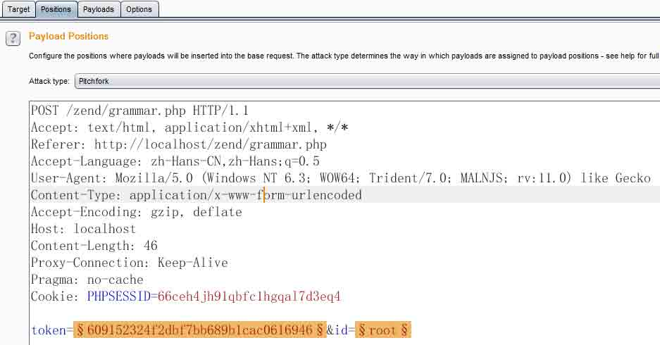

### 2)Options 设置如下：

```
Request Engine 
```

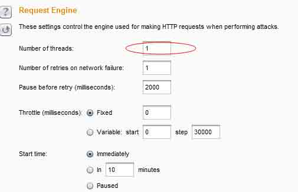

```
options>Grep-Extract>add 
```

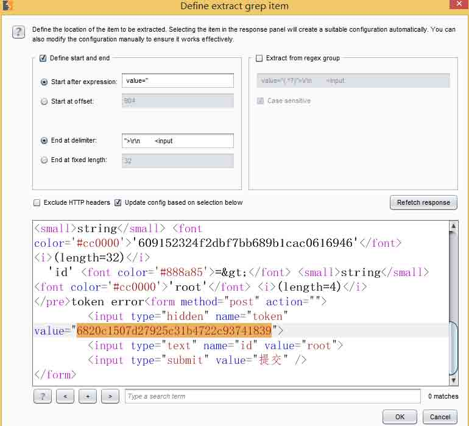

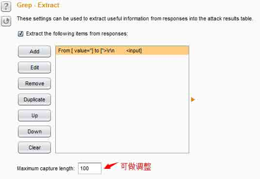

### 3)payloads 设置如下

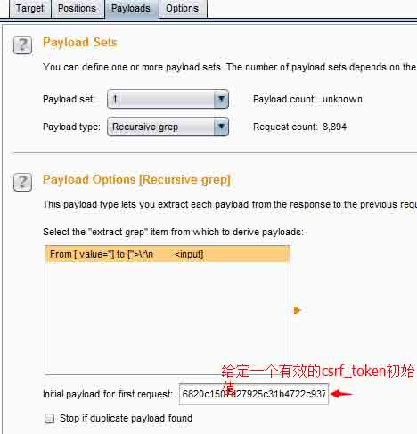

这里 payload type 设置递归(Recursive grep)，在 Initial payload for first request 设置一个有效的 csrf_token 值作为第一项

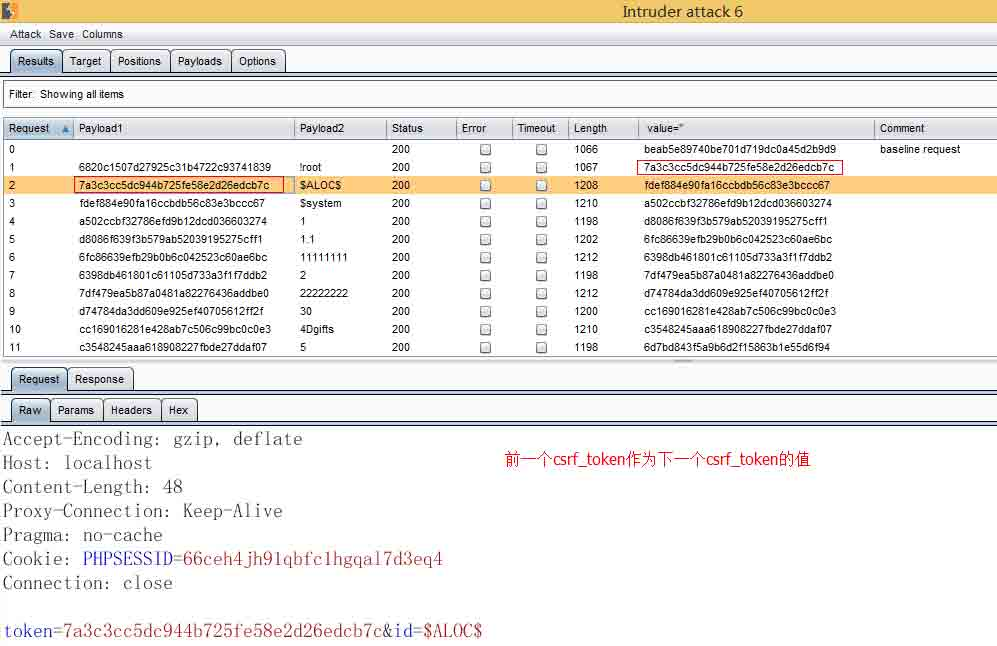

## 0x01 Active Scan with sqlmap

* * *

其实这个结合 sqlmap 有两种方法，然后跟@c4bbage 讨论了下,我采用的也是他那个代码，但是在注入的时候我发现在 burpsuite 里查看 HTTP history(历史记录)里的 token 是没有变化的，但是还是可以注入，刚开始挺纳闷的，我以为他写的那个代码有问题，后来他说不是，在 burpsuite 里是看不到的，然后我也同意他说的，就是替换这个过程直接经过宏功能替换了，不会显示在历史记录里。我这里就说下第二种方法吧。第一种点这里。

### 1)首先是登录 csrf_token 页面，不需要拦截。然后选择 Options>Sessions>Add

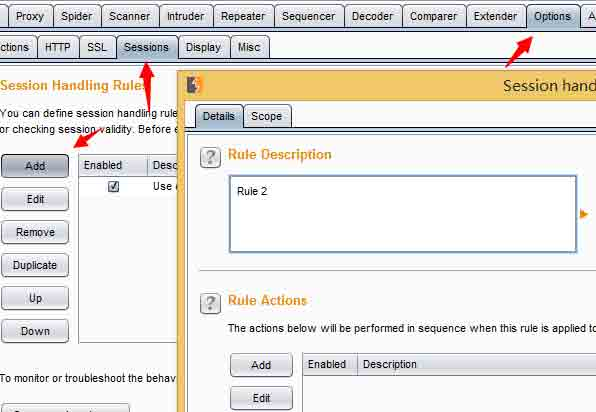

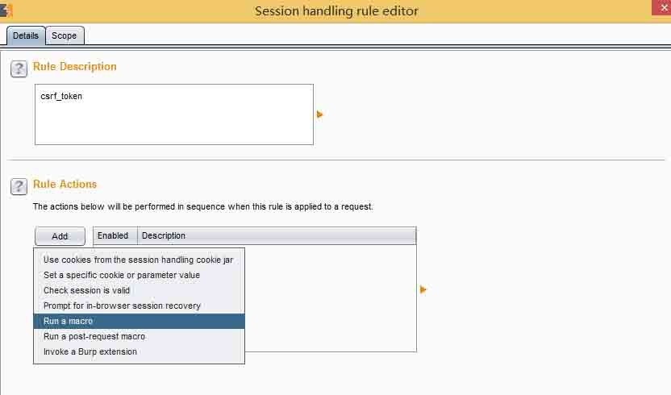

### 2)接着会弹出一个窗口选择 Select macro>add

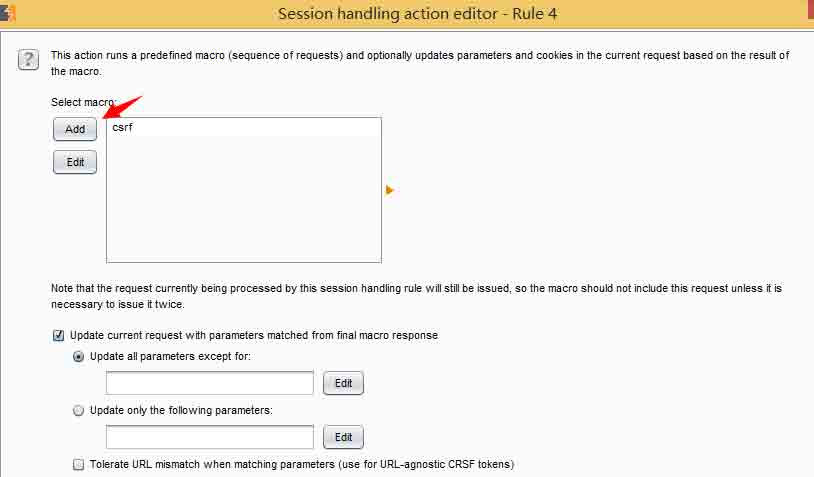

### 3)点击 add 後会弹出两个页面如图所示：

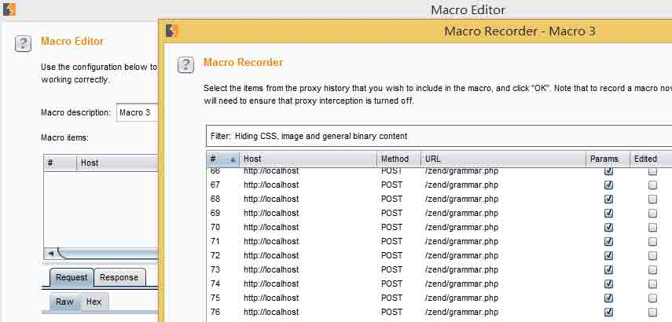

### 4)选择 2-3 个页面，第一个页面是请求页面，第二个页面是 post 数据的时候的页面，为了便于查看我这里添加了 3 个页面。

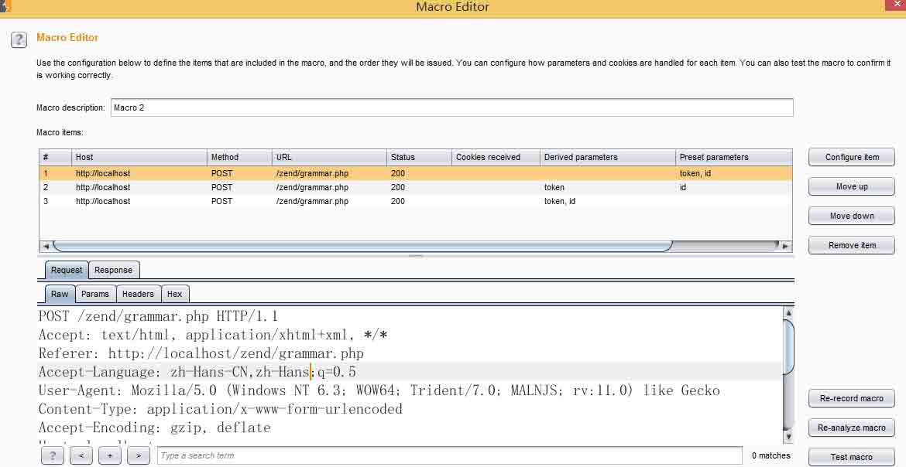

### 5)选择第二个页面点击 Configure item，指定 root，添加一个自定义 token 参数

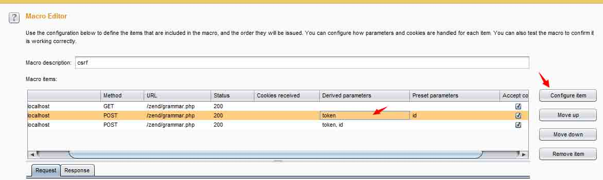

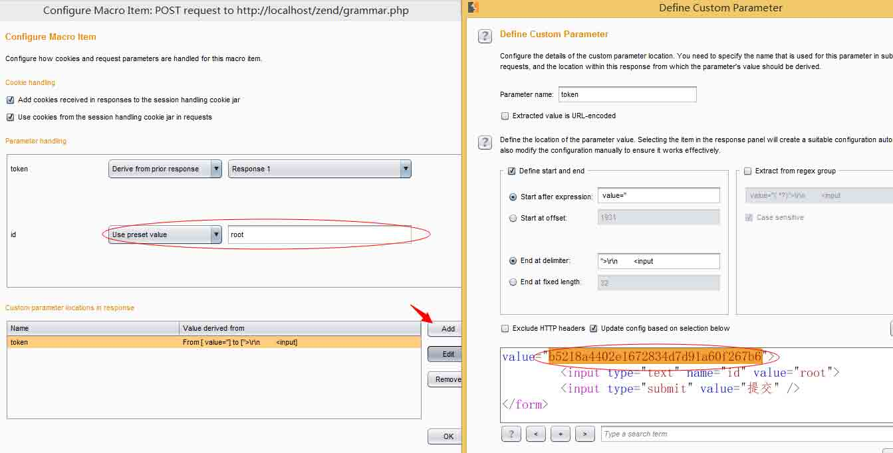

### 6)最后配置完可以点击 Test macro 看看我们配置成功了没

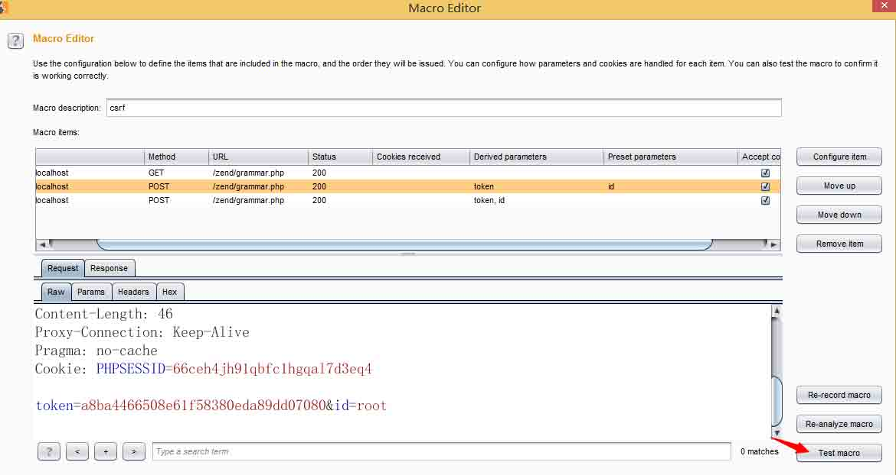

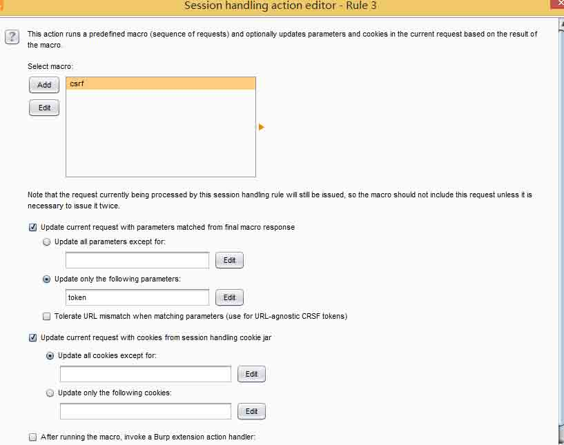

### 7)如果以上配置成功，再选择 Scope 选择应用范围

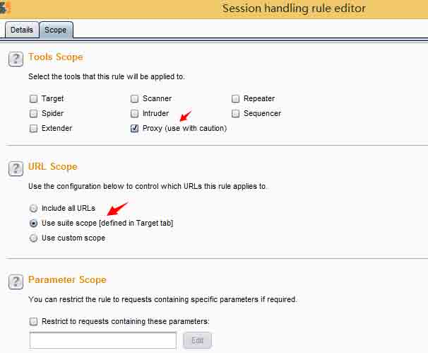

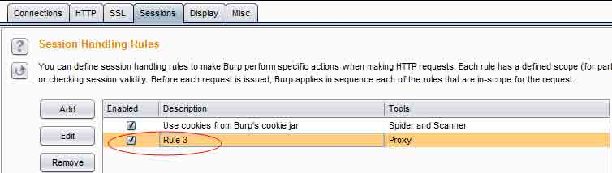

### 8)接着就是放到 sqlmap 里去跑数据咯

如果是 post 页面，这里是把 post 的数据保存到 request.txt 文件里，然后运行命令如下：

```
./sqlmap.py -r request.txt –proxy=http://127.0.0.1:8080 
```

如果是 get 页面命令如下：

```
./sqlmap.py –u “www.target.com/vuln.php?id=1” –proxy=http://127.0.0.1:8080 
```

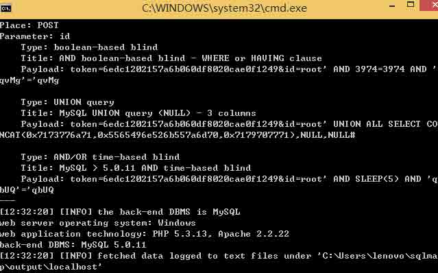

## 0x02 Session Randomness Analysis Sequencer

* * *

请求拦截一个地址，在响应内容中如果有 cookie，或者我们可以在 sequencer 中自定义配置 token 参数

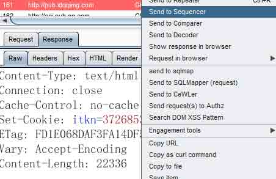

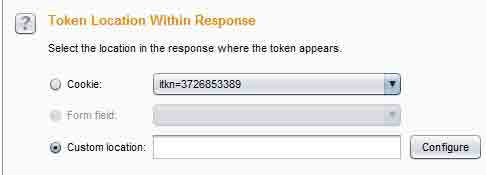

然后点击 Start live capture 进行分析

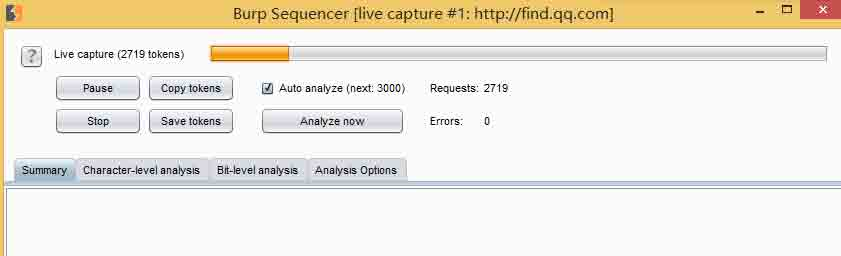

等分析完即可生成报告，通过报告我们可以看出 token 是否可以伪造。

参考资料：http://resources.infosecinstitute.com/session-randomness-analysis-burp-suite-sequencer/

版权声明：未经授权禁止转载 [小乐天](http://drops.wooyun.org/author/小乐天 "由 小乐天 发布")@[乌云知识库](http://drops.wooyun.org)

分享到：

### 相关日志

*   [Burp Suite 使用介绍（二）](http://drops.wooyun.org/tools/1629)
*   [Burp Suite 使用介绍（三）](http://drops.wooyun.org/tips/2247)
*   [用 Burpsuite 来处理 csrf token](http://drops.wooyun.org/tips/2460)
*   [Burp Suite 使用介绍（一）](http://drops.wooyun.org/tools/1548)
*   [InsightScan:Python 多线程 Ping/端口扫描 + HTTP 服务/APP 探测，可生成 Hydra 用的 IP 列表](http://drops.wooyun.org/tools/427)
*   [nmap 脚本使用总结](http://drops.wooyun.org/tips/2188)