# STRUTS2 的 getClassLoader 漏洞利用

2014/03/14 18:56 | [阿里巴巴安全中心](http://drops.wooyun.org/author/阿里巴巴安全中心 "由 阿里巴巴安全中心 发布") | [漏洞分析](http://drops.wooyun.org/category/papers "查看 漏洞分析 中的全部文章") | 占个座先 | 捐赠作者

## 0x00 摘要

* * *

2012 年，我在[《攻击 JAVA WEB》](http://www.inbreak.net/?spm=0.0.0.0.lxJSWS&p=477)，文中提多关于“classLoader 导致特定环境下的 DOS 漏洞”，当时并没有更加深入的说明，这几天 struts 官方修补了这个漏洞，本文是对这个漏洞的深入研究。

## 0x01 正文

* * *

这一切，得从我们控制了 classLoader 说起，曾经写过一篇文章，提到了一个小小的技术细节，非常不起眼的一个鸡肋。 引用[《Spring framework（cve-2010-1622）漏洞利用指南》](http://www.inbreak.net/?spm=0.0.0.0.lxJSWS&p=377)：

> Struts2 其实也本该是个导致远程代码执行漏洞才对，只是因为它的字段映射问题，只映射基础类型，默认不负责映射其他类型，所以当攻击者直接提交 URLs[0]=xxx 时，直接爆字段类型转换错误，结果才侥幸逃过一劫罢了。

tomcat8.0 出来后，这个问题爆发了，这是一个鸡肋漏洞的逆袭。

在 struts2 任何一个 action 运行之前，一旦接受到用户提交参数 xx=zzzzz 时，就由 Ognl 负责调用对应的当前 action 的 setXxx 方法，至于 set 方法到底是干什么的，其实不重要，里面的逻辑也不重要，我们只关注这个方法调用了，参数传递了。这种对属性的改变，有时候是可以很大程度的影响后续复杂逻辑。

### 普及一点基础

Object 是 java 的基础类，所有的 class 生成的对象，都会继承 Object 的所有属性和方法，因此当前 action 无论是什么代码，必须有 Object 自带的 getClass 方法，这个方法会返回一个 Class 对象，Class 对象又一定会有 getClassLoader 方法，最终在每个 action 都可以

```
getClass().getClassLoader()

```

拿到当前的 ClassLoader。

我研究这个问题，在几年前了，这个东西理解起来不容易，尤其是各个 web 容器不一致，刚巧当时有个阿里巴巴内部《tomcat 等容器的 classLoader 加载原理》培训，收获匪浅。本文篇幅有限，简单的讲一下。

在 JRE 启动中，每个 Class 都会有自己的 ClassLoader。web 容器，为了方便的管理启动过程，通常都有实现自定义的 ClassLoader。《Spring framework》的漏洞的利用场景真的非常幸运，利用了 web 容器的特性 getURLs 方法，所有容器的 servlet 的 ClassLoader 都会通过继承父类 UrlClassLoader 得到 getURLs 这个方法，所以这个漏洞可以不受容器影响。事实上，每个容器的 ClassLoader 都是自己实现的，环境必然会有所不同，那次 struts2 侥幸逃过一劫，所以我的一个关注点，一都放在几大 web 容器的 ClassLoader 代码变化上，哪天看到 tomcat8 居然把 resources 放进 ClassLoader 上，而 ServletContext 刚巧挂在 resources 上，顿时知道肉戏来了。

### 上传 webshell 的可能性研究

多次的远程代码执行漏洞洗礼，我一直在脑海里模拟“ServletContext 被控制了，这次能干什么”，究竟有哪些路线，可以通往代码执行的领域。

比如：Struts2 会去 servletContext 里取到一个值，然后把它作为 Ognl 执行掉。这个太简单了，我自己都不信。

Ognl 的 Context 树形结构：

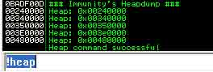

servletContext 被转换成 Map，变成了图中的 application 子项，这个位址很尴尬，如果是上一层 Node，从上到下找到 value Stack，确实有实现这个思路的可能，但现在看来，这条路断了，它不支持找到父节点。经过多次找寻后，确认 Ognl 出局，只能从 web 容器本身入手。

运行在 Tomcat8 下的 struts，在随便哪个 action 代码中，插入这段，下断点，

```
this.getClass().getClassLoader();

```

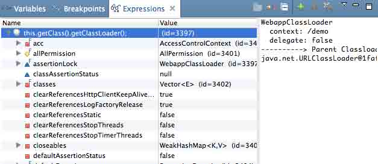

任何一个 Action 的 classLoader 都是 org.apache.catalina.loader.WebappClassLoader，这是漏洞的源头。

我的思路，是给 context 赋予初始化参数 readOnly=false。因为在 tomcat 上，所有的请求，都会默认由 defaultServlet 上处理，或者由 jspServet 处理。只要在 context 初始化时，readOnly=false，接下来 defaultServlet 就会真的处理 PUT 请求 DELETE 请求等等大威力请求，于是我们可以直接 PUT 文件上来。

这个思路的前提，是 defaultservlet 再被初始化一次。现实很残酷，这个思路最终没有得到执行，原因是 servlet 只会初始化一次，而 readOnly 属性只有在 servlet 初始化时，才会真的给 servet 的 readOnly 属性赋值。这次突破，宣告失败。

### 几个这个漏洞的调试小技巧：

**1\. 仅仅从 debug 上查看 ognl 的赋值情况，是不准确的，debug 只能看到这个类定义好的变量。**

如果有一个代码是这样的：

```
public void setName(String name){…}

```

但是并没有定义过这个属性，这时 debug 无法看到这个东西，但是其实 ognl 可以直接通过 name=zzzzz 调用，并且能把 zzzz 传递过去。

**2\. 或者只有一个私有属性，但是没有 set 方法，其实也是 ognl 不能赋值的。**

这个 debug，观察这个漏洞时，仅仅是个参考，要真正深入进去看代码才能和 ognl 的视线保持一致。

**3\. 一个 final 的对象，或者只是 get 方法返回一个对象，看起来像是只读的，其实对象的属性还是可以改的，这个只是对象的引用。**

你可以理解为指针指向的地址不能变，但是指向的那个对象的属性，是可以修改的。

举例：

```
public User getUser()
{
     return this.user;
}
public final User user;

```

这两处代码，其实真正返回给 OGNL 的都是 user 对象，对象的属性只要还有 set 方法，也都是可以被修改的。依然可以通过

```
url?user.name=xxx 
```

对 user 的 name 赋值。

### struts2 运行在 tomcat8.0.1rc5(2013,11 月前)的任意文件读取漏洞

在 tomcat 的环境下，classLoader 会挂载一个 resources，类名叫做“StandardRoot”，这个恐怖的东西，和 tomcat 的资源文件管理有关，debug 看到的第一个属性就是非常危险的属性“allowLinking”。

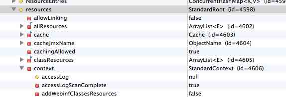

这个事情，要从很久很久以前，struts 修补的一个任意文件读取漏洞说起。

[`struts.apache.org/release/2.3.x/docs/s2-004.html`](http://struts.apache.org/release/2.3.x/docs/s2-004.html)

这是一个目录列表+文件读取漏洞，修补方案非常阴险，没有采用正规的手段，在框架层解决漏洞，而是利用了 web 容器的一个公约特性，jsp 的 web 容器都遵守一个规则。

当一个路径叫做“`/var/www/tomcat/webapps/demo/struts/../`”时，调用

```
getClassLoader().getResource(Path)

```

返回路径为：

```
/var/www/tomcat/webapps/demo/ 
```

会把/../去掉，并且直接到达目的目录。

这个叫做 web 容器特性，由 web 容器说了算，哪天 web 容器生气了，想变了，struts 没有话语权。事实上，我一直喜欢讲框架安全，其中一条准则，就是“框架不要依靠 web 容器的特性做防御”，当然，今天不讨论这个话题，只是稍微做个铺垫。

当时修补代码为：

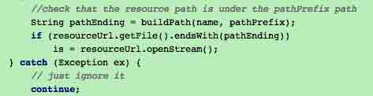

用户提交`struts/../`时，`pathEnding="struts/../"`。

但是

```
resourceUrl="/var/www/tomcat/webapps/demo/" 
```

所以并不以 pathEnding 结尾。这种猥琐的做法，当时确实有效。

tomcat8 这个版本突然抽风了，重写了这个方法，还真的返回了

```
/var/www/tomcat/webapps/demo/struts/../ 
```

宣告沦陷。但是代码实际运行中，有个要求，就是“StandardRoot.allowLinking”必须是 true（默认肯定是 false）。

机会来了。首先提交：

```
http://localhost:8080/demo/t1.action?class.classLoader.resources.allowLinking=true 
```

debug 可以看到已经是 true。

然后按照以前的攻击方法：

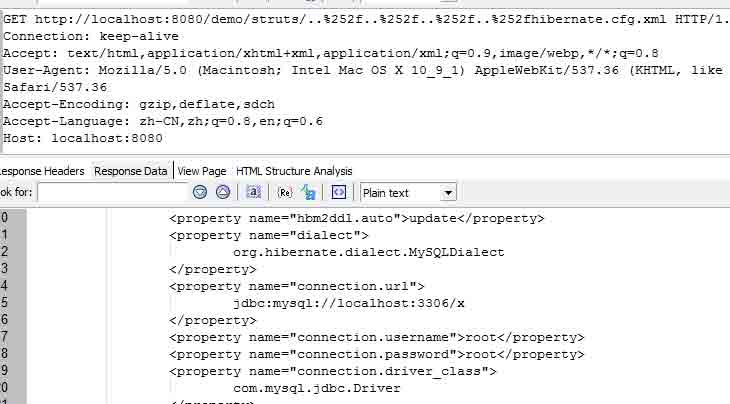

就可以轻易读取任意文件，拿到数据库密码等等。

这是两个漏洞结合的成果，非常遗憾的是，在 RC5 这个版本之后，有人给 tomcat 提交了一个需求，大概在 2013 年 11 月左右，tomcat 的一个不重要的需求中（刚好这个需求涉及到资源文件相关代码），tomcat 维护人员也许并没有意识到了这里存在读取资源文件的威胁，仅仅是把读取资源功能重新抽象规划了一次，结果顺带修补了这个漏洞，这问题产生的理由非常冤屈，修补的理由非常冤屈，最郁闷的是我，活生生的，0day 没了。原本沾沾自喜以为可以大杀四方，结果大神打了个喷嚏。

最后顺带说一句，这个漏洞只在 windows 下正常，linux 下未知原因抽风。

### tomcat8 下黑掉 struts2 应用的首页

但是不要紧，tomcat 是不可能给 struts 解决根本问题的，standardroot 暴露出来，可以顺带影响很多东西。这个算 DDOS 么？其实我可以把“Hacked by kxlzx”写到你的应用首页去

成因非常的“正常”，因为这个 context 属性代表了 tomcat 的`/conf/context.xml`文件的配置，我现在把 path 给你改了，那么 struts 去处理 result 时，会用路径拼接读取文件，现在目录名被改掉了，自然就读不到文件了，可惜这里不能 00 截断，否则又是一个任意文件读取漏洞。 下面是被干掉的网站，访问任何一个 action，都会有如下效果：

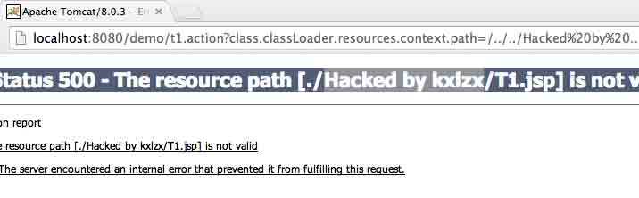

看看 debug 的情况：

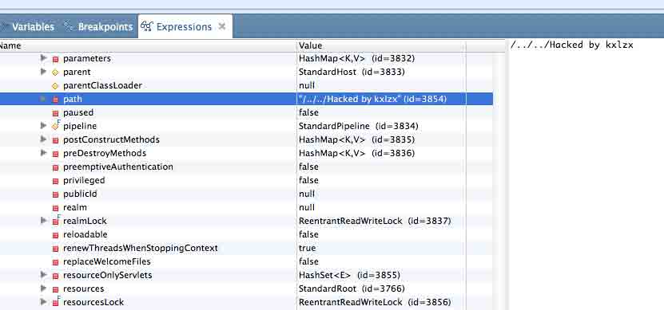

当前 action 叫做 T1，会找到 T1.jsp，但是现在目录名已经被修改了，所以报错。

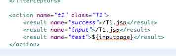

这个问题可以影响 tomcat8 所有版本下运行的 struts2，对了，你们得自己设计 EXP 哈，不要乱入。

### jetty7 关机指令

既然提到了 web 容器，只有研究 tomcat，肯定不能覆盖大家关心的地方，于是我选择了另一个开源免费并且使用量大的轻量级 web 容器：jetty。

现在先看看 jetty 是否有突破的口子。这次讲解路线反过来，先找个影响“不大”，各位“不是”很关心的漏洞。

还是先看看 web 结构,使用老办法断点：

```
this.getClass().getClassLoader();

```

看到一个 class：

```
org.eclipse.jetty.webapp.WebAppClassLoader

```

jetty 的漏洞，没有 tomcat 那么含蓄，非常直接的，context 就挂载在 classLoader 上。

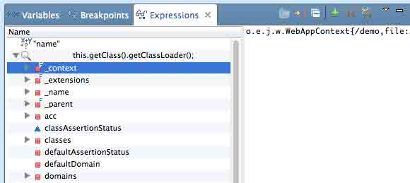

jetty 在运行过程中，会去实时查看 ContextHandler 中的 shutdown 属性（webappcontext 通过几层继承关系，继承了这个类，其实亲戚关系有八丈远），一旦发现 true，直接就不工作了，这是典型的，使用一个状态判断业务是否同行。基于这个原理，只要如下访问，以后这个应用，就只剩下 404 了。

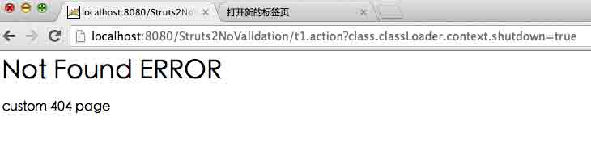

无论是什么 action，都只会返回这个错误，后续的执行，jetty 都以为真的 shutdown 了。并且这个过程没有任何补救措施，只能管理员手工重启了，各位 SA 亲们，你们准备好了么？

### jetty 任意文件下载

我们让 404 为这个漏洞服务到底。

事实上，下面说的这个问题发生在 jetty 上，tomcat 真的是巧合的逃过一劫。

我们看看 jetty 对于自定义错误文件的配置过程：

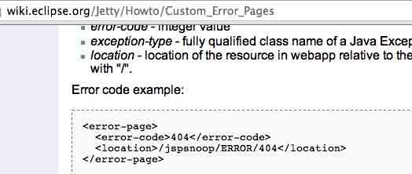

这段配置文件，可以自定义 404 错误文件，这里可以指定`/WEB-INF/`目录下的文件，一旦配置之后，由 ErrorPageErrorHandler 负责给 errorPages（这也是个 map）添加一个对应关系。这个类最终会被挂在到 context 中，那么依照这个漏洞的原理，我们可以层层调用，最终制定一种错误，比如 404 错误。

Jetty 把 errorHandler 挂载到 context 上，errorHander 有个 errorPages 属性，这其实是个 map，代表错误页面，key 是一个返回码数字，value 就是错误后显示的文件。 所以打开：

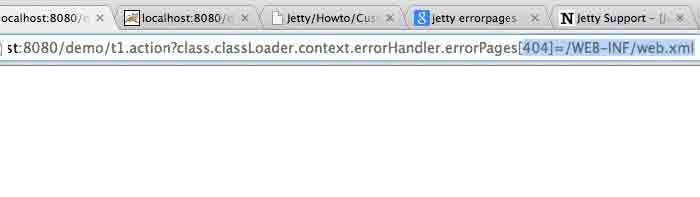

访问图片中这条 URL 后，效果如下，任何一个不存在的页面都会显示 web.xml 的内容：

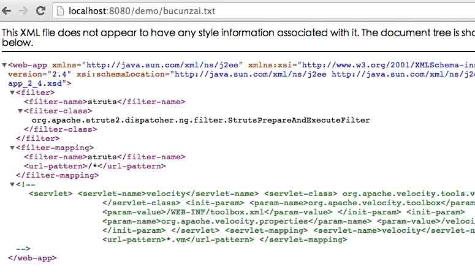

有了这个问题，就可以读取数据库文件，查看数据库密码，读取代码文件，查找隐藏的业务逻辑漏洞。注意，是任何人遇到 404 都可以看到这个页面，最好等夜深人静的时候再使用，用完了还得恢复原样。

## 0x02 漏洞修补

* * *

这漏洞已经被官方修补了，2012 年发出来的老问题，只是没有单独提交官方而已，居然也能拖到现在，建议各位下定决心换个框架。

from:[`security.alibaba.com/blog/blog_3.htm`](http://security.alibaba.com/blog/blog_3.htm)

版权声明：未经授权禁止转载 [阿里巴巴安全中心](http://drops.wooyun.org/author/阿里巴巴安全中心 "由 阿里巴巴安全中心 发布")@[乌云知识库](http://drops.wooyun.org)

分享到：

### 相关日志

*   [从 Windows 到安卓：多重攻击机制的远控的分析](http://drops.wooyun.org/papers/1270)
*   [Cisco ASA Software 远程认证绕过漏洞](http://drops.wooyun.org/papers/3459)
*   [WebView 中接口隐患与手机挂马利用](http://drops.wooyun.org/papers/548)
*   [Attacking MongoDB](http://drops.wooyun.org/papers/850)
*   [CVE-2014-6321 schannel 堆溢出漏洞分析](http://drops.wooyun.org/papers/4194)
*   [BurpSuite 扩展开发[1]-API 与 HelloWold](http://drops.wooyun.org/papers/3962)