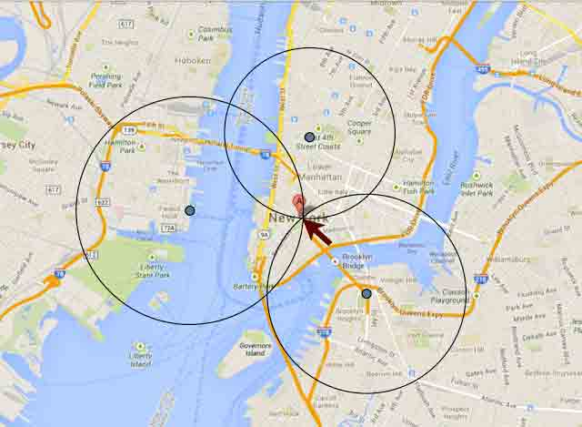

# 国外社交软件 Tinder 被爆漏洞可定位任意用户位置

2014/02/21 14:29 | [News](http://drops.wooyun.org/author/news "由 News 发布") | [业界资讯](http://drops.wooyun.org/category/news "查看 业界资讯 中的全部文章") | 占个座先 | 捐赠作者

Tinder 是国外的一款手机交友 APP，这款应用在推出的两个月内，推荐匹配了超过 100 万对的爱慕者（双方第一眼互有好感），并获取了 3500 万个用户的账号打分。而它最初的着力点，正是在校园。它的功能实际很简单：基于你的地理位置，应用每天为你“推荐”一定距离内的四个对象，根据你们在 Facebook 上面的共同好友数量、共同兴趣和关系网给出评分，得分最高的推荐对象优先展示。


在 2013 年七月的时候，Tinder 就被爆有 API 接口暴露 iOS 客户端的经纬度，可以定位任意用户位置。

下面介绍的这个 API 是新发现的，而不是之前被暴露的。

通过代理抓取 iPhone 的请求，抓取 Tinder 的通信情况，抓到一个 API 通过用户的 ID 返回信息如下：

```
{
   "status":200,
   "results":{
      "bio":"",
      "name":"Anthony",
      "birth_date":"1981-03-16T00:00:00.000Z",
      "gender":0,
      "ping_time":"2013-10-18T18:31:05.695Z",
      "photos":[
      //cut to save space
      ],
      "id":"52617e698525596018001418",
      "common_friends":[

      ],
      "common_likes":[

      ],
      "common_like_count":0,
      "common_friend_count":0,
      "distance_mi":4.760408451724539
   }
} 
```

不再返回准确的 GPS 信息，但是`distance_mi`字段为距离信息，是一个 64 位双精度字段，精确度非常的高了。

利用此信息，我们就可以获取改 ID 对应用户的比较准确的 GPS 信息。看看下图你就明白了：



利用三个位置的距离信息就可以定位到该用户的准确位置，其原理与 GPS 定位是一样的。

通过伪造 GPS 信息，通过 API 来告诉 Tinder，我在任意的位置，并查询 API 查找到用户的距离。

创建 Tinder 的 3 个测试账号。然后告诉了 Tinder 的 API，我所在的三个位置，以及到该用户的距离。

然后，根据[公式](https://en.wikipedia.org/wiki/Trilateration#Derivation)就可以算出该用户的 GPS 信息了。

这种问题似乎微信与陌陌之前也有，不知道现在还有没有呢？:)

版权声明：未经授权禁止转载 [News](http://drops.wooyun.org/author/news "由 News 发布")@[乌云知识库](http://drops.wooyun.org)

分享到：

### 相关日志

*   [马航 MH370 航班被黑了？](http://drops.wooyun.org/news/1202)
*   [通过伪造乌克兰相关文件进行传播的恶意软件 MiniDuke](http://drops.wooyun.org/news/1373)
*   [网络安全威胁周报——第 201410 期](http://drops.wooyun.org/news/1034)
*   [NSA 暗中监视中国政府和企业网络（目标华为）](http://drops.wooyun.org/news/1289)
*   [APPLE IOS 7.1 修复了超过 20 个代码执行的漏洞](http://drops.wooyun.org/news/1057)
*   [GnuTLS 和 Apple 证书验证的 bugs 并非为同一个](http://drops.wooyun.org/news/1021)