# OAuth 2.0 安全案例回顾

2013/09/13 15:06 | [horseluke](http://drops.wooyun.org/author/horseluke "由 horseluke 发布") | [web 安全](http://drops.wooyun.org/category/web "查看 web 安全 中的全部文章"), [漏洞分析](http://drops.wooyun.org/category/papers "查看 漏洞分析 中的全部文章") | 占个座先 | 捐赠作者

## 0x00 背景

* * *

纵观账号互通发展史，可以发现 OAuth 比起其它协议（如 OpenID）更流行的原因是，业务双方不仅要求账号本身的认证互通（authentication；可理解为“我在双方的地盘姓甚名谁”），而是更需要双方业务流的授权打通（authorization；可理解为“我在双方的地盘上可做什么”），因为后者才能产生实际的互惠互利。

2013 年将过大半，有关 OAuth 的讨论确有冷却的趋势，这源于在商业价值上该协议的使用越来越趋于理性；而 OAuth 2.0 在国内的实施也已经成熟，“第三方登录”已经规模化。在这个时刻进行安全问题回顾，也许可以为未来类似协议的安全实施做一个参考。在此之前，captain pysolve[《浅谈 OAuth 安全（OAuth Security）》](http://hi.baidu.com/pysolve/item/0a88ad8768d7c340850fab22)（2012 年 11 月）和 pnig0s[《OAuth Security》](http://pan.baidu.com/share/link?shareid=160592&uk=1093341668)（2012 年 12 月），均进行了 OAuth 历史和漏洞回顾；而 Eran Hammer 于 2012 年 7 月撰写的著名文章[《OAuth 2.0：通往地狱之路》](http://article.yeeyan.org/view/50978/307535)，则以协议制定参与者的身份，在原理上阐述 OAuth 2.0 为什么“在大部分开发者手中会容易出现不安全的实现结果”。本文主要从被攻击的资源分类角度，结合 wooyun 等披露案例对 OAuth 2.0 实施过程进行分点回顾，也在整体上反映国内开放平台的历史关注度。为简化责任说明，本文主要有如下角色：平台方、应用方、用户。本文可能有错误，敬请指正。

## 0x01 OAuth 2.0 的安全焦点

* * *

OAuth 2.0 的标准在去年（2012 年）10 月份总算尘埃落定：RFC 6749 [The OAuth 2.0 Authorization Framework](http://tools.ietf.org/html/rfc6749)（中文翻译点此[`github.com/jeansfish/RFC6749.zh-cn`](https://github.com/jeansfish/RFC6749.zh-cn)）和 RFC 6750 [The OAuth 2.0 Authorization Framework: Bearer Token Usage](http://tools.ietf.org/html/rfc6750)（中文翻译点此[`github.com/jeansfish/RFC6749.zh-cn`](https://github.com/jeansfish/RFC6750.zh-cn)）。相比 OAuth 1.0 的实践式总结，OAuth 2.0 更像是一种框架式指引，这其中主要的特点有：

### （1）尽量适应多个场景授权：场景复杂化下增加了攻击点

从业务出发点来讲，制定 OAuth 2.0 协议的最大动力之一，是希望用一个协议适应多个业务场景授权，即需要既能满足传统客户端授权场景，又要满足无服务器参与的授权场景，甚至还有手机应用授权场景等等等等。

而这种拉大业务场景的结果，一般也意味着薄弱点的增多，这是因为在场景复杂化的情况下，开发方容易考虑不周、或者对应用方的相关安全指示不足，应用方也容易错误使用应用场合，而协议对这些场景也没有更加深入的指引。另外它也可能导致场景之间的安全问题产生了交叉，一些本来属于潜在威胁，很容易通过场景转换变成了显性漏洞。对于擅长“由点到面”的攻击者来说，现在只需要针对常见薄弱点（尤其是授权认证流程中的薄弱点）就有可能攻击成功。

OAuth 2.0 的 rfc 定义了几种场景授权模式，并允许平台方自行扩充，本文讨论的有：

#### （A）Authorization Code Grant（授权 code 许可）

用户在平台方授权页面登录后，跳转的 redirect_uri 中，参数段（如 http://cakkback_url/?code=aaaaa&state=ssss）带 code 参数；此时应用需要再次向平台方的指定接口（一般为获取 Access Token 接口）发起请求，用 code 参数换取 access token。

这是 OAuth 1.0 中几乎唯一定义过的业务场景，主要用于传统客户端和有服务器参与的网站授权。

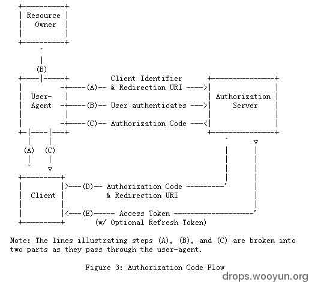
图：rfc6749 第 4.1 节 Authorization Code Grant 流程图

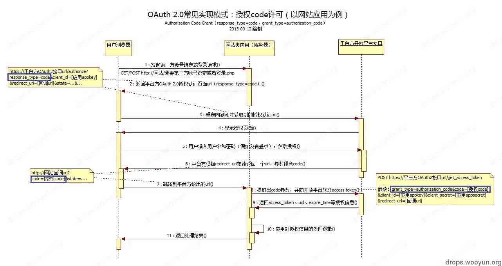
图：Authorization Code Grant 常见的实现模式：以网站应用为例

#### （B）Implicit Grant（隐式许可）

用户在平台方授权页面登录后，跳转的 redirect_uri 中，uri 片段（如 http://cakkback_url/#access_token=aaaaaa&uid=aaaaa）直接带 access token。

这种场景不验证应用的有效性，主要用于无应用方服务器参与的纯浏览器 javascript/HTML5 交互。

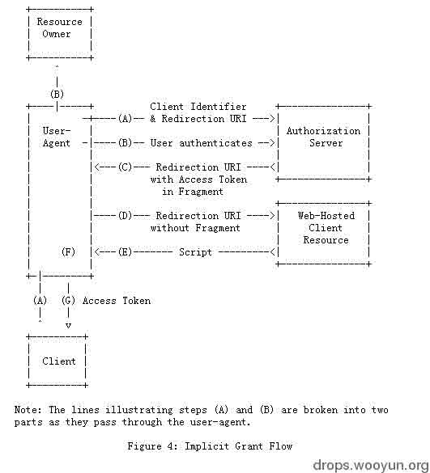
图：rfc6749 第 4.2 节 Implicit Grant 流程图

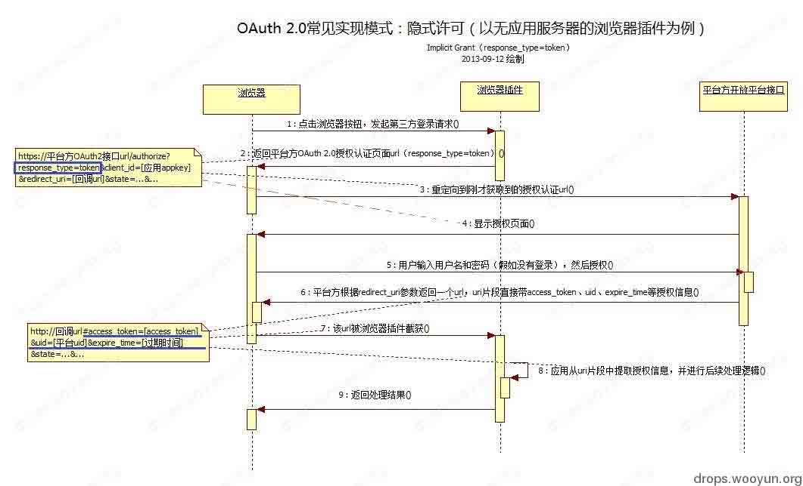
图：Implicit Grant 常见的实现模式：以无应用服务器的浏览器插件为例

#### （C）Resource Owner Password Credentials Grant（资源所有者密码凭据许可；XAuth 即为此类）

应用直接向平台方的指定接口（一般为专用的 XAuth 登录接口；或者为获取 Access Token 接口）发起请求，直接用用户名和密码获取 Access Token。

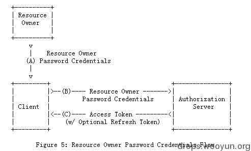
图：rfc6749 第 4.3 节 Resource Owner Password Credentials Grant 流程图

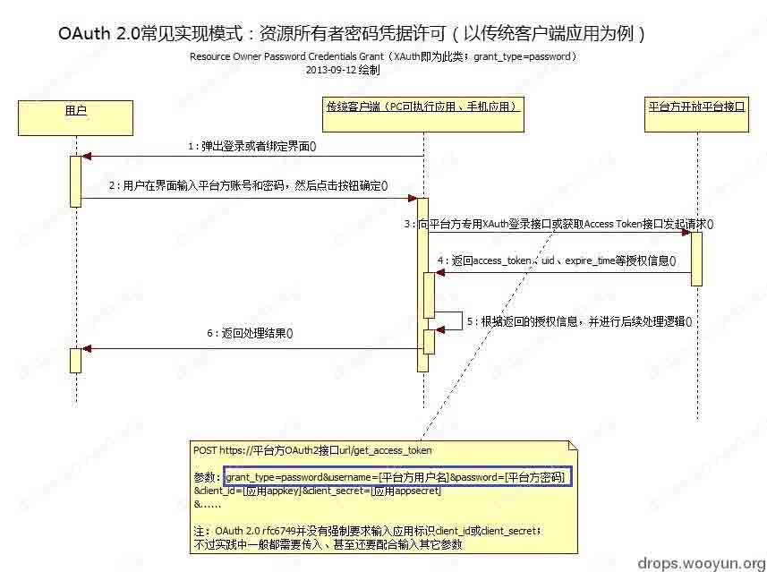

图：Resource Owner Password Credentials Grant 常见的实现模式：以传统客户端应用为例

### （2）简化和不作强制要求：落空的开发者保安全愿望

从具体技术实现来讲，OAuth 2.0 为了让平台方可以以最小的业务改造代价整合已有资源，对于许多方面并不作强制要求，这其中一个核心精神，就是将应用层签名流程简化（甚至去除），并依赖传输层加密（TLS）。在业界的实践中，这种精神被转化为无绑定 token（Unbounded tokens）和无记名 token（Bearer tokens） ：OAuth 2.0 中既不存在 Access token secret 等签名专用参数，也放弃以请求参数为基础生成一个签名 hash 值的做法；整个 api 通讯过程在表面上和浏览器访问 https 网站很相像，唯一不同的是 cookies 换成了 access token。虽然标准有推荐类似[OAuth-HTTP-MAC](http://tools.ietf.org/html/draft-ietf-oauth-v2-http-mac-04)的签名流程提案，但在实践中并不待见。

这种简化和不作强制要求，提高了平台方和应用方的安全编码要求——在没有协议保障安全下（OAuth 1.0 就是靠强制签名），双方（尤其是应用方）需要自行实施能够相互配合的安全方案，才能保障整个 OAuth 2.0 的使用全过程，均是出于用户自身意愿的授权。但问题是，开发普遍有匮乏安全意识的客观情况，对“认证”和“授权”之间的区别也难以细究，更遑论平台方和应用方之间的安全不对等和相互推诿，这就使得靠开发保障安全的美好想法落空。

此处以新浪微博 api 为例给出两个协议的区别：

【HTTP, Sina weibo OAuth 1.0a】

```
GET /users/show/123456.json?oauth_consumer_key=【应用 APP KEY】&oauth_nonce=【OAuth 随机值】&oauth_signature=【查询参数+应用 APP SECRET+Access Token Secret 三者共同进行签名后的值】&oauth_signature_method=HMAC-SHA1&oauth_timestamp=【请求时间】&oauth_token=【Access Token】&oauth_version=1.0a HTTP/1.1
Host: api.t.sina.com.cn 
```

【HTTPS, Sina weibo OAuth 2.0】

```
Host: api.weibo.com
GET /2/users/show.json?uid=123456 HTTP/1.1
Authorization: OAuth2 【Access Token】 
```

## 0x02 攻陷应用方的账号体系

* * *

OAuth 2.0 的安全实施问题，有非常多是落在攻陷应用方的账号体系上，这是因为应用方的水平参差不齐且不可控，其安全意识更弱，因此攻击者会挑选最薄弱地带攻击。

### 当授权用于认证时的不当参数选择或无验证机制

漏洞频率：常见

责任方：应用方（主要）、平台方（无或次要）

wooyun 案例：

2012-08-24 [WooYun: 淘网址 sina oauth 认证登录漏洞](http://www.wooyun.org/bugs/wooyun-2012-011104)

2013-01-14 [WooYun: 啪啪任意进入他人账号（OAuth 2.0 无绑定 token 问题）](http://www.wooyun.org/bugs/wooyun-2013-017306)

2013-01-19 [WooYun: 金山快盘手机客户端任意进入他人快盘账号](http://www.wooyun.org/bugs/wooyun-2013-017543)

漏洞成因和建议修复方案：

无论是 OAuth 1.0 还是 OAuth 2.0，应用场景最多的就是第三方登录（账号打通），其中关键步骤，在于当应用方通过平台方的 Access token 获取接口得到授权信息（Access Token、uid、expire_time 等）后，如何将其作为参数匹配到自己应用方的账号，然后自动登录（或自动注册）。针对这个流程常见的攻击之一是修改授权信息，如果后续的匹配处理逻辑出现纰漏（比如不当参数选择或无验证机制），那么就有可能导致任意登录到任一应用方账号的严重漏洞。

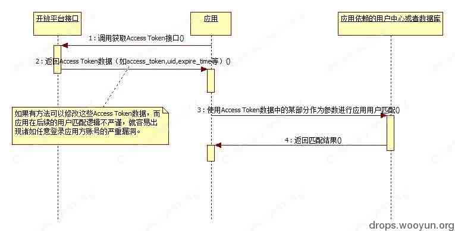
图：攻击 Access token 数据的薄弱点

在 OAuth 1.0 还是 Authorization Code Grant 一统天下的年代，由于主要用于服务器网站应用，这个问题顶多算是潜在问题，毕竟如果要改授权信息，只能操作服务器或者在服务器所在网站 arp——都入侵到那种地步了有啥不可能。不过是世事无绝对，当年已经有开放平台提前实现了 Implicit Grant 场景，然后有网站错误使用了这种模式，通过 javascript 获取里面的 uid/access token，然后再提交给网站直接进行登录；结果由于这些授权信息可以被攻击者轻易地截包修改，造成安全问题——淘网址的漏洞，就是这么来的。

而 OAuth 2.0 在对待手机、平板之类应用的授权的问题上，一般都倾向于返回 access token；然后由应用将 access token 上报给服务器，以进行应用自身的账号认证登录。这种场景的变化导致被篡改的难度大大降低（简单的验证方法是使用 fiddler2 进行截包篡改），但许多手机开发者、乃至手机背后的服务器 api 开发者并没有意识到，结果错误选择了授权信息作为参数（比如单纯选择 uid）、或者没有对授权信息（access token）进行来源验证，从而导致这类漏洞大爆发。

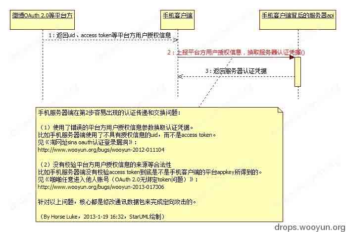
图：手机开发者引入 OAuth 2.0 后，常犯的任意登录到应用方账号严重漏洞成因

解决这类漏洞的关键点主要靠应用方，但平台方也必须要参与：

（1）应用方需要认真考虑在整个自动登录/自动注册的过程中，平台方返回的授权信息（尤其是 access token 和 uid）会否被用户篡改；如果任一个授权信息都会被篡改，那么在服务器中必须再次使用平台方给出的 access token 验证接口，验证该 access token 是否为指定来源应用所颁发，同时使用该 access token 验证接口给出的 uid，而不能使用可能被篡改的原 uid 值。

如果应用方已经收到该漏洞攻击的影响，则需要对对所有已存入的绑定 access_token 进行核查，发现 access_token 中的平台方 uid 和绑定的平台方 uid 不一致、非自身客户端应用 appkey 授权的 access_token、过期 access_token 等异常情况均需要全部撤消，要求这些异常用户重新授权登录。

（2）平台方需要开发 access token 验证接口，接收参数为 access token 等，返回结果应包括颁发的应用来源（一般是 appkey）、uid、过期时间等。同时平台方应针对受影响开发者，发布安全公告和指引，说明易受攻击和使用此接口的场景。

### 针对应用方 csrf 劫持第三方账号

漏洞频率：常见

责任方：应用方（主要）、平台方（如果没有配合应用方的 csrf 防御，则为主要；否则无）

wooyun 案例：

2012-11-10 [WooYun: 优酷网存在账号被劫持风险](http://www.wooyun.org/bugs/wooyun-2012-014571)

2013-01-07 [WooYun: 大麦网存在帐号被劫持风险](http://www.wooyun.org/bugs/wooyun-2013-017051)

2013-03-01 [WooYun: 美丽说 oauth 漏洞可劫持账号](http://www.wooyun.org/bugs/wooyun-2013-019367)

漏洞成因和建议修复方案：

有关应用方 csrf 劫持的问题，不得不提 2012 年 11 月份的一场大讨论。那场讨论的漏洞场景主要是使用 Authorization Code Grant 的应用（网站居多），主要的漏洞原因是 redirect_uri 中的 code 参数没有和当前客户端的状态绑定，攻击者可以通过发送预先获取好的 code 参数到受害者电脑，导致导致受害者当前登录的应用方账号被绑定到攻击者指定的平台方（如微博）帐号上。当时我写了篇文章[《小议 OAuth 2.0 的 state 参数——从开发角度也说《互联网最大规模帐号劫持漏洞即将引爆》》](http://zone.wooyun.org/content/1562)，详细建议用 state 参数防御这种 csrf 攻击，此处不再重复。

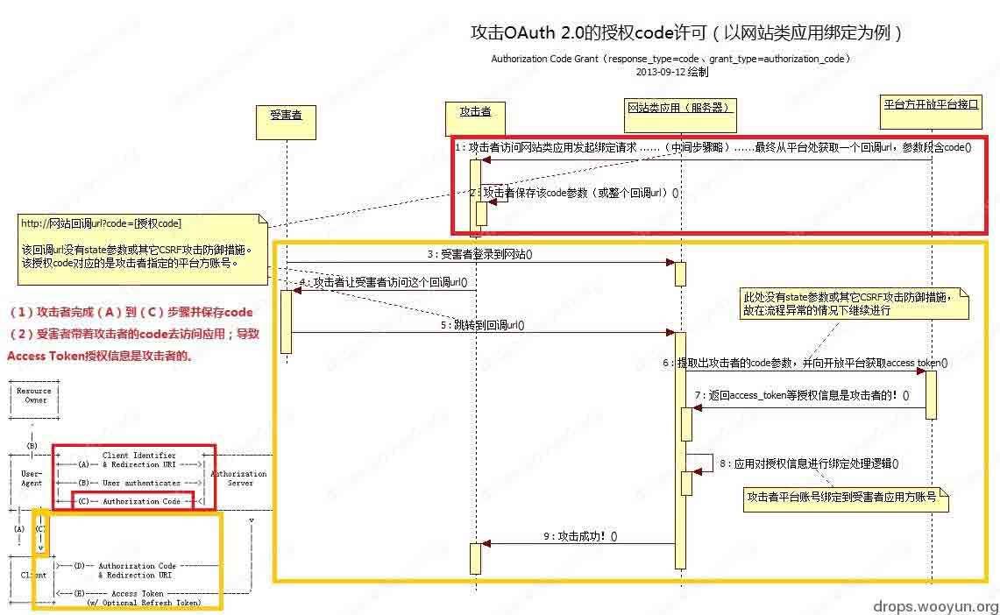
图：针对 code 参数的 Authorization Code Grant 攻击；以及和 rfc6749 的流程图关系

应用方要预防这种 csrf 劫持账号，加入 state 参数是比较简单的通行方法。根据 rfc6749 章节 10.12，该值既不可预测，又必须可以证明应用（client）和和当前第三方网站的登录认证状态存在关联（如果存在过期时间更好）。一种简单的方法是：随机算一个字符串，然后保存在 session，回调时检查 state 参数和 session 里面的值。

而平台方也要在回调时，支持应用方的 state 参数（当然如果允许 redirect_uri 参数中带应用方自己的防 csrf 参数，其实也可以）。

但严格来讲，仅有 state 参数，其实还不够，还需要结合 3.3 提到的防御手段。

### 更猥琐的针对应用方 csrf 劫持第三方账号：应用方授权动作本身的 csrf + 平台方的登录漏洞…...

漏洞频率：常见

责任方：应用方（主要）、平台方（主要？次要？）

wooyun 案例：

暂无

其它案例：

webstersprodigy，2012-5-9，Common OAuth issue you can use to take over accounts：

[`webstersprodigy.net/2013/05/09/common-oauth-issue-you-can-use-to-take-over-accounts/`](http://webstersprodigy.net/2013/05/09/common-oauth-issue-you-can-use-to-take-over-accounts/)

（csrf stackexchange（应用方） + csrf facebook（平台方） = 绕过 state 参数 + 将受害者的 stackexchange 账号绑定到攻击着指定的 facebook 账号）

漏洞成因和建议修复方案：

加入 state 参数是否就意味着没有问题？比如承认，去年我在文章中仅关注仅关注 state 参数确实很片面，甚至是违反了“安全是一个整体”的原则，人为割裂了整个授权过程的整体分析，掩盖了其它问题乃至攻击角度：state 参数确能有效保护授权过程中是当前用户的唯一真实操作，但是发起授权前呢？授权后呢？国外的这个案例给了很好的答案（[该案例在 zone 上有讨论](http://zone.wooyun.org/content/3987)）：

（1）facebook（平台方）存在登录漏洞，可以被 csrf

如果平台方可以被 xss、或者没有 xss 但其登录流程有漏洞可以被 csrf（比如登录表单没有 referer 保护），那么就可以让受害者的电脑登录到攻击者指定的平台方账号。这个的作用是干啥？别急，往下看。

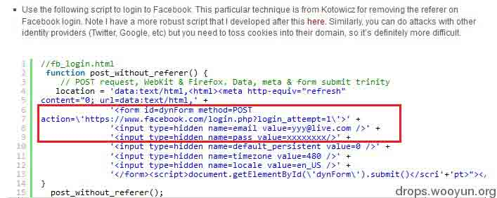
图：webstersprodigy csrf facebook 登录的 poc

（2）stackexchange（应用方）csrf 发起绑定请求

回想一下作为一个普通用户，在应用方（stackexchange）绑定平台方（facebook）账号的过程：用户到 stackexchange 绑定页面，提示未绑定 facebook，此时当然会点击“开始绑定”。那么有没有想过，“开始绑定”这个动作，其实是没有做 csrf 保护的？这正是应用方（包括我自己）长期以来忽视的一个问题——在应用点击发起绑定授权时，并不等于向平台方发起授权请求啊，它必须要做一些逻辑判断（包括生成 state 参数）后才能跳转到平台方的授权页面……

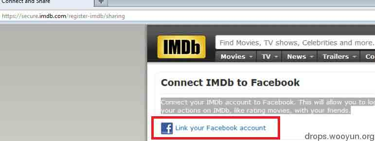
图：webstersprodigy 展示应用方的绑定页面

因此，结合上面提到的 facebook（平台方）可以 csrf 登录，攻击者首先让受害者电脑登录到指定的 facebook 账号，然后再 csrf stackexchange（应用方）绑定请求，那么就可以达到劫持应用方帐号的目的了。而这两点成因，和 state 参数所防御的攻击场景有一定区别，所以完全可以 bypass 掉。

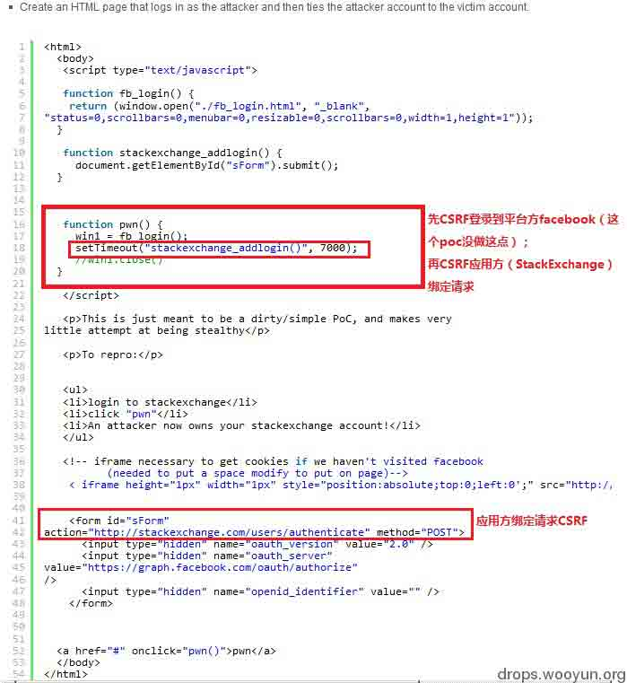

图：webstersprodigy 的 csrf 应用方绑定请求 poc

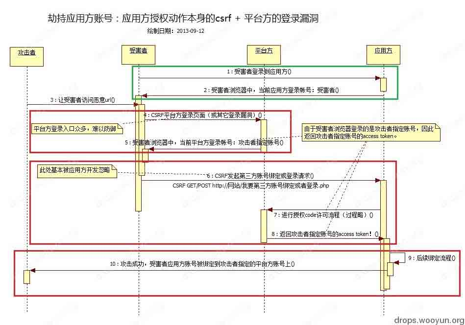
图：webstersprodigy 的完整攻击流程图

[@渥村万涛 当年的评论](http://weibo.com/1921985135/z4wUOvAon)，更能说明有关 csrf 劫持应用方帐号这类问题的本质，只可惜我醒悟得太迟：“其实, 这个漏洞的根本原因, 是违反了 RFC6749, 没有任何 CSRF 保护, 而不是没有使用 state 参数 (state 只是实现 CSRF 保护的一种). 根据 RFC6749[`t.cn/zlTZyo6`](http://t.cn/zlTZyo6)state 是推荐(SHOULD), 而不是必须(MUST). 但 CSRF 保护是 MUST. 没有用 state, 不违反标准, 但没有 CSRF 保护, 则违反”（发表于 2012-11-10 12:50）

而返回到这个漏洞，“安全是一个整体”再一次体现——只有平台方和应用方的共同努力，才可能修补完全。不过各位都懂的，对于这种有多个责任方问题的漏洞，这几乎不可能…...

针对平台方的建议：

（1）检查所有登录页面和登录流程，防止出现登录漏洞。

比如在存在登录入口的页面（尤其是在具有 sso 登录功能的页面上）上，强制进行 referer 和一次性 token 验证，以防止被 csrf 登录。

又比如检查所有登录相关的流程，防止出现漏洞。以下是一些例子：

2013-02-19 [WooYun: 猪八戒网不用账号密码登录任意账号](http://www.wooyun.org/bugs/wooyun-2013-018898)

2013-03-18 [WooYun: 饭统网登录任意账户漏洞](http://www.wooyun.org/bugs/wooyun-2013-020258)

（2）检测会否能够对帐号异地登录有反应并采取措施。

不过如果出现定向攻击，这似乎没啥用。

针对应用方的建议：

（1）做好发起绑定平台方账号（新浪微博、QQ 空间、人人网等等）、解除绑定等等等等诸如此类的绑定相关动作的 csrf 防护。这是整个开发界一直以来忽视的点。

（2）在绑定页面显示绑定的平台方昵称、uid 等信息等，防止用户无法自查绑定信息。

（3）绑定和解绑时，通知用户。

### 账号体系的固有逻辑缺陷利用

漏洞频率：少见

责任方：应用方（主要）

wooyun 案例：

2012-03-14 [WooYun: 5sing.com 借助第三方连接可创建重复昵称账户](http://www.wooyun.org/bugs/wooyun-2012-05257)

漏洞成因和建议修复方案：

实际上这类漏洞和 OAuth 协议（或者说任何一个账号互通登录协议）没有关联，纯粹是应用方设计的帐号体系逻辑存在问题。将其放在这里主要是希望提醒应用方开发者，仔细审查账号设计体系和实现方式，在使用平台方的账号互通时要留意对方帐号体系的不同点（在 OAuth 实现中，则主要体现在应用方账号绑定和注册中的代码逻辑），避免出现重复帐号问题。

## 0x03 攻击平台方的账号和资源体系

* * *

经过 OAuth 1.0 的洗礼，平台方在安全上有了更多的认识，比如强制限定回调地址（较多是验证域名部分）以降低 redirect_uri 跳转的范围，强制 access token 有效期（甚至基本不提供 refresh token 之类的东西）以限制应用方的长时间资源占用和滥用等。但业务场景的多样化，使得攻击者游走在场景之间以点撕面；而平台方则受制于防御成本处处受困（无论是来自自身还是来自应用方）。

### Implicit Grant 场景的无奈（response_type=token）

漏洞频率：常见

责任方：应用方（主要或次要）、平台方（主要或次要）

wooyun 案例：

2012-04-15 [WooYun: 人人网 Oauth 2.0 授权可导致用户 access_token 泄露](http://www.wooyun.org/bugs/wooyun-2012-05804)

2012-08-27 [WooYun: 透过[新浪微博]官方来源调用 API 发表微博.无需 client_sec](http://www.wooyun.org/bugs/wooyun-2012-011314)

2012-09-20 [WooYun: 无需 client_sec 可用 QQ 登录平台发表空间日志等高权限操作（WooYun-2012-11314 衍生）](http://www.wooyun.org/bugs/wooyun-2012-012462)

2012-09-25 [WooYun: QQ 互联开放平台 QQ 登陆 oauth 授权接口可以劫持 access_token](http://www.wooyun.org/bugs/wooyun-2012-012689)

2012-09-25 [WooYun: 百度开放平台 oauth 授权接口可以劫持 access_token](http://www.wooyun.org/bugs/wooyun-2012-012683)

其它案例：

Egor Homakov，How we hacked Facebook with OAuth2 and Chrome bugs，2013-2-19：
[`homakov.blogspot.com/2013/02/hacking-facebook-with-oauth2-and-chrome.html`](http://homakov.blogspot.com/2013/02/hacking-facebook-with-oauth2-and-chrome.html)

（利用 OAuth 2.0 Implicit Grant 特性 + Chrome bug 获取 facebook 的 access token）

漏洞成因和建议修复方案：

有关 Implicit Grant 场景的讨论，可见 2012 年 9 月撰写的 zone 文章[《从 wooyun-2012-11314 小议 OAuth 2.0 认证缺陷》](http://zone.wooyun.org/content/1088)。此处将一些关键点拿出来再讨论。

Implicit Grant 场景的特点是授权验证时只需要 client_id 和 redirect_uri 这两个参数作应用标识，返回的时候也就直接在 uri 片段中返回 access token。这个场景的提出，和客户端（client-side）业务需求有着密不可分的关联，典型例子就是无服务器参与的纯 javascript 交互的浏览器插件、各种网站挂件。在这种业务下，客户端难以保密双 secret（app secret，access token secret）也难以加密，因此干脆将这些限制均进行简化。

但 Implicit Grant 场景也在安全问题上深深地困扰着平台方：

（1）由于缺失了双 secret 的签名，api 仅凭 access token 基本难以分辨应用请求来源

（2）绝大多数开放平台通过 Implicit Grant 方式认证获取的 client-side access token，可用于服务器的 api 通讯中（即权限等同于走 Authorization Code Grant 方式获取到的 server-side access token）

（3）各开放平台由于要实施诸如网站挂件之类的应用，经常会对自己开放平台的中转页面或者跨域文件大开绿灯。也就是说 redirect_uri 会放行两类域名：应用方自己的域名、平台方自己指定的中转域名。

（4）client_id（即应用 appkey）和 redirect_uri 基本属于公开信息。

以上困扰造就一种最常见且棘手的网站安全问题，那就是只要合作方网站（最常见）、平台方网站甚至是浏览器三者之一有任何一个 xss，攻击者无需知道 app secret，就很容易 xss 获取到 access token，然后以此攻击受害者的平台方账号。

另一种困扰则是“当授权用于认证时的不当参数选择或无验证机制”所阐述的，既然 api 分辨不了应用请求来源，那么只要掌握了 A 应用中受害者的 access token，并且在 B 应用中的某些关键请求步骤中替换掉，那么就有可能顺利登录到 B 应用的受害者应用方账号。

第三种则是应用冒充，攻击者只使上述公开参数用就能冒充成其它应用调出授权页面，获取到的 access token 可以用于控制受害者的平台方账号。如果是高权限 client_id，获取到的 access token 显然更有破坏力。

解决这个问题，rfc6749 第 10.16 小节就只是语焉不详的说需要额外的安全措施，这也反映了这种场景的防御难处。从实践来看，有一种方法是必须的：平台方必须对应用方的应用强制进行分类——即应用方在申请 client_id（即应用 appkey）时，需要选择属于哪类应用；平台方再根据分类开放对应权限，并且进行特定的防御和监控措施，以下以手机 sso 登录 sdk 进行分析。

#### Implicit Grant 场景的无奈手机版：手机 SSO 登录 SDK

漏洞频率：常见

责任方：平台方（主要）

wooyun 案例：

2013-03-27 [WooYun: 开放平台单点登录 SSO 方案设计缺陷导致钓鱼风险](http://www.wooyun.org/bugs/wooyun-2013-020790)

其它案例：

@囧虎张建伟，新浪微博 Android 客户端 SSO 授权认证缺陷，2013-09-08：[`www.blogjava.net/zh-weir/archive/2013/09/08/403829.html`](http://www.blogjava.net/zh-weir/archive/2013/09/08/403829.html)

漏洞成因和建议修复方案：

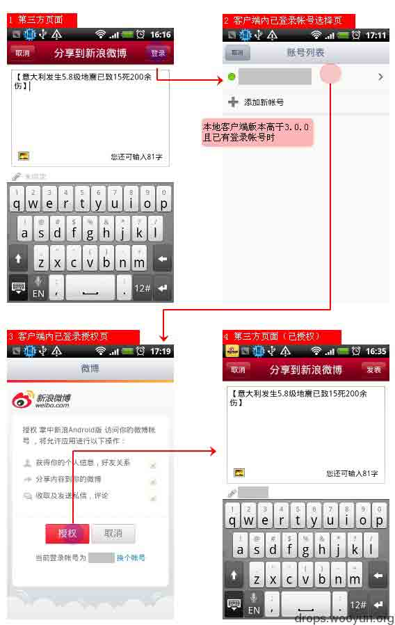
图：新浪微博开放平台开发文档[移动应用 SSO 授权](http://open.weibo.com/wiki/%E7%A7%BB%E5%8A%A8%E5%BA%94%E7%94%A8SSO%E6%8E%88%E6%9D%83)

手机应用 sso 登录 sdk，一般是指应用方使用该 sdk 后，当用户点击授权时，如果如果已经安装了平台方的官方手机应用，就会跳到那里，由该官方应用代为授权，免去重新输入用户名和密码。

如果这其中有 OAuth 参与，就会发现各家的实现方式会有 Implicit Grant 的影子。在早期，应用在初始化 sso sdk 的时候，只需要 client_id（即应用 appkey）和 redirect_uri 即可发起授权请求。而这两个参数基本是公开的；即便再加上 client_secret，在反编译/逆向后拿到手也是易如反掌（后面将阐述）。所以攻击可以进行应用冒充，获取 access token 来控制用户在平台方的账号。

平台方一开始是着重防御授权页面被伪造和重放攻击（这也确实要做的），所以官方手机应用弹出的授权页 url 是有参数签名的，但这防御不了恶意使用 client_id 的问题。后来大家意识到进行手机应用的包名和签名验证，才算比较好的解决了这个问题。不过在这里要提醒，如果 fallback 机制不对（比如没装官方客户端后的授权流程没做好）、或者签名对比机制本身就有漏洞，也可能会被绕过......

### 较大争议的 Xauth 场景（Resource Owner Password Credentials Grant；grant_type=password）

漏洞频率：不常见

责任方：平台方（主要）

wooyun 案例：

2012-11-05 [WooYun: 开心网 android 客户端暴力破解漏洞，测试 2000 帐号，成功 132 个](http://www.wooyun.org/bugs/wooyun-2012-014408)

其它案例：

2013-03-15，CCTV 2013 年 315 晚会中“指控”高德地图低版本“收集新浪微博用户名和密码”（后高德发表声明否认）：[`jingji.cntv.cn/2013/03/15/ARTI1363354929366253.shtml`](http://jingji.cntv.cn/2013/03/15/ARTI1363354929366253.shtml)

漏洞成因和建议修复方案：

这是一个存在较大争议的场景：在谈判桌上，这是体现应用方公司和平台方公司之间的实力角逐；在开发界里，这是提升用户体验和转化率的利好方法；在安全界中，却是有着偷窃隐私和危害用户的后门行为。这个引起开发界和安全界争论不休的东西，叫做 XAuth，叫做 Resource Owner Password Credentials Grant，又或者，叫做直接用平台方用户名和密码获取 access token。

XAuth 常见的目标业务有这两种：（1）内部或自身官方应用的服务调用；（2）应用方的高级合作和深度整合。可以说，XAuth 代表着的高级授权认证，是平台方对应用方最大的信任和合作。

但毕竟 XAuth 是由应用方代为提交用户名和密码到接口，而绕过了平台方本身的授权认证页面，因此从安全来说，在无法确保应用方能力信誉和安全状况的情况下，难以保证用户名和密码不会被泄露。比如如果是网站类应用允许使用 XAuth，按照深度整合的流程，一般都会设计成直接在应用方的网站上弹出代理登录界面；用户输入平台方账号和密码后，通过应用方服务器同步登录到平台方和应用方账号。但这种设计流程，很容易在传输到应用方网站的过程、乃至在应用方服务器上就泄露了账号密码等敏感信息。手机类应用也可类比（参见高德低版本微博登录流程）。

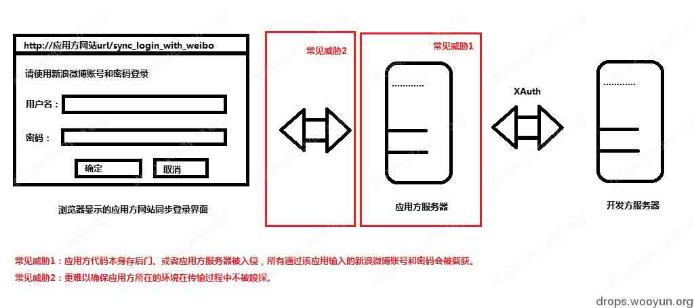
图：常见的 XAuth 威胁

另外一点，由于 XAuth 的高级授权认证，限制通常会放得比较宽，这会导致常规登录的保护流程在 XAuth 接口处失效，那么攻击者就可以实施撞库扫号攻击。

然而完全取消 XAuth 在业务上也并不现实，因此还必须立足在业务上提出切实的解决方法：

（1）对于外部合作方，最大限度取消且不开放 XAuth 的授权。对于因为合同原因而导致无法取消的情况，需要加强监控。不得不说，2013 CCTV 315 晚会可是帮了各大平台方一把，使得在谈判时，更有底气说不开放 XAuth 了。

（2）内部应用一样要划分等级，无必要的应用一律禁止使用 XAuth 和内部接口。对于官方应用也不建议直接使用 XAuth，最好走代理接口，原因就在接下来讨论的问题：高权限 client_id 等应用标识泄露。

### 堵不住的高权限 client_id（appkey）和 client_secret（app secret）泄露

漏洞频率：常见

责任方：平台方（主要）、应用方（次要或主要）

wooyun 案例：

2011-06-01 [WooYun: 金山毒霸微服务 Oauth key 泄露问题](http://www.wooyun.org/bugs/wooyun-2011-02202)

2011-12-02 [WooYun: 新浪微博可能导致用户信息泄露的 BUG](http://www.wooyun.org/bugs/wooyun-2011-03498)

其它案例：

2013-03-08，John Leyden，Leaked: The 'secret OAuth app keys' to Twitter's VIP lounge：[`www.theregister.co.uk/2013/03/08/twitter_oauth_leaked_keys/`](http://www.theregister.co.uk/2013/03/08/twitter_oauth_leaked_keys/)

2013-4-10，Nicolas Seriot（HITBSECCONF2013 - AMSTERDAM），busing Twitters API and OAuth Implementation ：[`conference.hitb.org/hitbsecconf2013ams/materials/D1T2%20-%20Nicolas%20Seriot%20-%20Abusing%20Twitters%20API%20and%20OAuth%20Implementation.pdf`](http://conference.hitb.org/hitbsecconf2013ams/materials/D1T2%20-%20Nicolas%20Seriot%20-%20Abusing%20Twitters%20API%20and%20OAuth%20Implementation.pdf)

（主要讲述反编译/逆向 twitter 官方应用获取 appkey 和 app secret（即 client_id 和 client_secret），然后假冒官方应用使用；最后认为将 OAuth 应用在传统客户端在根本上是错误的）

漏洞成因和建议修复方案：

导致高权限 client_id 和 client_secret 泄露的原因有许多种，比如：

（1）官方或者高级合作伙伴的客户端反编译/逆向。这是许多有关 OAuth 可否使用在客户端（无论是传统桌面客户端还是手机客户端等）的讨论焦点之一。

（2）应用方源代码泄露 client_id 和 client_secret。

由于 Implicit Grant 场景只需要 client_id 和 redirect_uri 就可以造成破坏，因此仅泄露高权限 client_id 的原因也需要考虑在内：

（1）代理接口错误设计。有些 OAuth 代理接口设计成传递 client_id 使用，结果被截获。

（2）高级应用方（高级合作伙伴）使用了开放平台挂件等。

泄露通常会带来资源滥用的后果，常见的有：

（1）应用冒充：比如替换 client_id 和 client_secret，将 android 手机应用装成 iphone 客户端，官方还不能封锁，因为这个 client_id 代表官方应用，封了等于断自己生意；又比如在 Implicit Grant 场景下，只使用 client_id 就能冒充成其它应用，从而控制受害者的平台方账号，此部分前面已经阐述。

（2）非合作数据挖掘：比如爬数据，又比如自动批量私信骚扰等。

（3）非正常的高级接口调用。

缓解 client_id 的泄露以及所带来的资源滥用，以下解决方法可以参考：

（1）应用方正确设计一组代理接口，在不泄露 client_id 和 client_secret 的情况下对 OAuth 进行一层包装。

例子为新浪微博手机客户端，它在后续的版本就不走 OAuth 流程，而是改为访问代理接口，该代理接口的使用过程中也不会传递 client_id 和 client_secret。改造后，既解决了 client_id 和 client_secret 泄漏问题，又可以更好地调整手机型号的判断。

（2）平台方从协议入手阻断批量调用不同 client_id。

例子为腾讯开放平台。由于用户关系是 QQ 的核心，所以腾讯为反关系数据挖掘，对 OAuth 标准进行了一些改动，每个 client_id 获取的用户 openid（用户 QQ 号码转化得到的 ID）均不一样，这样，就能够防止攻击者批量调用不同 client_id 进行数据挖掘和用户骚扰。

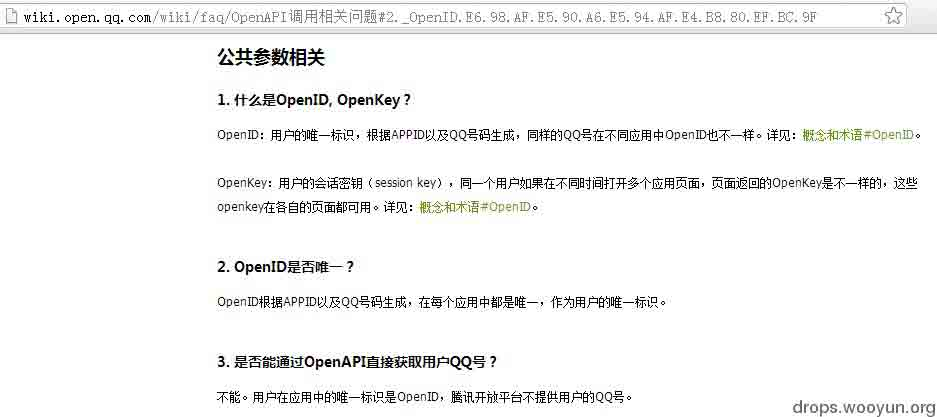

图：腾讯开放平台资料库[OpenAPI 调用相关问题](http://wiki.open.qq.com/wiki/faq/OpenAPI%E8%B0%83%E7%94%A8%E7%9B%B8%E5%85%B3%E9%97%AE%E9%A2%98)

不过要在这里说明的是，实际上无论是[学术研究、商业数据挖掘](http://weibo.com/1497035431/zzFHYzp1N)还是垃圾信息发送者，其实他们根本就不会乖乖走 OAuth，毕竟要滥用资源办法实在是太多了，[众包爬页面](http://weibo.com/1872109493/zEyiQzMuC)、[客户端插入](http://weibo.com/1221479170/zpnqA1lf8)都是方法。因此对平台方来讲，讨论 OAuth 会否导致资源滥用可能并不重要，重要的是讨论使用 OAuth 后能否遏制其它方面的资源滥用——毕竟 OAuth 订立了一种和外界商业合作的态度和框架，那么平台方就可以据此遏制这个框架外的未授权资源滥用。貌似和安全无关，扯远了…...

（3）平台方完善接口权限控制和行为监测，发现异常进行处理和报警。

### 没有考虑全面的协议实现

漏洞频率：不常见

责任方：平台方（主要）

wooyun 案例：

2012-10-30 [WooYun: 腾讯微博开放平台 openid、openkey 截取](http://www.wooyun.org/bugs/wooyun-2012-014070)

2013-04-11 [WooYun: 搜狐微博 OAuth2.0 获取 Authorization Code 过程隐患](http://www.wooyun.org/bugs/wooyun-2013-021598)

漏洞成因和建议修复方案：

这一块主要是因为对场景考虑不周导致的 OAuth 2.0 协议实施不全面。由于本人没有做过平台开发，因此除了建议考虑场景之外，无法给出更具体的分析和建议了。

### 其它杂项

以下内容并非是 OAuth 协议独有（甚至和 OAuth 无关），它只是反映了当前在实现 api 协议的时候共同面临的问题，故归到杂项。

#### api 接口和主业务流的失调

漏洞频率：常见

责任方：平台方（主要）

wooyun 案例：

（与主业务流脱节）

2012-11-24 [WooYun: 绕过腾讯微博运营限制继续发微博](http://www.wooyun.org/bugs/wooyun-2012-015210)

（与主业务流错误整合混用）

2012-03-06 [WooYun: 新浪微博开放平台接口恶意利用漏洞可导致病毒传播](http://www.wooyun.org/bugs/wooyun-2012-05068)

2012-07-20 [WooYun: 新浪微博加关注 CSRF 漏洞（已经泛滥）](http://www.wooyun.org/bugs/wooyun-2012-09949)

2012-11-10 [WooYun: 新浪微博安全漏洞，导致微博帐号被轻易盗用](http://www.wooyun.org/bugs/wooyun-2012-014588)

2013-04-02 [WooYun: 豆瓣 API 2.0 接口 CSRF](http://www.wooyun.org/bugs/wooyun-2013-021135)

漏洞成因和建议修复方案：

业务流失调问题并不是 OAuth 协议独有，所有存在多套业务流（尤其是不同入口均可完成同一任务）的软件开发都容易出现这类 bug（进一步就是漏洞），它反映的是业务划分没有定式的难题。上面的案例就反映出 api 接口和主业务流（一般用在平台方主站点）之间有着太多选择问题：

一方面，api 接口希望保持逻辑独立性，以方便全平台扩展；但如果 api 滞后于主业务流，那么就会出现脱节现象。比如由于开发计划滞后，暂时只在主站限制了实名发微博，但 api 还没上这个策略，那么攻击者就可以直接用 api 绕过这个限制。

另一方面，主业务流也希望将自身集成到 api 接口中，以确保全平台策略一致性；但如果本着“不重复造轮子”，错误整合混用的话，那么就会出现干扰问题。比如主站可以用登录 cookies 当作 access token 直接调用 api 接口，这就容易实施各种 csrf 攻击。

解决业务流失调的关键还是在于业务范围大小范围划分以及服务粒度粗细（还有 api 粒度粗细）范围划分，这都需要平台方内部数个（乃至数十个）业务流相关项目组的共同讨论和配合执行。这个话题非常大，对架构师的要求较高。

#### 攻击 api 接口或者配套系统（传统 web 安全问题）

漏洞频率：常见

责任方：平台方（主要）、应用方（主要）

wooyun 案例：

（平台方 api 接口问题）

2012-10-08 [WooYun: 网易 Oauth 身份验证机制存在 XSS](http://www.wooyun.org/bugs/wooyun-2012-013137)

（平台方 api 接口 + 平台方 sdk 或应用方输出过滤问题）

2012-06-05 [WooYun: ”用 qq 登陆“api 接口 xss](http://www.wooyun.org/bugs/wooyun-2012-07887)

（平台方 api 配套系统问题）

2010-11-08 [WooYun: 人人网某频道 XXS 漏洞](http://www.wooyun.org/bugs/wooyun-2010-0795)

2012-07-08 [WooYun: 腾讯开放平台储存型 xss 漏洞](http://www.wooyun.org/bugs/wooyun-2012-09350)

2013-04-28 [WooYun: 优酷开放平台 存储型 XSS 脚本攻击漏洞 成功劫持后台](http://www.wooyun.org/bugs/wooyun-2013-022673)

漏洞成因和建议修复方案：

由于 OAuth 本质上是 http 服务，故无论是 api 接口本身还是配套系统也会有诸如 xss（经常出现在各种 jssdk 和网站挂件中）、csrf、sql 注射、甚至 ddos 等等的安全威胁。其根源和解决（缓解）方法与传统 web 安全在部分课题上基本一致，但也有一部分也存在差异，见云舒有关 cc 攻击的[研究](http://www.icylife.net/blog/?p=17)和[PPT](http://www.icylife.net/blog/?p=3)。

在这里要特别提醒应用方和做官方 SDK 的平台方开发人员，api 传递回来的数据可能并没有经过过滤，此时仍需要以“输入不可信”的处理方法进行过滤。

#### 不能释怀的浏览器控件（如 WebView）

漏洞频率：常见

责任方：平台方（主要？次要？）、应用方（主要？次要？）

wooyun 案例：

2013-03-18 [WooYun: 微信存非法记录其他网站账号密码行为](http://www.wooyun.org/bugs/wooyun-2013-020246)

（注意：该案例仅是 webview 自带的自动记录功能，claudxiao 进行了分析和说明： [`blog.claudxiao.net/2013/03/android-webview-cache/`](http://blog.claudxiao.net/2013/03/android-webview-cache/)

其它案例：

淘宝开放平台，无线开放平台开发要求“无线类应用授权必须走浏览器模式而非 webview 模式”，2013-9-12 访问和验证：[`open.taobao.com/doc/detail.htm?spm=0.0.0.0.L44DxW&id=972`](http://open.taobao.com/doc/detail.htm?spm=0.0.0.0.L44DxW&id=972)

漏洞成因和建议修复方案：

手机开发中，浏览器控件一般用于在应用内嵌入网页，以进行应用和网站之间的 html5 混合交互和提升用户体验。android 和 ios 上一般指[基于 webkit 引擎的 WebView 组件](http://developer.android.com/reference/android/webkit/WebView.html)Windows Phone 则有[基于 IE 的 WebBrowser 控件](http://developer.nokia.com/Community/Wiki/Windows_Phone%E4%B8%AD%E7%9A%84WebBrowser%E6%8E%A7%E4%BB%B6)（以下内容未对 WP 实证）。

有一些用户无法信任应用使用浏览器控件打开 OAuth 授权认证登录页面，其主要原因有：

（1）[无法看到打开的 url，容易被钓鱼](http://www.icylife.net/blog/?p=7)。

（2）[浏览器控件可被注入应用的恶意 js 代码](http://www.eoeandroid.com/thread-194776-1-1.html)，导致账号被泄露等。

当然，最近大热的[WebView 接口编码不当导致任意代码执行](http://drops.wooyun.org/papers/548)也不是不可能存在，不过从该问题的历史讨论来讲，这个并不是主要担忧原因。

要让用户信任浏览器控件内的应用授权页面，当前主要实践模式都是平台方开发交互性更加便捷的官方手机应用 SDK（比如手机 SSO SDK 等），并在提交应用审查时要求使用官方 SDK 或者遵守相关开发要求。目前在国内最严格的是淘宝开放平台，在无线开放平台开发要求明确要求“无线类应用授权必须走浏览器模式而非 webview 模式（具体实现可以参看两种无线 sdk 下载包中的文档）”，当然在前期这个举措，使得淘宝有着较大压力和遇到碎片化难题（讨论见[1](http://weibo.com/1679264133/yy3zWnuhY)、[2](http://weibo.com/1679264133/yvlREtza1)、[3](http://weibo.com/1973168857/yBhJCeNNb)）。

除了 SDK 和开发要求外，平台方还有一个问题，那就是授权页面本身如何防止浏览器控件和浏览器自动记录功能（无论在手机还是 PC）。这个时候，[autocomplete=off 就要派上用场了](https://developer.mozilla.org/en-US/docs/Mozilla/How_to_Turn_Off_Form_Autocompletion)。

#### 来自 https 的烦恼

漏洞频率：常见

责任方：平台方（主要？次要？）

wooyun 案例：

无

其它案例：

《Why Eve and Mallory Love Android: An Analysis of Android SSL (In)Security》中文简翻（附原文）：[`zone.wooyun.org/content/1396`](http://zone.wooyun.org/content/1396)

漏洞成因和建议修复方案：

由于 https 比 tls 更加众所周知，所以此处用 https 这个词了。OAuth 2.0 将安全性基本押宝在传输层加密上，所以 https 的安全问题也会影响到 OAuth 2.0（或者其它协议）安全，但具体分析这个问题也是烦恼不断。

一方面，https 在网络不稳定的情况下容易出现超时。在 2012 年 3 月份@quaful 给了一个[血泪教训](http://weibo.com/1796149773/yv337v6TZ)：“在手机上使用 https 协议要慎重。在北上广深以外的中国广大城市，有 20%~25% 的用户都会遇到 https 连接困难。排查发现问题和接入点无关，信号和网络不稳定导致 https 请求很难完成。”。

另一方面，即使使用了 https，由于绝大部分应用的代码不会去检查证书，这就导致一旦遇到 arp 和中间人攻击，基本 game over。

所以在这个问题上各平台方和应用方的解决平衡之道可谓是五花八门（比如其中一种是让重要接口和流程走 https，而其它还是走回类似 OAuth 1.0 形式的 http+请求参数签名），虽然从理论上，让任何 OAuth 2.0 流程都不走 https 的方法，都有违反协议所订立的安全前提嫌疑。

而对于一些重要接口的应用开发，在使用 https 的时候还是建议开启检查证书的代码（最好进行证书锁定），不过带来的问题是不好调试，此时就是各开发者进行 debug log 能力大比拼了。

### 0x04 附录：那些在 OAuth 1.0 年代的安全案例

以下错误不代表 OAuth 2.0 没有，只是说大家吸取教训，已经开始少见。

（1）平台方授权页面的 csrf

2012-02-15 [WooYun: CSRF 导致微博应用自动授权](http://www.wooyun.org/bugs/wooyun-2012-04537)

2012-07-20 [WooYun: 第三方 APP 强制新浪用户 OAUTH 授权漏洞](http://www.wooyun.org/bugs/wooyun-2012-09952)

2012-12-03 [WooYun: 网易开放平台第三方应用 oauth 强制用户授权漏洞](http://www.wooyun.org/bugs/wooyun-2012-015550)

（2）OAuth 1.0 session fixation

攻击根源：回调 url 参数 oauth_callback 可被攻击者控制，导致任意跳转。

攻击过程：

（A）攻击者从应用方预先获取带 REQUEST TOKEN 参数的授权认证页面 url，但并不跳转，而是记录下原来的 oauth_callback 参数，并将其替换成攻击者的 url。

（B）受害者访问该恶意构造的授权认证页面 url 后，使用自己的平台方账号进行授权。完毕后平台方根据 oauth_callback，连同 REQUEST TOKEN 等参数，指示受害者浏览器跳转到攻击者的 url。

（C）攻击者打时间差，抢先访问原来的 oauth_callback 参数，至此成功登录到受害者的应用方账号上。整个过程不需要知道 APP SECRET 和 REQUEST TOKEN SECRET，也可以 bypass 应用方的 csrf 防御。

防御方法：

后续规范 OAuth1.0a 和 RFC 5849 中，明确规定 oauth_callback 参数需要加入生成 REQUEST TOKEN 的签名中；并且平台方在返回回调 url 时，带上不可预测的 oauth_verifier 参数。相关详细资料请参考：[`sakinijino.com/archives/1208`](http://sakinijino.com/archives/1208)

和 OAuth 2.0 的比较：

由于 OAuth 2.0 没有签名，故平台方的开放平台应用管理界面上，有“绑定域名”或者“回调 url”设置选项，不符合这些设置的会在授权页面上报错（比如 invalid_redirect_uri）；oauth_verifier 参数则被 code 参数取代。

案例：

2010-11-03 [WooYun: Sina 微博 OAuth 提供者存在 session fixation attack 漏洞](http://www.wooyun.org/bugs/wooyun-2010-0781)

2011-02-18 [WooYun: 新浪微博应用 URL 跳转](http://www.wooyun.org/bugs/wooyun-2011-01342)

2011-04-29 [WooYun: 街旁网第三方登录劫持漏洞](http://www.wooyun.org/bugs/wooyun-2011-02010)

2013-07-01 [WooYun: 图虫网第三方认证缺陷导致可以劫持帐号](http://www.wooyun.org/bugs/wooyun-2013-027320)

2013-07-23 [WooYun: 团 800oauth 缺陷可能导用户帐号被劫持](http://www.wooyun.org/bugs/wooyun-2013-031954)

（3）没有考虑全面的协议实现之 OAuth 1.0 版

2012-12-02 [WooYun: 139 邮箱 OAuth 1.0 标准协议设计缺陷](http://www.wooyun.org/bugs/wooyun-2012-015524)

2012-12-04 [WooYun: 天涯开放平台第三方应用 oauth 冒名授权漏洞](http://www.wooyun.org/bugs/wooyun-2012-015625)

## 0x05 附录：致谢和部分参考文章列表

* * *

该文章的编写基于各类文献资料和漏洞案例，在此向所有作者和白帽子致谢。

有一部分 OAuth 相关的文章并没纳入本文中，如有需要，请[点击此处](http://www.iirr.info/blog/?p=1075)参阅清单。

作者已经做成 pdf 供各位方便下载保存：[20130914_pdf_pub_OAuth-2.0_security_case_review.pdf](http://static.wooyun.org/20141017/2014101712092813188.pdf)

版权声明：未经授权禁止转载 [horseluke](http://drops.wooyun.org/author/horseluke "由 horseluke 发布")@[乌云知识库](http://drops.wooyun.org)

分享到：

### 相关日志

*   [OAuth 安全指南](http://drops.wooyun.org/papers/1989)
*   [深夜调试某浏览器堆损坏的小记录](http://drops.wooyun.org/papers/1026)
*   [攻击 JavaWeb 应用[6]-程序架构与代码审计](http://drops.wooyun.org/tips/429)
*   [Short XSS](http://drops.wooyun.org/papers/512)
*   [Drupal – pre Auth SQL Injection Vulnerability](http://drops.wooyun.org/papers/3197)
*   [攻击 JavaWeb 应用[4]-SQL 注入[2]](http://drops.wooyun.org/tips/288)