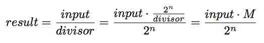
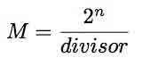
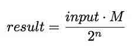
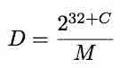
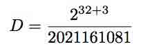
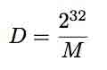

# 逆向基础（五）

2014/05/29 17:16 | [Reverse Engineering](http://drops.wooyun.org/author/reverse-engineering "由 Reverse Engineering 发布") | [二进制安全](http://drops.wooyun.org/category/binary "查看 二进制安全 中的全部文章"), [技术分享](http://drops.wooyun.org/category/tips "查看 技术分享 中的全部文章") | 占个座先 | 捐赠作者

## Chapter 14

* * *

## Division by 9

下面是一个非常简单的函数

```
int f(int a)
{
    return a/9;
};

```

## 14.1 x86

以一种十分容易预测的方式编译的

```
_a$ = 8             ; size = 4
_f   PROC
    push    ebp
    mov     ebp, esp
    mov     eax, DWORD PTR _a$[ebp]
    cdq             ; sign extend EAX to EDX:EAX
    mov     ecx, 9
    idiv    ecx
    pop     ebp
    ret     0
_f  ENDP

```

IDIV 有符号数除法指令 64 位的被除数分存在两个寄存器 EDX:EAX,除数放在单个寄存器 ECX 中。运算结束后，商放在 EAX，余数放在 EDX。f（）函数的返回值将包含在 eax 寄存器中，也就是说，在进行除法运算之后，值不会再放到其他位置，它已经在合适的地方了。正因为 IDIV 指令要求被除数分存在 EDX：EAX 里，所以需要在做除法前用 CDQ 指令将 EAX 中的值扩展成 64 位有符号数，就像 MOVSX 指令(13.1.1)所做的一样。如果我们切换到优化模式（/0x），我们会得到

清单 14.2:MSVC 优化模式

```
_a$ = 8                         ; size = 4
_f   PROC

    mov     ecx, DWORD PTR _a$[esp-4]
    mov     eax, 954437177      ; 38e38e39H
    imul    ecx
    sar     edx, 1
    mov     eax, edx
    shr     eax, 31             ; 0000001fH
    add     eax, edx
    ret     0
_f   ENDP

```

这里将除法优化为乘法。乘法运算要快得多。使用这种技巧可以得到更高效的代码。

在编译器优化中，这也称为“strength reduction”

GCC4.4.1 甚至在没有打开优化模式的情况下生成了和在 MSVC 下打开优化模式的生成的几乎一样的代码。

清单 14.3 GCC 4.4.1 非优化模式

```
        public f
f       procnear
arg_0   = dword ptr 8

        push    ebp
        mov     ebp, esp
        mov     ecx, [ebp+arg_0]
        mov     edx, 954437177 ; 38E38E39h
        mov     eax, ecx
        imul    edx
        sar     edx, 1
        mov     eax, ecx
        sar     eax, 1Fh
        mov     ecx, edx
        sub     ecx, eax
        mov     eax, ecx
        pop     ebp
        retn
f       endp

```

## 14.2 ARM

ARM 处理器，就像其他的“纯”RISC 处理器一样，缺少除法指令，缺少 32 位常数乘法的单条指令。利用一个技巧，通过加法，减法，移位是可以实现除法的。
这里有一个 32 位数被 10（20，3.3 常量除法）除的例子，输出商和余数。

```
; takes argument in a1
; returns quotient in a1, remainder in a2
; cycles could be saved if only divide or remainder is required
    SUB     a2, a1, #10         ; keep (x-10) for later
    SUB     a1, a1, a1, lsr #2
    ADD     a1, a1, a1, lsr #4
    ADD     a1, a1, a1, lsr #8
    ADD     a1, a1, a1, lsr #16
    MOV     a1, a1, lsr #3
    ADD     a3, a1, a1, asl #2
    SUBS    a2, a2, a3, asl #1  ; calc (x-10) - (x/10)*10
    ADDPL   a1, a1, #1          ; fix-up quotient
    ADDMI   a2, a2, #10         ; fix-up remainder
    MOV     pc, lr

```

### 14.2.1 Xcode 优化模式（LLVM）+ARM 模式

```
__text:00002C58 39 1E 08 E3 E3 18 43 E3     MOV     R1, 0x38E38E39
__text:00002C60 10 F1 50 E7                 SMMUL   R0, R0, R1
__text:00002C64 C0 10 A0 E1                 MOV     R1, R0,ASR#1
__text:00002C68 A0 0F 81 E0                 ADD     R0, R1, R0,LSR#31
__text:00002C6C 1E FF 2F E1                 BX      LR

```

运行原理

这里的代码和优化模式的 MSVC 和 GCC 生成的基本相同。显然，LLVM 在产生常量上使用相同的算法。

善于观察的读者可能会问，MOV 指令是如何将 32 位数值写入寄存器中的，因为这在 ARM 模式下是不可能的。实际上是可能的，但是，就像我们看到的，与标准指令每条有四个字节不同的是，这里的每条指令有 8 个字节，其实这是两条指令。第一条指令将值 0x8E39 装入寄存器的低十六位，第二条指令是 MOVT,它将 0x383E 装入寄存器的高 16 位。IDA 知道这些顺序，并且为了精简紧凑，将它精简转换成一条伪代码。

SMMUL (Signed Most Significant Word Multiply)实现两个 32 位有符号数的乘法，并且将高 32 位的部分放在 r0 中，弃掉结果的低 32 位部分。

```
“MOV R1,R0,ASR#1“指令算数右移一位。
“ADD R0,R1,LSR#31” R0=R1+R0>>32 
```

事实上，在 ARM 模式下，并没有单独的移位指令。相反，像（MOV,ADD,SUB,RSB）3 这样的数据处理指令，第二个操作数需要被移位。ASR 表示算数右移，LSR 表示逻辑右移。

### 14.2.2 优化 Xcode(LLVM)+thumb-2 模式

```
MOV         R1, 0x38E38E39
SMMUL.W     R0, R0, R1
ASRS        R1, R0, #1
ADD.W       R0, R1, R0,LSR#31
BX          LR

```

在 thumb 模式下有些单独的移位指令，这个例子中使用了 ASRS（算数右移）

### 14.2.3 Xcode 非优化模式（LLVM） keil 模式

非优化模式 LLVM 不生成我们之前看到的那样的代码，它插入了一个调用库函数的`call __divsi3`

关于 keil：通常插入一个调用库函数的`call __aeabi_idivmod`

## 14.3 工作原理

下面展示的是怎样用乘法来优化除法，其中借助了 2^n 的阶乘



M 是一个 magic 系数

M 的计算过程



因此这些代码片段通常具有这样的形式



n 可以是任意数，可能是 32（那么这样运算结果的高位部分从 EX 或者 RDX 寄存器中获取），可能是 31（这种情况下乘法结果的高位部分结果右移）

n 的选取是为了减少错误。

当进行有符号数除法运算，乘法结果的符号也会被放到输出结果中。

下面来看看不同之处。

```
int f3_32_signed(int a)
{
    return a/3;
};
unsigned int f3_32_unsigned(unsigned int a)
{
    return a/3;
};

```

在无符号版本的函数中，magic 系数是 0xAAAAAAAB，乘法结果被 2³*3 除。

在有符号版本的函数中，magic 系数是 0x55555556，乘法结果被 2³² 除。

符号来自于乘法结果：高 32 位的结果右移 31 位（将符号位放在 EAX 中最不重要的位置）。如果最后结果为负，则会设置为 1。

清单 14.4：MSVC 2012/OX

```
_f3_32_unsigned     PROC
        mov     eax, -1431655765        ; aaaaaaabH
        mul     DWORD PTR _a$[esp-4]    ; unsigned multiply
        shr     edx, 1
        mov     eax, edx
        ret     0
_f3_32_unsigned ENDP

_f3_32_signed PROC
        mov     eax, 1431655766         ; 55555556H
        imul    DWORD PTR _a$[esp-4]    ; signed multiply
        mov     eax, edx
        shr     eax, 31                 ; 0000001fH
        add     eax, edx                ; add 1 if sign is negative
        ret     0
_f3_32_signed ENDP

```

## 14.4 得到除数

### 14.4.1 变形＃1

通常，代码具有这样一种形式

```
mov     eax, MAGICAL CONSTANT
imul    input value
sar     edx, SHIFTING COEFFICIENT ; signed division by 2^x using arithmetic shift right
mov     eax, edx
shr     eax, 31
add     eax, edx

```

我们将 32 位的 magic 系数表示为 M，移位表示为 C，除数表示为 D

我们得到的除法是



举个例子

清单 14.5：优化模式 MSVC2012

```
mov     eax, 2021161081     ; 78787879H
imul    DWORD PTR _a$[esp-4]
sar     edx, 3
mov     eax, edx
shr     eax, 31             ; 0000001fH
add     eax, edx

```

即



比 32 位的数字大，为了方便，于是我们使用用 Wolfram Mathematica 软件。

```
In[1]:=N[2^(32+3)/2021161081]
Out[1]:=17. 
```

因此例子中的代码得到结果是 17。

对于 64 位除法来说，原理是一样的，但是应该使用 2⁶⁴ 来代替 2³²。

```
uint64_t f1234(uint64_t a)
{
    return a/1234;
};

```

清单 14.7：MSVC2012/Ox

```
f1234   PROC
        mov     rax, 7653754429286296943 ; 6a37991a23aead6fH
        mul     rcx
        shr     rdx, 9
        mov     rax, rdx
        ret     0
f1234   ENDP

```

清单 14.8：Wolfram Mathematica

```
In[1]:=N[2^(64+9)/16^⁶a37991a23aead6f]
Out[1]:=1234. 
```

### 14.4.2 变形＃2

忽略算数移位的变形也是存在的

```
mov     eax, 55555556h ; 1431655766
imul    ecx
mov     eax, edx
shr     eax, 1Fh

```

更加简洁



在这个例子中


再用一次 Wolfram Mathematica

```
In[1]:=N[2³²/16^⁵⁵⁵⁵⁵⁵⁵⁶]
Out[1]:=3. 
```

得到的除数是 3

## chapter 15

* * *

## 用 FPU 工作

FPU－－是一个主 cpu 被设计用来处理浮点数的设备。

过去它被称为协处理器，放在 CPU 旁边，看起来像可编程的计算器，在学习 FPU 之前学习堆栈机或 forth 语言是值得的。

有趣的是，在过去（80486cpu 之前），协处理器是一个单独的芯片，并不总是安装在母版上，单独购买和安装也是可以的。

但从 80486 DX CPU 开始,FPU 就被安装在里面了。

FWAIT 指令可能提醒我们一个事实－－它将 CPU 转换成等待模式，因此它可以一直等待直到 FPU 完成工作。另外一点是 FPU 指令操作码从所谓的 escape 操作码（D8..DF）开始，进入了 FPU。

FPU 有可以容纳 8 个 80 字节的寄存器栈容量，每一个寄存器可以存储一个 IEEE 754 格式的数字。

C/C++语言提供至少两种浮点数类型，float（单精度，32 位），double 类型（双精度，64 位）。

GCC 也支持多精度类型（扩展精度，80 位），但是 MSVC 不支持。

在 32 位环境中，浮点数要求和 int 类型的位数相同，但是数值的表示法完全不同。

数值包括符号位，尾数（也叫做分数）和指数。

参数列表中有 float 和 double 类型的函数通过栈来获得值，如果函数返回 float 或者 double 类型的值，那么返回值将放在 ST(0)寄存器中－－在 FPU 的栈顶。

## 15.1 简单实例

下面我们来研究一个简单的例子

```
double f (double a, double b)
{
    return a/3.14 + b*4.1;
}

```

### 15.1.1 x86

在 msvc2010 中编译

```
CONST SEGMENT
__real@4010666666666666 DQ 04010666666666666r   ; 4.1
CONST ENDS
CONST SEGMENT
__real@40091eb851eb851f DQ 040091eb851eb851fr   ; 3.14
CONST ENDS
_TEXT SEGMENT
_a$ = 8         ; size = 8
_b$ = 16        ; size = 8
_f  PROC
    push    ebp
    mov     ebp, esp
    fld     QWORD PTR _a$[ebp]

; current stack state: ST(0) = _a

    fdiv    QWORD PTR __real@40091eb851eb851f

; current stack state: ST(0) = result of _a divided by 3.13

    fld     QWORD PTR _b$[ebp]

; current stack state: ST(0) = _b; ST(1) = result of _a divided by 3.13

    fmul    QWORD PTR __real@4010666666666666

; current stack state: ST(0) = result of _b * 4.1; ST(1) = result of _a divided by 3.13

    faddp   ST(1), ST(0)

; current stack state: ST(0) = result of addition

    pop     ebp
    ret     0
_f ENDP

```

FLD 从栈中取 8 个字节并将这个数字放入 ST(0)寄存器中，自动将它转换成内部 80 位格式的扩展操作数。

FDIV 除存储在 ST(0)中地址指向的数值 __real@40091eb851eb851f —3.14 就放在那里。

汇编语法丢失浮点数，因此，我们这里看到的是 64 位 IEEE754 编码的 16 进制表示的 3.14。

执行 FDIV 执行后，ST(0)将保存除法的结果。

另外，这里也有 FDIVP 指令，用 ST(0)除 ST(1)，从栈中将将这些值抛出来，然后将结果压栈。如果你懂 forth 语言，你会很快意识到这是堆栈机。

FLD 指令将 b 的值压入栈中之后，商放入 ST(1)寄存器中，ST(0)中保存 b 的值。

接下来 FMUL 指令将来自 ST(0)的 b 值和在 __real@4010666666666666 (4.1 的值在那里)相乘，然后将结果放入 ST（0）中。

最后，FADDP 指令将栈顶的两个值相加，将结果存储在 ST(1)寄存器中，然后从 ST（1）中弹出，再放入 ST(0)中。

这个函数必须返回 ST(0)寄存器中的值，因此，在执行 FADDP 命令后，没有其他额外的的指令了需要执行了。

GCC 4.4.1（选项 03）生成基本同样的代码，有小小的不同之处。

不同之处在于，首先，3.14 被压入栈中（进入 ST(0)）,然后 arg_0 的值除以 ST(0)寄存器中的值

FDIVR 意味着逆向除法 被除数和除数交换。

因为乘法两个乘数可交换，所以没有这样的指令，我们只有 FMUL 而没有逆乘。

FADDP 也是将两个值相加，其中一个来自栈。然后 ST(0)保存它们的和。

这段反编译代码的碎片是由 IDA 产生的，ST(0)简称为 ST。

### 15.1.2 ARM: Xcode 优化模式(LLVM)+ARM 模式

直到 ARM 有标准化的浮点数支持后，几家处理器厂商才将其加入到他们自己指令扩展中。然后，VFP（向量浮点运算单元）标准化了。

与 x86 相比，一个重要的不同是，在 x86 中使用 fpu 栈工作，而在 ARM 中，这里没有栈，你只能使用寄存器。

```
f
        VLDR        D16, =3.14
        VMOV        D17, R0, R1 ; load a
        VMOV        D18, R2, R3 ; load b
        VDIV.F64    D16, D17, D16 ; a/3.14
        VLDR        D17, =4.1
        VMUL.F64    D17, D18, D17 ; b*4.1
        VADD.F64    D16, D17, D16 ; +
        VMOV        R0, R1, D16
        BX          LR
dbl_2C98    DCFD 3.14 ; DATA XREF: f
dbl_2CA0    DCFD 4.1 ; DATA XREF: f+10

```

可以看到，这里我们使用了新的寄存器，并以 D 开头。这些是 64 位寄存器，有 32 个，他们既可以用作浮点数(double)运算也可以用作 SIMD(在 ARM 中称为 NEON)。

它们同时也可以作为 32 个 32 位的 S 寄存器使用，它们被用于单精度操作浮点数（float）运算。

记住它们很容易：D 系列寄存器用于双精度数字，S 寄存器用于单精度数字，记住 Double 和 Single 的首字母就可以了。

两个常量（3.14 和 4.1）都是以 IEEE 754 的形式存储在内存中。

VLDR 和 VMOV 指令，容易推断，类似 LDR 和 MOV 指令，但是它们使用 D 系列寄存器，需要注意的就是这些指令不就之后也会展现出，就像 D 系列寄存器一样，不仅可以进行浮点数运算而且也可以用于 SIMD(NEON)运算，参数传递的方式仍旧是通过 R 系列寄存器传递，但是每个具有双精度的数值有 64 位，所以为了便于传递需要两个寄存器。

```
“VMOV D17,R0,R1”在最开始，将两个来自 R0 和 R1 的 32 位的值组成一个 64 位的值并且将它保存在 D17 中。
“VMOV R0,R1,D16”是一个逆操作，D16 中的值放回 R0,R1 中。 
```

VDIV,VMUL,VADD 都是用于浮点数的处理计算的指令，分别为除法指令，乘法指令，加法指令。

thumb-2 的代码也是相同的。

### 15.1.3 ARM:优化 keil＋thumb 模式

```
f
            PUSH    {R3-R7,LR}
            MOVS    R7, R2
            MOVS    R4, R3
            MOVS    R5, R0
            MOVS    R6, R1
            LDR     R2, =0x66666666
            LDR     R3, =0x40106666
            MOVS    R0, R7
            MOVS    R1, R4
            BL      __aeabi_dmul
            MOVS    R7, R0
            MOVS    R4, R1
            LDR     R2, =0x51EB851F
            LDR     R3, =0x40091EB8
            MOVS    R0, R5
            MOVS    R1, R6
            BL      __aeabi_ddiv
            MOVS    R2, R7
            MOVS    R3, R4
            BL      __aeabi_dadd
            POP     {R3-R7,PC}
dword_364   DCD 0x66666666          ; DATA XREF: f+A
dword_368   DCD 0x40106666          ; DATA XREF: f+C
dword_36C   DCD 0x51EB851F          ; DATA XREF: f+1A
dword_370   DCD 0x40091EB8          ; DATA XREF: f+1C

```

keil 为处理器生成的代码不支持 FPU 和 NEON。因此，双精度浮点数通过通用 R 寄存器来传递双精度数字，与 FPU 指令不同的是，通过对库函数调用（如 __aeabi_dmul, __aeabi_ddiv, __aeabi_dadd）用来实现乘法，除法，浮点数加法。当然，这比 FPU 协处理器慢，但总比没有强。

另外，在 x86 的世界中，当协处理器少而贵并且只安装昂贵的计算机上时，在 FPU 模拟库非常受欢迎。

在 ARM 的世界中，FPU 处理器模拟称为 soft float 或者 armel，用协处理器的 FPU 指令的称为 hard float 和 armhf。

举个例子，树莓派的 linux 内核用两种变量编译。如果是 soft float，参数就会通过 R 系列寄存器编码，hard float 则会通过 D 系列寄存器。

这就是不让你使用例子中来自 armel 编码的 armhf 库原因，反之亦然。那也是 linux 分区必须根据调用惯例编译的原因。

## 15.2 通过参数通过浮点数

```
#include <math.h>
#include <stdio.h>
int main ()
{
    printf ("32.01 ^ 1.54 = %lf
", pow (32.01,1.54));
    return 0;
}

```

### 15.2.1 x86

让我们来看看在（msvc2010）中得到的东西

清单 15.3 ：MSVC 2010

```
CONST   SEGMENT
__real@40400147ae147ae1 DQ 040400147ae147ae1r   ; 32.01
__real@3ff8a3d70a3d70a4 DQ 03ff8a3d70a3d70a4r   ; 1.54
CONST ENDS

_main     PROC
        push    ebp
        mov     ebp, esp
        sub     esp, 8 ; allocate place for the first variable
        fld     QWORD PTR __real@3ff8a3d70a3d70a4
        fstp    QWORD PTR [esp]
        sub     esp, 8 ; allocate place for the second variable
        fld     QWORD PTR __real@40400147ae147ae1
        fstp    QWORD PTR [esp]
        call    _pow
        add     esp, 8 ; "return back" place of one variable.

; in local stack here 8 bytes still reserved for us.
; result now in ST(0)

        fstp    QWORD PTR [esp] ; move result from ST(0) to local stack for printf()
        push    OFFSET $SG2651
        call    _printf
        add     esp, 12
        xor     eax, eax
        pop     ebp
        ret     0
_main       ENDP

```

FLD 和 FSTP 读取 FPU 的栈中的变量。pow（）从 FPU 栈中拿出两个值然后将结果返回到 ST(0)寄存器中。printf（）函数从本地栈中取出 8 字节并且将他们翻译为双精度变量。

### 15.2.2 ARM+Non-optimizing Xcode（LLVM）+thumb-2 模式

```
_main
var_C       = -0xC
            PUSH    {R7,LR}
            MOV     R7, SP
            SUB     SP, SP, #4
            VLDR    D16, =32.01
            VMOV    R0, R1, D16
            VLDR    D16, =1.54
            VMOV    R2, R3, D16
            BLX     _pow
            VMOV    D16, R0, R1
            MOV     R0, 0xFC1 ; "32.01 ^ 1.54 = %lf
"
            ADD     R0, PC
            VMOV    R1, R2, D16
            BLX     _printf
            MOVS    R1, 0
            STR     R0, [SP,#0xC+var_C]
            MOV     R0, R1
            ADD     SP, SP, #4
            POP     {R7,PC}
dbl_2F90    DCFD 32.01      ; DATA XREF: _main+6
dbl_2F98    DCFD 1.54       ; DATA XREF: _main+E

```

就像我以前写的一样，64 位的浮点数是成对传递给 R 系列寄存器的。这样的代码是冗陈的（当然是因为优化选项关掉了），因为，事实上直接从 R 系列寄存器传递值，不借助 D 系列寄存器是可能的。

因此我们可以看到，_pow 将第一个参数放入 R0 和 R1 中，第二个参数放入 R2 和 R3 中。函数结果放入 R0 和 R1 中。_pwn 的结果先放入了 D16 中，然后再放入 R1 和 R2 中，然后 printf 函数将取走这个值。

### 15.2.3 ARM+非优化模式 keil＋ARM 模式

```
_main
                STMFD   SP!, {R4-R6,LR}
                LDR     R2, =0xA3D70A4 ; y
                LDR     R3, =0x3FF8A3D7
                LDR     R0, =0xAE147AE1 ; x
                LDR     R1, =0x40400147
                BL      pow
                MOV     R4, R0
                MOV     R2, R4
                MOV     R3, R1
                ADR     R0, a32_011_54Lf ; "32.01 ^ 1.54 = %lf
"
                BL      __2printf
                MOV     R0, #0
                LDMFD   SP!, {R4-R6,PC}

y               DCD 0xA3D70A4       ; DATA XREF: _main+4
dword_520       DCD 0x3FF8A3D7      ; DATA XREF: _main+8
; double x
x               DCD 0xAE147AE1      ; DATA XREF: _main+C
dword_528       DCD 0x40400147      ; DATA XREF: _main+10
a32_011_54Lf    DCB "32.01 ^ 1.54 = %lf",0xA,0
                                    ; DATA XREF: _main+24

```

D 系列寄存器在这里不使用，只成对地使用 R 系列的寄存器

## 15.3 对比实例

试试这个

```
double d_max (double a, double b)
{
    if (a>b)
    return a;
    return b;
};

```

### 15.3.1 x86

尽管这个函数很简单，但是理解它的工作原理并不容易。

MSVC 2010 生成

```
PUBLIC      _d_max
_TEXT   SEGMENT
_a$ = 8         ; size = 8
_b$ = 16        ; size = 8
_d_max      PROC
    push    ebp
    mov     ebp, esp
    fld     QWORD PTR _b$[ebp]

; current stack state: ST(0) = _b
; compare _b (ST(0)) and _a, and pop register

    fcomp   QWORD PTR _a$[ebp]

; stack is empty here

    fnstsw  ax
    test    ah, 5
    jp      SHORT $LN1@d_max

; we are here only if a>b

    fld     QWORD PTR _a$[ebp]
    jmp     SHORT $LN2@d_max
$LN1@d_max:
    fld     QWORD PTR _b$[ebp]
$LN2@d_max:
    pop     ebp
    ret     0
_d_max      ENDP

```

因此，FLD 将 _b 中的值装入 ST(0)寄存器中。

FCOMP 对比 ST(0)寄存器和 _a 值，设置 FPU 状态字寄存器中的 C3/C2/C0 位，这是一个反应 FPU 当前状态的 16 位寄存器。

C3/C2/C0 位被设置后，不幸的是，IntelP6 之前的 CPU 没有任何检查这些标志位的条件转移指令。可能是历史的原因（FPU 曾经是单独的一块芯片）。从 Intel P6 开始，现在的 CPU 拥有 FCOMI/FCOMIP/FUCOMI/FUCOMIP 指令，这些指令功能相同，但会改变 CPU 的 ZF/PF/CF 标志位。

当标志位被设好后，FCOMP 指令从栈中弹出一个变量。这就是和 FCOM 的不同之处，FCOM 只对比值，让栈保持同样的状态。

FNSTSW 讲 FPU 状态字寄存器的内容拷贝到 AX 中，C3/C2/C0 放置在 14/10/8 位中，它们会在 AX 寄存器中相应的位置上，并且都放在 AX 的高位部分—AH。

```
如果 b>a 在我们的例子中，C3/C2/C0 位会被设置为：0，0，0
如果 a>b 标志位被设为:0,0,1
如果 a=b 标识位被设为：1，0，0 
```

执行了 test sh，5 之后，C3 和 C1 的标志位被设为 0，但是第 0 位和第 2 位（在 AH 寄存器中）C0 和 C2 位会保留。

下面我们谈谈奇偶位标志。Another notable epoch rudiment：

一个常见的原因是测试奇偶位标志事实上与奇偶没有任何关系。FPU 有 4 个条件标志（C0 到 C3），但是它们不能被直接测试，必须先拷贝到标志位寄存器中，在这个时候，C0 放在进位标志中，C2 放在奇偶位标志中，C3 放在 0 标志位中。当例子中不可比较的浮点数（NaN 或者其他不支持的格式）使用 FUCOM 指令进行比较的时候，会设置 C2 标志位。

如果一个数字是奇数这个标志就会被设置为 1。如果是偶数就会被设置为 0.

因此，PF 标志会被设置为 1 如果 C0 和 C2 都被设置为 0 或者都被设置为 1。然后 jp 跳转就会实现。如果我们 recall valuesof C3/C2/C0，我们将会发现条件跳转 jp 可能会在两种情况下触发：b>a 或者 a==b（C3 位这里不再考虑，因为在执行 test sh,5 指令之后已经被清零了）

之后就简单了。如果条件跳转被触发，FLD 会将 _b 的值放入 ST(0)寄存器中，如果没有被触发，_a 变量的值会被加载
但是还没有结束。

### 15.3.2 下面我们用 msvc2010 优化模式来编译它/0x

```
_a$ = 8         ; size = 8
_b$ = 16        ; size = 8
_d_max  PROC
    fld     QWORD PTR _b$[esp-4]
    fld     QWORD PTR _a$[esp-4]
; current stack state: ST(0) = _a, ST(1) = _b
    fcom ST(1) ; compare _a and ST(1) = (_b)
    fnstsw ax
    test ah, 65 ; 00000041H
    jne SHORT $LN5@d_max
    fstp ST(1) ; copy ST(0) to ST(1) and pop register, leave (_a) on top
; current stack state: ST(0) = _a
    ret 0
$LN5@d_max:
    fstp ST(0) ; copy ST(0) to ST(0) and pop register, leave (_b) on top
; current stack state: ST(0) = _b
    ret 0
_d_max ENDP

```

FCOM 区别于 FCOMP 在某种程度上是它只比较值然后并不改变 FPU 的状态。和之前的例子不同的是，操作数是逆序的。这也是 C3/C2/C0 中的比较结果是不同的原因。

```
如果 a>b  在我们的例子中，C3/C3/C0 会被设为 0，0，0
如果 b>a  标志位被设为：0，0，1
如果 a=b  标志位被设为：1，0，0 
```

可以这么说，test ah,65 指令只保留两位—C3 和 C0.如果 a>b 那么两者都被设为 0：在那种情况下，JNE 跳转不会被触发。
FSTP ST(1）接下来—这个指令会复制 ST(0)中的值放入操作数中，然后从 FPU 栈中跑出一个值。
换句话说，这个这个指令将 ST(0)中的值复制到 ST(1)中。然后，_a 的两个值现在在栈定。之后，一个值被抛出。之后，ST(0)会包含 _a 然后函数执行完毕。

条件跳转 JNE 在两种情况下触发：b>a 或者 a==b。ST(0)中的值拷贝到 ST（0）中，就像 nop 指令一样,然后一个值从栈中抛出，然后栈顶(ST(0）)会包含 ST(1)之前的包含的内容（就是 _b）。函数执行完毕。这条指令在这里使用的原因可能是 FPU 没有从栈中抛出值的指令并且没有地方存储。
但是，还没有结束。

### 15.3.3 GCC 4.4.1

```
d_max proc near
b               =qword ptr -10h
a               =qword ptr -8
a_first_half    = dword ptr 8
a_second_half   = dword ptr 0Ch
b_first_half    = dword ptr 10h
b_second_half   = dword ptr 14h

    push    ebp
    mov     ebp, esp
    sub     esp, 10h

; put a and b to local stack:

    mov     eax, [ebp+a_first_half]
    mov     dword ptr [ebp+a], eax
    mov     eax, [ebp+a_second_half]
    mov     dword ptr [ebp+a+4], eax
    mov     eax, [ebp+b_first_half]
    mov     dword ptr [ebp+b], eax
    mov     eax, [ebp+b_second_half]
    mov     dword ptr [ebp+b+4], eax

; load a and b to FPU stack:

    fld     [ebp+a]
    fld     [ebp+b]
; current stack state: ST(0) - b; ST(1) - a

    fxch    st(1) ; this instruction swapping ST(1) and ST(0)

; current stack state: ST(0) - a; ST(1) - b

    fucompp     ; compare a and b and pop two values from stack, i.e., a and b
    fnstsw  ax  ; store FPU status to AX
    sahf        ; load SF, ZF, AF, PF, and CF flags state from AH
    setnbe  al  ; store 1 to AL if CF=0 and ZF=0
    test    al, al               ; AL==0 ?
    jz      short loc_8048453    ; yes
    fld     [ebp+a]
    jmp     short locret_8048456

loc_8048453:
    fld     [ebp+b]
locret_8048456:
    leave
    retn
d_max endp

```

FUCOMMP 类似 FCOM 指令，但是两个值都从栈中取，并且处理 NaN(非数)有一些不同之处。

更多关于”非数“的：

FPU 能够处理特殊的值比如非数字或者 NaNs。它们是无穷大的，除零的结果等等。NaN 可以是“quiet”并且“signaling”的。但是如果进行任何有关“signaling”的操作将会产生异常。

FCOM 会产生异常如果操作数中有 NaN。FUCOM 只在操作数有 signaling NaN (SNaN)的情况下产生异常。

接下来的指令是 SANF—这条指令很少用，它不使用 FPU。AH 的 8 位以这样的顺序放入 CPU 标志位的低 8 位中：SF:ZF:-:AF:-:PF:-:CF<-AH。

FNSTSW 将 C3/C2/C0 位放入 AH 寄存器的第 6，2，0 位中。

换句话说，fnstsw ax/sahf 指令对是将 C3/C2/C0 移入 CPU 标志位 ZF,PF,CF 中。

现在我们来回顾一下，C3/C2/C0 位会被设置成什么。

```
在我们的例子中，如果 a 比 b 大，那么 C3/C2/C0 位会被设为 0，0，0
如果 a 比 b 小，这些位会被设为 0，0，1
如果 a＝b，这些位会被设为 1，0，0 
```

换句话说，在 FUCOMPP/FNSTSW/SAHF 指令后，我们的 CPU 标志位的状态如下

```
如果 a>b,CPU 的标志位会被设为:ZF=0,PF=0,CF=0
如果 a<b,CPU 的标志位会被设为:ZF=0,PF=0,CF=1
如果 a=b,CPU 的标志位会被设为:ZF=1,PF=0,CF=0 
```

SETNBE 指令怎样给 AL 存储 0 或 1：取决于 CPU 标志位。几乎是 JNBE 的计数器，利用设置 cc 码产生的异常，来给 AL 写入 0 或 1，但是 Jccbut Jcc do actual jump or not.SETNBE 存储 1 只在 CF=0 并且 ZF=0 的情况下。如果为假，将会存储 0。

cf 和 ZF 都为 0 只存在于一种情况：a>b

然后 one 将会被存入 AL 中，接下来 JZ 不会被触发，函数将返回 _a。在其他的情况下，返回的是 _b。

### 15.3.4 GCC 4.4.1-03 优化选项 turned 开关

```
            public d_max
d_max       proc near
arg_0       = qword ptr 8
arg_8       = qword ptr 10h
            push    ebp
            mov     ebp, esp
            fld     [ebp+arg_0] ; _a
            fld     [ebp+arg_8] ; _b

; stack state now: ST(0) = _b, ST(1) = _a
            fxch    st(1)

; stack state now: ST(0) = _a, ST(1) = _b
            fucom   st(1) ; compare _a and _b

            fnstsw  ax
            sahf
            ja      short loc_8048448
; store ST(0) to ST(0) (idle operation), pop value at top of stack, leave _b at top
            fstp    st
            jmp     short loc_804844A

loc_8048448:
; store _a to ST(0), pop value at top of stack, leave _a at top
            fstp    st(1)
loc_804844A:
            pop     ebp
            retn
d_max       endp

```

几乎相同除了一种情况：JA 替代了 SAHF。事实上，条件跳转指令（JA, JAE, JBE, JBE, JE/JZ, JNA, JNAE, JNB, JNBE, JNE/JNZ）检查通过检查 CF 和 ZF 标志来知晓两个无符号数字的比较结果。C3/C2/C0 位在比较之后被放入这些标志位中然后条件跳转就会起效。JA 会生效如果 CF 和 ZF 都为 0。

因此，这里列出的条件跳转指令可以在 FNSTSW/SAHF 指令对之后使用。

看上去，FPU C3/C2/C0 状态位故意放置在那里，传递给 CPU 而不需要额外的交换。

### 15.3.5 ARM+优化 Xcode(LLVM)+ARM 模式

```
VMOV        D16, R2, R3 ; b
VMOV        D17, R0, R1 ; a
VCMPE.F64   D17, D16
VMRS        APSR_nzcv, FPSCR
VMOVGT.F64  D16, D17 ; copy b to D16
VMOV        R0, R1, D16
BX          LR

```

一个简单例子。输入值放在 D17 到 D16 寄存器中，然后借助 VCMPE 指令进行比较。就像 x86 协处理器一样，ARM 协处理器拥有自己的标志位寄存器（FPSCR），因为存储协处理器的特殊标志需要存储。

就像 x86 中一样，在 ARM 中没有条件跳转指令，在协处理器状态寄存器中检查位，因此这里有 VMRS 指令，从协处理器状态字复制 4 位（N,Z,C,V）放入通用状态位（APSR 寄存器）

VMOVGT 类似 MOVGT 指令，如果比较时一个操作数比其它的大，指令将会被执行。

如果被执行了，b 值将会写入 D16，暂时被存储在 D17 中。

如果没有被执行，a 的值将会保留在 D16 寄存器中。

倒数第二个指令 VMOV 将会通过 R0 和 R1 寄存器对准备 D16 寄存去中的值来返回。

### 15.3.6 ARM+优化 Xcode（LLVM）+thumb-2 模式

```
VMOV        D16, R2, R3 ; b
VMOV        D17, R0, R1 ; a
VCMPE.F64   D17, D16
VMRS        APSR_nzcv, FPSCR
IT GT
VMOVGT.F64  D16, D17
VMOV        R0, R1, D16
BX          LR

```

几乎和前一个例子一样，有一些小小的不同。事实上，许多 ARM 中的指令在 ARM 模式下根据条件判定，当条件为真则执行。

但是在 thumb 代码中没有这样的事。在 16 位的指令中没有空闲的 4 位来编码条件。

但是，thumb-2 为老的 thumb 指令进行扩展使得特殊判断成为可能。

这里是 IDA-生成的表单，我们可以看到 VMOVGT 指令，和在前一个例子中是相同的。

但事实上，常见的 VMOV 就这样编码，但是 IDA 加上了—GT 后缀，因为以前会放置“IT GT”指令。

IT 指令定义所谓的 if-then 块。指令后面最多放置四条指令是可能的，判断后缀会被加上。在我们的例子中，“IT GT”意味着下一条指令会被执行，如果 GT（Greater Than）条件为真。

下面是一段更加复杂的代码，来源于“愤怒的小鸟”（ios 版）

```
ITE NE
VMOVNE    R2, R3, D16
VMOVEQ    R2, R3, D17

```

ITE 意味着 if-the-else 并且它为接下来的两条指令加上后缀。第一条指令将会执行如果 ITE（NE,不相等）这时为真，为假则执行第二条指令。（与 NE 对立的就是 EQ（equal））

这段代码也来自“愤怒的小鸟”

```
ITTTT EQ
MOVEQ       R0, R4
ADDEQ       SP, SP, #0x20
POPEQ.W     {R8,R10}
POPEQ       {R4-R7,PC}

```

4 个“T”符号在助记符中意味着接下来的 4 条指令将会被执行如果条件为真。这也是 IDA 在每条指令后面加上-EQ 后缀的原因。

如果出现上面例子中 ITEEE EQ（if-then-else-else-else）,那么这些后缀将会被这样设置。

```
-EQ
-NE
-NE
-NE

```

另一段来自“愤怒的小鸟”的代码。

```
CMP.W       R0, #0xFFFFFFFF
ITTE LE
SUBLE.W     R10, R0, #1
NEGLE       R0, R0
MOVGT       R10, R0

```

ITTE（if-then-then-else）意味着第一条第二条指令将会被执行，如果 LE（Less or Equal）条件为真，反之第三条指令将会执行。

编译器通常不生成所有的组合。举个例子，在“愤怒的小鸟”中提到的（ios 经典版）只有这些 IT 指令会被使用：IT,ITE,ITT,ITTE,ITTT,ITTTT.我们怎样去学习它呢？在 IDA 中，产生这些列举的文件是可能的，于是我这么做了，并且设置选项以 4 字节的格式现实操作码。因为 IT 操作码的高 16 位是 0xBF，使用 grep 指令

```
cat AngryBirdsClassic.lst | grep " BF" | grep "IT" > results.lst

```

另外，对于 thumb-2 模式 ARM 汇编语言的程序，通过附加的条件后缀，必要的时候汇编会自动加上 IT 指令和相应的标志。

### 15.3.7 ARM+非优化模式 Xcode(LLVM)+ARM 模式

```
b               =-0x20
a               =-0x18
val_to_return   = -0x10
saved_R7        = -4
                STR         R7, [SP,#saved_R7]!
                MOV         R7, SP
                SUB         SP, SP, #0x1C
                BIC         SP, SP, #7
                VMOV        D16, R2, R3
                VMOV        D17, R0, R1
                VSTR        D17, [SP,#0x20+a]
                VSTR        D16, [SP,#0x20+b]
                VLDR        D16, [SP,#0x20+a]
                VLDR        D17, [SP,#0x20+b]
                VCMPE.F64   D16, D17
                VMRS        APSR_nzcv, FPSCR
                BLE         loc_2E08
                VLDR        D16, [SP,#0x20+a]
                VSTR        D16, [SP,#0x20+val_to_return]
                B           loc_2E10
loc_2E08
                VLDR        D16, [SP,#0x20+b]
                VSTR        D16, [SP,#0x20+val_to_return]
loc_2E10
                VLDR        D16, [SP,#0x20+val_to_return]
                VMOV        R0, R1, D16
                MOV         SP, R7
                LDR         R7, [SP+0x20+b],#4
                BX          LR

```

基本和我们看到的一样，但是太多冗陈代码，因为 a 和 b 的变量存储在本地栈中，还有返回值

### 15.3.8 ARM+优化模式 keil＋thumb 模式

```
        PUSH    {R3-R7,LR}
        MOVS    R4, R2
        MOVS    R5, R3
        MOVS    R6, R0
        MOVS    R7, R1
        BL      __aeabi_cdrcmple
        BCS     loc_1C0
        MOVS    R0, R6
        MOVS    R1, R7
        POP     {R3-R7,PC}
loc_1C0
        MOVS    R0, R4
        MOVS    R1, R5
        POP     {R3-R7,PC}

```

keil 不为浮点数的比较生成特殊的指令，因为他不能依靠核心 CPU 的支持，它也不能直接按位比较。这里有一个外部函数用于比较：__aeabi_cdrcmple. N.B. 比较的结果用来设置标志，因此接下来的 BCS（标志位设置 - 大于或等于）指令可能有效并且无需额外的代码。

## 15.4 x64

更多关于 x86-64 位浮点数的处理在这里

版权声明：未经授权禁止转载 [Reverse Engineering](http://drops.wooyun.org/author/reverse-engineering "由 Reverse Engineering 发布")@[乌云知识库](http://drops.wooyun.org)

分享到：

### 相关日志

*   [逆向基础（四）](http://drops.wooyun.org/tips/2046)
*   [逆向基础（三）](http://drops.wooyun.org/tips/1963)
*   [逆向基础（六）](http://drops.wooyun.org/tips/2177)
*   [逆向基础（七）](http://drops.wooyun.org/tips/2282)
*   [逆向基础（十一）](http://drops.wooyun.org/tips/2812)
*   [逆向基础（十二）](http://drops.wooyun.org/tips/3167)