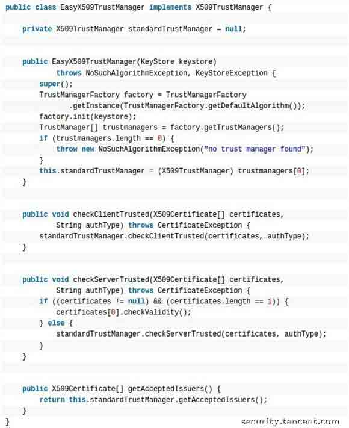
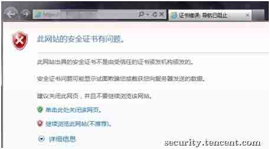
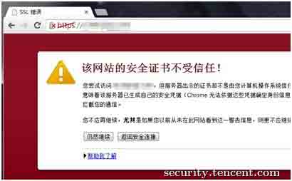

# 窃听风暴： Android 平台 https 嗅探劫持漏洞

2014/02/24 15:45 | [腾讯安全中心](http://drops.wooyun.org/author/腾讯安全中心 "由 腾讯安全中心 发布") | [漏洞分析](http://drops.wooyun.org/category/papers "查看 漏洞分析 中的全部文章") | 占个座先 | 捐赠作者

## 0x00 前言

* * *

去年 10 月中旬，腾讯安全中心在日常终端安全审计中发现，在 Android 平台中使用 https 通讯的 app 绝大多数都没有安全的使用 google 提供的 API，直接导致 https 通讯中的敏感信息泄漏甚至远程代码执行。终端安全团队审计后发现，腾讯部分产品及选取的 13 款业界主流 app 均存在此漏洞。

此外，通过这个漏洞，我们发现了国内整个行业处理安全问题存在诸多不足，例如安全情报滞后、安全警告未得到应有的重视、安全行业缺乏良性的沟通环境等等。腾讯安全中心希望通过 TSRC 这个平台，跟业界同行和白帽子共同探讨、共同提高，打造一个良性的安全生态环境，提升自己产品的安全性的同时也给我们的用户带来更好的安全保障。

## 0x01 原理分析

* * *

在 google 的官方文档中，详细给出了若干种 Android 平台中使用 https 的方法。开发小伙伴在使用了这些代码开发测试自己产品的 https 功能时，会发现发生很多种类型的 https 异常，相信不少有经验的白帽子也遇到过类似的问题。简单来说，根本原因是 google 的 API 会检查 https 证书进行合法性。而开发或者测试环境的 https 证书，基本上都无法通过合法性检查。

API 的检查内容包括以下 4 方面的内容：

```
1\. 签名 CA 是否合法；
2\. 域名是否匹配；
3\. 是不是自签名证书；
4\. 证书是否过期。 
```

一旦发现任何异常，则会终止请求并抛出相应的异常。那小伙伴们在产品开发或者测试时怎么办呢？终端安全团队审计后发现，绝大多数产品都采用了覆盖 google 默认的证书检查机制（X509TrustManager）的方式来解决这个问题。一个很典型的解决方案如下所示：



相信许多白帽子看到这段代码，已经发现问题在哪里了：覆盖默认的证书检查机制后，检查证书是否合法的责任，就落到了我们自己的代码上。但绝大多数 app 在选择覆盖了默认安全机制后，却没有对证书进行应有的安全性检查，直接接受了所有异常的 https 证书，不提醒用户存在安全风险，也不终止这次危险的连接。实际上，现在所有的网页浏览器，都会对这类 https 异常进行处理并提醒用户存在安全风险，一个典型的提醒如下图所示，相信不少小伙伴都曾经见到过这类提醒页面吧。





类似的问题，还有证书域名检查（HostnameVerifier）部分，情况和上面说到的及其类似，因此不再赘述。

## 0x02 恶意场景

* * *

想要利用这个漏洞进行攻击，我们需要能够进行流量劫持，去截获并修改 https 握手时数据包：将握手时的服务器下发的证书，替换成我们伪造的假证书。随后，全部的 https 数据都在我们的监控之下，如果需要，甚至可以随意篡改数据包的内容。下面我们看看典型的恶意场景。

### 1\. 伪造公众 wifi 进行劫持

某日，一名黑客带着他那台装满了“武器”的笔记本，激活了早已准备好的 aircrack，静静的在星巴克坐了一个下午，夕阳西下，黑客握着一杯星巴克咖啡，消失在人群中，深藏功与名。随后，下午在星巴克进行过网上购物的人都发现，自己银行卡中所有的现金被无声无息的转走了。这并不是危言耸听，本文探讨的这个漏洞，完全就能够做到这个效果。小伙伴们参考下图我们审计时发现的某 app 信用卡绑定的 https 漏洞，所有的信用卡信息（卡号，有效期，CVV，密码，验证码）全部泄漏。有了这些信息，盗走你的现金有什么难度？

从技术层面讲，使用成熟的 wifi 伪造工具（如 aircrack），黑客能够制造出和星巴克官方一摸一样的 wifi 信号。SSID，MAC 地址，路由参数，统统都可以伪造。对于普通用户而言，根本没法分清楚眼前的 wifi 是星巴克还是猩巴克。

[enter link description here](http://static.wooyun.org/20141018/2014101813584399150_jpg.jpg)

2013 台湾黑客大会中，主办方建立的 wifi“绵羊墙”（即通过伪造的 wifi 收集周围人的密码明文），旨在提醒人们注意公众 wifi 的安全性。整个会议过程中，它抓到了很多密码明文，其中不乏像 phpMyAdmin 的管理密码（如下图）。


所以，小伙伴们，在不可信的 wifi 环境中，千万别做敏感操作。或者，干脆就不使用不信任的 app。

### 2\. 城域网、DNS 等其他形式的流量劫持

相比而言，伪造 wifi 是比较容易实施的流量劫持方案。而城域网出口的流量劫持、DNS 请求劫持、路由链路劫持等攻击形式虽然相对困难，一旦成功实施，其影响将会是灾难性的。大家还记得 2010 年伊朗黑客的那次 dns 劫持攻击吗？假如配合上我们今天所讨论的 https 漏洞，会造成怎么样灾难性的后果？


## 0x03 漏洞现状

* * *

为了解此漏洞的业界现状，我们选取了 13 款使用 https 通讯的 Android app 进行分析，这些 app 全部来自业内大公司。分析结果显示全部的 13 款 app 都存在上文描述的敏感信息泄漏漏洞。而泄漏的信息中，密码明文，聊天内容，信用卡号，CVV 号随处可见。我们甚至还发现某些 app 的自动升级过程中使用的 https 通讯存在同样的问题，劫持流量后替换升级包的 url 后，该 app 会下载恶意的升级包并自动升级，直接造成了远程代码执行。

我们相信，业界绝大多数使用 https 的 app 都存在类似的漏洞。在发现此漏洞后，我们已经第一时间将漏洞的技术细节同步给国家互联网应急中心(CNCERT)以及发现存在此漏洞的友商。

## 0x04 后记

* * *

我们在发现、修复、溯源此次漏洞的过程中，发现了国内整个行业处理安全问题存在诸多不足。

### 1\. 安全情报滞后

在溯源过程中，我们发现这类型的漏洞其实从 Java 时代就已经存在，但一直未广泛传播，随后随着 dalvikvm Java 虚拟机的使用踏入 Android 平台，随着 Android 的普及传播的越来越广。国外在 CCS`12 中出现第一次系统的讨论 Android 平台的此漏洞[1](http://static.wooyun.org/20141018/2014101813584388339_jpg.jpg)， 2012 年 9 月《程序员》刊登的《Android 软件安全开发实践》[2](http://static.wooyun.org/20141018/2014101813584427609_jpg.jpg)中首次提到此类安全问题。google 官方的 API 文档[3](http://static.wooyun.org/20141018/2014101813584486317_jpg.jpg)中也曾提醒，自定义的 TrustManger 一定要小心实现，否则会引起严重的安全问题。

但可惜的是，这些关于的讨论并未得到我们和业界同行应有的重视，即使在一年后的今天，国内的 app 依然大面积的存在这类漏洞。CCS`12 报告中指出，google play 中 17.3%使用 https 的 app 存在这类安全漏洞。而据腾讯安全中心审计相关同事的统计，国内 app 中存在这类安全漏洞的比例，远远高于国外。

### 2\. 安全行业缺乏良性的沟通环境

其实，不管是国内还是国外，都有许多实力超群的白帽子，尽全力在为安全的互联网环境贡献自己的力量，但他们的声音，常常淹没在互联网信息的海洋里。个人的力量和影响终归是有限的，广大白帽子需要一个平台来发出他们的声音，使他们发现的安全问题得到应有的重视，也使这些安全问题尽快得到修复。TSRC 正是这样一个良性沟通平台的尝试，诚然，我们现在做得还不够，但是我们一直在为了这个目标而努力。

腾讯安全中心有责任也有义务，给广大用户一个安全的互联网环境。以后不管是安全情报还是安全团队发现的安全问题，我们都会第一时间同步到国家互联网应急中心(CNCERT)及受影响的友商，帮助业界同行尽快修复安全问题。TSRC 在此也呼吁业界同行放下公司、组织之间的隔阂，为了建立一个良好的沟通环境而共同努力。

国内安全行业任重而道远，腾讯安全中心跟整个行业一起，我们在路上。

## 0x05 相关链接

* * *

[1](http://static.wooyun.org/20141018/2014101813584388339_jpg.jpg) http://www2.dcsec.uni-hannover.de/files/android/p50-fahl.pdf
[2](http://static.wooyun.org/20141018/2014101813584427609_jpg.jpg) http://www.programmer.com.cn/15036/
[3](http://static.wooyun.org/20141018/2014101813584486317_jpg.jpg) http://developer.android.com/training/articles/security-ssl.html

原文来自：[【2014-02-24】窃听风暴： Android 平台 https 嗅探劫持漏洞](http://security.tencent.com/index.php/blog/msg/41)

版权声明：未经授权禁止转载 [腾讯安全中心](http://drops.wooyun.org/author/腾讯安全中心 "由 腾讯安全中心 发布")@[乌云知识库](http://drops.wooyun.org)

分享到：

### 相关日志

*   [本是同根生，相煎何太急-用 Google 语音识别 API 破解 reCaptcha 验证码](http://drops.wooyun.org/papers/1524)
*   [CDN 流量放大攻击思路](http://drops.wooyun.org/papers/679)
*   [Wordpress 3.8.2 补丁分析 HMAC timing attack](http://drops.wooyun.org/papers/1404)
*   [WordPress 3.8.2 cookie 伪造漏洞再分析](http://drops.wooyun.org/papers/1409)
*   [CVE 2015-0235: GNU glibc gethostbyname 缓冲区溢出漏洞](http://drops.wooyun.org/papers/4780)
*   [webgame 中常见安全问题、防御方式与挽救措施](http://drops.wooyun.org/papers/2677)