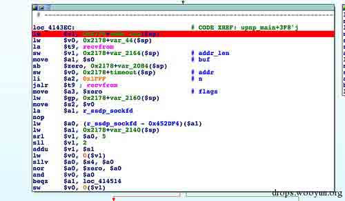
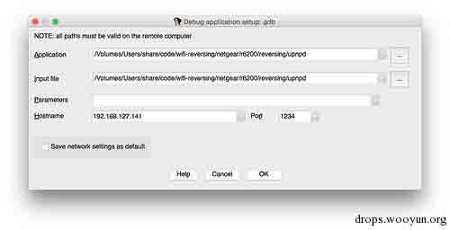
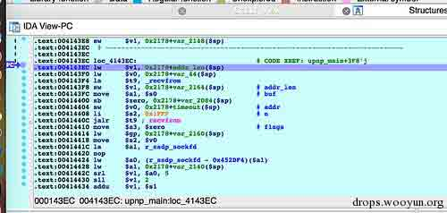

# 通过 QEMU 和 IDA Pro 远程调试设备固件

2015/01/08 9:05 | [cssembly](http://drops.wooyun.org/author/cssembly "由 cssembly 发布") | [技术分享](http://drops.wooyun.org/category/tips "查看 技术分享 中的全部文章") | 占个座先 | 捐赠作者

## 0x00 背景与简介

* * *

这篇文章主要讲了如何在模拟环境下调试设备固件。

作者：Zach Cutlip

原文链接：http://shadow-file.blogspot.gr/2015/01/dynamically-analyzing-wifi-routers-upnp.html。

在分析嵌入式设备的固件时，只采用静态分析方式通常是不够的。你需要实际执行你的分析目标来观察它的行为。在嵌入式 Linux 设备的世界里，很容易把一个调试器放在目标硬件上进行调试。如果你能在自己的系统上运行二进制文件，而不是拖着硬件做分析, 将会方便很多。这就需要用 QEMU 进行仿真。

接下来的一系列文章，我将专注于 Netgear 的一个比较流行的无线路由器，对其 UPnP 守护进程进行逆向分析。这篇文章将介绍如何在系统仿真环境下运行守护进程，以便可以通过调试器对其进行分析。

## 0x01 先决条件

* * *

首先，建议你读一下我的工作区以及所使用的工具的描述。这里是链接 http://shadow-file.blogspot.com/2013/12/emulating-and-debugging-workspace.html。

你需要一个 MIPS Linux 的模拟环境。对于这一点，建议读者查看我之前的搭建 QEMU 的帖子。http://shadow-file.blogspot.com/2013/05/running-debian-mips-linux-in-qemu.html

你还需要一个 MIPS Linux 的交叉编译器。我不会详细描述交叉编译器的建立过程，因为它们一团糟。有时候，你需要较旧的工具链，而其他时候，你需要较新的工具链。最好使用 uClibc buildroot project（http://buildroot.uclibc.org/）同时建立 big endian 和 little endian 的 MIPS Linux 工具链。除此之外，每当我发现其他交叉编译工具链时，我都会保存他们。类似 D-Link 和 Netgear 公司发布 GPL 版本 tarballs 是旧工具链的好来源。

一旦你有了目标架构的交叉编译工具链，你需要为目标建立 GDB 调试器。你至少需要适合目标架构的被静态编译的 gdbserver。如果要使用 GDB 进行远程调试，你需要编译 GDB，以便在你的本地机器架构（如 X86-64）上运行，来对目标架构（如 MIPS 或 mipsel 体系结构）进行调试。同样，我也不会去讨论这些工具的构建，如果你建立了你的工具链，这应该很容易了。

后面我将描述如何使用 IDA Pro 来进行远程调试。但是，如果你想使用 gdb，可以看看我的 MIPS gdbinit 文件：https://github.com/zcutlip/gdbinit-mips

## 0x02 模拟一个简单的二进制

* * *

假设你已经建立了上述工具，并能正常工作，你现在应该能够通过 SSH 进入您的模拟 MIPS 系统。正如我在 Debian MIPS QEMU 文章中所述，我喜欢连接 QEMU 的接口到 VMWare 的 NAT 接口，这样就能够用我的 Mac 通过 SSH 来接入，而不需要先登陆我的 Ubuntu 虚拟机。这也可以让我通过 NFS 将我的 Mac 工作区挂载到 QEMU 系统。这样，无论我工作在主机环境中，或是 Ubuntu 中，还是在 QEMU 中，我都在用相同的工作区。

```
zach@malastare:~ (130) $ ssh root@192.168.127.141
root@192.168.127.141's password:
Linux debian-mipsel 2.6.32-5-4kc-malta #1 Wed Jan 12 06:13:27 UTC 2011 mips

root@debian-mipsel:~# mount
/dev/sda1 on / type ext3 (rw,errors=remount-ro)
malastare:/Users/share/code on /root/code type nfs (rw,addr=192.168.127.1)
root@debian-mipsel:~#cd code
root@debian-mipsel:~/code# 
```

一旦登陆到模拟系统，cd 到从设备的固件中提取的文件系统中。你应该能够 chroot 到固件的根文件系统。需要使用 chroot，因为目标二进制是和固件的库链接的，很可能不能跟 Debian 的共享库一起工作。

```
root@debian-mipsel:~#cd code/wifi-reversing/netgear/r6200/extracted-1.0.0.28/rootfs/
root@debian-mipsel:~/code/wifi-reversing/netgear/r6200/extracted-1.0.0.28/rootfs#file ./bin/ls
./bin/ls: symbolic link to `busybox'
root@debian-mipsel:~/code/wifi-reversing/netgear/r6200/extracted-1.0.0.28/rootfs#file ./bin/busybox
./bin/busybox: ELF 32-bit LSB executable, MIPS, MIPS32 version 1 (SYSV), dynamically linked (uses shared libs), stripped
root@debian-mipsel:~/code/wifi-reversing/netgear/r6200/extracted-1.0.0.28/rootfs#chroot . /bin/ls -l /bin/busybox
-rwxr-xr-x    1 10001    80         276413 Sep 20  2012 /bin/busybox
root@debian-mipsel:~/code/wifi-reversing/netgear/r6200/extracted-1.0.0.28/rootfs# 
```

在上面的例子中，我已切换到所提取的文件系统的根目录中。然后使用 file 命令，我了解到 busybox 是 little endian MIPS 可执行文件。然后，chroot 到提取根目录，并运行 bin/ls，它是 busybox 的符号链接。

如果试图简单的通过“chroot .”来地启动一个 shell，将无法正常工作。因为你的默认 shell 是 bash，而大多数嵌入式设备没有 bash。

root@debian-mipsel:~/code/wifi-reversing/netgear/r6200/extracted-1.0.0.28/rootfs#chroot . chroot: failed to run command `/bin/bash': No such file or directory root@debian-mipsel:~/code/wifi-reversing/netgear/r6200/extracted-1.0.0.28/rootfs#

相反，你可以 chroot 并执行 bin / sh：

```
root@debian-mipsel:~/code/wifi-reversing/netgear/r6200/extracted-1.0.0.28/rootfs#chroot . /bin/sh

BusyBox v1.7.2 (2012-09-20 10:26:08 CST) built-in shell (ash)
Enter 'help' for a list of built-in commands.

#
#
#exit
root@debian-mipsel:~/code/wifi-reversing/netgear/r6200/extracted-1.0.0.28/rootfs# 
```

## 0x03 硬件解决方法

* * *

即使有了必要的工具，建立了仿真环境且工作正常，你仍然可能遇到障碍。虽然 QEMU 在模拟核心芯片组包括 CPU 上都做的很不错，但是 QEMU 往往不能提供你想运行的二进制程序需要的硬件。如果你试图模仿一些简单的像/bin/ls 的程序，通常能够正常工作。但更复杂的东西，如肯定有特定的硬件依赖的 UPnP 守护程序，QEMU 就不能够满足。尤其对于管理嵌入式系统硬件的程序更是这样，例如打开或关闭无线适配器。

你将遇到的最常见问题是在运行系统服务，如 Web 服务器或 UPnP 守护进程时，缺乏 NVRAM。非易失性 RAM 通常是包含配置参数的设备快速存储器的一个分区。当一个守护进程启动时，它通常会尝试查询 NVRAM，获取其运行时配置信息。有时一个守护进程会查询 NVRAM 的几十甚至上百个参数。

为了解决在模拟条件下缺乏 NVRAM 的问题，我写了一个叫 nvram-faker 的库。当你运行二进制程序时，应该使用 LD_PRELOAD 对 nvram-faker 库进行预加载。它会拦截通常由 libnvram.so 提供的 nvram_get（）调用。nvram-faker 会查询你提供的一个 INI 风格的配置文件，而不是试图查询 NVRAM。

附带的 README 提供更完整的说明。这里有一个链接：https://github.com/zcutlip/nvram-faker

即使解决了 NVRAM 问题，该程序可能会假设某些硬件是存在的。如果硬件不存在，该程序可能无法运行，或者即便它运行了，行为可能也与在其目标硬件上运行时有所不同。在这种情况下，你可能需要修补二进制文件。采用二进制补丁的情况各不相同。这取决于期望什么硬件，以及它不存在时的行为是什么。如果硬件缺失，你可能需要修补一个被执行到的条件分支。也可能需要修补针对特殊设备的 ioctl（）调用，如果你想将其替代为针对常规文件的读取和写入时。这里我将不谈论修补的细节，但在我的 BT HomeHub 文章以及 44CON 的相应讲座中进行了讨论。

这里是这些资源的链接：http://shadow-file.blogspot.com/2013/09/44con-resources.html

## 0x04 附加调试器

* * *

一旦在 QEMU 中运行了二进制程序，就可以附加调试器了。当然你需要 gdbserver。同样，这个工具应该适合目标架构并被静态编译，因为你会在 chroot 下运行它。你需要将它复制到提取的文件系统的根目录中。

```
# ./gdbserver
Usage: gdbserver [OPTIONS] COMM PROG [ARGS ...]
gdbserver [OPTIONS] --attach COMM PID
gdbserver [OPTIONS] --multi COMM

COMM may either be a tty device (for serial debugging), or
HOST:PORT to listen for a TCP connection.

Options:
  --debug               Enable general debugging output.
--remote-debug        Enable remote protocol debugging output.
--version             Display version information and exit.
  --wrapperWRAPPER --  Run WRAPPER to start new programs.
  --once                Exit after the first connection has closed.
# 
```

你可以将 gdbserver 附加到正在运行的进程，或者用它来直接执行二进制程序。如果你需要调试只发生一次的初始化程序，你可以选择后者。

另一方面，你可能要等到守护进程被创建。据我所知没有办法让 IDA 跟踪创建的进程（forked processes）。你需要单独的附加到它们。如果采用这种方式，你可以在 chroot 外，附加到已经运行的进程。

以下 shell 脚本将在 chroot 下执行 upnpd。如果 DEBUG 设置为 1，它会附加在 upnpd 上，并在 1234 端口上暂停等待远程调试会话。

```
ROOTFS="/root/code/wifi-reversing/netgear/r6200/extracted-1.0.0.28/rootfs"
chroot$ROOTFS /bin/sh -c "LD_PRELOAD=/libnvram-faker.so /usr/sbin/upnpd"

#Give upnpd a bit to initialize and fork into the background.
sleep 3;

if [ "x1" = "x$DEBUG" ];
then

$ROOTFS/gdbserver --attach 0.0.0.0:1234 $(pgrepupnpd)
fi

```

你可以在 recvfrom（）调用之前创建一个断点，然后当你向 upnpd 发送 M-SEARCH 包时，验证调试器断点。



然后，在 IDA 的 Debugger 菜单中的 Process 选项中设置“主机名”为你的 QEMU 系统的 IP 地址，并设置端口为 gdbserver 正在监听的端口。我用的是 1234。



接受设置，然后通过 IDA 的 CTRL+8 热键连接到远程调试会话。再次按 Ctrl+8 继续执行。你应该能够发送一个 M-SEARCH 包[1](http://static.wooyun.org/drops/20150106/20150106134849501312e25df697d3a76e857f3228a690e9d6e49d681ff.rar)，可以看到调试器命中断点。



显然还有很多需要探索，也会遇到有很多这里未提及的情况，但希望这可以让你开始。

我推荐 Craig Heffner 用于 UPnP 分析的 miranda 工具：https://code.google.com/p/miranda-upnp/

版权声明：未经授权禁止转载 [cssembly](http://drops.wooyun.org/author/cssembly "由 cssembly 发布")@[乌云知识库](http://drops.wooyun.org)

分享到：

### 相关日志

*   [应对 CC 攻击的自动防御系统——原理与实现](http://drops.wooyun.org/%e8%bf%90%e7%bb%b4%e5%ae%89%e5%85%a8/4151)
*   [metasploit 渗透测试笔记(内网渗透篇)](http://drops.wooyun.org/tips/2746)
*   [PHP Session 序列化及反序列化处理器设置使用不当带来的安全隐患](http://drops.wooyun.org/tips/3909)
*   [Linux 通配符可能产生的问题](http://drops.wooyun.org/papers/2448)
*   [渗透技巧之 SSH 篇](http://drops.wooyun.org/tips/1951)
*   [Alictf2014 Writeup](http://drops.wooyun.org/tips/3166)