# Android uncovers master-key 漏洞分析

2013/07/11 12:38 | [livers](http://drops.wooyun.org/author/livers "由 livers 发布") | [漏洞分析](http://drops.wooyun.org/category/papers "查看 漏洞分析 中的全部文章"), [移动安全](http://drops.wooyun.org/category/mobile "查看 移动安全 中的全部文章") | 占个座先 | 捐赠作者

### 0x00 背景

* * *

Bluebox 的 CTO Jeff Forristal 在其官⽅方 blog 爆出一个漏洞叫做 UNCOVERING ANDROID MASTER KEY,大致是不篡改签名修改 android 代码。

Link:[`bluebox.com/corporate-blog/bluebox-uncovers-android-master-key/`](http://bluebox.com/corporate-blog/bluebox-uncovers-android-master-key/)

##### blog:关于细节并没有讲太多,只有 discrepancies in how Android applications are cryptographically verified & installed(安卓应⽤用签名验证和安装的不⼀一致)essentially allowing a malicious author to trick Android into believing the app is unchanged even if it has been(让 andriod 系统本⾝身认为应⽤用没有修改)这两条重要的信息。

剩下就是放出来一张更改基带字串的图:

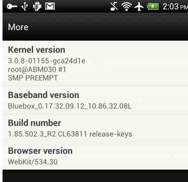

具体细节 7 月底的 blackhat 放出。

没多少天 7 月 8 号国外已经有人放出 poc 来。微博上看到 rayh4c 说已经搞定。就分析了一下。

### 0x01 分析

* * *

POC 还没出来之前,先是看了下 android 的签名机制和安装机制。

签名机制: 用简单的话来讲就是 android 把 app 应用的所有文件都做了 sha1(不可逆)签名,并对这签名用 RSA(非对称加密算法)的私钥进行了加密,客户端安装验证时用公钥进行解密。

从逻辑上看,这签名机制对完整性和唯一性的校验是完全没问题的。主流的很多加密都类似这样。

安装机制:

安装机制则较为复杂。

```
1.系统应用安装――开机时完成,没有安装界面
2.网络下载应用安装――通过 market 应用完成,没有安装界面
3.ADB⼯工具安装――没有安装界面。
4.第三⽅方应用安装――通过 SD 卡⾥里的 APK⽂文件安装,有安装界面,由 packageinstaller.apk 应⽤用处理安装及卸载过程的界面。 
```

安装过程:复制 APK 安装包到 data/app 目录下,解压并扫描安装包,把 dex⽂文件(Dalvik 字节码) 保存到 dalvik-cache 目录,并 data/data 目录下创建对应的应⽤用数据目录。

到这里看出在安装机制上的问题可能性比较大。

回头看⽼老外的 POC:[`gist.github.com/poliva/36b0795ab79ad6f14fd8`](https://gist.github.com/poliva/36b0795ab79ad6f14fd8)

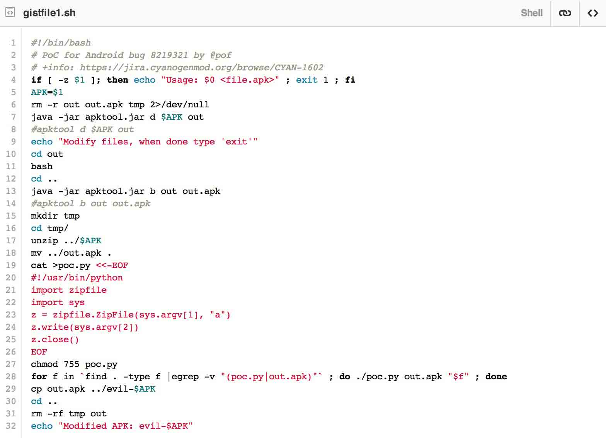

在 linux 执⾏行了一遍,出现错误。可能是 apk 的原因。

索性把这 poc 移植到 windows 下,先是⽤用 apktool 把要更改的 apk 给反编译出来到一个目录 apk_test

然后⼜又把 apk_test 打包成⼀一个新的 apk

把原先的 apk 解压出来 apk_old

把 apk_old 所有⽂文件以 zip 压缩的⽅方式加⼊入新的 apk 中。我本机以 weibo.apk 为例:

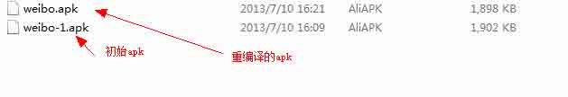

可见两者大小发生了变化,apktool 在反编译过程不可避免的出现差异。并且重编译的 apk 不含有签名文件。

按照 poc 的做法我用批处理导出目录的文件名到 1.txt 修改了 poc.py

```
import zipfile
import sys
f=open('1.txt','r')
line=f.readline()
test=[]
while line:
    test1=line.replace("\n","")
    test.append(test1)
    if not line:
        break
    line=f.readline()
f.close()
z = zipfile.ZipFile("livers.apk", "a")
for i in range(0,len(test)):
    print test[i]
    z.write(str(test[i]))
z.close() 
```

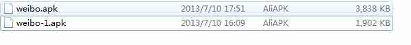

差不多增大了一倍,放在手机上安装了一下,成功安装。查看了下:

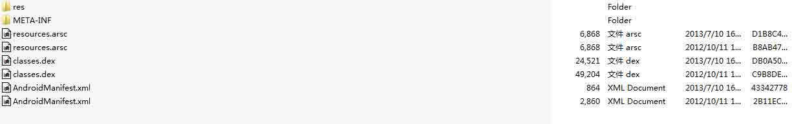

出现了多对同名文件。CRC 校验不同,查看了一下,基本上是两个字节便产生不同。

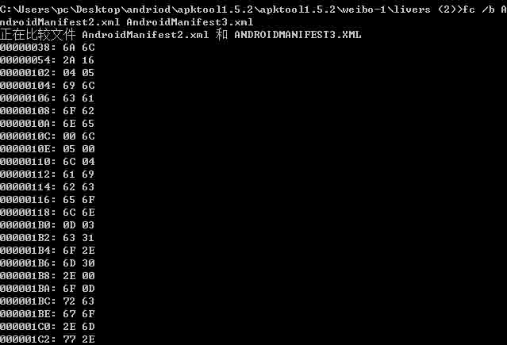

这里我又测试了只添加签名文件,或者 dex 文件等,均不能通过验证。

可证明其在 scan list 扫描目录或者复制文件时候对同名文件处理不当。

### 0x02 验证

* * *

证明是否可以进行更改源码,并能使用原生签名。我把 apk 图标进行了更改。

顺便讲下一般的反编译修改:

```
1\. apktool 或者其他工具进行反编译包含 smalijava 字节码汇编和 xml 图片文件。 
2\. apkzip 解压。
3\. 反编译 dex 成 java 文件。
4\. 查找对应修改的 smali 文件或者 xml(一般广告链接)
5\. Apktool 打包成 apk 文件
6\. 用 autosign 进行签名。
这里没有进行签名直接借用原来的签名。 
```

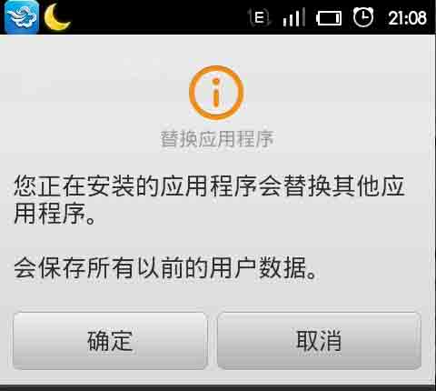

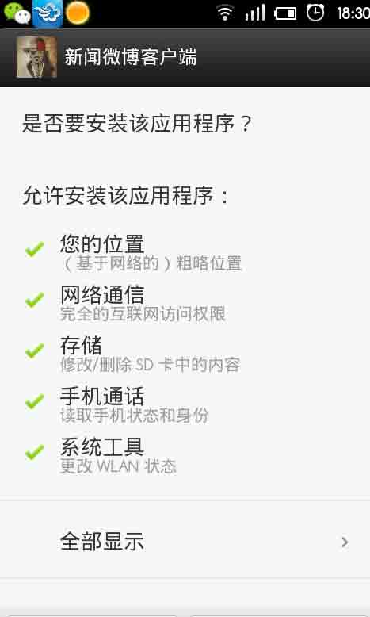

### 0x03 查找根源

* * *

我这里下载的 android 2.2 的源码，查找到获取签名信息安装位于`frameworks\base\core\java\android\content\pm\PackageParser.java`这个文件，`public boolean collectCertificates(Package pkg, int flags)`和`private Certificate[] loadCertificates(JarFile jarFile, JarEntry je, byte[] readBuffer)`这个方法是用来获取签名信息的。

```
 Enumeration entries = jarFile.entries();
            while (entries.hasMoreElements()) {
                JarEntry je = (JarEntry)entries.nextElement();
                if (je.isDirectory()) continue;
                if (je.getName().startsWith("META-INF/")) continue;
                Certificate[] localCerts = loadCertificates(jarFile, je,
                        readBuffer);
            。。。。。。
                } else {
                    // Ensure all certificates match.
                    for (int i=0; i<certs.length; i++) {
                        boolean found = false;
                        for (int j=0; j<localCerts.length; j++) {
                            if (certs[i] != null &&
                                    certs[i].equals(localCerts[j])) {
                                found = true;
                                break;
                            }
                        }
                      。。。。。 
```

前面通过黑盒方式，大致推断出安装机制就是把重命名文件同时处理了，没有覆盖而是：

```
if (certs[i] != null &&certs[i].equals(localCerts[j])) {
    found = true;
    break;
} 
```

两个重名文件都做了验证，只要有一个通过验证，就返回验证通过。

### 0x04 后继

* * *

我 android 研究不多，大多以前玩逆向的底子。大家可以多讨论。 欢迎大家留言探讨~！

======================================================================================================

#### 7 月 11 日 21 点更新：

没看到看雪上已经讨论的热火朝天，读下来来源于看雪的 zmworm 的原理分析应该是更准确的。

#### 原理简述

由于 ZIP 格式允许存在两个或以上完全相同的路径，而安卓系统没有考虑这种场景。

在该情况下，android 包管理器校验签名取的是最后一个文件的 hash，而运行 APK 加载的 dex 文件却是 zip 的第一个 dex 文件。

包管理器验证签名验的是最后一个（名字相同情况下）文件。

1\. 解析 zip 的所有 Entry，结果存到 HashMap（key 为路径，value 为 Entry）。

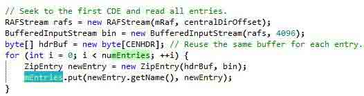

2\. 由于 HashMap.put 在相同 key 的情况下，会把 value 更新，导致上述的 HashMap 在相同路径下，存储的一定是最后一个文件的 Entry。

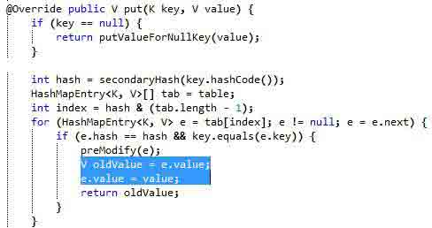

系统加载 dex 文件，加载的是第一个 dex。

1\. 查找 dex 的 Entry 用的是 dexZipFindEntry。

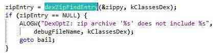

2\. dexZipFindEntry 的实现是只要 match 就返回，所以返回的都是第一个文件。

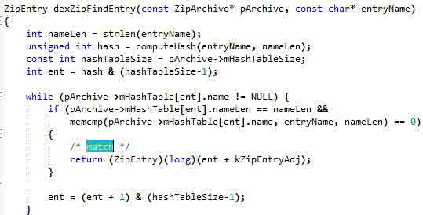

Zip 可以包含两个同名文件或者路径，而其自身的 unzip 默认方式是后一个覆盖前一个。

HashMap.put 的写法应该文件也直接覆盖(hash 表的冲突处理不当果真出大问题)才算是算是符合 zip 的标准。

就是加载 dex 的方式则是先加载第一个，这样确实信息不一致。

而我之前黑盒测出来认为 android 默认把两个都加载在签名验证顺序上出现问题的，未分析到上一层的类。

看雪上也是讨论很多帖子得到准确的原理分析，大家共同讨论，集思广益。Hack it, know it too.

持续跟新中。

**Tags:** [android](http://drops.wooyun.org/tag/android), [移动](http://drops.wooyun.org/tag/%e7%a7%bb%e5%8a%a8)

版权声明：未经授权禁止转载 [livers](http://drops.wooyun.org/author/livers "由 livers 发布")@[乌云知识库](http://drops.wooyun.org)

分享到：

### 相关日志

*   [针对性攻击与移动安全漏洞](http://drops.wooyun.org/tips/134)
*   [WebView 中接口隐患与手机挂马利用](http://drops.wooyun.org/papers/548)
*   [安卓 Bug 17356824 BroadcastAnywhere 漏洞分析](http://drops.wooyun.org/papers/3912)
*   [Denial of App – Google Bug 13416059 分析](http://drops.wooyun.org/tips/2976)
*   [一只 android 短信控制马的简单分析](http://drops.wooyun.org/papers/3030)
*   [Android Broadcast Security](http://drops.wooyun.org/tips/4393)