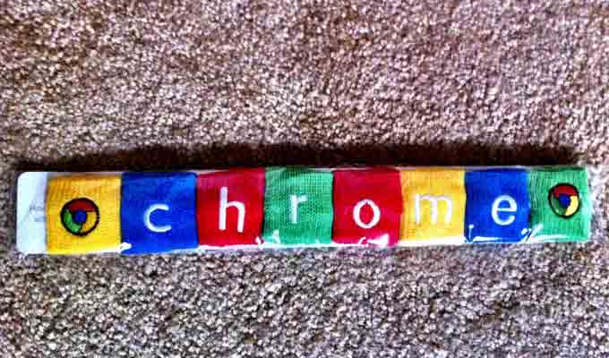

# GOOGLE 赶在 PWN2OWN 之前修复了四个高危漏洞

2014/03/13 16:13 | [News](http://drops.wooyun.org/author/news "由 News 发布") | [业界资讯](http://drops.wooyun.org/category/news "查看 业界资讯 中的全部文章") | 占个座先 | 捐赠作者

Pwn2Own 正在如火如荼的举行着。

Google 在本周 Pwn2Own 黑客竞赛开始之前，在 Chrome 33 版本中修复了几个严重的漏洞。

在 Pwn2Own 的竞赛上，Chrome 浏览器一直都列为目标之一，谁挖到 Chrome 浏览器未知的漏洞，将会得到丰厚的奖励，同时 Google 也举办了自己的 Pwnium 竞赛，也奖励丰厚。

Pwn2Own 在美国时间本周三开始，Chrome 的此次四个补丁是在周二发布的。

详情：

[`code.google.com/p/chromium/issues/detail?id=344881`](https://code.google.com/p/chromium/issues/detail?id=344881)
[`code.google.com/p/chromium/issues/detail?id=342618`](https://code.google.com/p/chromium/issues/detail?id=342618)
[`code.google.com/p/chromium/issues/detail?id=333058`](https://code.google.com/p/chromium/issues/detail?id=333058)
[`code.google.com/p/chromium/issues/detail?id=338354`](https://code.google.com/p/chromium/issues/detail?id=338354)

Chrome 可能在本周晚些时候发布 Chrome 浏览器的更多补丁。

PS：Pwn2Own 是全球最著名的黑客大赛之一，由美国五角大楼入侵防护系统供应商 TippingPoint 的 DVLabs 赞助。

版权声明：未经授权禁止转载 [News](http://drops.wooyun.org/author/news "由 News 发布")@[乌云知识库](http://drops.wooyun.org)

分享到：

### 相关日志

*   [马航 MH370 航班被黑了？](http://drops.wooyun.org/news/1202)
*   [通过伪造乌克兰相关文件进行传播的恶意软件 MiniDuke](http://drops.wooyun.org/news/1373)
*   [GnuTLS 和 Apple 证书验证的 bugs 并非为同一个](http://drops.wooyun.org/news/1021)
*   [NSA 暗中监视中国政府和企业网络（目标华为）](http://drops.wooyun.org/news/1289)
*   [网络安全威胁周报——第 201410 期](http://drops.wooyun.org/news/1034)
*   [一种被命名为 Chameleon 的病毒可以通过 WiFi 相互之间传播](http://drops.wooyun.org/news/976)