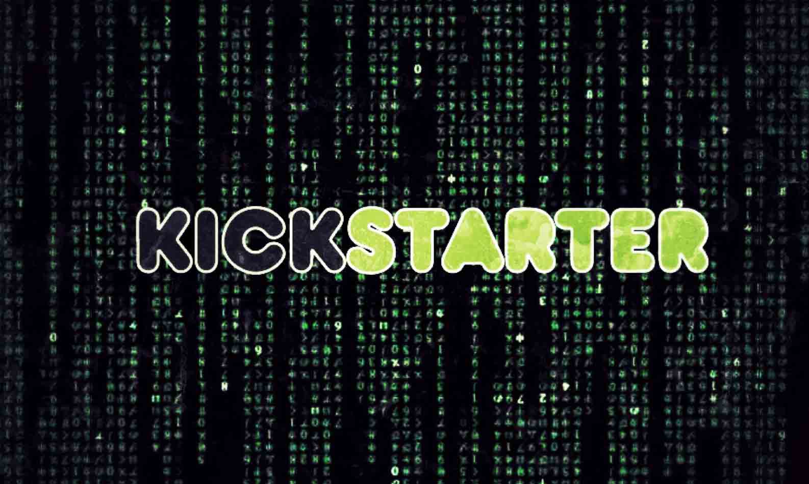

# 众筹平台 Kickstarter 被黑客攻击，部分用户数据被盗取

2014/02/16 12:30 | [News](http://drops.wooyun.org/author/news "由 News 发布") | [业界资讯](http://drops.wooyun.org/category/news "查看 业界资讯 中的全部文章") | 占个座先 | 捐赠作者

[Kickstarter 官方博客发表一则安全声明](https://www.kickstarter.com/blog/important-kickstarter-security-notice)：

在美国时间周三晚上，Kickstarter 被执法人员通知有黑客入侵，并且获取了部分客户的数据。

官方声称信用卡的数据并没有被盗取的痕迹，虽然信用卡数据没有被获取，但是用户的姓名，email 地址，邮寄地址，电话号码，以及加密过的密码都被盗取了，密码原文并没有泄露，但是密码使用 SHA-1 方式保存，黑客可采用暴力破解的方式，破解出用户的账号密码。

Kickstarter 声称，对此事非常抱歉，并对自己的服务器及程序进行了安全加固，防止此类事情再次发生，并建议用户使用 1Password 和 LastPass 工具管理自己的账号密码。

译者注：Kickstarter 于 2009 年 4 月在美国纽约成立，是一个创意方案的众筹网站平台。

网站详细介绍：[Kickstarter](http://baike.baidu.com/link?url=bEBMTUY-AN-AoZfweqL9jXGOaKksCkvVrVW0Cpvty2lp5cVZoRAc01TMtZFEGmVfaTwCLfPSdNni7HYwGZKqWK)

乌云知识库表示，凡是涉及到金钱的领域，最容易被黑客盯上，希望国内的类似网站增加安全意识，可以避免类似的事情发生。

版权声明：未经授权禁止转载 [News](http://drops.wooyun.org/author/news "由 News 发布")@[乌云知识库](http://drops.wooyun.org)

分享到：

### 相关日志

*   [马航 MH370 航班被黑了？](http://drops.wooyun.org/news/1202)
*   [通过伪造乌克兰相关文件进行传播的恶意软件 MiniDuke](http://drops.wooyun.org/news/1373)
*   [网络安全威胁周报——第 201410 期](http://drops.wooyun.org/news/1034)
*   [NSA 暗中监视中国政府和企业网络（目标华为）](http://drops.wooyun.org/news/1289)
*   [APPLE IOS 7.1 修复了超过 20 个代码执行的漏洞](http://drops.wooyun.org/news/1057)
*   [GnuTLS 和 Apple 证书验证的 bugs 并非为同一个](http://drops.wooyun.org/news/1021)