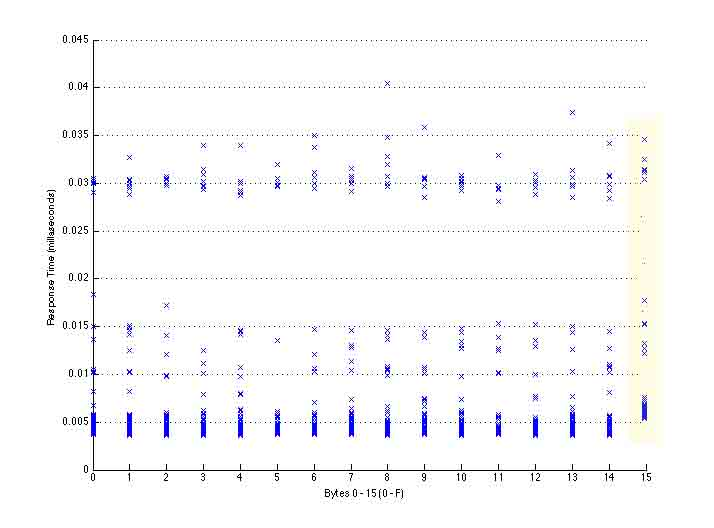

# WordPress 3.8.2 补丁分析 HMAC timing attack

2014/04/13 10:24 | [insight-labs](http://drops.wooyun.org/author/insight-labs "由 insight-labs 发布")   | [web 安全](http://drops.wooyun.org/category/web "查看 web 安全 中的全部文章"), [漏洞分析](http://drops.wooyun.org/category/papers "查看 漏洞分析 中的全部文章")  | 占个座先  | 捐赠作者

author: anthrax@insight-labs.org

## 0x00 背景

* * *

在 github 翻来覆去看了半天，官方版的 diff 只在 php 里改动了一个位置:

```
-  if ( $hmac != $hash ) {  
+  if ( hash_hmac( 'md5', $hmac, $key ) !== hash_hmac( 'md5', $hash, $key ) ) {  

```

WP 的开发人员也只是含糊的说这个版本修复了一个可以伪造 cookie 的漏洞。苦思半天翻来覆去看代码之后，甚至顺带挖出了个 0day，才发现原来自己又想多了，这个洞的原理其实很简单，那就是边信道攻击。

## 0x01 细节

* * *

边信道攻击我就不具体解释了，这个地方补的是一个关于 HMAC 的边信道攻击，利用时间差来判断 HMAC。

HMAC 是一种加密后的 hash，比如 WP 里用的是 HMAC-MD5，外观和 md5 一样，也是长度位 32 的 16 进制字符串，但是经过一个 key 加密，用来防止重放攻击等。

通过时间差攻击(Timing attack),可以获取完整的 HMAC 从而伪造 cookie。

首先我们来看下 wordpress 登录后的 cookie 长什么样，拿乌云 drops 为例:

```
wordpress_logged_in_7065d11a793a3ec8482214fcc4f0a55b=insight-labs%7C1397480887%7Cxxxxxxxxxxxxxxxxxxxxxxxxxxxxxxxx 
```

cookie 名字`wordpress_logged_in_`后面的那个 hash 看似很神秘，其实是:

```
if ( !defined( 'COOKIEHASH' ) ) {  
$siteurl = get_site_option( 'siteurl' );  
if ( $siteurl )  
define( 'COOKIEHASH', md5( $siteurl ) );  

```

也就是说其实就是 wp 网站的 url，比如 drops 的是'http://drops.wooyun.org',md5 一下你就知道了。

但是 cookie 的内容就没那么简单了，%7c 是键盘上的竖线 `|` 。

wp 的 cookie 用竖线作为分隔符，前面是用户名，中间是 cookie 过期时间，后面是 32 位的 hmac。

hmac 的来源比较复杂，但是如果我们能得到这个 hmac，我们就可以登录任意已知用户了(WP 并没有在本地记录登录 session，全靠 cookie)。

下面来看下 HMAC timing attack 的最基本原理，字符串对比。

即使没有看到 php 的源码，从理性角度分析，任何程序语言的字符串对比应该都是这样实现的：

如果两个字符串第一个字符不相同，那么后面的即使相同也没有意义了，所以返回 False。

如果第一个字符相同，那么到第二个字符，如果第二个字符也相同，判断第三个字符...直到最后一个字符，如果其中有一个字符不一样，那么就终止后续判断，返回 False，如果全部一样，就返回 True。

看到这里大家应该都懂了，那就是判断

```
'abcdef'=='zxcvbn' 
```

比

```
'abcdef'=='abcdeg' 
```

用的时间短。

## 0x02 攻击

* * *

构造 POC:

下面我有一个 32 位的 md5 hash:

```
f2835bb2a6ab584fc5cf268bb384c598 
```

有个简单的 php 程序

```
<?php  
$hash='f2835bb2a6ab584fc5cf268bb384c598'  

if($_GET['hmac']!=$hash){  
exit('Go away...')  
}
echo 'You are admin!'  
?>  

```

然后我提交:

```
00000000000000000000000000000000 
```

并且记录从提交到服务器返回结果所需要的时间(需要精确到微秒，起码也得是毫秒级)
之后提交

```
10000000000000000000000000000000  
..  
20000000000000000000000000000000  
..  
30000000000000000000000000000000  
.  
.  
.  
f0000000000000000000000000000000 
```

从 0-f，然后对比一下他们所需要的时间:

```
0 0.005450913  
1 0.005829198  
2 0.004905407  
3 0.005286876  
4 0.005597611  
5 0.004814430  
6 0.004969118  
7 0.005335884  
8 0.004433182  
9 0.004440246  
a 0.004860263  
b 0.004561121  
c 0.004463188  
d 0.004406799  
e 0.004978907  
f 0.004887240 
```

等等……这不是差不多么，而且明明第一位是 f，但是 7 的时间最长，这尼玛不是……


但是统计学告诉我们，任何微小的差异在重复多次后都会放大，所以这次我们把每个请求轮流跑 500 遍，然后都记录下来，注意，要轮流跑，如果先把 0 跑 500 遍再把 1 跑 500 遍，第二次对比相同内容的时候服务器返回都飞快，似乎有某种缓存机制。

把第一位的 0-f 轮流跑了 500 次之后，把记录的时间差做成图:



可以看出，多次重试增加了误差的统计显著性。

从图里可以看出，大部分情况下 0-e 的反应速度都在 0.005 毫秒以内，但是 f 却大于这个时间。

知道了第一位之后我们可以用同样的方法去计算第二位，这次把已知的第一位放进去:

```
f0000000000000000000000000000000  
f1000000000000000000000000000000  
f2000000000000000000000000000000  
.  
.  
.  
ff000000000000000000000000000000 
```

相同过程就不再阐述了，不过大家可以试试看，计算所有响应时间的方式是用平均值好还是标准差好。

通过这种攻击方式，我们只需要`16*500*32=256000`次请求即可获取完整的 HMAC cookie。

这下就能理解官方补丁的用意了，这样虽然没有去掉时间差(时间差总是存在的，除非用恒定时间对比算法)，但是因为多加了一层 hmac，攻击者的 payload 被随机化了，无法通过时间差来猜测具体字符是哪一个。

不过在互联网环境下，这个洞还是有点鸡肋，但是如果是在同一个机房或者虚拟主机同站的话效果应该还是不错的。

WP 的这个洞是补上了，我相信大家会举一反三的，毕竟用 == 或者!=的地方太多了。

PS: 小编欠饭次数+=1

版权声明：未经授权禁止转载 [insight-labs](http://drops.wooyun.org/author/insight-labs "由 insight-labs 发布")@[乌云知识库](http://drops.wooyun.org)

分享到：

### 相关日志

*   [WordPress 3.8.2 cookie 伪造漏洞再分析](http://drops.wooyun.org/papers/1409)
*   [上传文件的陷阱](http://drops.wooyun.org/tips/2031)
*   [CVE 2015-0235: GNU glibc gethostbyname 缓冲区溢出漏洞](http://drops.wooyun.org/papers/4780)
*   [GPU 破解神器 Hashcat 使用简介](http://drops.wooyun.org/tools/655)
*   [One git command may cause you hacked(CVE-2014-9390)](http://drops.wooyun.org/papers/4386)
*   [深入了解 SQL 注入绕过 waf 和过滤机制](http://drops.wooyun.org/tips/968)