# 分享信息安全工作小记

2014/09/05 16:11 | [健宇](http://drops.wooyun.org/author/健宇 "由 健宇 发布") | [技术分享](http://drops.wooyun.org/category/tips "查看 技术分享 中的全部文章") | 占个座先 | 捐赠作者

## 0x01 工作背景：

* * *

1、 某厅级部门政府站点被篡改

2、 上级主管部门安全通告

3、 配合该部门查明原因限期整改

## 0x02 工作记录：

* * *

**1、 信息收集**

A、首先到机房了解了一下拓扑图，大概就是：互联网-防火墙-web 应用防火墙-防篡改-DMZ 服务器区；

B、然后了解了一下 web 应用程序架构，大概就是：3 台服务器里面 1 台跑 iis 中间件 1 台跑 sqlserver2008 数据库，站库分离，服务器性能比较好，1 台 syslog 服务器接收日志；

C、网站属于.net 开发，之前加固过：

a、后台限制 IP 访问，

b、FCKEDITOR 上传目录禁止执行，

c、sqlserver 数据库降低权限使用 network service 并且关闭 cmdshell 等高危组件。

**2、 访谈管理员**

A、与管理员沟通得知某个 HTML 页面被黑客篡改了一些不好的内容，查看数据库日志以及数据库中记录的网站操作记录分析判断不属于后台管理员修改；

B、查看 web 应用防火墙日志的时候发现并未记录任何日志，访谈得知机房防火墙坏掉了，就变动了一下线路，所有请求 web 服务器的用户都不会经过 web 应用防火墙，相当于就是个摆设；

C、FCKEDITOR 编辑器任意上传漏洞早在 2013 年就已经存在，当时开发商没有历史源代码无法升级采用 web 应用防火墙+IIS 限制执行权限方法；

D、2013 年湖南省金盾信息安全测评中心的信息安全等级保护测评报告提出的整改建议甲方不知道如何整改就没有整改到位。

**3、 情况分析**

在初步了解完情况以后，对 web 目录进行可疑文件筛选：

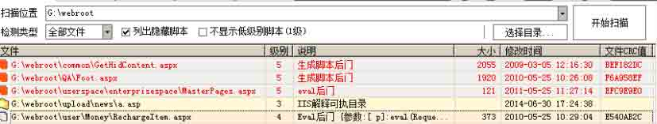

（黑客所放置的后门程序，文件修改时间被伪装）

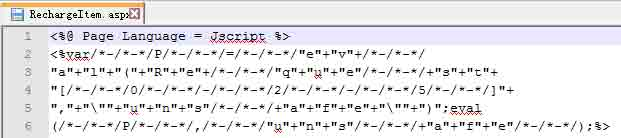

（webshell 内容，变异的一句话）

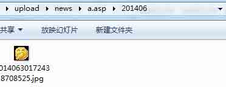

（通过 FCKEDITOR 编辑器上传的一句话木马文件初步判断为 2014 年 6 月 30 日黑客攻击）

初步判断为 FCKEDITOR 编辑器被黑客利用了，接下来对 iis 36GB 日志进行压缩打包：


（成功打包网站日志）

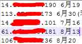

（以 webshell 路径做为筛选条件初步快速从 33GB 日志文件内找出所有可疑 IP 地址以及时间）

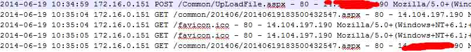

入侵手段分析：最终分析得知最早黑客攻击利用 Common/UpLoadFile.aspx 文件上传了 ASPX 木马文件在 common/201406/20140619183500432547.aspx，

此上传功能并未调用 FCKEDITOR 编辑器，之前加固限制 FCKEDITOR 编辑器上传文件执行权限成功阻止了黑客利用该漏洞

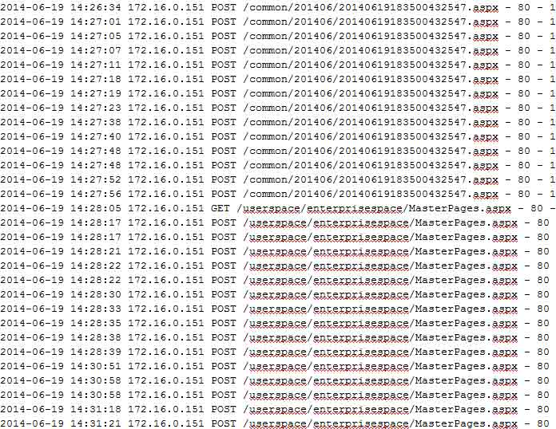

黑客通过 /common/201406/20140619183500432547.aspx 文件写入了/userspace/enterprisespace/MasterPages.aspx 一句话木马文件，

后续相继写入了之前扫描出的可疑 ASPX 文件，成功固定了黑客入侵手段、时间、IP 地址、综合分析在服务器的操作记录，由于综合分析操作记录部分涉及到该单位隐私信息不便公开

**4、 反向渗透取证定位**

在对 3 个月内日志仔细分析发现几个可疑的重庆和广东 5 个 IP 地址中 113.*.*.173 并未攻击成功，其他 4 个 IP 地址为 1 人或者 1 个团伙所使用 IP 地址：

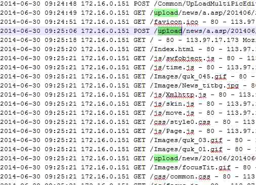

（黑客利用 FCKEDITOR 编辑器漏洞成功建立了 a.asp 文件夹尝试利用 IIS 解析漏洞，但是由于 IIS 中进行过安全配置以及 IIS7.5 已经修补该解析漏洞入侵并未成功，故忽略）

对剩余的 4 个 IP 地址仔细分析发现 61.*.*.181 属于一个黑客使用的 windows 服务器：

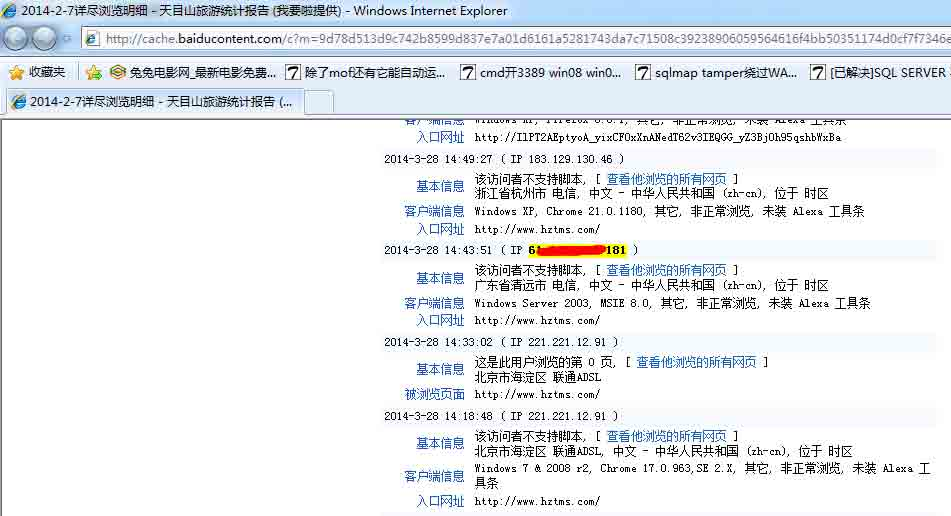


（对该服务器进行收集得知操作系统为 windows2003，浏览器 ie8.0，绑定域名 www.**dns.cn）

接下来对该服务器进行渗透测试，目的拿下其服务器获取黑客使用该服务器做跳板的日志以及黑客的真实 IP 地址，对其进行端口扫描结果：

```
PORT      STATE    SERVICE         VERSION
80/tcp    open     http            Microsoft IIS httpd 6.0
808/tcp   open     http            Microsoft IIS httpd 6.0
1025/tcp  open     msrpc           Microsoft Windows RPC（可以 openvas 或者 nessus 远程获取一些 RPC 信息）
1026/tcp  open     msrpc           Microsoft Windows RPC（可以 openvas 或者 nessus 远程获取一些 RPC 信息）
1311/tcp  open     ssl/http        Dell PowerEdge OpenManage Server Administrato
r httpd admin(通过 HTTPS 协议访问后了解到计算机名称为 EASYN-9D76400CB ，服务器型号 PowerEdge R610)
1723/tcp  open     pptp            Microsoft (黑客用做跳板开放的 PPTP VPN 服务器)
3029/tcp  open     unknown
8888/tcp  open     sun-answerbook?
10000/tcp open     ms-wbt-server   Microsoft Terminal Service（远程桌面服务，进行分析判断时发现存在黑客安装的 shift 后门） 
```


（黑客的 shift 后门真逗，竟然不使用灰色按钮，伪装失败，肉眼直接识别是后门）

接下来确定渗透思路为：

A、使用漏洞扫描设备扫描主机漏洞以及每个端口存在的弱口令；

B、对 shift 后门有着多年爆菊花经验，进行类似于 xss 盲打，用鼠标点击每个角落或者同时按住 ctrl+alt+shift 来点击，最后尝试每个按键以及常用组合键；

C、通过 1311 端口的 HTTPS 可以对 windows 管理员进行暴力破解；

D、从 80 端口绑定的站点进行 web 渗透。

运气还不错，找到一个显错注入点直接 sa 权限：

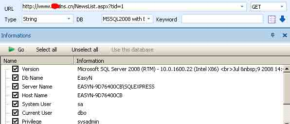

（SQL2008 显错注入成功）

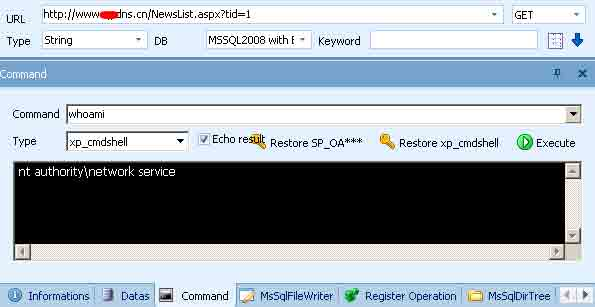

（测试 SA 可以执行 cmdshell，但是权限为网络服务，无法直接添加命令，还需要提权）

思考后觉得数据库与网站都属于 network service，应该可以通过数据库写文件到网站根目录，然后连接菜刀提权进入服务器：

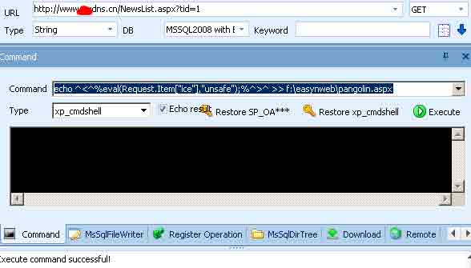

（通过显错得知了网站根目录，然后利用 echo 命令写入 shell 成功）


（webshell 连接成功，运气真好！）

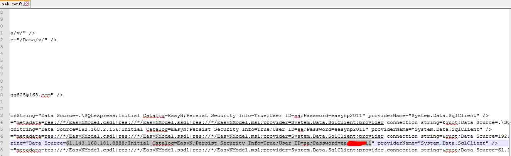

（从 web.config 文件中找到明文数据库 sa 超级管理员用户密码）

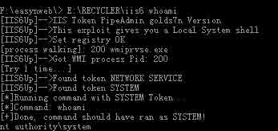

（iis6 提权成功）

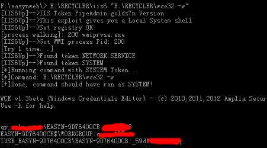

（明文管理员密码读取成功）

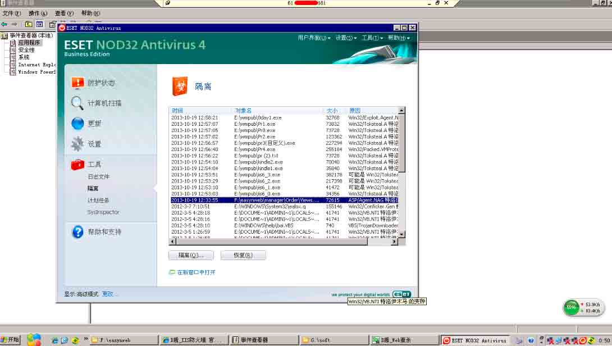

（进入服务器分析杀毒软件历史日志，得知黑客入侵手法）

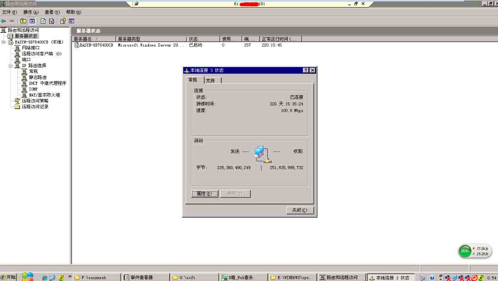

（查看 VPN 配置信息取出日志，顺便了解到该服务器 220 天没有重启了，真牛。。。）

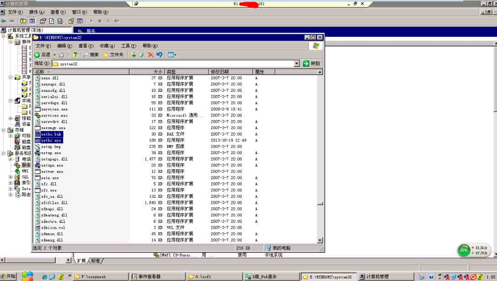

（提取出存在于系统中的 shift 后门）

继续向下分析，黑客是否种植远程控制木马或者其他 rootkit：

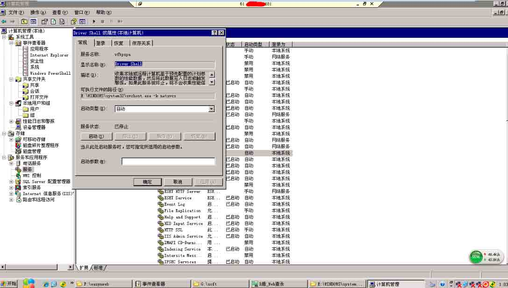

（系统服务中发现异常服务项为远程控制木马，爆破 1 组准备）

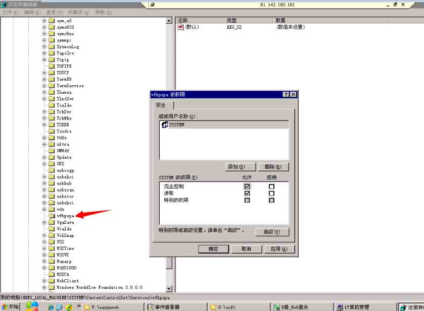

（小样，默认还设置了注册表不允许 administrators 组无权限）

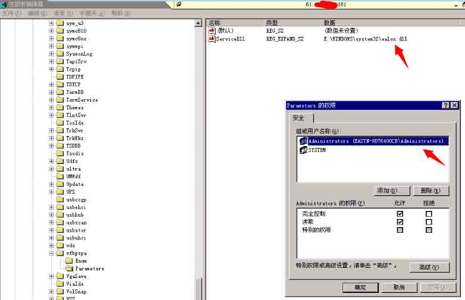

（定位到木马的 DLL，提取并固定到入侵证据中）

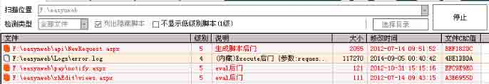

（黑客惯用手法，伪装与正常 ASPX 程序相关文件名，修改文件时间，就连 webshell 代码都是那么几个一模一样的） 后续还发现黑客添加成功 asp.net 用户，但是没有种植驱动级后门，当前也并未发现其他后门。综合系统日志、IIS 日志、webshell、逆向分析 shift 后门以及远程控制木马结果、数据库日志、防火墙日志等判断出黑客是重庆的 XXX，这里就不提这些了。

以上内容仅供技术交流参考，欢迎大家与我互相交流，同时请关注长沙雨人网安的专业安全团队。

版权声明：未经授权禁止转载 [健宇](http://drops.wooyun.org/author/健宇 "由 健宇 发布")@[乌云知识库](http://drops.wooyun.org)

分享到：

### 相关日志

*   [XSS 挑战第二期 Writeup](http://drops.wooyun.org/papers/938)
*   [Rsync 安全配置](http://drops.wooyun.org/papers/161)
*   [Shodan 搜索引擎介绍](http://drops.wooyun.org/tips/2469)
*   [Powershell tricks::Powershell Remoting](http://drops.wooyun.org/tips/3473)
*   [SCTF-WriteUp](http://drops.wooyun.org/tips/4243)
*   [从 Windows 到安卓：多重攻击机制的远控的分析](http://drops.wooyun.org/papers/1270)