# Burp Suite 使用介绍（三）

2014/06/11 12:19 | [小乐天](http://drops.wooyun.org/author/小乐天 "由 小乐天 发布") | [工具收集](http://drops.wooyun.org/category/tools "查看 工具收集 中的全部文章"), [技术分享](http://drops.wooyun.org/category/tips "查看 技术分享 中的全部文章") | 占个座先 | 捐赠作者

## 0x01 Android 虚拟机 proxy for BurpSuite

* * *

### 安卓虚拟机工具

这里我使用的是谷歌安卓模拟器 Android SDK,大家可以根据自己的系统来定，我使用的是 window64 系统，大家选择下载的时候可以注意一下，同时也是使用这个系统来演示。下载地址：http://developer.android.com/sdk/index.html

### 配置 Android 模拟器

下载后，里面有 SDK 的 manager.exe 和其他文件夹。现在，我们建立一个模拟器，可以通过 Android SDK 管理器来创建我们的 AVD（Android 的虚拟设备）; 这将是我们虚拟的 Android 手机。

1、设置安卓虚拟机如图

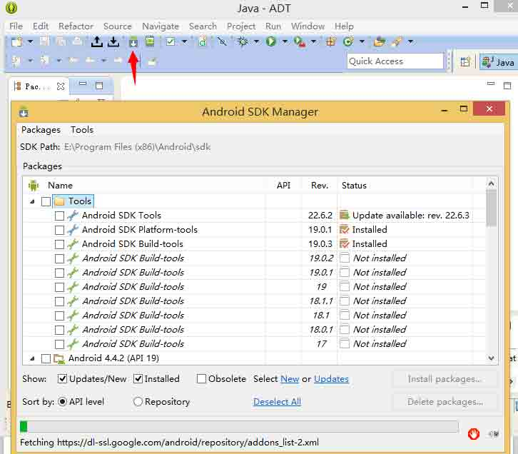

2、选择 TOOLs 下的 Manager AVDS

3、启动之后，设置如下配置

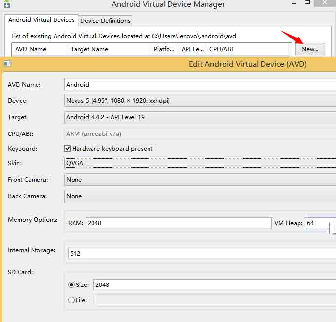

4、通过 Start 开启安卓虚拟机

5、界面如图

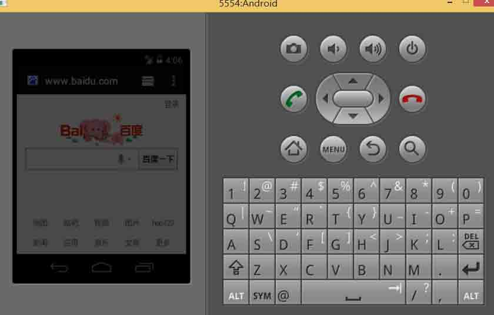

### 配置代理

1、Burp 代理设置如下

2、安卓模拟器设置，Menu>System setting>More>Mobile networks>Access Point Names> 选择默认的 APN 或者新建一个并且设置为默认代理

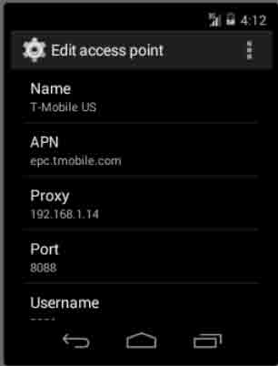

3、保存好了之后打开浏览器输入地址

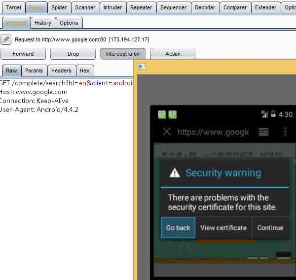

最后附上刚下载的一个百度知道应用程序，也是可以抓包的

具体详情参考：http://resources.infosecinstitute.com/android-application-penetration-testing-setting-certificate-installation-goatdroid-installation/

## 0x02 Android 手机 Proxy for Burpsuite

* * *

### 准备条件

首先安卓手机要跟电脑同一个网段，连接到同一个 wifi 下就可以了，我这里 网关是 192.168.1.1 物理机 192.168.1.5 手机 ip 192.168.1.2

### 配置

1)手机设置： 打开手机-->设置->WLAN-->选择你的 wifi 进入编辑，在代理这里设置为手动，设置如下 主机名：192.168.1.5 //也就是我物理机的 ip 端口：8088 保存即可。

2)Burp Suite 设置

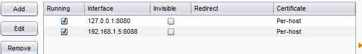

### 导入证书到手机中

导入证书到手机中其实也很简单，就是把电脑上已经安装好的证书导出来到内存卡中，然后从内存卡中安装证书

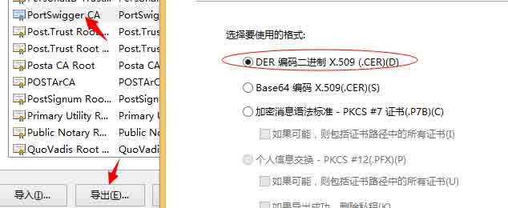

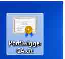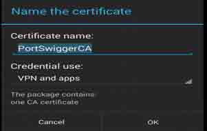

然后命令为 PortSwigger CA 导出到桌面，复制到内存卡中步骤如下： 打开手机-->设置-->安全和隐私-->凭据存储-->从存储设备安装,选择你刚才证书存放的路径，安装即可。 如果安装好了，就可以在安全和隐私-->凭据存储-->受信任的凭据-->用户下即可查看到

## 0x03 暴力破解

* * *

### 0-9,a-z 情况

选择 Payload type 里的 Brute forcer（暴力破解）,在下面 Payload options 选项会出现组合的一些字母或数字，可以自己加，比如一些特殊字符什么的，生成的字段长度范围 Min length-Max length，比如这里我只是需要 4 个，那就两个都写 4。

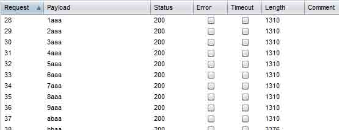

### 用户名自动生成

根据提供的用户名然后进行拆分

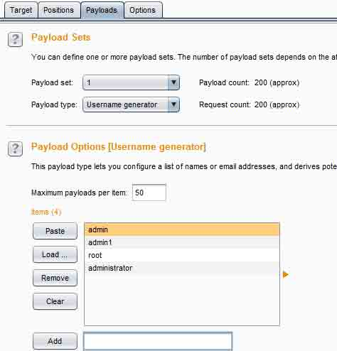

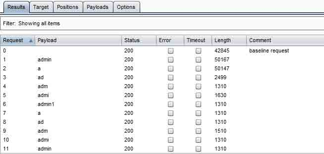

### 日期型爆破

年月日都可以自己定义，有几种可选，如下

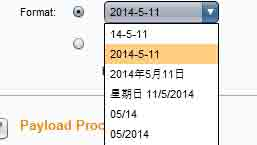

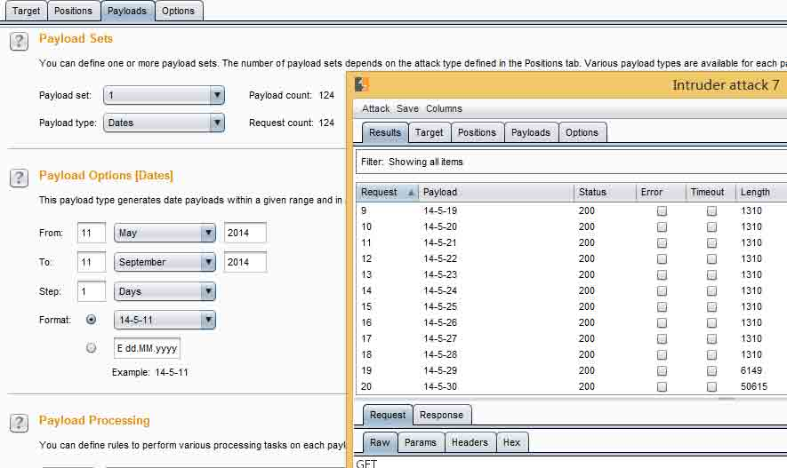

### 编码 frobber

说白了就是第二个值会替换前一个值

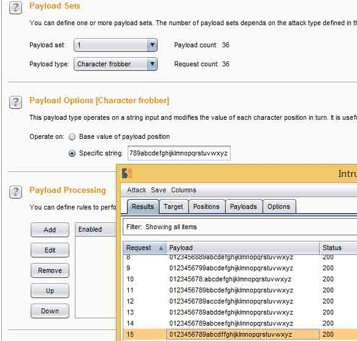

## 0x04 导出符合爆破规则的数据

* * *

### 查找符合结果的数据

比如我想把 Length 为 1310 的数据导出来，则可以先对 length 排序下，然后选择 length 为 1310 的所有数据右击选择高亮(随便选择一种颜色，除了白色，默认情况是白色)

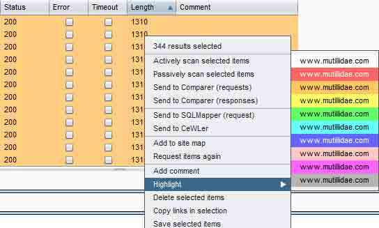

### 筛选出符合的数据

点击 Filter，勾选 show only highlighted items(表示显示仅仅显示高亮项)

同理也可以在上述步骤中选择添加注释(add commented),这里就应该选择 show only commented items

### 导出结果

如满足以上操作，即可选择 Save-->Result table，即弹出如下窗口

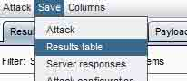

这里 all rows 是保存你所有选择的到的结果，selected rows 是导出你选择的数据， Save header row 如果勾选，则保存导航字段名，Delimiter 表示字段之间以什么相隔开 tab--一个 tab 键，Custom--自定义 下面有一些就是保存的时候需要保持什么就勾选，反之。

## 0x05 批量 md5 解密

* * *

### 准备

我们把需要爆破的 md5 值或者其他的需要爆破的同一放到一个 txt 文本里，这里我随便加密了几个放到里面

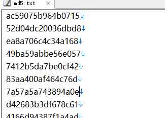

以 www.cmd5.com 网站为例做的批量解密 首先，还是同样的设置好代理之后访问 www.cmd5.com,然后抓包

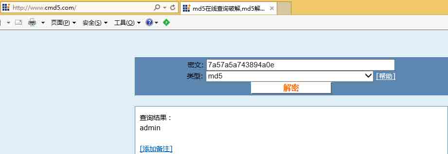

在密文处其实可以随便写什么，但是为了便于我们后面能够直接看出解密出的值我们还是写一个正常的。

### 设置 intruder

通过抓包到的数据我们可以看出我们填写的密文在哪

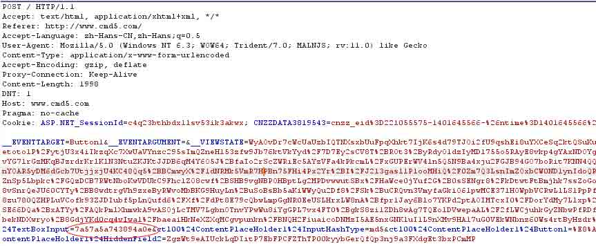

发送到 repeat 先，把我们想要的结果匹配到

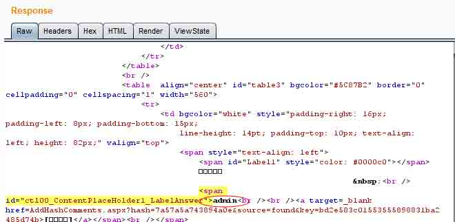

接着我们发送到 intruder,设置我们输入的值两边加上$

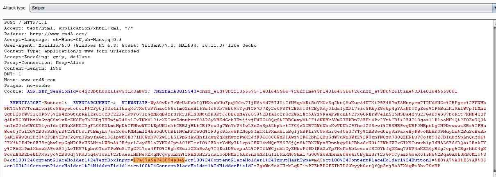

选择字典

再调节一下线程，最好是调低一点，太高了可能会解密失败，而且设置解密失败重试 2 次最好了

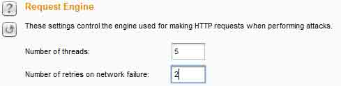

匹配解密出的结果

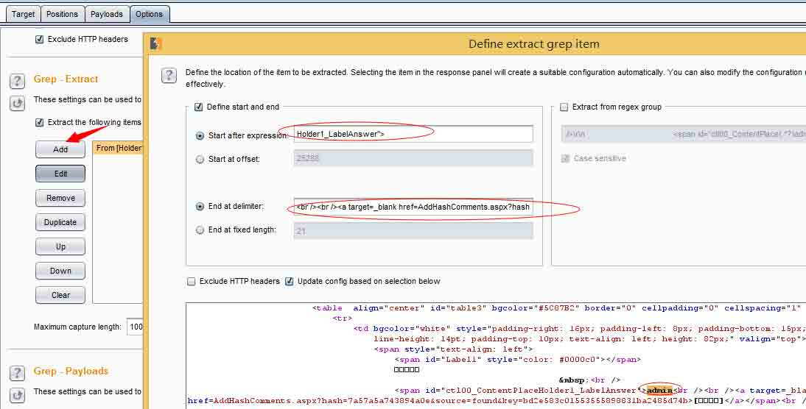

### 开始解密

点击 start attack

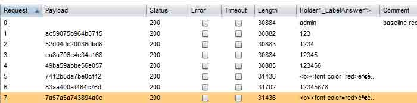

解密效果，后面导出就不用讲了，看过前面的应该就知道怎么导出想要的结果。

版权声明：未经授权禁止转载 [小乐天](http://drops.wooyun.org/author/小乐天 "由 小乐天 发布")@[乌云知识库](http://drops.wooyun.org)

分享到：

### 相关日志

*   [Burp Suite 使用介绍（四）](http://drops.wooyun.org/tips/2504)
*   [charles 使用教程指南](http://drops.wooyun.org/tips/2423)
*   [InsightScan:Python 多线程 Ping/端口扫描 + HTTP 服务/APP 探测，可生成 Hydra 用的 IP 列表](http://drops.wooyun.org/tools/427)
*   [metasploit 渗透测试笔记(内网渗透篇)](http://drops.wooyun.org/tips/2746)
*   [Cobalt Strike 之团队服务器的搭建与 DNS 通讯演示](http://drops.wooyun.org/tools/1475)
*   [Burp Suite 使用介绍（一）](http://drops.wooyun.org/tools/1548)