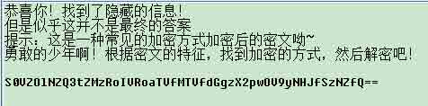
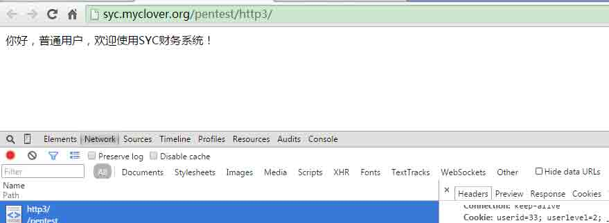

# 第五季极客大挑战 writeup

2014/11/03 16:22 | [F1uYu4n](http://drops.wooyun.org/author/F1uYu4n "由 F1uYu4n 发布") | [技术分享](http://drops.wooyun.org/category/tips "查看 技术分享 中的全部文章") | 占个座先 | 捐赠作者

## 0x01 misc

* * *

**too young too simple**

一个叫 flag.bmp 的文件，但是无法打开。文件头 42 4D 确实是 bmp 文件的头，但是文件尾 `49 45 4E 44 AE 42 60 82`却是 png 文件的尾。


另外文件头中的 IHDR 也能确信这是一个 png 图片。将文件头的 `42 4D E3 BF 22 00 00 00`修改为 png 头 `89 50 4E 47 0D 0A 1A 0A`，顺利打开得到一张图片。


图上是 appleu0 大神的 blog 地址，后面的提示意味不明。搜了下`weichuncai`并访问 blog 才知道这是 blog 上的动漫人物。与之聊天输入 flag 得到 Flag。Flag 貌似是海贼王里的。大神果然是十足的动漫控啊！


**你喜不喜欢萌萌哒的姐姐**

一张 loli 的图，在 jpg 尾 FF D9 后还有很多可显字符。


全部复制出来，看编码应该是 base64，放到 hackbar 里 base64decode 一下，却得到很多不可显字符，但是发现了 JFIF 标识，应该是 base64encode 了一张图片得到的。


下面是解码脚本。

```
import base64

f = open('1.jpg', 'rb')
pic = f.read()
index = pic.find('\xff\xd9')
flag = pic[index + 5:]
f.close()

f1 = open('flag.jpg', 'w')
f1.write(base64.decodestring(flag))
f1.close()

```

运行得到 flag.jpg。


**开胃小菜**

题目要求修改参赛口号为 Hacked by white god!。

在个人信息页面`http://hack.myclover.org/team_info`的 HTML 注释中发现提示：


更新口号翻译为 upvoice，简直不忍直视，不能再 low。 访问 `http://hack.myclover.org/team_info/upvoice?voice=Hacked+by+white+god!`得到 Flag。


**白神的假期**

一张 jpg 图片，在文件尾 FF D9 后还有不少内容，而且是 rar 文件头`52 61 72 21`。


复制出剩下的部分成 rar 文件解压得到 flag.txt。



在 base64decode 一下就得到 Flag：`KEY:SYC{Y34h!Thi5_15_th3_jp9_r4r_K3Y}`

**reg**


看到 com 啥的基本上就知道这肯定是个 url 了，再加上开始部分 twi 以及 com 之前的部分是从 syclover 中取，就能猜出是 twitter.com，追加上后面的 asdlalalalala 得到 url：`twitter.com/asdlalalalala`，访问 url 得到 Flag。


**bilibili**

最坑的题没有之一。出题者丧心病狂居然要求通过 bilibili 的会员晋级考试，还得至少 80 分。好不容易通过修改 HTML 代码弄出了一张通过图，竟然还要关注出题者。无奈只好仔细百度做题，还好这时候只需要 60 就晋级成功，出题者也无法分辨我到底是 60 还是 80。  

## 0x02 pentest

* * *

**HTTP Base1**

Flag 在 HTTP response header 中。


**HTTP Base2**


题目要求必须本机访问，开始以为加上 X-Forwarder-For: 127.0.0.1 到 request header 中就能解决，后来才知道也有从 Client-IP 来判断访问者来路的，于是填上 Client-IP: 127.0.0.1 到 request header 中得到 Flag。


**HTTP Base3**



题目显示访问者是普通用户，所以思路是变成管理员，再加上 cookie 中发现有：userid=33; userlevel=2;于是将 userid 和 userlevel 都置为 1，再次访问得到 Flag。


**CrackPWD1**


直接上 ophcrack。Ophcrack 基于彩虹表来破解 hash 口令，特别是针对 XP 的 LM-NT hash，成功率很高。 下载地址：

```
http://sourceforge.jp/projects/ophcrack/releases/

http://sourceforge.net/projects/ophcrack/files/ 
```


**CrackPWD2**


提示口令起始为`SYC#`且长度为 8，只需要生成一份包含所有可能性的字典交给工具跑。后 4 位每位上可见字符一共 94 个，字典大小为 94 的 4 次方行，约 7800w。


再加上毛子强大的工具 oclhashcat（http://hashcat.net/oclhashcat/），几乎是秒破口令。oclhashcat 是一款使用 GPU 显卡来破密码的工具，分为 N 卡版和 A 卡版，号称世界上最快的密码破解器。 运行命令：

```
cudaHashcat64.exe -t 32 -m 1000 NT.hash pass.dic 
```


**美男子**


按提示需要认证为美男子。查看 cookie 发现是： `user=diaosi; isboy=0; pass=d93fa3b25f83f202cc51257eee2c9207;`访问者被设为 diaosi 了，不能忍，果断修改 us`er=meinanzi; isboy=1;`刷新得到 Flag。


Cookie 中的 md5 解开是 ds0，没用上。

**Login**


以`username=appleU0&password=syclover`登录，发现一行提示 Tips: coverage login。 各种搜索不知道啥叫覆盖登录。各种乱想终于想到是覆盖 login，变量覆盖漏洞。经历 ISCC2014 的变量覆盖题，猜变量名是一件头大的事。我设想了几个可能的变量名：

```
admin\flag\key\KEY\user\login\submit 
```

以及可能的值： `1\true\flag\key\admin\flag\login`，爆破了下没有结果，甚至连中文的值都试过，登录\提交，无果。最终觉得既然是覆盖 login，变量名应该就是 login，于是在 GET 的 url 后面添加上?login=1，尝试了下得到 Flag。


**白神的 shell**


直接上代码吧，多线程也不会，跑的慢点，不过也能出结果。

```
import httplib

s = 'zxcvbnmasdfghjklqwertyuiop'
length = len(s)
uri = '/pentest/findshell/white_god_s_webshell_'
conn = httplib.HTTPConnection("syc.myclover.org")

for i in range(length):
    for j in range(length):
        for k in range(length):
            conn.request("GET", uri + s[i] + s[j] + s[k] + ".php")
            response = conn.getresponse()
            response.read()
            if response.status == 200:
                print "white_god_s_webshell_%s%s%s" % (s[i], s[j], s[k]) + ".php"
                exit()

```


**德玛西亚**


下载的 dhs 文件可以用 7z 解压缩，打开解压的文件发现内容是某用户访问 baidu 的 cookie，于是可以用劫持到的 cookie 冒充该用户登录百度。


利用 hackbar 修改 cookie，刷新登录百度，该用户的 baidu id 是 dsploit_test。开始以为 flag 会在网盘、文库等地方，找了下没找到，回到个人中心，发现用户有贴吧操作痕迹，果断查看发帖和回帖发现 Flag。


**Web Base1**

简单的 Get 型注入。

```
python sqlmap.py –u http://syc.myclover.org/pentest/web1/read.php?id=1 --dbms mysql -D webbase1 -T flag --dump 
```


**Web Base2**

Post 搜索型注入。

```
python sqlmap.py –u http://syc.myclover.org/pentest/web2/search.php --data “key=my” --dbms mysql -D webbase2 -T #flag --dump 
```


**SQL 注入**

链接是 sqlmap.org 的山寨页面，在 http response header 里发现提示，index.php?id=。分别取 id=1/2/3/4，页面与默认页面均不同。id=4-1 与 id=3 一样，id=2%2B1 与 id=3 也一样，id 应该就是所需要的注入点了。 如果直接上 sqlmap 的话，会发现有 mysql 的 payload，但是 sqlmap 无法识别 database 类型。


在尝试多个 tamper 之后，发现对关键字进行保护(对关键字添加/*!*/，如/!*select*/)的 versionedmorekeywords.py 能有斩获，payload 发生了变化，也可以跑出一个数据库。


MySQL 的表结构都存放在 information_schema 中，不能访问这个库，就无法知道 sqli 库的结构，使用 common-tables 爆破表名也未果。下图中无法获取数据库的个数，当时觉得可能是过滤了 information_schema，也没有想到好的绕过方法，至此暂时陷入了僵局。


两天后，主办方在页面注释中给出了新提示，

> 分享到：

### 相关日志

*   [360hackgame writeup](http://drops.wooyun.org/tips/1666)
*   [使用 netcat 进行反弹链接的 shellcode](http://drops.wooyun.org/tips/1376)
*   [RFID 之 M1 卡数据分析](http://drops.wooyun.org/tips/3168)
*   [逆向基础（三）](http://drops.wooyun.org/tips/1963)
*   [撞库扫号防范](http://drops.wooyun.org/tips/2830)
*   [GSM Hackeing 之 SMS Sniffer 学习](http://drops.wooyun.org/tips/723)