# 攻击 JavaWeb 应用[2]-CS 交互安全

2013/07/08 14:54 | [园长](http://drops.wooyun.org/author/园长 "由 园长 发布") | [web 安全](http://drops.wooyun.org/category/web "查看 web 安全 中的全部文章"), [技术分享](http://drops.wooyun.org/category/tips "查看 技术分享 中的全部文章") | 占个座先 | 捐赠作者

##### 注:本节意在让大家了解客户端和服务器端的一个交互的过程,我个人不喜欢 xss,对 xss 知之甚少所以只能简要的讲解下。这一节主要包含 HttpServletRequest、HttpServletResponse、session、cookie、HttpOnly 和 xss,文章是年前几天写的本应该是有续集的但年后就没什么时间去接着续写了。由于工作并非安全行业，所以写的并不算专业希望大家能够理解。后面的章节可能会有 Java 里的 SQL 注入、Servlet 容器相关、Java 的框架问题、eclipse 代码审计等。

### 0x00 Request & Response(请求与响应)

* * *

请求和响应在 Web 开发当中没有语言之分不管是 ASP、PHP、ASPX 还是 JAVAEE 也好，Web 服务的核心应该是一样的。

在我看来 Web 开发最为核心也是最为基础的东西就是 Request 和 Response！我们的 Web 应用最终都是面向用户的，而请求和响应完成了客户端和服务器端的交互。 服务器的工作主要是围绕着客户端的请求与响应的。

如下图我们通过 Tamper data 拦截请求后可以从请求头中清晰的看到发出请求的客户端请求的地址为：localhost。

浏览器为 FireFox，操作系统为 Win7 等信息，这些是客户端的请求行为，也就是 Request。 

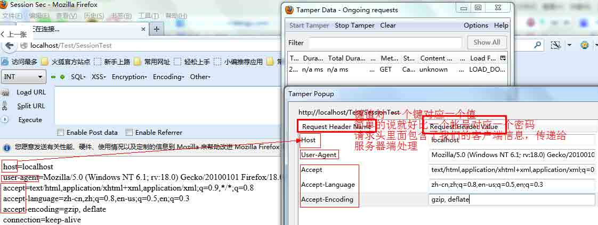

当客户端发送一个 Http 请求到达服务器端之后，服务器端会接受到客户端提交的请求信息(HttpServletRequest)，然后进行处理并返回处理结(HttpServletResopnse)。

下图演示了服务器接收到客户端发送的请求头里面包含的信息： 

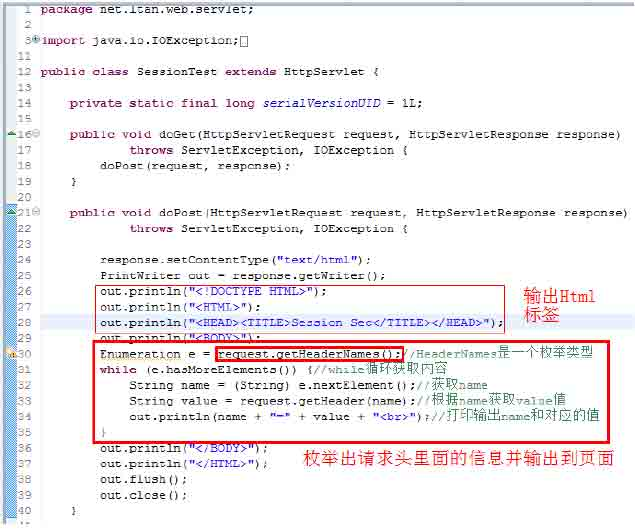

页面输出的内容为：

```
 host=localhost

user-agent=Mozilla/5.0 (Windows NT 6.1; rv:18.0) Gecko/20100101 Firefox/18.0

accept=text/html,application/xhtml+xml,application/xml;q=0.9,*/*;q=0.8

accept-language=zh-cn,zh;q=0.8,en-us;q=0.5,en;q=0.3

accept-encoding=gzip, deflate

connection=keep-alive 
```

#### 请求头信息伪造 XSS

关于伪造问题我是这样理解的:发送 Http 请求是客户端的主动行为，服务器端通过 ServerSocket 监听并按照 Http 协议去解析客户端的请求行为。

所以请求头当中的信息可能并不一定遵循标准 Http 协议。

用 FireFox 的 Tamper Data 和 Moify Headers（FireFox 扩展中心搜 Headers 和 Tamper Data 都能找到） 插件修改下就实现了，请先安装 FireFox 和 Tamper Data：  点击 Start Tamper 然后请求 Web 页面，会发现请求已经被 Tamper Data 拦截下来了。选择 Tamper：

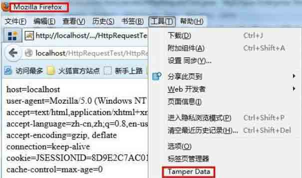

点击 Start Tamper 然后请求 Web 页面，会发现请求已经被 Tamper Data 拦截下来了。选择 Tamper：

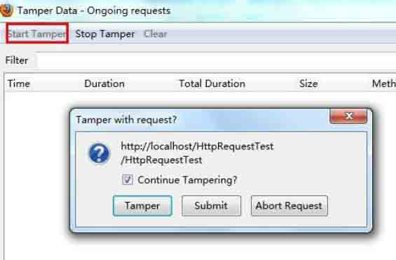

修改请求头信息： 

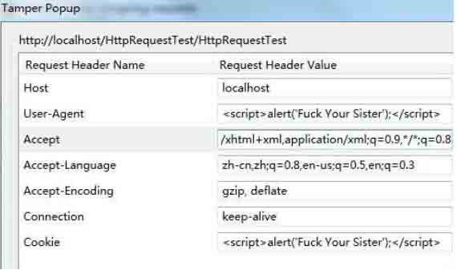

Servlet Request 接受到的请求：

```
Enumeration e = request.getHeaderNames();
while (e.hasMoreElements()) {
    String name = (String) e.nextElement();//获取 key
    String value = request.getHeader(name);//得到对应的值
    out.println(name + "=" + value + "<br>");//输出如 cookie=123
} 
```

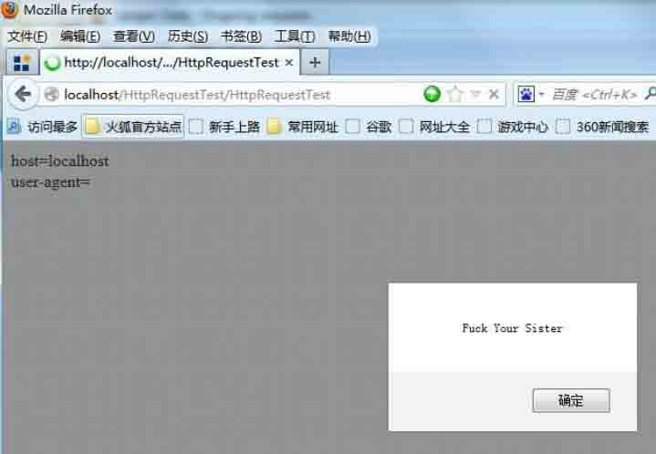

源码下载：[`pan.baidu.com/share/link?shareid=166499&uk=2332775740`](http://pan.baidu.com/share/link?shareid=166499&uk=2332775740)

使用 Moify Headers 自定义的修改 Headers:

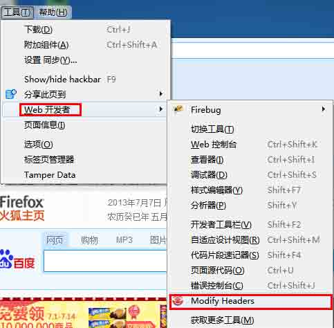

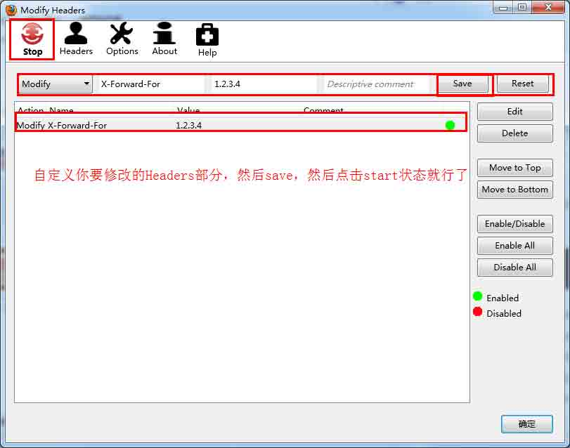

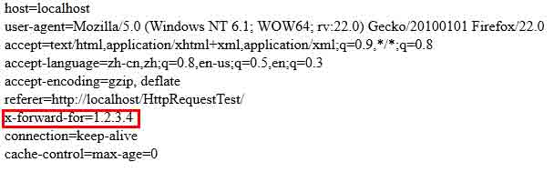

修改请求头的作用是在某些业务逻辑下程序猿需要去记录用户的请求头信息到数据库，而通过伪造的请求头一旦到了数据库可能造成 xss，或者在未到数据库的时候就造成了 SQL 注入，因为对于程序员来说，大多数人认为一般从 Headers 里面取出来的数据是安全可靠的，可以放心的拼 SQL(记得好像 Discuz 有这样一个漏洞)。今年一月份的时候我发现 xss.tw 也有一个这样的经典案例，Wdot 那哥们在记录用户的请求头信息的时候没有去转意特殊的脚本，导致我们通过伪造的请求头直接存储到数据库。

XSS.tw 平台由于没有对请求头处理导致可以通过 XSS 屌丝逆袭高富黑。 刚回来的时候被随风玩爆菊了。通过修改请求头信息为 XSS 脚本，xss 那平台直接接收并信任参数，因为很少有人会蛋疼的去怀疑请求头的信息，所以这里造成了存储型的 XSS。只要别人一登录 xss 就会自动的执行我们的 XSS 代码了。

Xss.tw 由于 ID 很容易预测，所以很轻易的就能够影响到所有用户：

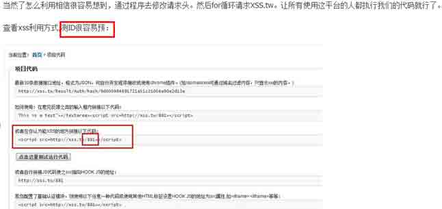

于是某一天就有了所有的 xss.tw 用户被随风那 2 货全部弹了 www.gov.cn: 

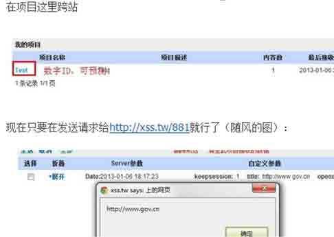

#### Java 里面伪造 Http 请求头

代码就不贴了，在发送请求的时候设置 setRequestProperty 就行了，如：

```
URL realUrl = new URL(url);
URLConnection connection = realUrl.openConnection();
connection.setConnectTimeout(5000);//连接超时
connection.setReadTimeout(5000);// 读取超时
connection.setRequestProperty("accept", "*/*");
connection.setRequestProperty("connection", "Keep-Alive");
(………………………..) 
```

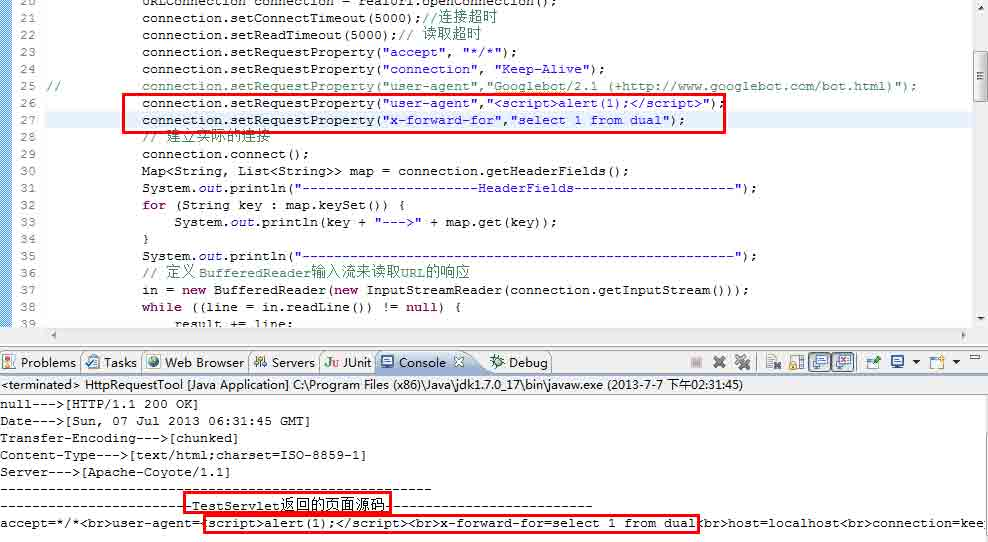

Test Servlet:

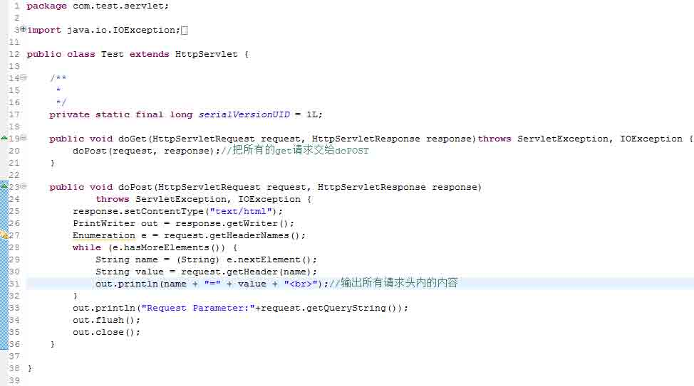 

### 0x01 Session

* * *

Session 是存储于服务器内存当中的会话，我们知道 Http 是无状态协议，为了支持客户端与服务器之间的交互，我们就需要通过不同的技术为交互存储状态，而这些不同的技术就是 Cookie 和 Session 了。

设置一个 session:

```
session.setAttribute("name",name);//从请求中获取用户的 name 放到 session 当中

session.setAttribute("ip",request.getRemoteAddr());//获取用户请求 Ip 地址
out.println("Session 设置成功."); 
```

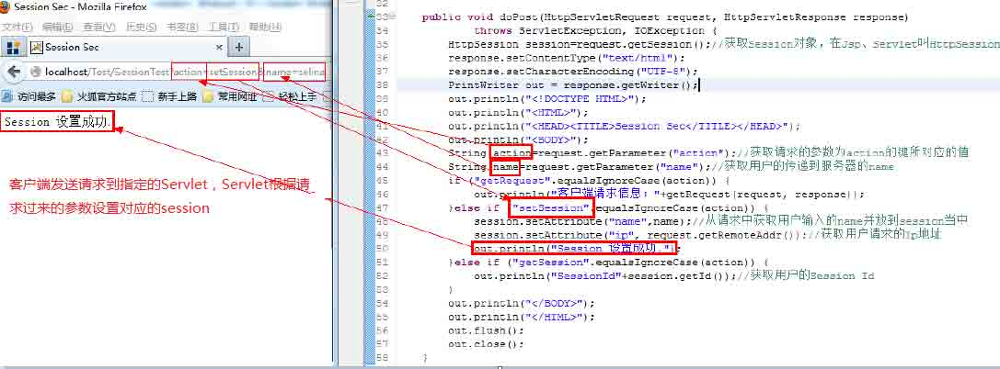

直接获取 session 如下图可以看到我们用 FireFox 和 Chrome 请求同一个 URL 得到的 SessionId 并不一样，说明 SessionId 是唯一的。一旦 Session 在服务器端设置成功那么我们在此次回话当中就可以一直共享这个 SessionId 对应的 session 信息，而 session 是有有效期的，一般默认在 20-30 分钟，你会看到 xss 平台往往有一个功能叫 keepSession，每过一段时间就带着 sessionId 去请求一次，其实就是在保持 session 的有效不过期。

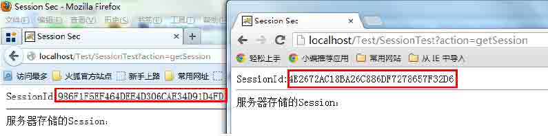

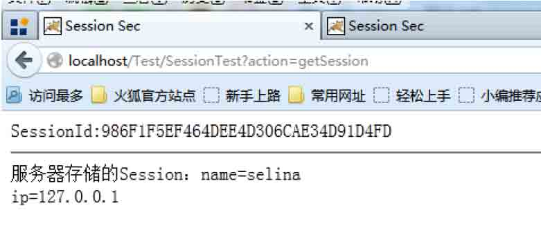

#### Session 生命周期(从创建到销毁)

1、session 的默认过期时间是 30 分钟，可修改的最大时间是 1440 分钟（1440 除以 60=24 小时=1 天）。

2、服务器重启或关闭 Session 失效。

##### 注：浏览器关闭其实并不会让 session 失效！因为 session 是存储在服务器端内存当中的。客户端把浏览器关闭了服务器怎么可能知道？正确的解释或许应该是浏览器关闭后不会去记忆关闭前客户端和服务器端之间的 session 信息且服务器端没有将 sessionId 以 Cookie 的方式写入到客户端缓存当中，重新打开浏览器之后并不会带着关闭之前的 sessionId 去访问服务器 URL，服务器从请求中得不到 sessionId 自然给人的感觉就是 session 不存在（自己理解的）。

当我们关闭服务器时 Tomcat 会在安装目录 workCatalinalocalhost 项目名目录下建立 SESSIONS.ser 文件。此文件就是 Session 在 Tomcat 停止的时候 持久化到硬盘中的文件. 所有当前访问的用户 Session 都存储到此文件中. Tomcat 启动成功后.SESSIONS.ser 又会反序列化到内存中,所以启动成功后此文件就消失了. 所以正常情况下 从启 Tomcat 用户是不需要登录的. 注意有个前提，就是存储到 Session 里面的 user 对象所对应的 User 类必须要序列化才可以。（摘自：[`alone-knight.iteye.com/blog/1611112`](http://alone-knight.iteye.com/blog/1611112)）

#### SessionId 是神马？有什么用？

我们不妨来做一个偷取 sessionId 的实验： 首先访问：http://localhost/Test/SessionTest?action=setSession&name=selina 完成 session 的创建，如何建立就不解释了如上所述。

同时开启 FireFox 和 Chrome 浏览器设置两个 Session： 

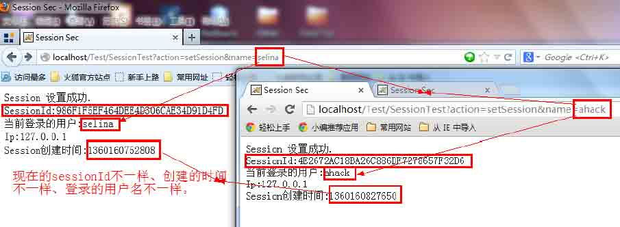

我们来看下当前用户的请求头分别是怎样的： 

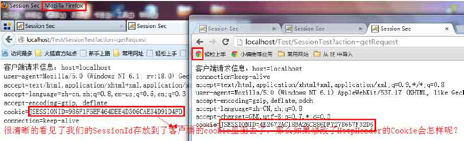

我们依旧用 TamperData 来修改请求的 Cookie 当中的 jsessionId，下面是见证奇迹的时刻： 

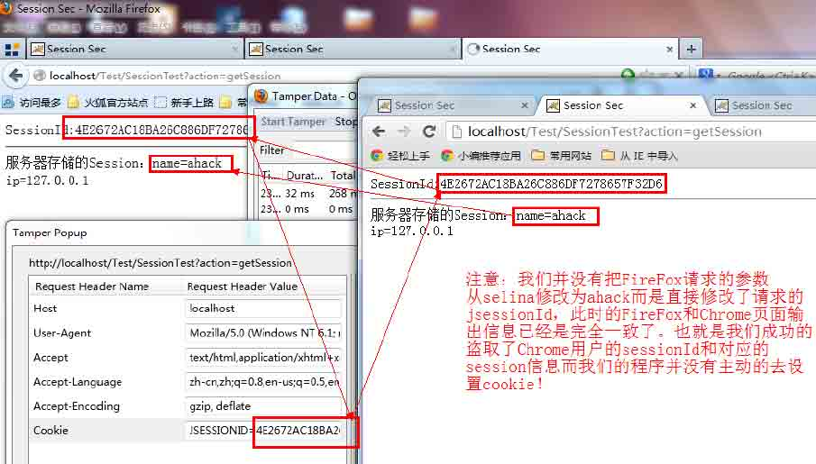

我要说的话都已经在图片当中的文字注释里面了，伟大的 Xss 黑客们看明白了吗？你盗取的也许是 jsessionId(Java 里面叫 jsessionId)，而不只是 cookie。那么假设我们的 Session 被设置得特别长那么这个 SessionId 就会长时间的保留，而为 Xss 攻击提供了得天独厚的条件。而这种 Session 长期存在会浪费服务器的内存也会导致：SessionFixation 攻击！

#### 如何应对 SessionFixation 攻击

1、用户输入正确的凭据，系统验证用户并完成登录，并建立新的会话 ID。

2、Session 会话加 Ip 控制

3、加强程序员的防范意识：写出明显 xss 的程序员记过一次，写出隐晦的 xss 的程序员警告教育一次，连续查出存在 3 个及其以上 xss 的程序员理解解除劳动合同(哈哈，开玩笑了)。

### 0x02 Cookie

* * *

Cookie 是以文件形式[缓存在客户端]的凭证(精简下为了通俗易懂)，cookie 的生命周期主要在于服务器给设置的有效时间。如果不设置过期时间，则表示这个 cookie 生命周期为浏览器会话期间，只要关闭浏览器窗口，cookie 就消失了。 这次我们以 IE 为例：

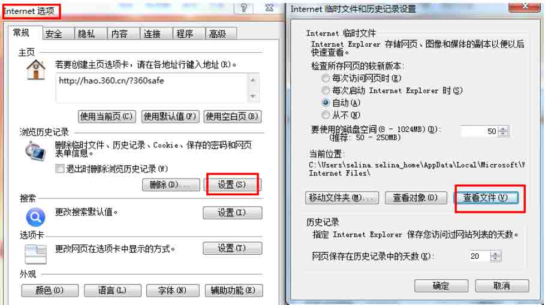

我们来创建一个 Cookie：

```
if(!"".equals(name)){

           Cookie cookies = new Cookie("name",name);//把用户名放到 cookie

           cookies.setMaxAge(60*60*60*12*30) ;//设置 cookie 的有效期

    //     c1.setDomain(".ahack.net");//设置有效的域

       response.addCookie(cookies);//把 Cookie 保存到客户端

           out.println("当前登录:"+name);
}else {

           out.println("用户名不能为空!");

} 
```

有些大牛级别的程序员直接把帐号密码明文存储到客户端的 cookie 里面去，不得不佩服其功力深厚啊。客户端直接记事本打开就能看到自己的帐号密码了。

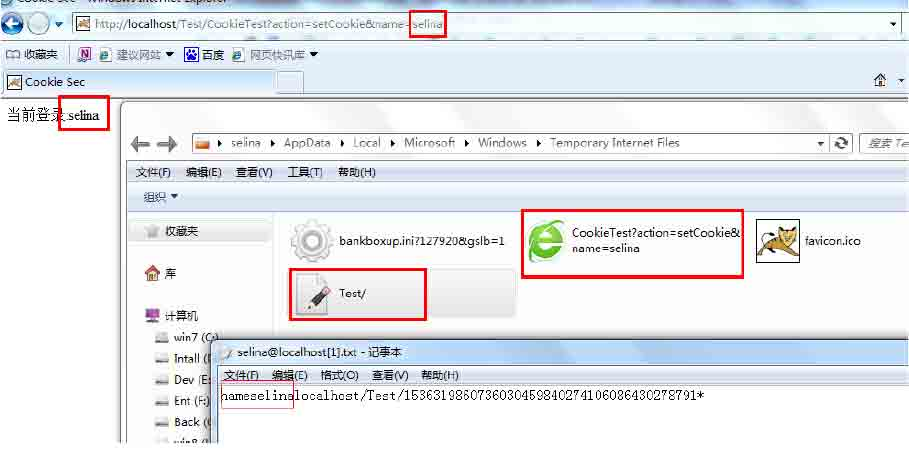

继续读取 Cookie：

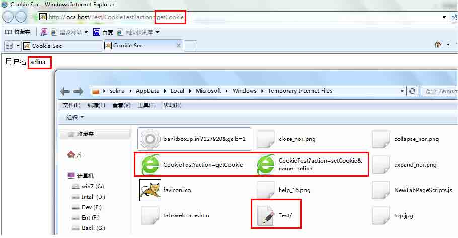

我想 cookie 以明文的形式存储在客户端我就不用解释了吧？文件和数据摆在面前！ 盗取 cookie 的最直接的方式就是 xss，利用 IE 浏览器输出当前站点的 cookie：

```
javascript:document.write(document.cookie)

     
```

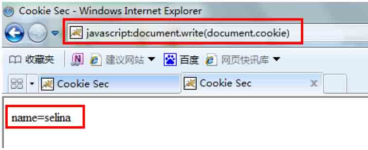

首先我们用 FireFox 创建 cookie： 

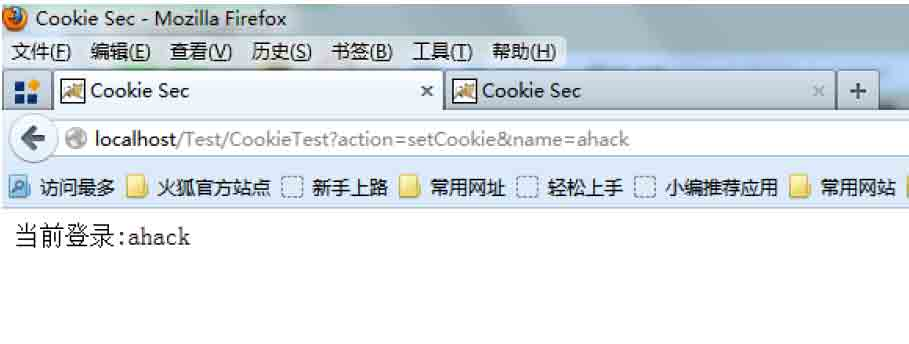

然后 TamperData 修改 Cookie：

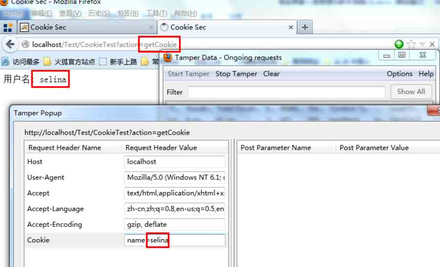

一般来说直接把 cookie 发送给服务器服务器，程序员过度相信客户端 cookie 值那么我们就可以在不用知道用户名和密码的情况下登录后台，甚至是 cookie 注入。jsessionid 也会放到 cookie 里面，所以拿到了 cookie 对应的也拿到了 jsessionid，拿到了 jsessionid 就拿到了对应的会话当中的所有信息，而如果那个 jsessionid 恰好是管理员的呢？

### 0x03 HttpOnly

* * *

上面我们用

```
javascript:document.write(document.cookie) 
```

通过 document 对象能够拿到存储于客户端的 cookie 信息。

HttpOnly 设置后再使用 document.cookie 去取 cookie 值就不行了。

通过添加 HttpOnly 以后会在原 cookie 后多出一个 HttpOnly;

普通的 cookie 设置：

```
Cookie: jsessionid=AS348AF929FK219CKA9FK3B79870H; 
```

加上 HttpOnly 后的 Cookie：

```
Cookie: jsessionid=AS348AF929FK219CKA9FK3B79870H; HttpOnly; 
```

（参考 YearOfSecurityforJava）

在 JAVAEE6 的 API 里面已经有了直接设置 HttpOnly 的方法了：  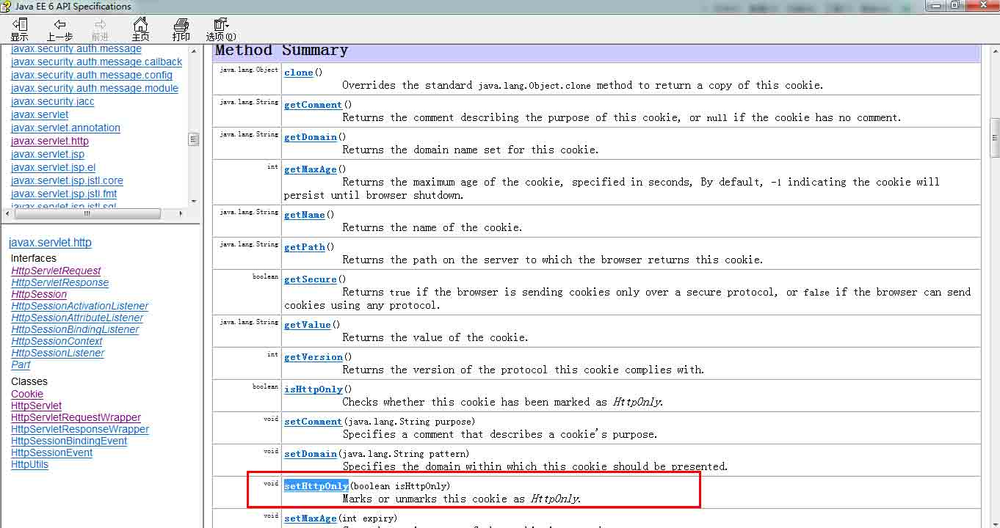

API 的对应说明：

大致的意思是：如果 isHttpOnly 被设置成 true，那么 cookie 会被标识成 HttpOnly.能够在一定程度上解决跨站脚本攻击。  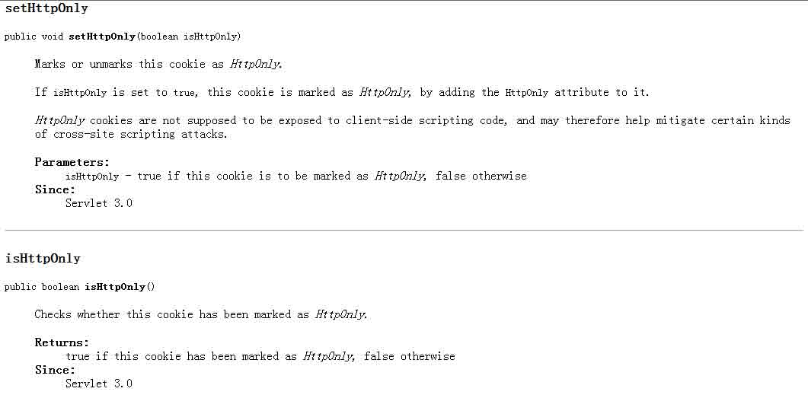

在 servlet3.0 开始才支持直接通过 setHttpOnly 设置,其实就算不是 JavaEE6 也可以在 set Cookie 的时候加上 HttpOnly; 让浏览器知道你的 cookie 需要以 HttpOnly 方式管理。而 ng a 在新的 Servlet 当中不只是能够通过手动的去 setHttpOnly 还可以通过在 web.xml 当中添加 cookie-config(HttpOnly 默认开启,注意配置的是 web-app_3_0.xsd):

```
<?xml version="1.0" encoding="UTF-8"?>
<web-app version="3.0" 

    xsi:schemaLocation="http://java.sun.com/xml/ns/javaee 
    http://java.sun.com/xml/ns/javaee/web-app_3_0.xsd">
    <session-config>
        <cookie-config>
            <http-only>true</http-only>
            <secure>true</secure>
        </cookie-config>
    </session-config>
    <welcome-file-list>
        <welcome-file>index.jsp</welcome-file>
    </welcome-file-list>
</web-app> 
```

还可以设置下 session 有效期(30 分)：

```
<session-timeout>30</session-timeout> 
```

### 0x04 CSRF (跨站域请求伪造)

* * *

CSRF（Cross Site Request Forgery, 跨站域请求伪造）用户请求伪造，以受害人的身份构造恶意请求。(经典解析参考：http://www.ibm.com/developerworks/cn/web/1102_niugang_csrf/ )

#### CSRF 攻击的对象

在讨论如何抵御 CSRF 之前，先要明确 CSRF 攻击的对象，也就是要保护的对象。从以上的例子可知，CSRF 攻击是黑客借助受害者的 cookie 骗取服务器的信任，但是黑客并不能拿到 cookie，也看不到 cookie 的内容。另外，对于服务器返回的结果，由于浏览器同源策略的限制，黑客也无法进行解析。因此，黑客无法从返回的结果中得到任何东西，他所能做的就是给服务器发送请求，以执行请求中所描述的命令，在服务器端直接改变数据的值，而非窃取服务器中的数据。所以，我们要保护的对象是那些可以直接产生数据改变的服务，而对于读取数据的服务，则不需要进行 CSRF 的保护。比如银行系统中转账的请求会直接改变账户的金额，会遭到 CSRF 攻击，需要保护。而查询余额是对金额的读取操作，不会改变数据，CSRF 攻击无法解析服务器返回的结果，无需保护。

#### Csrf 攻击方式

对象：A：普通用户，B：攻击者

```
1、假设 A 已经登录过 xxx.com 并且取得了合法的 session，假设用户中心地址为：http://xxx.com/ucenter/index.do
2、B 想把 A 余额转到自己的账户上，但是 B 不知道 A 的密码，通过分析转账功能发现 xxx.com 网站存在 CSRF 攻击漏洞和 XSS 漏洞。
3、B 通过构建转账链接的 URL 如：http://xxx.com/ucenter/index.do?action=transfer&money=100000 &toUser=(B 的帐号)，因为 A 已经登录了所以后端在验证身份信息的时候肯定能取得 A 的信息。B 可以通过 xss 或在其他站点构建这样一个 URL 诱惑 A 去点击或触发 Xss。一旦 A 用自己的合法身份去发送一个 GET 请求后 A 的 100000 元人民币就转到 B 账户去了。当然了在转账支付等操作时这种低级的安全问题一般都很少出现。 
```

#### 防御 CSRF：

```
验证 HTTP Referer 字段
在请求地址中添加 token 并验证
在 HTTP 头中自定义属性并验证
加验证码
 (copy 防御 CSRF 毫无意义，参考上面给的 IBM 专题的 URL) 
```

最常见的做法是加 token,Java 里面典型的做法是用 filter：[`code.google.com/p/csrf-filter/`](https://code.google.com/p/csrf-filter/)(链接由 plt 提供，源码上面的在：[`ahack.iteye.com/blog/1900708`](http://ahack.iteye.com/blog/1900708))

CSRF 的介绍 drops 已有文章，可以参考：[`drops.wooyun.org/papers/155`](http://drops.wooyun.org/papers/155)

**Tags:** [java 安全](http://drops.wooyun.org/tag/java%e5%ae%89%e5%85%a8)

版权声明：未经授权禁止转载 [园长](http://drops.wooyun.org/author/园长 "由 园长 发布")@[乌云知识库](http://drops.wooyun.org)

分享到：

### 相关日志

*   [攻击 JavaWeb 应用[1]-JavaEE 基础](http://drops.wooyun.org/tips/163)
*   [Java 安全模型介绍](http://drops.wooyun.org/tips/53)
*   [Discuz!X 升级/转换程序 GETSHELL 漏洞分析](http://drops.wooyun.org/papers/929)
*   [攻击 JavaWeb 应用[3]-SQL 注入[1]](http://drops.wooyun.org/tips/236)
*   [攻击 JavaWeb 应用[6]-程序架构与代码审计](http://drops.wooyun.org/tips/429)
*   [常见的 HTTPS 攻击方法](http://drops.wooyun.org/tips/4403)