# WIFI 渗透从入门到精通

2014/10/28 15:56 | [末笔丶](http://drops.wooyun.org/author/末笔丶 "由 末笔丶 发布") | [无线安全](http://drops.wooyun.org/category/wireless "查看 无线安全 中的全部文章"), [渗透案例](http://drops.wooyun.org/category/pentesting "查看 渗透案例 中的全部文章") | 占个座先 | 捐赠作者

## 0×00 前言

* * *

写这篇文章的初衷也是因为狗哥的一篇[文章](http://daily.zhihu.com/story/4126951) 看到狗哥的这篇文章不禁感触.不过我还是想说一句不一定免费的 wifi 才有风险哦~~.

## 0×01 让小绵羊知道自己是怎么被黑的.

* * *

**路由器 wps 功能漏洞**

路由器使用者往往会因为步骤太过麻烦，以致干脆不做任何加密安全设定，因而引发许多安全上的问题。WPS 用于简化 Wi-Fi 无线的安全设置和网络管理。它支持两种模式：个人识别码(PIN)模式和按钮(PBC)模式。路由器在出产时默认都开启了 wps 但这真的安全么！在 2011 年 12 月 28 日，一名名叫 Stefan Viehbock 的安全专家宣布，自己发现了无线路由器中的 WPS（Wi-Fi Protected Setup）漏洞，利用这个漏洞可以轻易地在几小时内破解 WPS 使用的 PIN 码以连上无线路由器的 Wifi 网络。

**个人识别码(PIN)**

有人可能会问了什么是 pin 码？WPS 技术会随机产生一个八位数字的字符串作为个人识别号码（PIN）也就是你路由底部除了后台地址账号密码之后的一组八位数的数字，通过它可以快速登录而不需要输入路由器名称和密码等。

Pin 码会分成前半四码和后半四码。前四码如果错误的话，那路由器就会直接送出错误讯息，而不会继续看后四码，意味着试到正确的前四码，最多只需要试 10000 组号码。一旦没有错误讯息，就表示前四码是正确的，而我们便可以开始尝试后四码。 后四码比前四码还要简单，因为八码中的最后一码是检查码，由前面七个数字产生，因此实际上要试的只有三个数字，共一千个组合。这使得原本最高应该可达一千万组的密码组合（七位数+检查码），瞬间缩减到仅剩 11,000 组，大幅降低破解所需的时间.

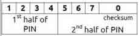

**根据路由 MAC 地址算出默认 pin 码**

另外有种更快破解 wifi 的方法就是根据路由 MAC 地址（MAC 是路由器的物理地址，是唯一的识别标志）算出默认出产时的 pin 码例如以下软件 还可以通过别人共享的找到 pin 码！http://mac-pin.456vv.net/


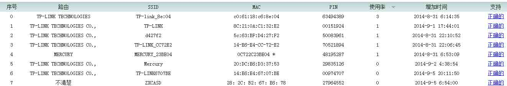

**抓取握手包破解**

提前条件是有客户端连接 wifi.另外作者是不会讲破解 wep 的.使用的小伙伴好自为之. 就简单介绍下原理吧 一个 TCP 包走进一家酒吧，对服务员说：“给我来瓶啤酒”。服务员说：“你要来瓶啤酒？”。TCP 包说：“是的，来瓶啤酒”服务员说:“好的”

1、当一个无线客户端与一个无线 AP 连接时，先发出连接认证请求（握手申请：你好！）

2、无线 AP 收到请求以后，将一段随机信息发送给无线客户端（你是？）

3、无线客户端将接收到的这段随机信息进行加密之后再发送给无线 AP （这是我的名片）

4、无线 AP 检查加密的结果是否正确，如果正确则同意连接 （哦～ 原来是自己人呀！）

通常我们说的抓“握手包”，是指在无线 AP 与它的一个合法客户端在进行认证时，捕获“信息原文”和加密后的“密文”。 利用 Deauth 验证攻击。也就是说强制让合法无线客户端与 AP 被断开，当它被从 WLAN 中断开后，这个无线客户端会自动尝试重新连接到 AP 上，在这个重新连接过程中，数据包通信就产生了，然后利用 airodump 捕获一个无线路由器与无线客户端四次握手的过程，生成一个包含四次握手的 cap 包。然后再利用字典进行暴力破解.

另外也提下关于这行的黑色产业.当我们抓到带数据的握手包时.这时候黑色产业往往会帮我们很大的忙.GPU 速度也是我们普通设备跑密码的速度上百倍.所以我是不建议自己跑密码的！吧包发给那些团队,跑的出密码才收 10-30rmb 不等的费用(根据需要跑的密码定价分普通包还有金刚包，普通包的字典只使用十个 G 的字典.金刚包会使用五十 G 以上的字典收费也会偏贵些)不过也有一些团队会收取电费(既跑不跑的出密码都会收取一定的费用)...另外这样的设备非常耗电不是一般人的消耗的起的哦.一般闲置的时候会利用这样的机器挖矿

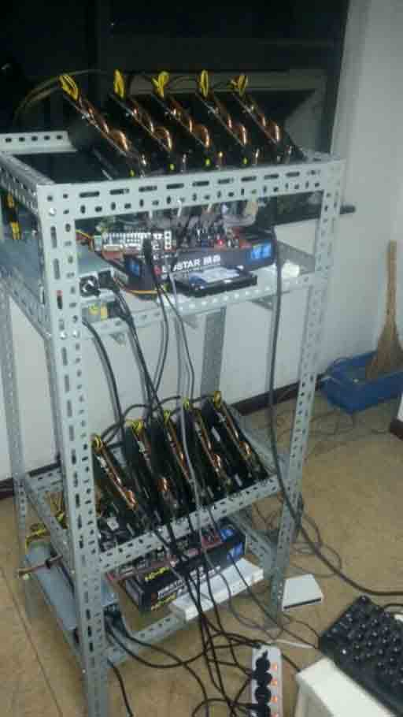


**分布式破解**

《骇客追缉令》片中的主人公都是有使用到分布式破解的.拿电影中的米特尼克来说吧.剧情中他拿到下村勉的加密后的密文,一般电脑来说要跑出密码需要几十年至几百年的时间才有机会跑出密码.此时的米特尼克利用了伪装.欺骗了某大学保安.偷偷的潜入进去使用大学中的超级电脑,只使用了几个小时就能到了想要的结果！《血色星期一》中的主角三浦春马使用了傀儡网络(肉鸡)使他在半个小时拿到了密码.(两部电影因为太久没看了可能有些地方说错了见谅。)于 2009 年 9 月 26 日晚 ZerOne 无线安全团队与 AnyWlan 无线门户成功完成国内首次分布式破解项目. [`www.freebuf.com/tools/38668.html`](http://www.freebuf.com/tools/38668.html) 工具附上.另外想说是分布式破解只是思路。不是破解方案。破不出来也没有关系。

**Wifi 万能钥匙 or wifi 分享**

其实我是十分不愿意提到这款流氓软件的.但这也是大部分网友主要的破解 wifi 的途径.为什么我不愿意提这款软件.又必须提到呢.答:这款最流氓的功能也就是这款软件最核心的功能.就是集成了全国各地的 wifi 账号密码.这必定包括一些恶意分享和一些无意分享出来的使用这款软件开始的时候有两个选项一.自动分享热点.二.分享前提示我.默认是选择一的.有些心急破解 wifi 的小伙伴可能看到没看就直接点击了下一步.将自己本机保存的 wifi 账号无意间公之于众.酱紫即使 wifi 密码强度在强也会因为猪一样的队友.团灭.这样误操作的例子真的很多.不得不提到的就是这款软件强大的集成了全国各地的 wifi 账号密码.当你使用这款软件的时候可以很方便的根据附近的 ssid.mac 地址在万能钥匙的数据库中找到正确的密码.这方便了用户也方便了不怀好意的童鞋~~ 小米科技也试着模仿盛大的万能钥匙.可最终还是死在了摇篮里。 13 年 9 月 5 日晚间消息，小米科技今日年度发布会上发布的 MIUI 新功能——Wifi 密码自助分享引发争议，众多网友指责小米此行为将导致 Wifi 严重安全隐患，有咖啡店主甚至指责小米此行为如同偷窃。从 2013-8-2 开始到发布会截止前，一个月就分享了 32 万个公共 Wi-Fi 密码，可想而知后续这个雪球会滚得更加大。微博网友@王伟 也对这个新功能十分愤怒，他表示：“我们只剩下两个选择：1、拒绝向使用小米手机的朋友提供家里/公司的 wifi 密码。2、使用小米手机的朋友离开之后马上更改家里\公司的 wifi 密码。”另外为什么万能钥匙没有遭到封杀我也不得而知了.但我想劝大家一句.逼不得已千万不要依靠万能钥匙.

**弱密码**

WPA-PSK 的密码空间用浩瀚来形容一点不为过,所以直接进行字典攻击是傻子的行为.但是作为一个密码对字典攻击来说有强密码和弱密码的区别.强密码就是破解希望极其渺茫的密码.弱密码是很有希望破解的密码当然强弱也是个相对概念,他也是依赖于加安全制的.银行的密码一般都为 6 位.像这样密码空间如此小的密码.普通情况下都为弱密码.但是银行的 ATM 一天只让你试三次.三次密码不对锁卡.有这样的机制 6 位的就不再是弱密码了.由弱密码组成的字典叫弱密码字典. [`www.freebuf.com/articles/web/42120.html`](http://www.freebuf.com/articles/web/42120.html) 这篇文章讲的更为详细.

**有一定联系性规律性密码**

例子：有人曾破如此一个 WPA-PSK 密码 IX1V7051242.如果你不了解这个密码的背景你肯能会觉得很神奇，这么强的密码也能破。这样的密码是在西班牙的 tele2 这样的 AP 上有，而且这样 AP_ESSID 里都有 tele2 字段。这样的密码后面的 8 位是相同的有真正的密码只有四位。四位密码其密码空间很小很容易被字典攻击出来。这个也是 AP 的默认密码。所以这个密码被破解是因为 AP 本身产生的随机密码就是个弱密码。是 AP 的厂家自己降低了安全性的做法。例如有一些餐厅.酒店.事业单位.等等.SSID 总会改成名字的拼音.密码当然是跟 ssid 相关的.最常见的就是这个单位的电话号码！

**社会工程学**

有目的性的社工师多多少少都掌握着 WIFI 使用者的个人信息~.不然怎么会叫做有目的的社工师呢.哈哈~~

例一个目标说吧了.会将跟目标有关系的人生日组合.姓名缩写(即开头字母).姓名拼音.手机号码.一般目标的恋爱对象.暗恋对象.重要的人.不排除基友~.成功率最高.还有目标的.姓名.生日.手机号码.邮箱号码.网名(即 ID.这招对黑阔很管用）.习惯用的字符,当然还有常用的密码!!!.还有一些特殊号码.特殊日子(结婚纪念日.开始恋爱)等等资料生成一个字典.】

举一个例子一位在安全圈混的一位小黑阔.具有很高的安全意识,知道 AP 要使用一个很强大的密码比如 hack!@#1024.但他这个人比较懒到那都使用着这个密码.然后这位黑阔在某个论坛某个网站注册了账号习惯性的输入了引以为傲的强密码.然后这些网站被黑(拖库)社工师根据密码生成了一个字典（根据泄露出来密码进行组合）然后就不用我多说了.这样的例子不少！《剑鱼行动》中那个黑客是如何在一分钟进入国家安全信息网的啊。就是网络上工作着为他收集密码的程序。而他就是通过这样的字典迅速破解的。而这样的字典真正的黑客也是不愿意发布出来的。

## 0×02 实例

* * *

**抓取握手包破解.**

网卡的选择也十分重要.一般使用笔记本内置网卡破解的话一定要看一下网卡型号 kali 有没有驱动.我用的是 8187 卡,kali 自带驱动我就不说了。 本次的实例是根据抓握手包破解进行的

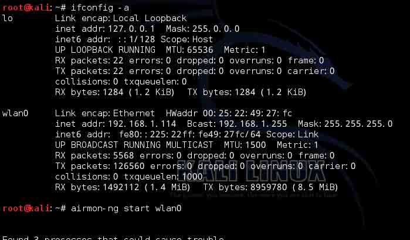

```
Airmon-ng start wlan0 
```

意思是启动网卡的监听模式.敲完这条命令后设备名 wlan=mon0 一般命令后都是要跟上设备名

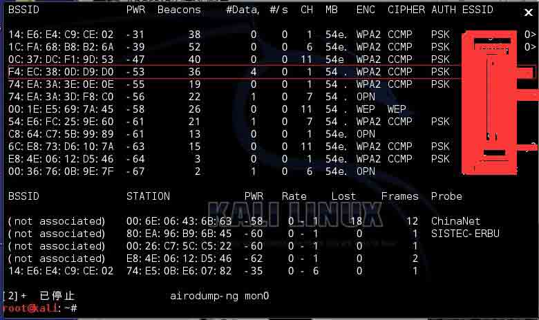

```
Airodump-ng mon0 
```

在抓包前肯定是要先选择目标.这条命令的意思是探测无线网络.选好目标,首选是客户端连接多的.复制好 BSSID 即 MAC 地址.记住信道（CH）

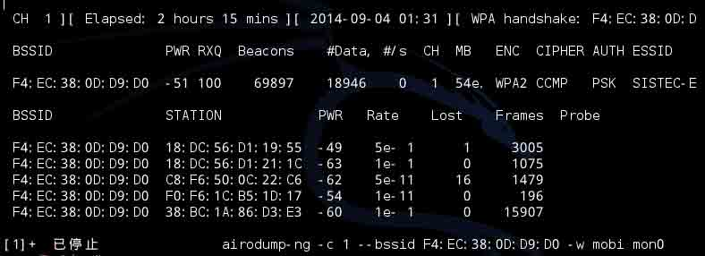

```
Airodump-ng -c 1 --bssid XX:XX:XX:XX:XX -w mobi mon0 
```

`-C`参数是选择目标信道.如果该信道就目标一个 AP 使用的话不用加上`--bssid`,这个参数是为了跟精准的锁定目标~~ `-w` 是保存握手包的名字.获取后会在当前目录生成一个`mobi-01.cap`的握手包。这时就不用关闭这条 shell 而是另外打开一个 shell

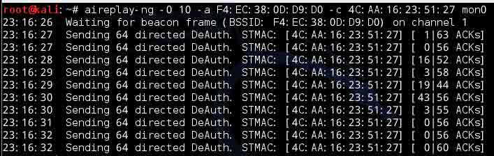

```
Aireplay-ng -0 10 -a (AP 的 mac) -c (客户端的 mac) 
```

> -0 参数是发起 deauth 攻击.10 是次数可以调节
> 
> -a 即第一条 shell 中 BSSID.下面的 AP 路由器 MAC 地址
> 
> -c 即 STATION 下客户机的 MAC 地址(这条为可选项)

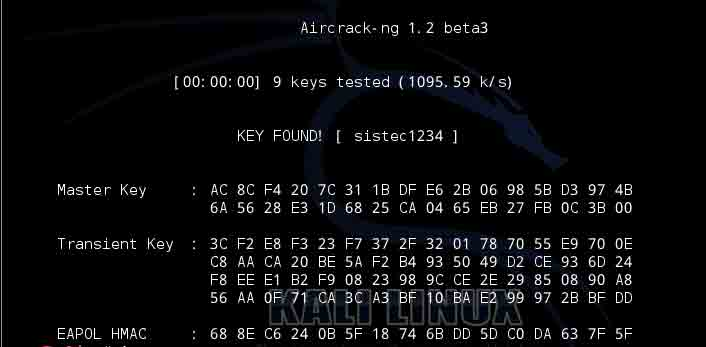

```
Aircrack-ng -w /pentest/passwords/sxsx.lst mobi-01.cap 
```

`-w` 选择字典 `mobi-01.cap` 即抓到的握手包

Ps：我是不建议自己跑密码的.我直接挂载 u 盘吧握手包 copy 到 u 盘里在.通过 QQ 方式吧包发给跑包团队. 然后是吧正确密码添加到了我的字典里。才会出现上图（既成功破解后的图）！ 另外是密码使用有一定联系性规律性密码

**破解方案二:利用路由器 wps 功能漏洞**

Airodump-ng mon0 查看附近无线情况。在 MB 这行带点的“.”表示能跑出 pin 码。使用 wash -i mon0 -C 可查看是否开启了 wps 功能

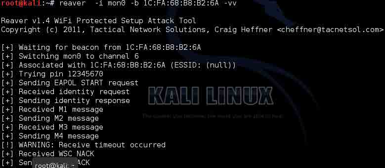

```
Reaver -i mon0 -b xx:xx:xx:xx -vv 
```

reaver 命令参数

> -i 监听后接口名称
> 
> -b 目标 mac 地址
> 
> -a 自动检测目标 AP 最佳配置
> 
> -S 使用最小的 DH key（可以提高 PJ 速度）
> 
> -vv 显示更多的非严重警告
> 
> -d 即 delay 每穷举一次的闲置时间 预设为 1 秒
> 
> -t 即 timeout 每次穷举等待反馈的最长时间
> 
> -c 指定频道可以方便找到信号，如-c1 指定 1 频道，大家查看自己的目标频道做相应修改 （非 TP-LINK 路由推荐–d9 –t9 参数防止路由僵死

示例：

```
reaver -i mon0 -b MAC -a -S –d9 –t9 -vv 
```

应因状况调整参数（-c 后面都已目标频道为 1 作为例子） 目标信号非常好:

```
reaver -i mon0 -b MAC -a -S -vv -d0 -c 1 
```

目标信号普通:

```
reaver -i mon0 -b MAC -a -S -vv -d2 -t 5 -c 1 
```

目标信号一般:

```
reaver -i mon0 -b MAC -a -S -vv -d5 -c 1 
```

## 0×03 防御只是一个步骤.安全是一个系统.

* * *

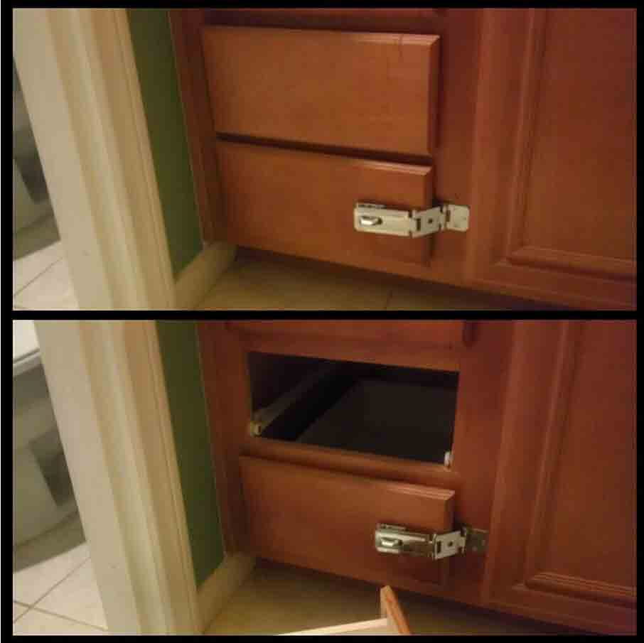

看我任何突 MAC 封锁！

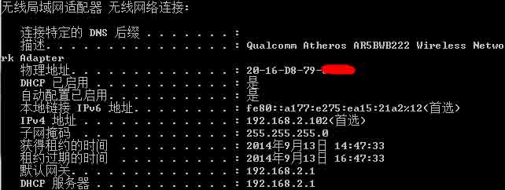

客户机的截图模拟主人使用 MAC 过滤功能！.

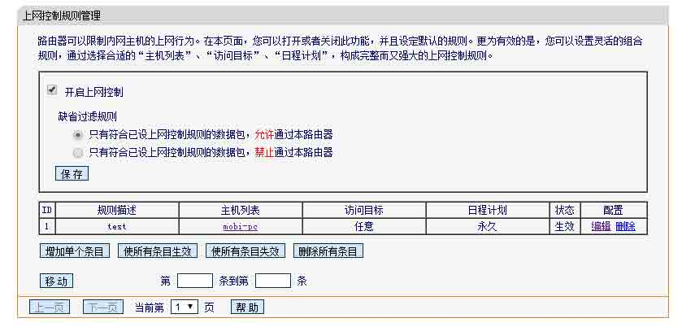

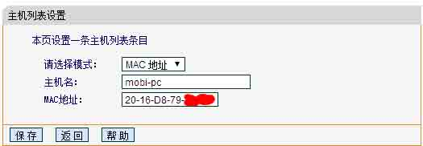

在路由器上使用 mac 过滤.黑客就一点办法的没有了么？.no！


由于路由器只接受白名单的数据包.所以 kali 无法从 dns 服务器获取到域名 IP

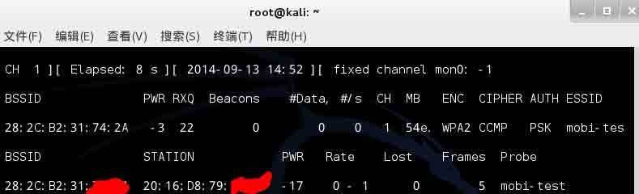

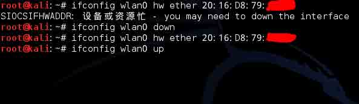

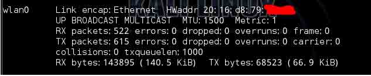

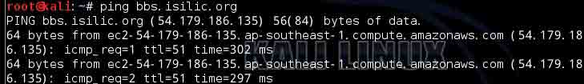

伪装 MAC 地址上网由于有两个无线客户端.所有的数据包都会发送至两个客户端.难免会出现数据包丢失的！

**关闭 dhcp 真的有用么?**

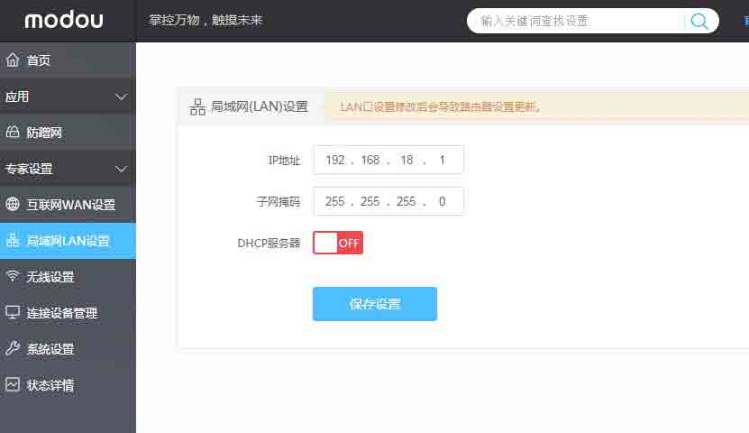

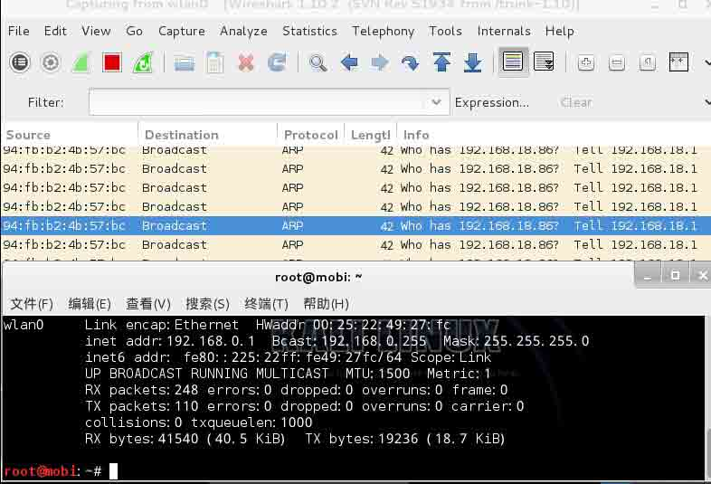

首先我先模拟 WIFI 的管理员.吧 DHCP 关了.并且设置了一个只有自己知道的网关 IP.

可以清楚的看到.kali 并不在管理员使用的网段内.但在 OSI 二层环境中.kali 抓取了路由器与客户端的 ARP 报文.

版权声明：未经授权禁止转载 [末笔丶](http://drops.wooyun.org/author/末笔丶 "由 末笔丶 发布")@[乌云知识库](http://drops.wooyun.org)

分享到：

### 相关日志

*   [Open Wifi SSID Broadcast vulnerability](http://drops.wooyun.org/wireless/2891)
*   [树莓派打造无线扫描仪.](http://drops.wooyun.org/wireless/3810)
*   [无线应用安全剖析](http://drops.wooyun.org/wireless/4295)
*   [非扫描式定位攻击域内 SQL Server](http://drops.wooyun.org/pentesting/2134)
*   [TPLINK 渗透实战](http://drops.wooyun.org/tips/2552)
*   [RFID 之 M1 卡数据分析](http://drops.wooyun.org/tips/3168)