# Perl 数据类型安全研究【翻译】

2015/01/06 14:53 | 路人甲 | [web 安全](http://drops.wooyun.org/category/web "查看 web 安全 中的全部文章"), [漏洞分析](http://drops.wooyun.org/category/papers "查看 漏洞分析 中的全部文章") | 占个座先 | 捐赠作者

## 0x00 背景

* * *


前几天有个人在某大会上讲了一个在 perl 中存在了 20 年的问题。作为一个只会 perl 不会 python 的人，真的很心痛。看完视频后感觉被黑的吃不下东西。

这俨然就是一场对 perl 的吐槽批斗大会，整个演讲充满了 sucks、fuck 等和谐词汇，也能看出演讲者是多么的义愤填膺，场下一次次的鼓掌和附，嗯，让我想起了郭德纲。

## 0x01 问题

* * *


言归正传，这个在 perl 中存在了 20 年的问题到底是啥呢？抛去 perl 的语法的槽点，真正的问题在 data types 上，对的，就是数据类型。

Perl 对数据类型的处理真是有点匪夷所思了。

我们先了解一下 perl 中的变量有哪几种。

perl 中的变量

perl 的数据类型分为三类：标量$，数组@，哈希%。

具体定义在这里不多说，我们来看几个例子：


不管是标量、数组还是哈希（字典），定义跟其他语言没什么区别。

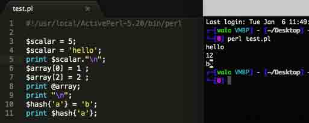

我们来看看几个特殊的情况，下面每个预期值为正常人类理解应该得到的结果。

```
@array =(1, 2, 'a', 'b', 'c');
print $array[0];

```

预期值 1

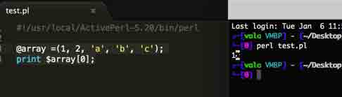

实际值 1

```
$scalar = (1, 2, 'a', 'b', 'c'); 
print $scalar;

```

预期值 1

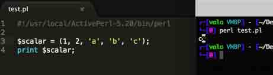

实际值 c 我擦泪，为毛会是 c！太不科学了，继续往下看。

```
@list = (1, 2, 'a', 'b', 'c'); 
print scalar @list;

```

预期值 1

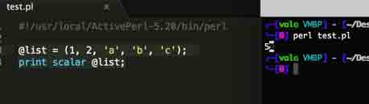

实际值 5 呵呵，他把数组的长度输出了。

再看看这个哈希的例子

```
%hash = (1, 2, 'a', 'b', 'c'); 
print $hash{'a'};

```

预期值 木有

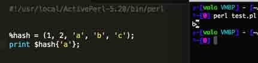

实际值 b 为毛把 b 给输出了，谁能告诉我这头草泥马是怎么处理的。

## 0x02 漏洞

* * *

这些问题会产生什么漏洞呢？

一起看看在 web 中 php 跟 perl 处理的对比。

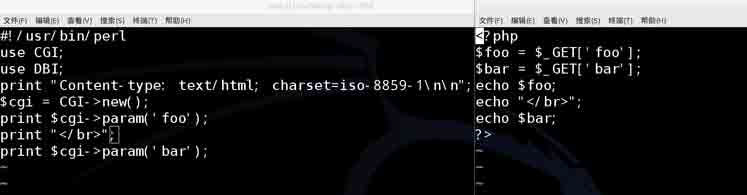

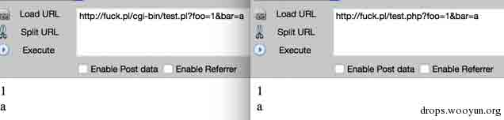

这么看来是木有任何问题的，那么使用复参的时候呢？

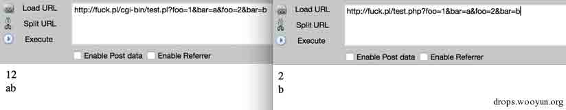

php 很好的处理了传入的数据，而 perl 的做法就是草泥马在奔腾%>_<%他是直接可以传入数组的。

再深入一下，看看当数组和哈希结合的时候的情况。

```
@list = ('f', 'lol', 'wat');
$hash = {'a' => 'b',
         'c' => 'd', 
         'e' => @list
};
print $hash;

```

预期值

```
{
'a' => 'b',

'c' => 'd',

'e' => ['f','lol','wat'] 
} 

```

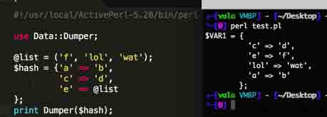

神马情况，数组中的“，”变成了“=>”又给赋值了？e=>f、lol=>wat，what the f*cuk！


这是多大的一个坑啊！看 Bugzilla 是怎么掉进去的。

http://zone.wooyun.org/content/15628

关于数据类型的这些问题我不想再说了，有些恶心。

## 0x03 GPC 的问题

* * *

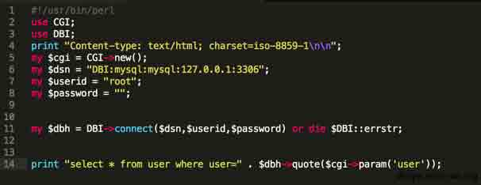

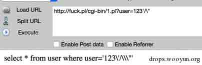

屌屌的棒棒的，对吧，可是……

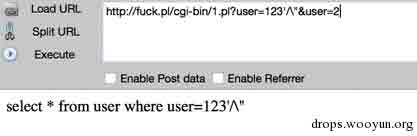

我了个*，一个都不给转义了，就这么罢工了，可以顺顺畅畅的注入了好么。


我想静静。

## 0x04 来源

* * *

Pdf：

http://events.ccc.de/congress/2014/Fahrplan/system/attachments/2542/original/the-perl-jam-netanel-rubin-31c3.pdf

视频地址：

http://media.ccc.de/browse/congress/2014/31c3_-*6243*-*en*-*saal_1*-*201412292200*-*the_perl_jam_exploiting_a_20_year-old_vulnerability*-_netanel_rubin.html#video

版权声明：未经授权禁止转载 路人甲@[乌云知识库](http://drops.wooyun.org)

分享到：

### 相关日志

*   [Laravel cookie 伪造,解密,和远程命令执行](http://drops.wooyun.org/papers/1515)
*   [Wordpress 3.8.2 补丁分析 HMAC timing attack](http://drops.wooyun.org/papers/1404)
*   [XSS 挑战第二期 Writeup](http://drops.wooyun.org/papers/938)
*   [浏览器安全（一）](http://drops.wooyun.org/papers/526)
*   [利用 HTTP host 头攻击的技术](http://drops.wooyun.org/papers/1383)
*   [Python Pickle 反序列化带来的安全问题](http://drops.wooyun.org/papers/66)