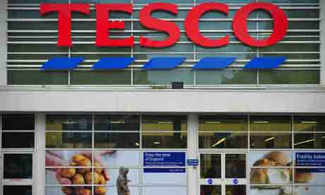

# 超过 2000 个 Tesco.com 账户因遭到黑客攻击而被迫暂停账号登陆

2014/02/17 18:22 | [News](http://drops.wooyun.org/author/news "由 News 发布") | [业界资讯](http://drops.wooyun.org/category/news "查看 业界资讯 中的全部文章") | 占个座先 | 捐赠作者

超过 2000 个 Tesco.com 账户因为泄露了用户名与密码，所以遭到黑客攻击而被迫暂停账号登陆。

美国时间上周四，有一份超过 2000 的 Tesco.com 网站用户的账号信息在互联网上被公开，可以进入上述商户的在线商城账号，并查看个人详细信息以及 Tesco 的优惠劵。

Tesco 对外发言人表示“我们把客户数据的安全性看的极为重要，正在紧急调查此事件。我们已经联系了所有可能受到影响的客户，并且尽量减少他们的损失。”

这些账号密码的泄露原因应该是其他网站的信息被盗取，然后再到 Tesco 的网站进行测试，是否同样可登陆。

黑客似乎已经成功登陆了 2239 个账户，受到影响的用户必须修改密码才能继续登陆。

Rapid7 全球安全战略专家表示“到现在为止，此次的影响有限，仅仅是被用来盗取 Tesco 的优惠劵，但是同样的事情可能在其他网站也发生了”。

在互联网上使用相同的用户名密码，以及弱口令是非常危险的一件事情。

译者注：特易购(TESCO)公司成立于 1932 年，是英国最大的零售公司，也是世界三大零售商之英国特易购公司一。除了在英国本土的 691 家大型购物中心外，该公司 42%的店铺分布于中欧与东南亚各国，是个国际化的超市巨人。此次攻击事件也提醒了其他网站，不止本身程序的安全就好，也要在其他逻辑上注意，可参考之前 drops 写的一篇文章：

[浅谈互联网中弱口令的危害](http://drops.wooyun.org/papers/234)

版权声明：未经授权禁止转载 [News](http://drops.wooyun.org/author/news "由 News 发布")@[乌云知识库](http://drops.wooyun.org)

分享到：

### 相关日志

*   [马航 MH370 航班被黑了？](http://drops.wooyun.org/news/1202)
*   [通过伪造乌克兰相关文件进行传播的恶意软件 MiniDuke](http://drops.wooyun.org/news/1373)
*   [网络安全威胁周报——第 201410 期](http://drops.wooyun.org/news/1034)
*   [NSA 暗中监视中国政府和企业网络（目标华为）](http://drops.wooyun.org/news/1289)
*   [APPLE IOS 7.1 修复了超过 20 个代码执行的漏洞](http://drops.wooyun.org/news/1057)
*   [GnuTLS 和 Apple 证书验证的 bugs 并非为同一个](http://drops.wooyun.org/news/1021)