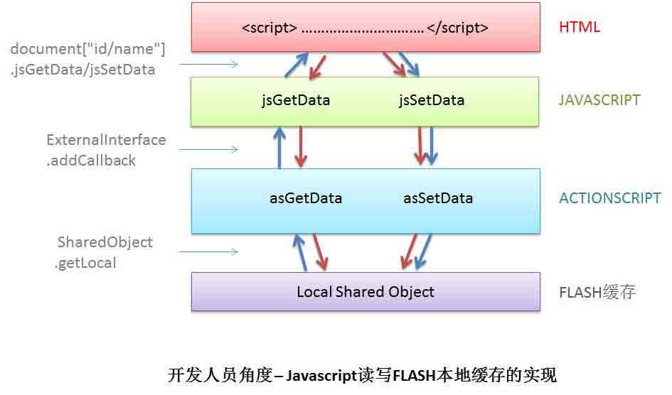
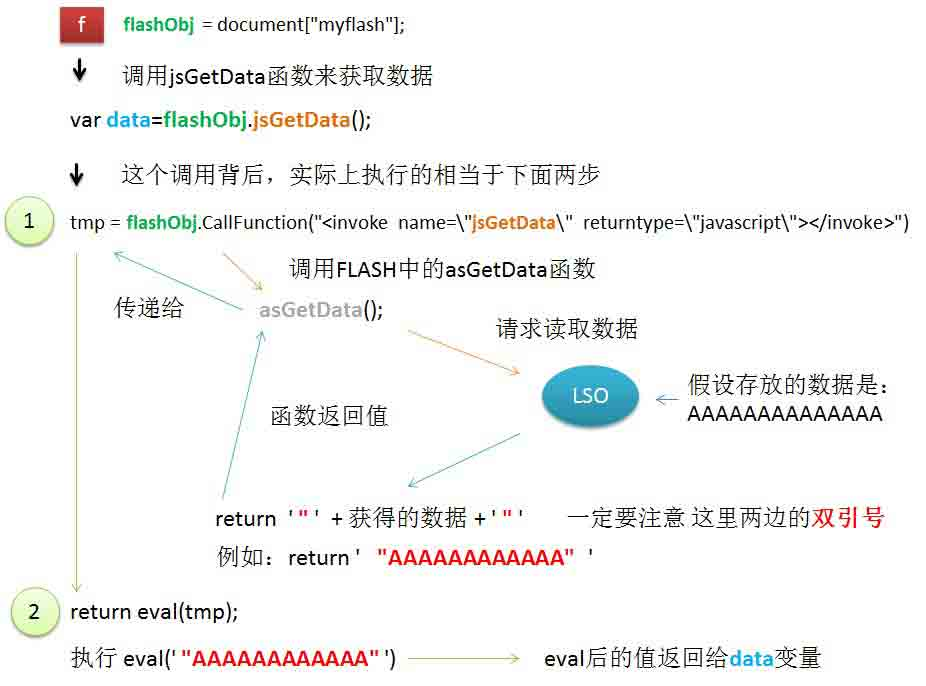
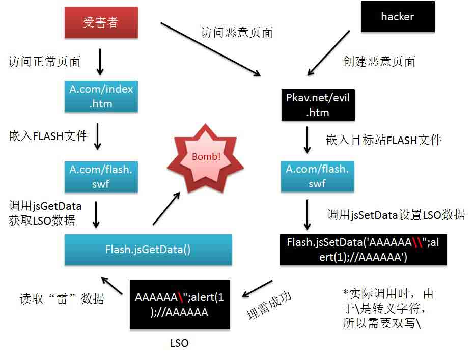

# 一个可大规模悄无声息窃取淘宝/支付宝账号与密码的漏洞 -（埋雷式攻击附带视频演示）

2014/04/17 10:59 | [gainover](http://drops.wooyun.org/author/gainover "由 gainover 发布")   | [web 安全](http://drops.wooyun.org/category/web "查看 web 安全 中的全部文章"), [漏洞分析](http://drops.wooyun.org/category/papers "查看 漏洞分析 中的全部文章")  | 占个座先  | 捐赠作者

## 0x00 说在前面的话

* * *

下面是一段如何利用 flash xss rookit 漏洞来窃取淘宝/支付宝帐号密码的演示视频，当前漏洞已经修复

由于视频网站上传的均不给通过，只好给出一个 URL 了：

[`static.wooyun.org/files/taobaoxss.swf`](http://static.wooyun.org/files/taobaoxss.swf)

网速好的可以下载并观看清晰版本：

[`static.wooyun.org/files/taobaoxss.wmv`](http://static.wooyun.org/files/taobaoxss.wmv)

2 月底我们 PKAV 团队在乌云(http://www.wooyun.org/index.php)上向阿里（淘宝/支付宝）报告了该漏洞，漏洞的标题看起来有点恐怖，但它绝对不是“标题党”。 乌云的漏洞审核人员在看了漏洞中的视频演示后，为其附加了一个生动又有一点霸气的名字："埋雷式攻击"。

为何叫埋雷呢？本文中也会给出具体的解释。

当时阿里推出了 5W 的奖励计划，有人问我这个漏洞为什么不上报 asrc（阿里巴巴漏洞应急响应中心），报乌云没奖励的。

我给出的答复是：“ 思路灵感都是乌云来的，自当报还之”。

本人乃至本团队，还是更喜欢并赞同乌云上这种透明的机制，从我们自身角度来讲能学习到不少，从用户角度来讲，至少可以让用户知道发生过什么，怎么保护自己 （试想，如果本文中的漏洞曾被黑客拿来窃取过用户帐号与密码，然后某天厂商修复了，用户并不知道曾经有这个漏洞发生过，也不知道自己密码是如何被盗的）。

从厂商角度来讲：Oh shit! 不要拿漏洞恐吓用户！

下面带大家一起来感受一下，这个来自乌云，又回归乌云的漏洞历程。

## 0x01 第一次漏洞报告

* * *

这个有意思的漏洞最初在乌云上由白帽子 neobyte 报告（ [WooYun: 一个 flash 的 0day 导致的淘宝网存储 xss(可形成永久后门)](http://www.wooyun.org/bugs/wooyun-2013-039481) ），该漏洞描述了在一些 FLASH 应用中，因使用 Local Shared Object （以下简称 LSO）与 ExternalInterface.addCallback 而导致的一类 XSS 漏洞。由于此前并没有见到类似的报告，从开发人员角度来说，并不会 十分去注意并防御此类漏洞。我们来看看，在开发人员的角度，通过 js 与 as 的交互来实现读取 FLASH 本地缓存功能的流程图:



在这个示意图中，红色的箭头表示函数的调用，蓝色的箭头表示用户数据的流向。普通的开发人员仅仅在意功能是否完整的实现；带有一些安全意识的开发人员会注意到，jsGetData 所获得的数据需要经过过滤再进入 DOM, 如果没有考虑这点会造成什么安全问题呢？乌云上的 p.z 大神也给我们举了一个好例子（ [WooYun: 淘宝某处存储型 XSS 漏洞](http://www.wooyun.org/bugs/wooyun-2013-022080) ）; 但是现在，我们将会遇到一个最糟糕的情况：“不论你是否是一个有安全意识的程序员，你都十分可能掉入这个坑中！”。

这是一个什么样的坑呢？

我们得先更深入了解下 javascript 调用 FLASH 所提供的函数接口时，到底做了哪些事情。下图描述了当我们调用 jsGetData 函数来获取 FLASH 本地缓存数据的调用过程：



上面是一个正常获取数据的流程，假设 LSO 中存放的数据是 AAAAAAAAAAAA，最终，我们的 data 变量的值也为 AAAAAAAAAAAA，当然，这是理想状态下的情况。

如果你对 DOM XSS 有一定了解，也知道 eval 是多么 evil！(不了解但有兴趣的参见本人马甲贴： [WooYun: [腾讯实例教程] 那些年我们一起学 XSS - 10\. Dom Xss 进阶 [邂逅 eval]](http://www.wooyun.org/bugs/wooyun-2012-016197) )，那么你一定不难想到下面的做法：将存储在 LSO 中的数据做以下改变:

AAAAAAAAAAAA 返回数据过程中会执行： eval('"AAAAAAAAAAAA"');

如果我们将存储的数据更换为:

```
AAAAAA";alert(1);//AAAAAA 

```

返回数据将执行：

```
eval('"AAAAAA";alert(1);//AAAAAA"');

```

可以看到，我们在 eval 的数据中插入了一个 alert(1)，当 eval 执行时，就会执行弹窗操作！（**你也可以打开 F12 的 console，然后复制上面的代码运行试一试！**）

然而，上面只是我们假想的情况。实际上 FLASH 会对返回数据进行转义操作，将双引号 (") 转义为反斜线+双引号 (\")，即我们更改存储的数据后，实际执行的是下面的代码：

```
eval('"AAAAAA\";alert(1);//AAAAAA"');

```

正是这个转义，使得我们上面的想法泡汤了。但是，别灰心，FLASH 对返回数据的过滤是存在问题的，虽然过滤了双引号 `(")`，但是 FLASH 并没有过滤反斜线 `(\)`，我们只需将上面的代码稍加修改，如下：

```
AAAAAA\";alert(1);//AAAAAA 

```

返回数据将会是以下的情况：

```
"AAAAAA\\";alert(1);//AAAAAA"

```

随后返回内容进入 eval 被当作脚本执行。

```
eval('返回内容'); 
```

其中双引号 (")被转义为反斜线+双引号(")，但是该反斜线却被我们添加的反斜线所转义。

//如果你想在控制台测试效果，可以执行以下代码

```
eval('"AAAAAA\\\\";alert(1);//AAAAAA"');

```

//-- 此处由 @piaca 指出并更正描述，由于实际内容写成字符串时，反斜线需要被写成转义形式。

**小总结**：到了这里，我们可以知道的是，如果我们可以在 LSO 中存储**恶意数据**，当 HTML 页面中通过 javascript 调用 jsGetData 函数，继而通过 actionscript 中的 asGetData 函数, 从 Flash 本地存储中读取**该恶意数据**时，就会触发我们的恶意代码。

接下来的问题，我们如何往 LSO 中添加我们的恶意数据呢？最暴力的方法是，抢你电脑，拔你网线，拆你硬盘，而后改之！，&@……！%&！%@ ... 温柔，一定要温柔！

在我们的第一个图中，开发人员同样为我们实现了

```
jsSetData -> asSetData -> LSO 
```

的流程，也就是说，我们可以通过 Javascript 调用 jsSetData 来实现修改 LSO 中的数据。从功能角度上是这么设计的，然而出于安全考虑，FLASH 所提供的外部函数接口，并不是什么时候都可以调用的，在默认情况下，只有 http://A.com 的网页文件才能调用 http://A.com 下的 FLASH 文件所提供的函数接口，如下图：


这样看来，其实在默认的安全设置下，我们并没有直接的办法来修改数据。此外，每个域名下 FLASH 文件所使用的缓存是独立的，因而正常情况下，我们也无法使用 http://B.com 的 FLASH 文件来修改 http://A.com 下的 FLASH 缓存（不排除有猥琐的办法哦～）。

然而，这种”js 读写 FLASH 缓存“的功能模块，天生会要求有一种特性，就是写一次，四处皆可用，从开发的角度来讲，这是天经地义的事情，方便，很方便。于是乎，开发人员在代码中加上了下面这么一句：

```
Security.allowDomain("*");

```

这一句代码的具体作用，可参见官方手册（[Flash CS4 Professional ActionScript 2.0](http://help.adobe.com/zh_CN/AS2LCR/Flash_10.0/help.html?content=00001493.html))），简单来说，这一句话，打破了我们上面所述的 FLASH 默认安全设置，使得任何域名下的网页均可以调用 A.com 下 FLASH 文件所提供的 addCallback 接口。

这样一来，我们整个漏洞的原理图就可以建立起来了：



这个图箭头比较多。当黑客创建了恶意页面后，我们以受害者作为起点，当受害者访问了恶意页面后，会执行一系列操作，从而将恶意数据存入 LSO 中，这个过程，我们称之为“埋雷”。哪里会被“埋雷”呢？答案是很多地方：

譬如：

```
低级一点的：黑客 A 向你发送一个链接，你点开了。

不知不觉一点的：当你到处点网页的时候！

高级一点的：你看了一篇黑客写的博文/日志，或是有黑客给你的 QQ 空间日志发表了一条留言或者评论，内容里被植入了 XSS 代码（需结合 QQ 的 XSS 漏洞），你点开了。

再高级再不知不觉一点的：某天你 QQ 收到了一条礼物消息（QQ 空间礼物功能 XSS 可以攻击任意指定 QQ 号码用户），或者是某天突然来了一个陌生人的 QQ 对话框（微博上正在疯传的那个 QQ 客户端聊天就中的 XSS（可登陆和控制他人账号））。 
```

总之，如果是有心而为之，你！，被埋雷的可能性非常大。

当受害者被埋下雷之后，受害者再次访问目标站（比如本次漏洞中的淘宝，或者是支付宝），黑客所埋下的恶意代码就会被触发，Bomb! 雷就爆炸了！当然，实际上黑客不大可能去恶作剧式的“Bomb!"的吓你一跳，而是偷偷的，悄无声息的利用这颗无声的”雷“来窃取受害者的帐号与密码。

看我敲了这么多，发了这么多张图，你们觉得这个漏洞的潜在危害大么？反正我觉得挺大的，再来看看厂商对 neobyte 提交漏洞的响应：

```
危害等级：中

漏洞 Rank：8

确认时间：2013-10-12 16:44 
```

是的，厂商似乎没有感觉到这个漏洞的危害。

## 0x02 第二次漏洞报告

* * *

到了 2013 年 10 月 24 号，我已经可以查看 neobyte 所提交的漏洞详情，于是就对他所提交的这个漏洞进行了研究，由于自己对 FLASH 也推敲过一些，在明白成因之后，也下载了漏洞中所提到的那个存在缺陷的 FLASH 文件（[`acjstb.aliyun.com/actionlog/flash/JSocket.swf`](http://acjstb.aliyun.com/actionlog/flash/JSocket.swf)）。以下是对方的修复代码：

```
public function getlso():String{
    var _local1:SharedObject = SharedObject.getLocal("kj");
    var _local2:RegExp = new RegExp("[a-zA-Z]");
    if (_local1.data.key == undefined){
        return ("");
    };
    if (_local2.test(_local1.data.key)){
        this.setlso("");
        return ("");
    };
    return (_local1.data.key);
}

```

由于业务上，淘宝此处存储在 LSO 的数据，并不需要字母，但是恶意代码中却需要使用到字母，例如：alert。所以开发人员这里加上了一个正则判断：“如果所获取的数据中存在字母，则返回空字符串”。是的，看起来是被修复了，但是依然存在问题，一来，开发人员并没有过滤掉真正导致潜在危害的反斜线()，二来，Javascript 中调用函数完全可以不需要存在任何字母，纳尼？？一起来看看：

```
//我们可以使用以下方式创建一个函数:
new Function("alert(1)");
//也可以不要 new
Function("alert(1)")()
//可以将 Function 转换下
"...".substr.constructor("alert(1)")()
//再转换下
"..."["substr"]"constructor"")()
//字符串全部转义
"..."["\163\165\142\163\164\162"]"\143\157\156\163\164\162\165\143\164\157\162"()

```

这样我们就实现了不需要字母即可执行 alert(1)的目的。再利用在上一小节中所说的恶意代码构造技巧，我们只需将 AAAAAAAAAAAAAA 替换为以下代码：

```
...\"["\163\165\142\163\164\162"]"\143\157\156\163\164\162\165\143\164\157\162"()//..

```

漏洞就这样再次出现了，虽然当时已经想到这个漏洞用来钓鱼的危害挺大，但是并没有动力去做一个钓鱼演示，并且漏洞刚被阿里修复不久，只是出于技术上的好意，想提醒开发人员完美的修复。于是，我“不好意思”的登上了我另外一个马甲号，发了一个续集： [WooYun: 一个 flash 的 0day 导致的淘宝网存储 xss 【续集】](http://www.wooyun.org/bugs/wooyun-2013-040838) 。当时我给漏洞自评了 8 分，因为漏洞的原作者 neobyte 也只要了 8 分，我也没敢多要。但是，对方竟然只给了我 5 分：

```
危害等级：中

漏洞 Rank：5

确认时间：2013-10-24 14:19 
```

## 0x03 第三次漏洞报告

* * *

恩，不得不说，为什么还会有第三次呢？主要是因为上面这个 5 分！个人觉得，如果一个漏洞被修复后，又被绕过，这是更加严重的情况，怎么说也不应该给 5 分，起码也得 6 分是不！。这个 5 分大大刺激了我的“报复欲”，让我想再次绕过他们的修复方案，然后做一个大规模的钓鱼演示，让他们知道这个绝对不能是 5 分！！！。但是呢，这一次他们的修复方案并没有好的绕过方法！ 虽然如此，隔三差五的，我还是会去研究研究，不怕贼偷，就怕贼惦记.......，直到有一天，我发现 FLASH 中的修复方案竟然被换掉了，并且，第一眼，我就看出这个换掉的方案又出现问题了。新的修复代码如下：

```
private function getlso():String{
    var _local1:SharedObject = SharedObject.getLocal("kj");
    var _local2:RegExp = new RegExp("[\\({]");
    if (_local1.data.key == undefined){
        return ("");
    };
    if (_local2.test(_local1.data.key)){
        this.setlso("");
        return ("");
    };
    return (_local1.data.key);
}

```

可以看到，正则表达式 _local2 仅仅过滤了 ( 和 { ，而前面也已提到，正确的过滤方法应该是过滤 \ 。经过前面 2 轮的洗礼，我觉得安全人员应该是知道\的危害了，为什么还会出现过滤失误呢？我在漏洞描述中也已经给出了以下猜测，后确认，答案是 B。毕竟我也是写了很多年前端的，RegExp 这个坑在我曾经也数次掉入。

```
A. 响应漏洞的同学并没看到我的修复建议并转告开发同学。

B. 开发的同学，认为 [\\({] 是 \ , ( 和 } 的集合， 而实际上，RegExp 方式创建正则表达式时，需要写成 [\\\\({] ，原因是：\在字符串里是转义符，在正则里也是转义符。 
```

当然，还需要注意的是，这个正则，不允许(和{，那么还可以执行 javascript 代码吗？答案是可以的，如下：

```
location.href="javascript:alert%28129";

```

使用 location.href 来执行 js，并且将其中的括号与花括号进行 URL 编码。

嗯，这个漏洞就这样再次出现了，这一次我可不想再得到那可怜的 5 分！于是花了时间写了一个真实可利用的代码，并录制了本文最开始的视频，撰写了漏洞报告（ [WooYun: 一个可大规模悄无声息窃取淘宝/支付宝账号与密码的漏洞 -（埋雷式攻击附带视频演示）](http://www.wooyun.org/bugs/wooyun-2014-051615) ）。阿里这次给出了 15 分，还是没有给出我心中的 20 分。怎么说呢，从用户角度来讲，它的危害肯定是值 20 分的，但是厂商并不总是站在用户考虑问题的。

```
危害等级：高

漏洞 Rank：15

确认时间：2014-02-26 10:25 
```

## 0x04 对于开发人员

* * *

**注意 addCallback: **在 Flash 中使用 addCallback 向外部提供函数接口时，如果 as 中对应函数的返回值是 String, Array, Object 等类型，并且返回数据中有用户可控的数据时，建议对返回值进行过滤操作，将反斜线()过滤掉。如果没有进行过滤的话，则可能出现与（ [WooYun: QQ 空间某功能缺陷导致日志存储型 XSS - 14](http://www.wooyun.org/bugs/wooyun-2014-051432) ）相类似的案例。这里我就不给出具体的过滤代码了，相信一般的开发人员的 as 都比我写的好，以下是伪代码：

```
function asFunction():String{
     var data:String="xxx 某些用户可控数据 xxx";
     var obj:Object={"name":"用户可控数据"};
     ....
     data = 过滤(data);
     obj = 遍历过滤(obj); 

     return data; 或 return obj;
}

```

**勿滥用***|*Security.allowDomain("*"): **不是非常、极其、十分需要的情况下，建议将 allowDomain 限定在指定的域名下面，而不要为了方便而使用*。因为使用*，可能还会导致其它安全问题。

## 0x05 对于普通用户

* * *

由于这类漏洞十分隐蔽，目前应该没有安全软件能防御此类攻击。鉴于绝大部分厂商并不会“举一反三”的修复同类问题，我们不能完全指望厂商，安全还得靠自己。如果我们尽可能的定期清理 Flash player 缓存，理论上会大大降低此类漏洞造成的危害。

Flash 的本地缓存一般存放在一个叫做 #SharedObjects 的目录中，如果有使用 Everything 这款搜索工具的网友，可以使用 Everything 查找所有#SharedObjects 目录，然后这些目录下的**目录（8 位的数字/字母组成）**下的内容进行删除处理。（当然，删除#SharedObjects 目录下数据，可能导致一些 FLASH 游戏或者 FLASH 应用的数据需要重新下载，但是相比之下，安全更重要。）

如果你没有使用 Everything，下表列出了**IE**和**chrome**中 Flash 的缓存目录所在，找到对应目录进行清理即可，其它浏览器用户，如**360***|||||*，搜狗**，可自行搜索 C 盘下 SharedObjects 目录进行相应删除操作。

```
IE 浏览器

C:\Documents and Settings\用户名 \Application Data\Macromedia\Flash Player\#SharedObjects （Win XP 系统）

C:\Users\用户名\AppData\Roaming\Macromedia\Flash Player\#SharedObjects\ （Win 7）

Chrome

C:\Documents and Settings\用户名 \Local Settings\Application Data\Google\Chrome\User Data\【用户目录】\Pepper Data\Shockwave Flash\WritableRoot\#SharedObjects （Win XP 系统）

C:\Users\用户名 \AppData\Local\Google\Chrome\User Data\【用户目录】\Pepper Data\Shockwave Flash\WritableRoot\#SharedObjects （Win 7）

*【用户目录】可能是 Profile+数字 或者 Default 
```

常见的“卫士”软件，自带了垃圾清理功能，但是可能在默认设置中，并未开启清理 FLASH 缓存功能，所以需要用户手动勾选“清理 Flash player 缓存”。这里以金山卫士为例：清理垃圾->其它常用软件产生的垃圾文件->Flash player 缓存。 但是该方法也许并不会完全清理干净，例如：并不会清理 chrome 浏览器的 flash 缓存，因此还是建议使用以上方法手工清理。

## 0x06 说在后面的话

* * *

这个漏洞虽然标题是在说“窃取淘宝/支付宝的帐号与密码”，有些人觉得反正不知道支付密码，不要紧！但是这个漏洞所造成的潜在危害，并不是只有淘宝/支付宝帐号与密码那么简单。试想，如果在淘宝的登录页面上再结合一个 QQ 的 xss 漏洞，我们可以得到什么信息呢？淘宝/支付宝帐号、密码，QQ 帐号及 QQ 相关信息（关于 QQ 的 XSS 可以做什么，参见乌云一哥 jannock 的  [WooYun: 跨站脚本-可以让战场离得更远（浅谈腾讯架构缺陷）](http://www.wooyun.org/bugs/wooyun-2012-011192) ，这个 2012 年时候的情况，现在已经有所好转，但是当前状况似乎依然不是太好）。此外，由于淘宝/支付宝这类涉及现金的帐号，密码等级往往十分高，可能会出现支付宝登录密码同样是 QQ 密码的情况，所以这类密码一旦泄漏，可能会涉及后续更严重的信息泄漏。

版权声明：未经授权禁止转载 [gainover](http://drops.wooyun.org/author/gainover "由 gainover 发布")@[乌云知识库](http://drops.wooyun.org)

分享到：

### 相关日志

*   [Json hijacking/Json 劫持漏洞](http://drops.wooyun.org/papers/42)
*   [利用 CSP 探测网站登陆状态（alipay/baidu 为例）](http://drops.wooyun.org/tips/4482)
*   [Zabbix SQL Injection/RCE – CVE-2013-5743](http://drops.wooyun.org/papers/680)
*   [RansomWeb:一种新兴的 web 安全威胁](http://drops.wooyun.org/papers/4834)
*   [WordPress < 3.6.1 PHP 对象注入漏洞](http://drops.wooyun.org/papers/596)
*   [CVE-2014-1806 .NET Remoting Services 漏洞浅析](http://drops.wooyun.org/papers/3993)