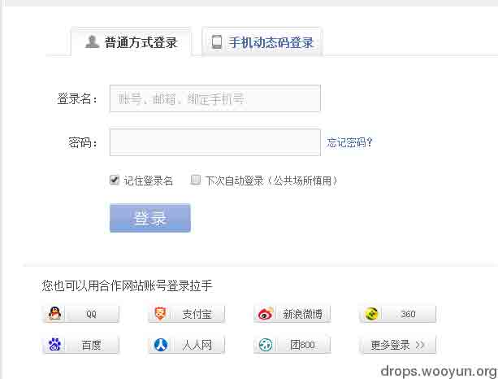
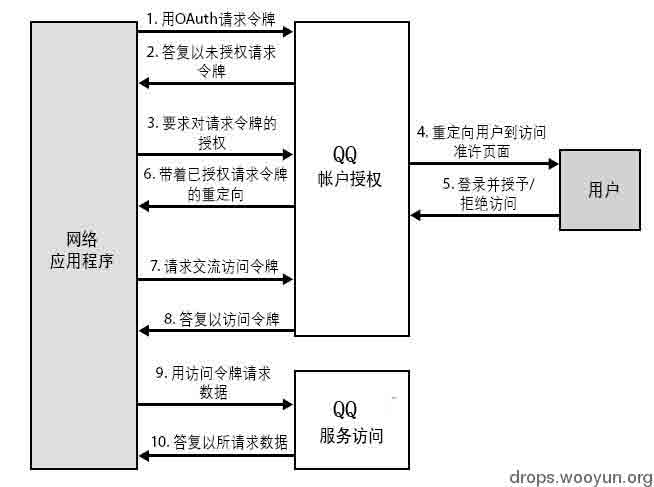
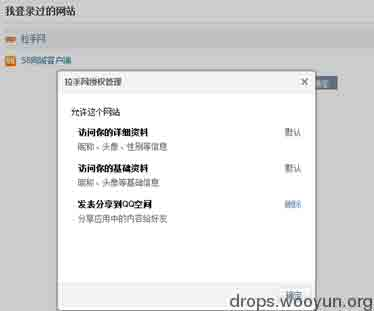

# 第三方账号登陆的过程及由此引发的血案

2014/03/19 10:40 | [72agency](http://drops.wooyun.org/author/72agency "由 72agency 发布") | [web 安全](http://drops.wooyun.org/category/web "查看 web 安全 中的全部文章"), [漏洞分析](http://drops.wooyun.org/category/papers "查看 漏洞分析 中的全部文章") | 占个座先 | 捐赠作者

## 0x00 前言

* * *

第三方账号登陆也就是当你没有 A 网站的注册账号时，你可以使用该与 A 网站合作的第三方账号登陆 A，在大多数情况下你会立即拥有与你第三方账号绑定的 A 网站会员，然后执行 A 网站的会员操作。这种场景常见于登陆团购、酒店住宿等网站，当人们没有该网站账号时，不少人会毫不犹豫地选择使用 qq 等登陆。以下的第三方账号就以 qq 为例吧

## 0x01 第三方登陆的过程

* * *

第三方账号登陆骨子里就是单点登录 SSO 的概念，现在添加了很多商业因素。当你使用了第三方账号登陆了，目标站点可以通过第三方账号确定你的身份，你与目标站点的信任关系就建立起来了。SS0 的流行让“一个账号游遍互联网”成为了可能。

SSO 的优点在于风险集中化，对用户来说不用记那么多的账号密码了，对一些中小网站来说可以专心于业务上而减小账号管理成本。SSO 的缺电也很明显，因为风险集中了，所以如果单点一旦被攻破，影响的业务就会涉及所有使用单点登录的系统。为此有些敏感操作如付款等会要求用户输入独立口令或者通过短信验证用户身份等。

腾讯 qq 的授权登陆过程大致如下：

在这里很重要的一点是认证的过程是在 qq 的控制下完成了。授权通过后，用户还可以设置允许网络应用程序访问自己 qq 账号的那些数据以及是否可以发布状态等权限。（用户只能在 qq 授权规则范围内再次选择授权）

OAuth 协议为用户资源的授权提供了一个安全的、开放而又简易的标准。现在已经发展到 2.0 版，具体内容大家可百度之。

## 0x02 由此引发的血案

* * *

风险 1：针对目标网络应用程序而言，从第三方账号获取的数据构成了一种输入，而输入一般是需要进行过滤的，否则会引发 XSS。

乌云上有这么一个漏洞 [WooYun: 拉手网任意订单密码以及用户信息存在泄漏风险（xss 盲打后台）](http://www.wooyun.org/bugs/wooyun-2013-045499)

拉手网获取 qq 昵称后直接输出到拉手网页面了，而且腾讯允许 qq 昵称带有特殊字符如等,然后使用 qq 账号登陆拉手网，其在拉手网的昵称就存在一个 xss。该漏洞中作者通过评论反馈盲打了后台并成功登陆。

直到今天拉手网的这个 qq 昵称问题仍然存在，只是已经不能盲打后台了，估计在之后的页面输出时做了过滤。类似的使用 qq 账户登录 58 团、糯米团等，大家有兴趣还可以检测更多的网站。

风险 2：授权后的站点在第三方账号站点发布的数据也构成了一种输入，这种输入存在两个问题：第一个问题本质上还是上面的过滤问题，见乌云漏洞 [WooYun: 博客园的分享接口存在 xss 漏洞（广大程序猿们要注意啊）](http://www.wooyun.org/bugs/wooyun-2014-048759) 发布文章到博客园形成 xss；第二个问题就是有些无良站点，在用户授权登陆后往用户账号发布令人反感的信息，一些小白用户甚至都不明白怎么回事。

## 0x03 一点想法

* * *

任何时候都不要忘记一个原则：来自用户的输入都是不安全的，堵住了传统的发布渠道时不要忘了所谓的合作账户数据也是一种输入。

尽管有些网站开发者意识到了要过滤第三方账户的数据，但是开发人员良莠不齐，而且策略也很紊乱。例如：有些地方过滤有些地方不过滤（拉手就是这种情况，总觉得以后还会出问题），还有的甚至根本就不过滤。建议开发者在用户一次授权登陆后获取第三方数据并过滤，之后在用户此次登陆过程中就使用这份过滤后版本的数据。

版权声明：未经授权禁止转载 [72agency](http://drops.wooyun.org/author/72agency "由 72agency 发布")@[乌云知识库](http://drops.wooyun.org)

分享到：

### 相关日志

*   [Laravel cookie 伪造,解密,和远程命令执行](http://drops.wooyun.org/papers/1515)
*   [Drupal – pre Auth SQL Injection Vulnerability](http://drops.wooyun.org/papers/3197)
*   [WordPress 3.8.2 cookie 伪造漏洞再分析](http://drops.wooyun.org/papers/1409)
*   [代码审计之逻辑上传漏洞挖掘](http://drops.wooyun.org/papers/1957)
*   [应用程序逻辑错误总结](http://drops.wooyun.org/papers/1418)
*   [Wordpress 3.8.2 补丁分析 HMAC timing attack](http://drops.wooyun.org/papers/1404)