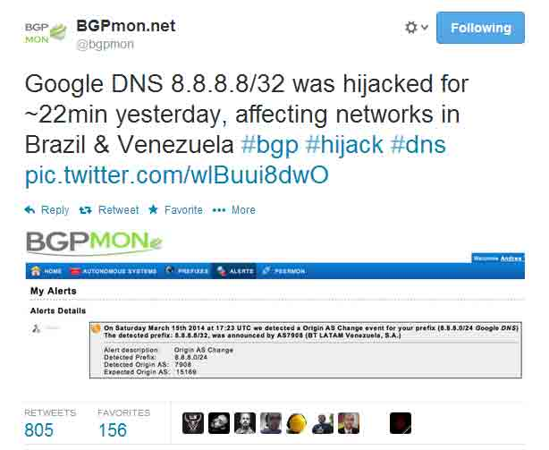
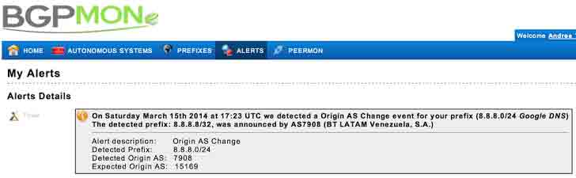
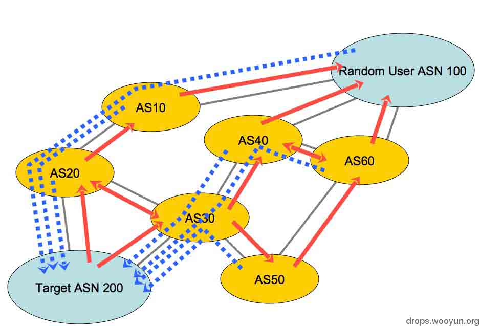
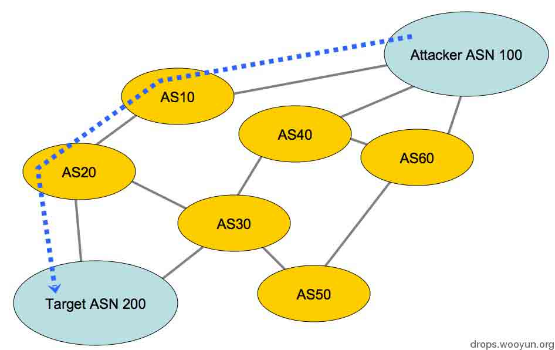
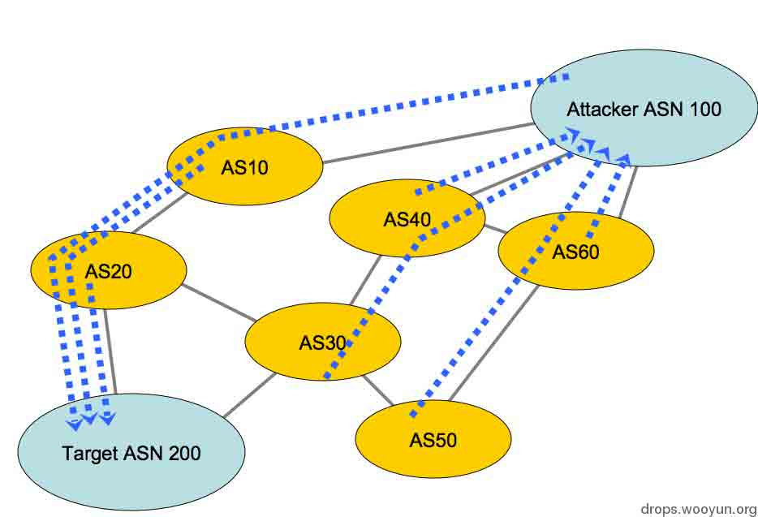

# Google DNS 劫持背后的技术分析

2014/03/18 15:58 | [insight-labs](http://drops.wooyun.org/author/insight-labs "由 insight-labs 发布")   | [漏洞分析](http://drops.wooyun.org/category/papers "查看 漏洞分析 中的全部文章"), [运维安全](http://drops.wooyun.org/category/%e8%bf%90%e7%bb%b4%e5%ae%89%e5%85%a8 "查看 运维安全 中的全部文章")  | 占个座先  | 捐赠作者

## 0x00 背景

* * *

最近世界真是越来越不太平了，尤其是对于大部分普通人而言。昨天又传来噩耗，根据网络监测公司 BGPMon，Google 的公开 DNS 服务器 IP 8.8.8.8 被劫持到了委内瑞拉和巴西超过 22 分钟。

Google DNS 服务器平均每天处理超过 1500 亿个查询，在被劫持的 22 分钟里起码几百万个查询包括金融系统，政府和个大商业网站的 DNS 查询流量都被劫持走了。



根据砖家们的推测，这次劫持可能是黑客利用了 Border Gateway Protocol(BGP) 协议中一个众所周知的漏洞来实现的，BGP 协议为 ISP 级的路由协议，一般用来协调大型 ISP 之间的路由走向。这次劫持可以让黑客把网上的部分流量劫持从而经过他们所控制的路由。



这已经不是 Google DNS 服务器被第一次劫持了，在 2010 年也 Google DNS 的流量也曾经被劫持到了罗马尼亚和奥地利境内。

BGP 劫持攻击是一种大规模的中间人攻击，并且较难发现，因为数据包的最终目的地并没有变，只是绕了下路而已。

## 0x01 BGP 劫持详解

* * *

本部分来源于 Tony Kapela 和 Alex Pilosov 在 2008 年 Defcon 会议上的演讲。

### 什么是 BGP

首先互联网整体上来说是一个分布式的网络，并没有整个网络的中心。但是整个互联网实际上是由成百上千个不同的 ISP 的子网络组成的。

这些子网络互相连接，通过 BGP 协议告诉对方自己子网络里都包括哪些 IP 地址段，自己的 AS 编号（AS Number）以及一些其他的信息。

这里又要扯到互联网的 IP 地址分配方式。互联网的 IP 地址分配是中心化的，ICANN 这个机构把 IP 地址大段分给 Regional Internet Registries（RIR），区域互联网注册管理机构。RIR 再把 IP 地址段细分后分给 ISP 们。

大部分情况下，AS Number 和分给该 AS 什么 IP 段是没有任何关系的。

下面问题来了，BGP 协议里虽然有一些简单的安全认证的部分，但是对于两个已经成功建立 BGP 连接的 AS 来说，基本会无条件的相信对方 AS 所传来的信息，包括对方声称所拥有的 IP 地址范围。

对于 ISP 分配给大公司客户的地址段，ISP 往往会对 BGP 做一些有限的过滤。但是对于大型 ISP 来说，因为对方所拥有的 IP 地址段可能过于分散，所以一般是按最大范围设置 BGP prefix 地址过滤。比如假设 ISP A 拥有地址段 20.1.0.0/16 和 20.200.0.0/16，那么 ISP B 可能会设置过滤对方传来的 20.0.0.0/8 以外的路由。

当然这种情况比较极端，一般 ISP 分配到的 IP 地址段都是连续的，但是基本也都有可操作的空间，可以把数百到几万个不属于自己的 IP 合法加到自己的 BGP 信息里。

多数 ISP 甚至都没有把自己本身的 IP 段过滤掉，也就是说如果其他 AS 声称拥有该 ISP 自己的 IP 段，这个 ISP 的 BGP 路由也会相信。

为了解决这个问题，有人发明了一个叫 Internet Routing Registry (IRR)的东西，相当于一个开放式的数据库，像 DNS 根服务器一样采用分布式镜像服务器放在世界各地。

ISP 可以向 IRR 注册自己的 IP 地址段和路由策略，其他 ISP 就可以查询 IRR 从而对自己的 BGP 路由器做过滤。这样做的确防止了一些由于无意而导致的路由劫持。

但是 IRR 这个东西本身也是不靠谱的。IRR 里存了大约 10 万条记录，如果全部加载进路由器的话是个不小的负担。另外 IRR 基本没人管，任何人可以可以往里面注册任何路由记录。

所以在大部分 ISP 都无条件相信 IRR 的时代，IRR 也带来了不少的麻烦。

最简单的方式就是通过 Whois 找到目标 IP 段的 管理员邮箱，如果该邮箱或者邮箱所在的域名已经过期，那么就自己注册一个，然后就可以随便通过邮件向 IRR 修改记录了。

或者直接通过 BGP 路由向 ISP 发送，反正大家都不 care……

### 实际案例

现在我们来看一个 Youtube 被劫持的案例:

youtube 有 5 个网段，其中一个是

```
208.65.152.0/22 
```

因为觉得 Youtube 不和谐，于是巴基斯坦政府决定封锁 Youtube。

巴基斯坦电信在路由器上加了条 static route 把

```
208.65.153.0/24 
```

弄到了 null0 接口（GFW 之黑洞路由大法）

巴电信的工程师手抖把 static route redistribute 到 BGP 了(Cisco 路由器上同步不同协议路由表的方法)，也就是说把该路由器上的静态路由表添加到 BGP 的路由表了，静态路由同步到其他路由表里的优先值最高。

BGP 把这条路由向其他 AS 的路由器同步了，最先中枪的是香港的电讯盈科（PCCW），然后接着被逐渐同步到了全世界。

这时互联网的大部分用户想上 Youtube 的时候数据包都跑到巴基斯坦了，结果当然是打不开了（因为进来就被弄到 null0 了）。

Youtube 发现后重新用 BGP 声明了对该 IP 段和其他 IP 段的所有权，成功刷新了部分 ISP 路由器的路由表。

两小时后 PCCW 断开了和巴基斯坦电信路由器的 BGP 连接。3-5 分钟后，一切恢复正常，除了苦逼的巴基斯坦用户们。

这意味着只要控制了任何一个 ISP 的任何一个 BGP 路由，都将具备影响全世界互联网的能力。

BGP 劫持很难被发现，如果不是因为巴基斯坦电信把 youtube 的 IP 段转发到了 null0 接口，数据包就只会在巴基斯坦网络里绕一圈然后再到达 Youtube。

如果攻击者的路由器具备篡改 TTL 的功能，那么即使通过 traceroute 也很难发现数据包被劫持，唯一的方法就是像前面所说的 BGPmon 那样检测全世界范围内的 AS 路由表和 BGP 信息。

### BGP 劫持理论

当我们控制了 ISP 的 BGP 路由后，像平常一样发送路由信息。通过修改 AS Path 等 BGP 信息，让其他 AS 认为你到目标网络的距离最短。

为了让回来的数据包也经过你的路由器，你需要记录 trace route 到目标网络的时候都会经过哪些 AS。

使用 AS-PATH prepend list 包括这些 AS Number

设置 static route 到 traceroute 出现的第一个 ASN

#### 详解：

目标 IP 段

```
10.10.220.0/22 
```

在 AS 200 中
ASN 200 向相邻的 AS 20 和 30 发送 BGP 通告。
此时为正常的状态。



攻击者控制了 AS 100 的 BGP 路由。

AS 100 的路由表和 BGP 表显示到达

```
10.10.200.0/22 
```

需要经过 AS 10.

于是我们把 AS10，20 和 200 加入我们的 AS PATH prepend list



通过 route-map 把目标 IP 段加入 BGP 路由表

```
10.10.220.0/24 is announced with a route-map:  
route-map hijacked permit 10  
match ip address prefix-list jacked  
set as-path prepend 10 20 200 
```

然后在 AS100 的路由器中加入 static route，把流向目标 IP 段的数据包指向 AS10

```
ip route 10.10.220.0 255.255.255.0 4.3.2.1 
```



完成后可以看出，AS30 40 50 60 的数据包如果想要到 AS 200 去，都会先经过 AS 100.

到了这里我们已经可以分析出，BGP 劫持的本质再次回到安全的本质既是信任这一点，因为 BGP 直接无条件信任对方 AS 发来的路由信息，并且缺乏有效的认证和过滤手段，导致 BGP 劫持屡次得手。

版权声明：未经授权禁止转载 [insight-labs](http://drops.wooyun.org/author/insight-labs "由 insight-labs 发布")@[乌云知识库](http://drops.wooyun.org)

分享到：

### 相关日志

*   [浅谈基于 NTP 的反射和放大攻击](http://drops.wooyun.org/papers/926)
*   [加盐 hash 保存密码的正确方式](http://drops.wooyun.org/papers/1066)
*   [从技术角度深入剖析：改号软件，电话号码任意显示，伪造来电显示](http://drops.wooyun.org/tips/342)
*   [CDN 流量放大攻击思路](http://drops.wooyun.org/papers/679)
*   [Openssl 多个安全补丁简易分析危害及修复方案](http://drops.wooyun.org/papers/2185)
*   [Dionaea 低交互式蜜罐部署详解](http://drops.wooyun.org/tips/640)