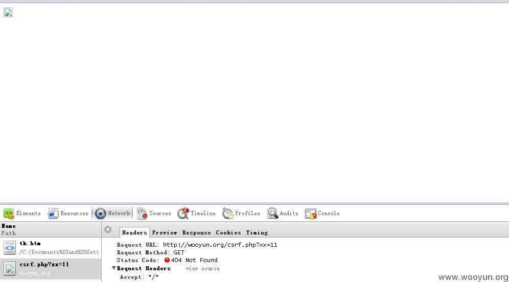

# CSRF 简单介绍及利用方法

2013/07/02 12:24 | [VIP](http://drops.wooyun.org/author/VIP "由 VIP 发布") | [web 安全](http://drops.wooyun.org/category/web "查看 web 安全 中的全部文章"), [技术分享](http://drops.wooyun.org/category/tips "查看 技术分享 中的全部文章"), [漏洞分析](http://drops.wooyun.org/category/papers "查看 漏洞分析 中的全部文章") | 占个座先 | 捐赠作者

### 0x00 简要介绍

* * *

CSRF（Cross-site request forgery）跨站请求伪造，由于目标站无 token/referer 限制，导致攻击者可以用户的身份完成操作达到各种目的。根据 HTTP 请求方式，CSRF 利用方式可分为两种。

### 0x01 GET 类型的 CSRF

* * *

这种类型的 CSRF 一般是由于程序员安全意识不强造成的。GET 类型的 CSRF 利用非常简单，只需要一个 HTTP 请求，所以，一般会这样利用：

```
 
```

如下图，在访问含有这个 img 的页面后，成功向 http://wooyun.org/csrf.php?xx=11 发出了一次 HTTP 请求。所以，如果将该网址替换为存在 GET 型 CSRF 的地址，就能完成攻击了。



乌云相关案例：

http://wooyun.org/bugs/wooyun-2010-023783

http://wooyun.org/bugs/wooyun-2010-027258 (还未公开)

### 0x02 POST 类型的 CSRF

* * *

这种类型的 CSRF 危害没有 GET 型的大，利用起来通常使用的是一个自动提交的表单，如：

```
<form action=http://wooyun.org/csrf.php method=POST>
<input type="text" name="xx" value="11" />
</form>
<script> document.forms[0].submit(); </script> 
```

访问该页面后，表单会自动提交，相当于模拟用户完成了一次 POST 操作。

乌云相关案例：

http://wooyun.org/bugs/wooyun-2010-026622

http://wooyun.org/bugs/wooyun-2010-022895

### 0x03 其他猥琐流 CSRF

* * *

过基础认证的 CSRF(常用于路由器):

POC:

```
 
```

加载该图片后，路由器会给用户一个合法的 SESSION，就可以进行下一步操作了。

乌云相关案例：

[WooYun: TP-LINK 路由器 CSRF，可干许多事（影响使用默认密码或简单密码用户）](http://www.wooyun.org/bugs/wooyun-2013-026825)

### 0x04 如何修复

* * *

针对 CSRF 的防范，有以下几点要注意：

#### 关键操作只接受 POST 请求

#### 验证码

CSRF 攻击的过程，往往是在用户不知情的情况下构造网络请求。所以如果使用验证码，那么每次操作都需要用户进行互动，从而简单有效的防御了 CSRF 攻击。

但是如果你在一个网站作出任何举动都要输入验证码会严重影响用户体验，所以验证码一般只出现在特殊操作里面，或者在注册时候使用

#### 检测 refer

常见的互联网页面与页面之间是存在联系的，比如你在 www.baidu.com 应该是找不到通往 www.google.com 的链接的，再比如你在论坛留言，那么不管你留言后重定向到哪里去了，之前的那个网址一定会包含留言的输入框，这个之前的网址就会保留在新页面头文件的 Referer 中

通过检查 Referer 的值，我们就可以判断这个请求是合法的还是非法的，但是问题出在服务器不是任何时候都能接受到 Referer 的值，所以 Refere Check 一般用于监控 CSRF 攻击的发生，而不用来抵御攻击。

#### Token

目前主流的做法是使用 Token 抵御 CSRF 攻击。下面通过分析 CSRF 攻击来理解为什么 Token 能够有效

CSRF 攻击要成功的条件在于攻击者能够预测所有的参数从而构造出合法的请求。所以根据不可预测性原则，我们可以对参数进行加密从而防止 CSRF 攻击。

另一个更通用的做法是保持原有参数不变，另外添加一个参数 Token，其值是随机的。这样攻击者因为不知道 Token 而无法构造出合法的请求进行攻击。

Token 使用原则

```
Token 要足够随机————只有这样才算不可预测
Token 是一次性的，即每次请求成功后要更新 Token————这样可以增加攻击难度，增加预测难度
Token 要注意保密性————敏感操作使用 post，防止 Token 出现在 URL 中 
```

### 0x05 测试 CSRF 中注意的问题

* * *

如果同域下存在 xss 的话，除了验证码，其他的方式都无法防御这个问题。

有个程序后端可能是用 REQUEST 方式接受的，而程序默认是 POST 请求，其实改成 GET 方式请求也可以发送过去，存在很严重的隐患。

当只采用 refer 防御时，可以把请求中的修改成如下试试能否绕过：

原始 refer：`http://test.com/index.php`

测试几种方式（以下方式可以通过的话即可能存在问题）：

```
http://test.com.attack.com/index.php

http://attack.com/test.com/index.php

[空] 
```

refer 为空构造的方法：

```
由于浏览器特性，跨协议请求时不带 refer（Geckos 内核除外），比如 https 跳到 http，如果 https 环境不好搭建的话，ftp 其实也是可以的：）

<iframe src="data:text/html,<script src=http://www.baidu.com></script>"> //IE 不支持

利用 xxx.src='javascript:"HTML 代码的方式"'; 可以去掉 refer，IE8 要带。
<iframe id="aa" src=""></iframe>
<script>
document.getElementById("aa").src='javascript:"<html><body>wooyun.org<scr'+'ipt>eval(你想使用的代码)</scr'+'ipt></body></html>"';
</script>
//来自于二哥 gainover 
```

**Tags:** [CSRF](http://drops.wooyun.org/tag/csrf)

版权声明：未经授权禁止转载 [VIP](http://drops.wooyun.org/author/VIP "由 VIP 发布")@[乌云知识库](http://drops.wooyun.org)

分享到：

### 相关日志

*   [利用 CSP 探测网站登陆状态（alipay/baidu 为例）](http://drops.wooyun.org/tips/4482)
*   [熵不起得随机数](http://drops.wooyun.org/tips/1060)
*   [攻击 JavaWeb 应用[2]-CS 交互安全](http://drops.wooyun.org/tips/164)
*   [Web 攻击日志分析的过去现在与未来](http://drops.wooyun.org/tips/4051)
*   [IPS BYPASS 姿势](http://drops.wooyun.org/papers/4323)
*   [论 PHP 常见的漏洞](http://drops.wooyun.org/papers/4544)